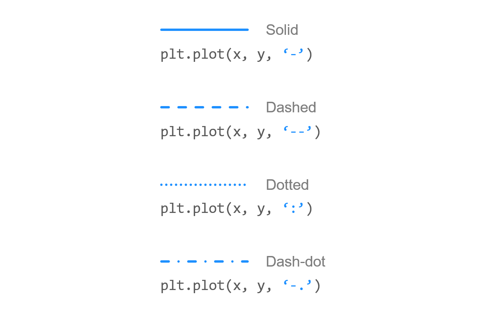
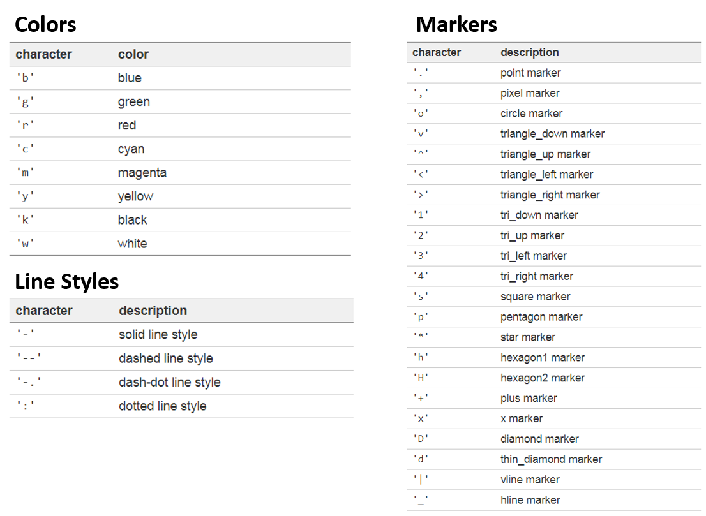
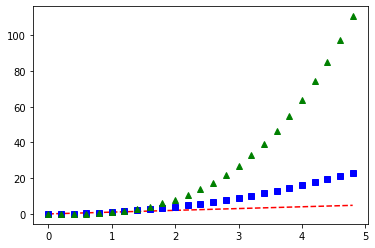

**`matplotlib` 기초 함수 정리**

___

`matplotlib`란?
- **데이터 시각화**에 가장 많이 사용되는 파이썬 라이브러리

## 그래프 기본 설정

`xlabel`, `ylabel`: x축, y축의 label을 설정할 수 있다.
- `labelpad=`: 그래프와 label의 거리 
- `fontdict=`: 폰트 설정
- `loc=`: 라벨의 위치 설정

`legend()`: 그래프의 범례 설정
- `loc=`: 위치 설정
- `ncols=`: 몇 개의 column으로 나타낼 지

`xlim()`, `ylim()`: 리스트나 튜플 형태의 parameter를 받아, 그래프의 x축, y축의 최솟값, 최댓값으로 사용

`axis([xmin, xmax, ymin, ymax])`: x축, y축에 대한 최댓값, 최솟값을 동시에 설정
- `axis()` 함수는 위와 같은 parameter 대신, 아래와 같은 parameter를 가질 수 있다.
- `on` | `off` | `equal` | `scaled` | `tight` | `auto` | `normal` | `image` | `square`
- x축, y축의 범위에 따라 x축와 y축이 서로 다른 크기를 갖도록 할 수도 있다.

**선 종류**

` - ` (Solid), ` - - ` (Dashed), ` : ` (Dotted), ` -. ` (Dash-dot)


**색 / 선 / 마커**


**스케일 지정**
`yscale()`
- `linear`: 선형 스케일
- `log`: 로그 스케일

`title()`: 그래프의 제목을 설정
- `loc=`: 위치
- `pad=`: 그래프와 제목 사이 간격

`grid()`: 격자판 생성
- `axis=`: both, x, y 중 선택 가능

`subplot()`: 여러 그래프를 한 화면에 나타낼 수 있도록 한다.

- 첫 번째 숫자: 전체 행(row) 수

- 두 번째 숫자: 전체 열(column) 수

- 세 번째 숫자: 현재 subplot 위치 


## 데이터 시각화

`plot()`: 배열을 paramter로 받아서 원하는 mark로 표현할 수 있다.

Example
```python
plt.plot(t, t, 'r--', t, t**2, 'bs', t, t**3, 'g^')
plt.show()
```

- `label=`을 통해 해당 그래프가 어떤 정보를 나타내는 지 표시할 수 있다.
  
추가적으로 관련 그래프를 그릴 수 있는 함수들은 아래와 같다.

| 함수명         | 설명        |
| ----------- | --------- |
| `scatter()` | 산점도       |
| `bar()`     | 수직 막대 그래프 |
| `barh()`    | 수평 막대 그래프 |
| `hist()`    | 히스토그램     |
| `boxplot()` | 박스 플롯     |
| `pie()`     | 파이 차트     |
| `imshow()`  | 이미지 출력    |

___

`reference`: https://wikidocs.net/book/5011