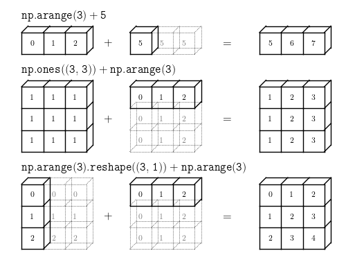

**`numpy` 기초 함수 정리**
---

### **배열 생성 및 관리** 

우리가 흔히 아는 행렬에서의 `행`은 axis = 0, `열`은 axis = 1로 표시된다.

numpy에서의 행렬을 `ndarray`로 표시되며, 아래 5개의 속성을 갖는다.
- `ndim`: 축의 개수
- `shape`: 각 축의 크기
- `dtype`: 데이터의 타입
- `itemsize`: 각 element의 bytes 크기
- `size`: 전체 element의 개수

numpy에서 배열을 생성하는 방법은 아래 방법이 있다.
- `np.array([1, 2, 3, 4])`: 해당 element 4개를 갖는 1차원 배열을 만들 수 있다.
  
다른 방법으로도 배열을 만들 수 있다. 대신 argument로 shape이 들어간다.
-  `np.zeros()`: 전부 0으로 초기화된 배열
-  `np.ones()`: 전부 1로 초기화된 배열
-  `np.empty()`: 형태만 잡혀있고 초기화되지 않은 배열
- `np.arange(start, end, step)`: 시작부터 step씩 커지며 형성하는 배열 
- `np.linspace(start, end, step)`: 시작부터 끝까지 step등분한 배열
- `np.eye()`: Identity matrix 생성

위 함수들 뒤에 `_like(ndarray object)`를 붙여 해당 ndarray와 같은 크기의 배열을 생성할 수도 있다.
- EX) `np.empty_like()`

`reshape()`를 사용하여 위에서 생상한 `ndarray`의 shape을 바꿀 수 있다.

___

### **배열 연산**

numpy에서의 모든 연산은 기본적으로 `element-wise`이다.

-`np.add()`, `np.subtract()`, `np.sqrt()` 와 같은 함수나 `*`, `+`, `-` 같은 연산자들을 모두 **element-wise**이다.

> 우리가 흔히 아는 **matrix multiplication**을 위해선 `@` 연산자나 `np.dot()` 함수를 사용하야 한다.

추가로 연산 시, dtype이 다르다면 포함 범위가 큰 순서 `complex` > `float` > `int` 순으로 자동 type casting이 이루어 진다.

numpy는 최대, 최소 관련 함수들도 지원한다. 아래 함수들에 `axis =` argument를 이용하여 원하는 차원 기준으로 연산을 수행할 수 있다.

- `np.sum()`: 모든 요소의 합
- `np.min()`: 모든 요소 중 최소값
- `np.max()`: 모든 요소 중 최대값
- `np.argmax()`: 모든 요소 중 최대값의 인덱스
- `np.cumsum()`: 모든 요소의 누적합

___

### **수학 관련 함수**

아래와 같이 여러 수학 관련 함수를 제공하지만 너무 많아 필요할 때마다 찾아서 사용하는 것이 편할 것 같다. 
- `np.sin()`
- `np.cos()`
- `np.exp()`
- `np.sqrt()`

___

### **배열 다루기 관련**

배열을 다룰 때, row나 col에 따라 다르게 접근해야할 때도 있고, 특히 Fully connected layer에서는 flatten이 필요한 경우도 있다.

- `np.flat`: Flatten 지원, 실제로 배열을 바꾸는 대신, loop에서 flatten된 것처럼 처리하기 위해 사용
- `np.revel()`: 배열을 Flatten
  - `np.reshape(-1)` 과 동일하다.
- `...`: 배열의 차원이 굉장히 클 때, 중간에 ...을 사용하면 알아서 알맞는 차원으로 처리된다.
- `np.fromfunction(func, shape, dtype=)`: 특정 함수 동작 방식에 맞추어 배열을 생성한다.  

위에서 Flatten처럼 서로 다른 배열을 stack처럼 쌓아야하는 경우도 많다.
- `np.vstack()`: axis = 0 기준으로 쌓음
- `np.hstack()`: axis = 1 기준으로 쌓음

기존 배열을 쪼개야하는 경우도 발생할 수 있다.
- `np.vsplit(num)`: axis = 0 기준으로 [d, :] => [`d/num`, :] 배열 `num`개로 나눔
- `np.hsplit(num)`: axis = 1 기준으로 [:, d] => [:, `d/num`] 배열 `num`개로 나눔

___
### 배열 복사 관련

배열 복사는 `a`와 `b`가 ndarray라면 단순히 `a = b` 형태로 할 수도 있지만 복사가 중요한 이유는 `shallow copy` 와 `deep copy` 때문이다.

**`shallow copy`**: 값은 동일하지만, 두 객체가 완전한 독립체가 아니라 참조하고 있는 상태
- 둘 중 하나의 값이 변하면, 나머지 하나의 값도 변한다.
- 위에서 본 `=` 연산자와 `np.view()` 함수는 `shallow copy`를 지원한다.

**`deep copy`**: 값도 동일하고, 두 객체가 완전한 독립체인 상태태 
- 둘 중 하나의 값이 변하면, 나머지 하나의 값도 변하지 않는다.
- `np.copy()` 함수는 `deep copy`를 지원한다.

`del` 명령어로 객체 삭제 및 메모리 반환이 가능하다.

___
### BROADCASTING

> 배열 관련 연산을 하다가 보면, 배열 간의 `shape`이 맞지 않는 경우가 발생할 수 있다. 이런 경우에 numpy는 `Broadcasting`을 지원한다.

`Broadcasting`이 가능한 조건은 아래와 같다.

1.  **둘 중 하나의 배열의 차원이 1**인 경우
2.  늘리는 축의 길이를 제외한 **나머지 축의 크기는 동일**해야 하고, 두 배열 중 **하나의 배열의 늘리는 축의 크기가 1**이어야 한다.



즉, `Broadcasting`은 크기가 안 맞는 두 배열끼리 연산할 때, 축의 크기가 1인 축을 방향대로 늘려서 연산하는 것이라고 생각하면 된다.

**참고)** numpy에서는 `(3, )` 과 `(3, 1)`의 차이가 크다. 전자는 **1D vector** 이고 후자는 **2D array**이다  
- `np.array([1, 2, 3])` 은 전자, `np.array([[1, 2, 3]])`은 후자에 속한다.
- `(3, 1)` 방식을 사용하는 것이 명확하다.


___
### Indexing

배열 내에 배열을 이용하여 `Indexing`하는 것이 가능하다.

```python
import numpy as np

a = np.array([10, 20, 30, 40, 50])
idx = np.array([0, 2, 4])
print(a[idx])  # [10 30 50]

a = np.array([10, 20, 30, 40, 50])
mask = np.array([True, False, True, False, True])
print(a[mask])  # [10 30 50]

a = np.array([10, 20, 30, 40, 50])
print(a[a > 25])  # [30 40 50]
```

___
### .ix_() function

여러 개의 1D 배열을 서로 브로드캐스팅 가능한 다차원 배열로 변환해주는 함수
- **모든 조합**의 인덱싱
- **외적 연산**에 유용하게 사용
  
```python
import numpy as np

a = np.array([1, 2, 3])  # shape: (3,)
b = np.array([10, 20])   # shape: (2,)

A, B = np.ix_(a, b)

print("A:\n", A)
print("B:\n", B)

# 출력 - A와 B가 Broadcasting 가능한 형태로 맞춰짐
A:
[[1]
 [2]
 [3]]

B:
[[10 20]]


import numpy as np

a = np.array([[11, 12, 13],
              [21, 22, 23],
              [31, 32, 33],
              [41, 42, 43]])

rows = [1, 3]
cols = [0, 2]

result = a[np.ix_(rows, cols)]

print(result)

# 출력 - 모든 조합
[[21 23]
 [41 43]]
```

___
### 선형대수학 관련 함수

numpy는 행렬, 배열을 주로 다루는 라이브러리이기 때문에, 선형대수학을 다루는 함수도 지원한다.

| 함수                         | 설명                                    |
| -------------------------- | ------------------------------------- |
| `np.dot(A, B)`             | 내적 (dot product), 행렬곱                 |
| `np.matmul(A, B)`          | 일반 행렬곱 (`@` 연산자와 동일)                  |
| `np.outer(a, b)`           | 외적 (outer product), 벡터 곱              |
| `np.inner(a, b)`           | 내적 (1D 벡터일 때는 스칼라)                    |
| `np.cross(a, b)`           | 벡터의 외적 (3D 벡터 기준)                     |
| `np.transpose(A)` or `A.T` | 전치 행렬                                 |
| `np.linalg.inv(A)`         | 역행렬                                   |
| `np.linalg.pinv(A)`        | 유사역행렬 (pseudo-inverse)                |
| `np.linalg.det(A)`         | 행렬식                                   |
| `np.linalg.matrix_rank(A)` | 행렬의 랭크                                |
| `np.linalg.eig(A)`         | 고유값 및 고유벡터                            |
| `np.linalg.svd(A)`         | 특이값 분해 (Singular Value Decomposition) |
| `np.linalg.solve(A, b)`    | 선형방정식 `Ax = b` 해 찾기                   |
| `np.linalg.norm(x)`        | 벡터나 행렬의 노름 (기본은 L2)                   |
| `np.linalg.qr(A)`          | QR 분해                                 |
| `np.linalg.cholesky(A)`    | Cholesky 분해 (대칭 양의정부호 행렬)             |

___
### 정규분포 관련
인공지능 분야에서는 특히 `Gaussian`, `정규 분포` 가 많이 등장하기 때문에 관련된 numpy 함수 및 `SciPy` 라이브러리에 대해 알아보자.

**numpy 함수**
- `np.random.normal(mean, std, shape)`: 평균, 표준편차에 따라 랜덤하게 shape 배열 생성

- `np.random.randn(shape)`: 평균이 0, 표준편차가 1인 .normal function
- `np.mean(data), np.std(data)`: 평균/표준편차 계산


**SciPy 라이브러리 함수**

| 목적         | 함수                           | 설명                                  |
| ---------- | ---------------------------- | ----------------------------------- |
| 확률밀도 함수    | `norm.pdf(x, mean, std)`    | 주어진 `x`에서 정규분포의 PDF (확률 밀도) 값       |
| 누적분포 함수    | `norm.cdf(x, mean, std)`    | `x` 이하일 확률 (P(X ≤ x))               |
| 역 누적 함수    | `norm.ppf(q, mean, std)`    | 누적확률 `q`에 해당하는 분위수 (inverse CDF)    |
| 샘플 생성      | `norm.rvs(mean, std, shape)` | 평균 `loc`, 표준편차 `scale` 정규분포에서 난수 생성 |
| 평균/표준편차 추정 | `norm.fit(data)`             | 주어진 데이터로부터 MLE 기반 `mu`, `sigma` 추정  |
