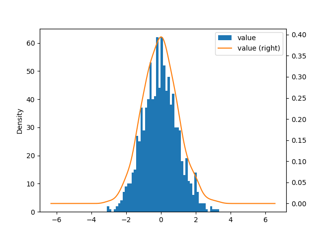
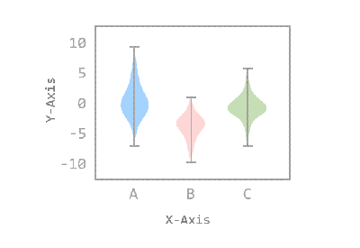
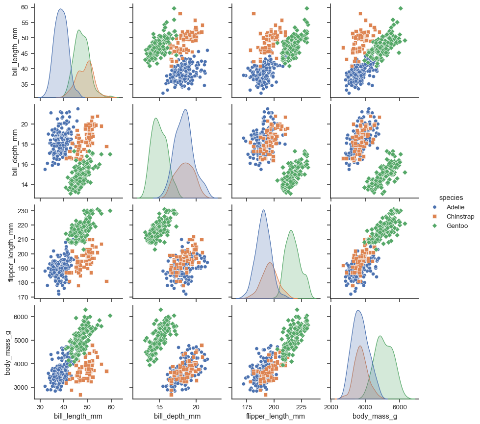

**`seaborn` 기초 함수 정리**

___
`seaborn` 이란?
- `matplotlib` 기반으로 동작하는 데이터 시각화 라이브러리
  - `matplotlib`의 함수도 사용할 수 있다.
- `pandas`의 `DataFrame`과 연동하여 `pandas`의 객체 데이터를 직접 사용할 수 있다.

`load_dataset()` 함수를 이용하여 데이터를 불러올 수 있다.

## 데이터 시각화

**`histplot()`**: 히스토그램으로 표현해주는 함수
    
- `bin=`: 전체 구간을 몇 개의 구간으로 나눌 지 결정

**`kdeplot()`**: 커널 밀도 그래프
    

**`scatterplot`**: 산점도

**`lineplot()`**: 선 그래프

**`barplot()`**: 막대 그래프

**`violinplot()`**: 바이올린 플롯
    

**`heatmap()`**: 히트맵

**`pairplot()`**: 페어 플롯

### 데이터 시각화에서 공통적으로 사용하는 옵션

1. `data`: 시각화할 데이터를 지정

2. `x`, `y`: x축과 y축에 어떤 컬럼을 쓸지 지정

3. `hue`: 어떤 col을 기준으로 색을 나눌지 지정
   
4. `col`, `row`: 해당 col / row 기준으로 subplot으로 나눔

5. `palette`: 상 테마 지정

6. `style`: 마커(점)의 모양 스타일 

7. `size`: 점의 크기를 어떤 col 기준으로 조절할지 지정

8. `legend`: 범례를 표시할지 말지

9. `ax`
→ matplotlib의 축 객체를 넘겨서, 그 위에 그리기

10.  `order`, `hue_order`: 카테고리 순서 강제 지정

