# 04. Optimizaion

**`강의 영상`**                      

https://www.youtube.com/watch?v=qcSEP17uKKY&list=PL5-TkQAfAZFbzxjBHtzdVCWE0Zbhomg7r&index=4

**`강의 자료`**

https://web.eecs.umich.edu/~justincj/slides/eecs498/498_FA2019_lecture04.pdf


___

지난 강의에서 배운 내용을 정리하면 다음과 같다.

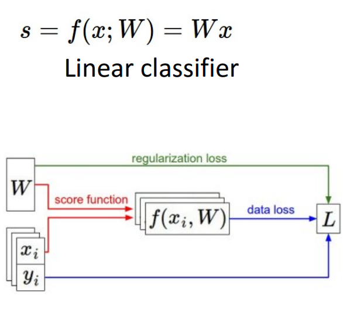

`Loss function`을 이용하여 현재의 `W`가 타당한 값인지 확인하는 과정을 공부하였다.
- 이 과정에서 사용 가능한 `Loss function`의 종류와, `Regularization` 등을 학습하였다.

우리가 `W` 값이 좋은 지 여부를 `Loss function`으로 확인할 수 있다면, **어떻게 `W`의 값을 정할지에 대한 지식도 필요하다.**

# Optimization

> Find a best W

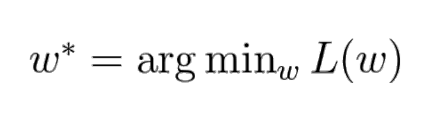

- 한마디로, **`Loss function`의 결과를 최소화하는 $W$를** 찾는 것이 목표이다.
- **General 한 경우**에서의 `Optimization`을 이 강의에서 공부할 것이다.

**Example**

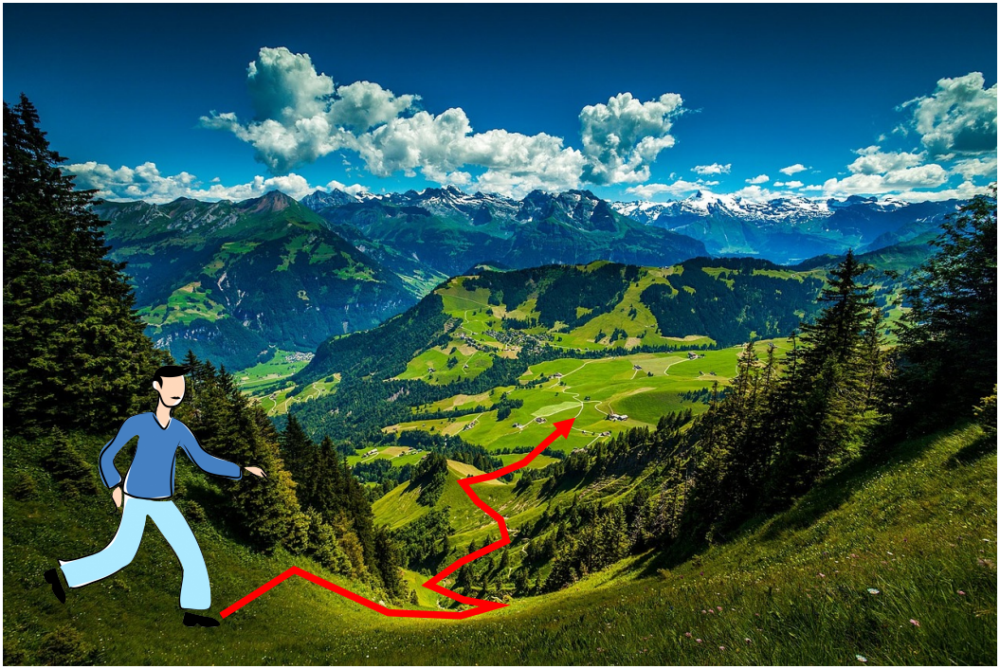
- 사진 속 사람이 눈을 가리고, 아래 낮은 지점까지 가도록 만들어야 하는 상황을 생각해보자
- `Linear Classification`과 같이 간단한 상황에서는 수식, 방정식으로 해결이 가능하지만 대부분의 상황은 그렇게 해결되지 않는다.
  

때문에 우리는 **반복적인 방법**을 사용해야 한다.

___ 

**첫 번째 방법**: `Random Search`

> Random한 값의 Weight를 사용하며, 그 중 가장 좋은 값을 사용하는 방법
   
```python
bestloss = float("inf")

for num in range(10000):
    W = np.random.randn(10, 3073) * 0.0001
    loss = L(X_train, Y_train, W)

    if loss < bestloss:
        bestloss = loss
        bestW = w
```
  
- `CIFAR10`에서 위 방법을 사용하면 `15.5%`의 정확도를 얻을 수 있다.
  
- 별로 좋지 않은 방법이다.
  
**두 번째 방법**: `Follow the slope`
  
  > 사람이 눈을 가리고 있어도 지면의 경사를 느낄 수 있으므로 , 한 발자국마다 경사가 아래로 큰 방향으로 이동하도록 하는 방법.
  
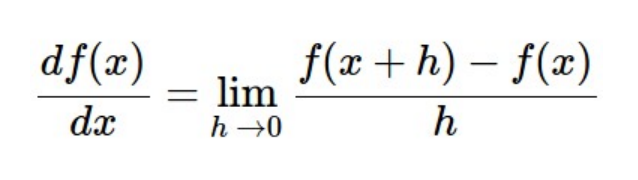
- 1차원에서는 **기울기(경사)는** 위 수식처럼 나타낼 수 있다.
    
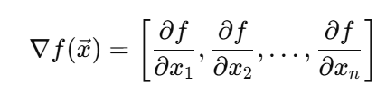
- 다차원에서 Vector를 입력받아 Scalar를 반환하는 함수에 대해 각 차원에 대해 **편미분**하여, Vector 형식으로 만들면 `Gradient`이다.
  
- `Gradient`는 기울기 증가량이 가장 큰 방향을 가르키며, `방향 벡터`와 내적시 해당 방향으로의 기울기를 구할 수 있다.
  
- 위 예시에서는 아래 방향의 기울기를 확인해야 하는데, 기울기가 가장 크게 감소하는 방향은 `Gradient`**의 음의 방향**이다.

- 위 같이 수치적으로 계산한 `Gradient`를 `Numeric Gradient`라고 한다.
___

수식에 따라 `Numeric Gradient`를 구해보자.

`Loss function`은 vector $W$를 입력받아 Scalar 값인 `loss`를 반환한다.
- 위에서 본 `Gradient` 수식을 적용할 수 있다.

`h`를 굉장히 작은 수인 **0.00001**로 잡고, 계산해보자

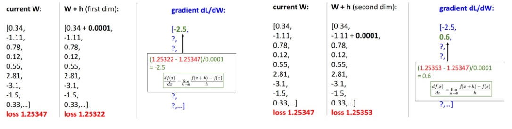
- 이처럼 $W$ **vector** 속 값마다 수식을 적용하여 `Gradient` **vector**를 구할 수 있다.

`Numeric Gradient`를 이용하면 **코드 작성이 간단하다는 장점**이 있지만, **두 가지 문제점**이 존재한다.

1. **시간이 오래 걸린다**
2. **h = 0.00001로 설정하는 것 자체가 `Approximation`이다.**

따라서 일일히 계산하지 않고, `Analytic Gradient`를 이용하여 **단일 연산으로 계산**할 수 있도록 한다.
- **미분 공식을 이용하여 `Gradient`를 계산하는 방법**이다.
- `Lecture 6`에서 배울 예정이다. 

그러나 `Analytic Gradient`를 사용하기 위해선 사전 작업이 필요하고, 계산 상의 오류가 발생할 수도 있다.

따라서 **일반적으로는 `Numeric`과 `Analytic` 두 가지 방법을 모두 사용한다.**

> **`Analytic Gradient`의 빠른 계산을 이용하여 구현하고, `Numeric Gradient`를 이용하여 잘못된 것이 없는지 확인한다.**

`pytorch`는 위 작업을 `torch.autograd.gradcheck()`와 `torch.autograd.gradgradcheck()` 함수를 통해 지원한다.
- `gradcheck()`: 1차 도함수 지원
  
- `gradgradcheck()`: 2차 도함수 지원
- `requires_grad=True` 설정 되어있어야 한다.


# Gradient Descent

> **현재 위치에서 기울기가 가장 크게 감소하는 `Negative Gradient` 방향으로 반복적으로 이동하며, 함수의 최솟값을 찾는 알고리즘**

가장 간단한 `Gradient Descent` 방법은 **`Vanilla gradient descent` 또는 `Batch Gradient Descent`라고** 부른다.
- 전체 데이터셋을 한 번에 사용하여 `Weight`를 업데이트하는 방법이다.

```python
w = initialize_weights()
for t in range(num_steps):
    dw = compute_gradient(loss_fn, data, w)
    w -= learning_rate * dw
```

위 `Vanilla gradient descent` 코드를 보면, 3개의 `Hyperparameter`가 존재하는 것을 확인할 수 있다.

1. `Weight initialization method`
   
2. `Number of steps`
   - Deep Learning에서 Gradient descent를 중단하는 가장 간단한 방법
   
3. `Learning_rate` 
   - 한 번 `Local Gradient` 만큼 이동하는 크기를 제어

`Gradient Descent` 과정을 시각화하면 아래와 같다.

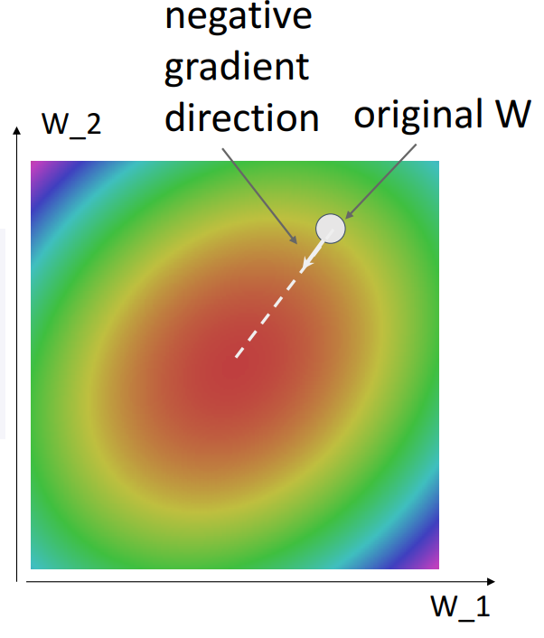

조금 더 복잡한 상황에서 `Gradient Descent` 과정을 애니메이션으로 보면, 두 가지 특징을 확인할 수 있다.

1. **일직선으로 최솟값으로 가지 않고 호를 그리며 이동한다.**

2. **처음에는 빠르게 감소하다가 최솟값 근처에서는 느리게 감소한다.**

지금까지 본 방법은 **전체 데이터 N개에 대해 `Analytic Gradient`를 계산**하는 것을 반복한다.

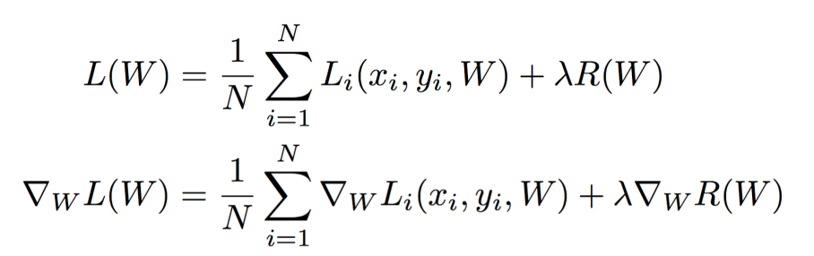

이 것을 코드로 구현하면, **데이터셋이 큰 경우에 굉장히 오랜 시간이 걸린다는 단점이 존재한다.**

- 특히, 데이터셋이 큰 경우에는 최적의 성능을 보이고자 하는데, 이 경우에 오랜 시간이 걸리는 것은 적절하지 않다.

# Stochastic Gradient Descent (SGD)

> `Batch Gradient Desent` (`Vanilla Gradient Descent`) 처럼 **전체 데이터셋을 이용하여 계산하는 것은 오래 걸리기 때문에** 대신 사용하는 방법

> 아래 같은 경우는 일반적으로 `Mini-Batch SGD`라고 부른다.

전체 데이터셋에서 `minibatch`만큼의 데이터만을 이용하여 `Gradient Descent`를 진행하는 방법이다.

```python
w = initialize_weights()

for t in range(num_steps):
    minibatch = sample_data(data, batch_size)
    dw = compute_gradient(loss_fn, data, w)
    w -= learning_rate * dw
```

`Batch Gradient Descent`와 다르게, 2개의 `Hyperparameter`가 추가적으로 필요하다.

1. `Batch size`
    - GPU Machine이 처리할 수 있는 최대 크기까지 사용하는 것이 좋다.

2. `Data Sampling` 
   - Random value 사용
   - 전체 데이터를 shuffle하고 순서대로 사용

**위 두 가지 모두 학습 결과에 어느 정도 영향은 미치지만, 기존 3개의 `Hyperparameter`만큼 큰 영향을 끼치지는 않는다.**

### Q) Why "stochastic"?

> 우리가 전체 데이터 셋에서 일부만을 사용함으로서, 우리는 **Loss function을 전체 데이터셋에 대한 기댓값**으로 간주할 수 있다.

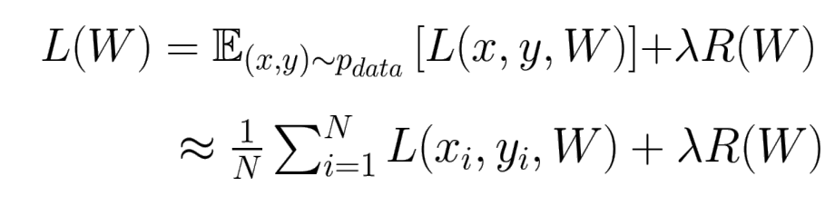

`Monte-Carlo` 방식에 의해 **전체 데이터셋에 대한 기댓값**은 `Sampling data`로 구한 `Loss`의 총합을 `Sampling data` 개수로 나누어서 `Approximation`할 수 있다.

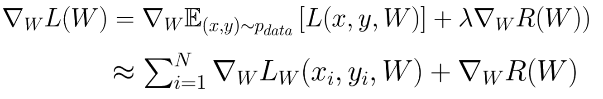

`Gradient`도 마찬가지로 구할 수 있다.

역사적으로는 아래 순서를 따른다.

    Full-Batch는 너무 오래 걸림 -> Mini-batch SGD로 계산하자 -> 계산하고 보니 Monte-carlo 방식이네? -> 실제 Loss의 Expectation을 근사한 것처럼 동작하는구나


## Gradient Descent의 문제점

`Learning rate의 크기`
   
   - `Learning rate`가 큰 경우
    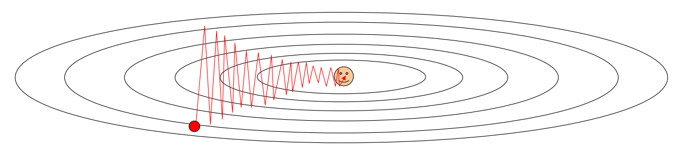
      - 지그재그 패턴이 생긴다.
      - **최솟값에 도달하지 못하고 지나치는** `Overshoot`이 발생한다.
  

   - `Learning rate`가 작은 경우
     - `Overshoot`은 방지할 수 있다.
     - 너무 오래 걸린다.

   - `Condition Number`
     - 한 쪽은 경사가 가파르고, 다른 한 쪽은 평평한 경우
     - 이 경우에는 `Learning rate`를 적절히 설정해도 학습에 어려움이 있다. 

`Local minimum과 Saddle point의 존재`

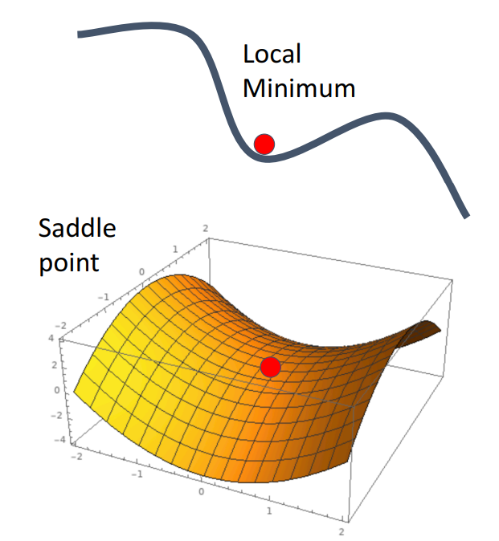

- `Global minimum`은 아니지만 0으로 수렴할 수 있는 경우
  
- 0으로 수렴하는 경우, `Global Minimum`인지 여부와 관계없이 `Gradient descent`는 더 이상 동작하지 않는다.
  
- `saddle point` 한 차원에서는 `Local Maximum`, 다른 차원에서는 `Local Minimum`인 점
  - **High Dimension**에서 더 자주 발생한다.

`Noisy`
    
    `Mini-batch SGD`에서만 발생하는 문제이다.

- 우리가 `Sampling`을 사용하기 때문에, `Noise`가 발생할 수 있다.
  
- 이런 경우에는 현재 시점에서 이동하고자 하는 방향이 정확한 방향인지 확신할 수 없다.

- `Noise`가 있더라도 오래 기다리면 최솟값으로 이동하긴 하지만, 어떤 상충 관계가 있는지 확인할 수 없으므로 문제점이다.

# SGD + Momentum

> 위에서 본 Gradient Descent의 문제점을 해결하기 위해 Gradient를 계산하는 다른 방식을 알아보자.

하나의 점이 경사로를 내려간다고 생각하는 대신, 구슬이나 공이 경사로로 내려간다고 생각해보자

**구슬이나 공은 내려갈수록 속도가 붙게 된다.**
- `SGD + Momentum`은 이 점을 이용한다.

수식과 코드로 나타내면 아래와 같다.

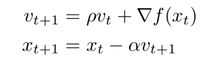


```python
v = 0
w = initialize_weights()

for t in range(num_steps):
    dw = compute_gradient(w)
    v = rho * v + dw
    w -= learning_rate * v
```

하나의 `Hyperparameter`가 추가된다.
- $\rho$:  마찰력, 저항 등으로 속도를 줄이는데 사용된다.

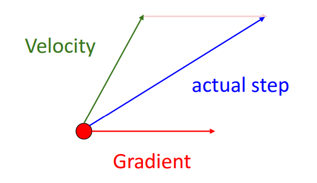

현재 시점에서 구한 `Local Gradient`의 방향으로 이동하는 것이 아니라, **`Velocity + Gradient`의 방향으로 이동**하는 것이 가장 큰 차이점이다.

`Velocity`는 직전의 `Velocity`와 `Local Gradient`를 더한다.
- 경사로의 마찰력을 감안해서 속도를 줄이기도 한다.
- **`Velocity`와 `Local Gradient`의 방향이 같다면 속도가 붙고, 다르다면 속도가 감소한다.**

논문에 따라 다른 방식으로 계산되기도 하나, 의미는 동일하다.

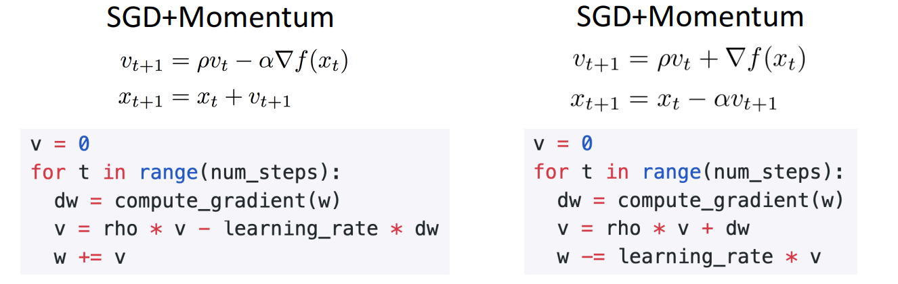

`Velocity`는 기존 `Local Gradient`의 `가중 평균`이다.

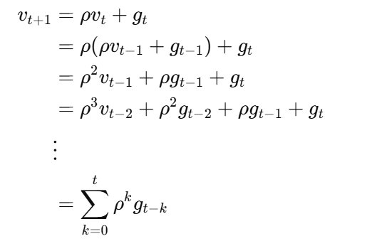

**우리가 훈련 중에 보았던 모든 `Local Gradient의 가중 평균`으로 현재 `Local Gradient`의 방향을 조정할 수 있다.**

### SGD + Momentum이 기존 GD의 문제를 해결하는 방법

1. `Local Minimum`과 `Saddle point`는 `Local Gradient` = 0이어도 기존 `Velocity`가 남아있어 쉽게 넘어간다.
    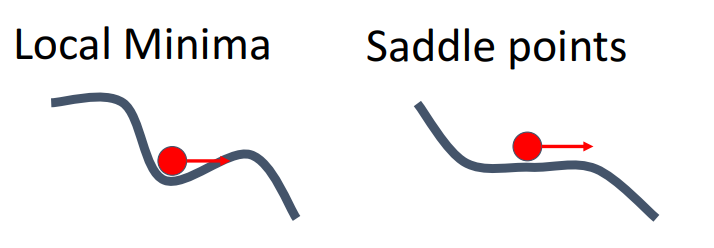

2. `Condition Number`는 평평한 지역에서는 `Velocity`를 이용해 학습이 빨라지도록, 가파른 지역에서는 `Velocity`를 이용해 급격한 방향 전환을 막아 `Overshoot`을 피하도록 할 수 있다.

3. `Noise`가 있는 경우에 `SGD + Momentum`을 사용하면 최솟값으로 비교적 일정하게 가는 것을 확인할 수 있다.

### 단점

`SGD + Momentum`은 `Velocity`를 History처럼 사용하기 때문에, `Gradient` 방향에 따른 즉각적인 반응이 일어나지 않아 `Overshoot`이 발생하고 복구되는 경우가 많다.

# Nesterov Momentum

> 일반 Momentum과 가장 큰 차이점은 Gradient를 계산할 때, 우선 현재 Velocity만큼 이동해 본 위치에서 Gradient를 계산한다는 점이다. 강의에서는 이것을 **"Look ahead"라고** 포현한다. 

수식과 코드로 보면 아래와 같다.

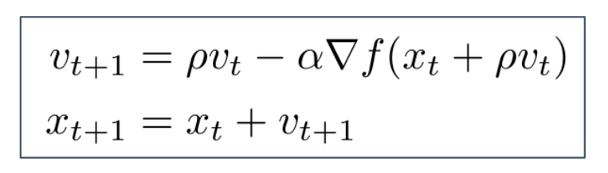

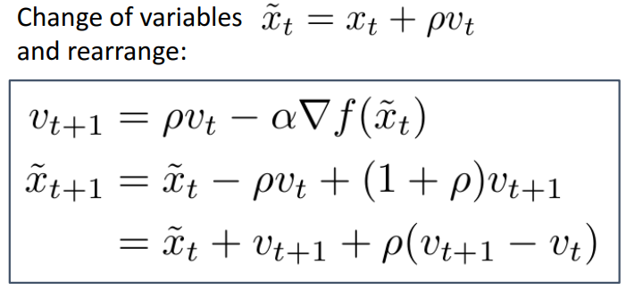

```python
v = 0
w = initialize_weights()

for t in range(num_steps):
    dw = compute_gradient(w)
    old_v = v
    v = rho * v - learning_rate * dw
    w -= rho * old_v - (1 + rho) * v
```

**`Velocity`만큼 이동해본 위치에서 `Gradient`를 계산하여 `Velocity`와 더한다.**

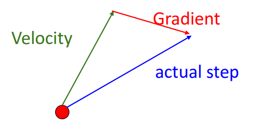

> `Velocity`가 기존에 확인했던 `Gradient의 History`라고 생각하면, 예측되는 위치로 이동하여 구한 방향을 `Velocity`에 더하여 사용하는 방법은 `일반 모멘텀`보다 빠르고 `Oveshoot`도 적다고 생각 할 수 있다. 


# AdaGrad

> 각 파라미터마다 학습률을 다르게 조정하며, 학습 과정 중에도 자동으로 변화하는 학습률 기법인 `Adaptive Learning Rate`의 대표적인 예시

`Gradient`를 각 차원 속 `historical sum of squares`에 따라 **element-wise scaling**하여 더한다.

```python
grad_squared = 0

for t in range(num_steps):
    dw = compute_gradient(w)
    grad_squared += dw * dw
    w -= learning_rate * dw / (grad_squared.sqrt() + 1e-7)
```

`Overshoot`의 가능성이 있는 상황에서는 `grad_squared`가 커져 `w`는 작은 폭으로 변하게 된다.

`Gradient`가 느리게 변하는 상황에서는 `grad_squared`가 작아져 `w`는 큰 폭으로 변하게 된다.

**즉, `Gradient`의 크기에 따라 `Learning rate`를 조절하여 `Overshoot`을 방지하고 평평한 구간에서 빠른 학습을 유도할 수 있다.**

### 문제점
`grad_squared`는 제곱 즉, 항상 양수인 값을 더하기 때문에, 오랜 시간이 지나면 `grad_squared`는 매우 커지게 된다.

**`grad_squared`가 매우 커지면 `w`의 변화량은 매우 작아지거나 0이 되어 `gradient descent`가 멈추는 문제가 발생하게 된다.**

# RMSProp

> `AdaGrad`의 문제점을 보완하기 위해서, 일부분을 바꾸어 만든 방법

``` python
grad_squared = 0

for t in range(num_steps):
    dw = compute_gradient(w)
    grad_squared += decay_rate * grad_squared + (1 - dacay_rate) * dw * dw
    w -= learning_rate * dw / (grad_squared.sqrt() + 1e-7)
```

`AdaGrad`에서 `grad_squared`가 계속해서 커지는 것이 문제였으므로 `decay_rate`로 증가량을 조절할 수 있게 한다.

# Adam

> `RMSProp`과 `Momentum`을 합쳐 사용하는 형태이다.

```python
moment1 = 0
moment2 = 0

for t in range(num_steps):
    dw = compute_gradient(w)
    # Momentum 기법 이용
    moment1 = beta1 * moment1 + (1 - beta1) * dw
    # RSMProp 기법 이용
    moment2 = beta2 * moment2 + (1 - beta2) * dw * dw
    # RSMProp + Momentum
    w -= learning_rate * moment1 / (moment2.sqrt() + 1e-7)
```

- 위 코드에서 확인할 수 있는 `RSMProp`과 `Momentum` 기법을 모두 사용한다.

하지만 위 경우 **문제점**이 있다.

만약 학습 초기에 `beta2`가 1에 굉장히 유사한 값으로 초기화되어 있다면, `moment2`는 0에 가까워질 것이고 이는 `w` 변화량의 크기를 굉장히 크게 만든다.
- 이 문제는 `RSMProp`에서도 발생한다.

-> **이 문제를 해결하기 위해, `Bias correction`이라는 것을 추가한다.**

-> `beta2`에 제곱을 하여 분`moment2`를 0보다 큰 값이 되도록 한다.

```python
moment1 = 0
moment2 = 0

for t in range(num_steps):
    dw = compute_gradient(w)
    # Momentum 기법 이용
    moment1 = beta1 * moment1 + (1 - beta1) * dw
    # RSMProp 기법 이용
    moment2 = beta2 * moment2 + (1 - beta2) * dw * dw
    # Bias correction
    moment1_unbias = moment1 / (1 - beta1 ** t)
    moment2_unbias = moment2 / (1 - beta2 ** t)
    # RSMProp + Momentum
    w -= learning_rate * moment1_unbias / (moment2_unbias.sqrt() + 1e-7)
```

- 학습의 초기 몇 Step 동안은 `moment1`과 `moment2`가 0일 가능성이 있으므로, 분모에 **(1 - beta ** t)를** 나눔에 따라 분모를 작게 만들어 초기 `moment` 값을 키우는 역할을 한다.

> **Adam은 Deep Learning에서 General하게 가장 많이 사용되는 방법이다.**

- `RMSProp`처럼 올바른 방향으로 즉시 구부러지며, `Momentum`을 이용할 때처럼 진동을 줄이고 빠르게 수렴하는 대신, `Overshoot`을 줄일 수 있다.
  
- `RSMProp`은 누적된 정보가 없기 때문에 지그재그 패턴이 나올 수 있고, `Momentum`은 곡률이 변화하는 지점에서 이전 `Velocity`의 영향을 받기 때문에 `Overshoot`이 발생할 수 있다.
- `Adam`은 두 방법을 혼용하여 위 문제를 해결한다.

# Optimizatoin Method 비교

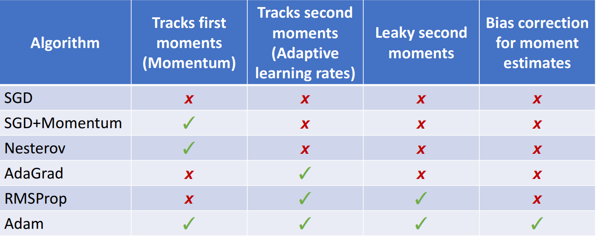

# First-Order Optimization

> 1차 도함수만을 이용하여 계산하는 방법

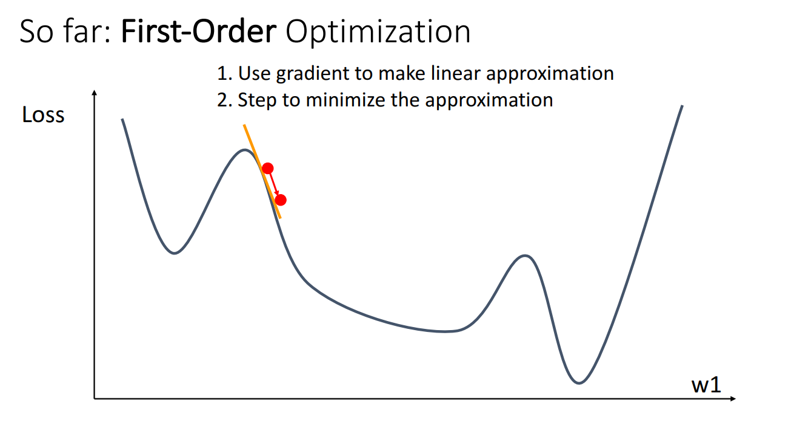

- **우리가 위에서 봤던 모든 방법이 여기에 속한다.**
  
- 기본적인 `Gradient Descent`는 이 방법을 사용한다. 
  
- 미적분학 정의에 따라 선형 근사로도 구할 수 있다.

# Second-Order Optimization

> 각 차원에 따라 이계 도함수를 구한 행렬인 `Hessian Matrix`를 이용하는 방법

`Hessian Matrix`: 오목과 볼록의 정보까지 포함해 곡률을 알 수 있다.

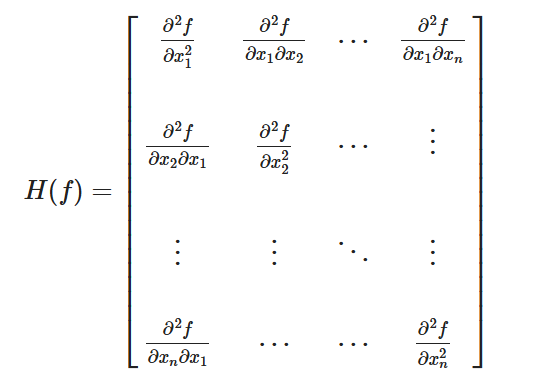


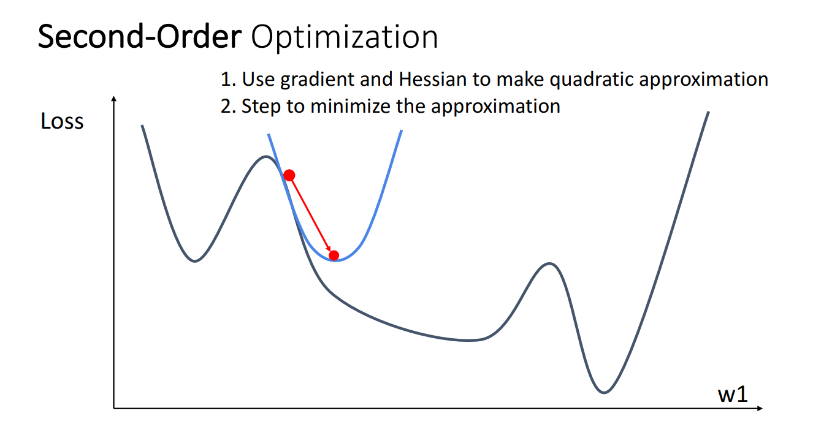

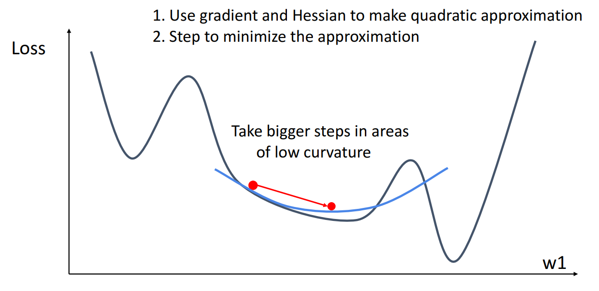

**`Second-Order Optimization`을 사용하면, 곡률이 작은 곳에서는 크게 곡률이 큰 곳에서는 작게 변화도록 유도할 수 있다.**

이 방법은 `Quasi-Newton Method (BGFS)`라고 하며 과정은 아래와 같다.

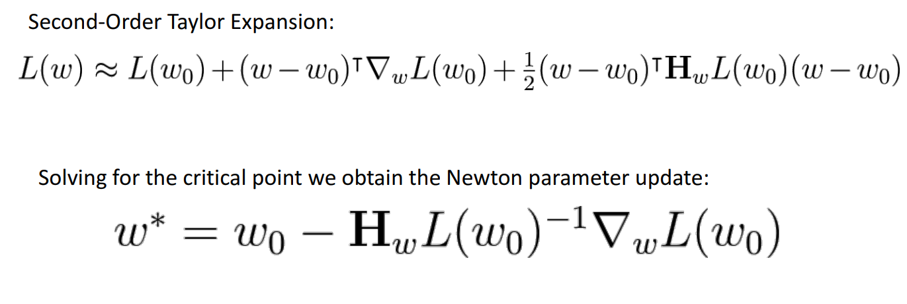

1. `Taylor Expansion`
   
2. `Weight Update`

**결국, 1차 도함수와 이계 도함수를 모두 사용하여 곡률 정보와 방향 모두를 알고 `Weight`를 조정할 수 있다.**
- `Adam`, `Mementum` 등의 방법은 곡률 정보를 간접적으로 알려준다고 하여 `Second-Order`라고 이야기하는 사람도 있다.

### 문제점

수식에서 확인할 수 있는 것처럼, 계산할 때 `Hessian matrix`의 역행렬을 구해야 한다.
- 이 과정에서 $O(n^3)$의 시간이 소요된다.
  
- 대신 `L-BGFS`를 사용하는 경우가 많다.
- `L-BGFS`는 Full-batch에서 더 잘 동작한다.


# Summary

`Adam`은 많은 경우에서 **기본값으로 좋은 선택**이다.

`SGD + Momentum`이 `Adam`보다 더 좋은 성능을 낼 수 있지만,
`하이퍼파라미터 튜닝`이 더 많이 필요할 수 있다.

만약 **전체 배치 학습(full batch update)이 가능하다**면,
`L-BFGS`를 시도해보는 것도 좋다.
(단, 모든 잡음 요소는 반드시 비활성화해야 한다.)
