# 10. Training Neural Networks (Part 1)

**`강의 영상`**                      

https://www.youtube.com/watch?v=qcSEP17uKKY&list=PL5-TkQAfAZFbzxjBHtzdVCWE0Zbhomg7r&index=10

**`강의 자료`**

https://web.eecs.umich.edu/~justincj/slides/eecs498/498_FA2019_lecture10.pdf

___

# Overview

1. `SetUp`

    - Activation functions, data preprocessing, weight initialization, regularization 

2. `Training dynamics`
    - Learning rate schedules, large-batch training, hyperparameter optimization

3. `After Training`

    - Model ensembles, transfer learning

**10강**에서는 우선 `SetUp` 단계만 살펴볼 것이다.

나머지 두 단계는 **11강**에서 배울 것이다.

# Activation function

> **입력을 받아 비선형성을 부여하며 다음 층에 전달 할 수 있도록 해주는 단계**

## Sigmoid 

> **2개의 class가 있거나, 참 또는 거짓 문제에 대해 확률로 해석되기 때문에 예전에 가장 인기있게 사용되는 Activation function 중 하나**

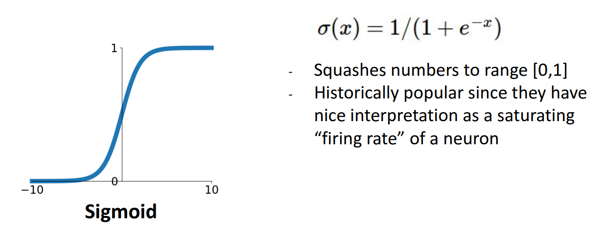

- 이 함수는 실제 `Neuron`에서의 `Firing rate`처럼 사용된다.

### 단점

`Sigmoid function`에는 **3가지 단점**이 존재한다.

#### 1. Kill the gradients

**절대값 $x$ (Input)가** 큰 경우에는 `Sigmoid` **그래프의 기울기가 0에 가까운 것**을 확인할 수 있다.

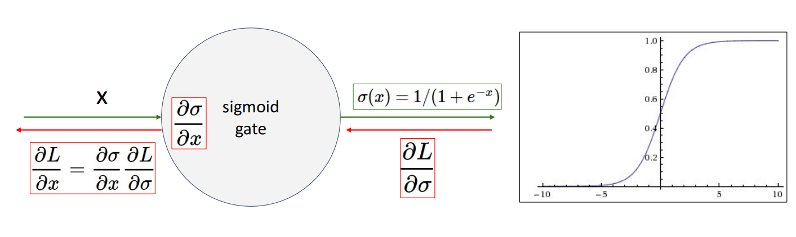

**절대값 $x$ (Input)가** 큰 경우에는 **`Local Gradient`가 0에 가까워지기 때문에,  `Upstream Gradient`과 관련없이 `Downstream Gradient`가 0에 가까워진다.**

- 이 문제는 **모델의 학습을 굉장히 느리게** 만든다.'
  
학습이 잘 진행되는 경우는 **입력 $x$가 0에 가까운 `Sweet Spot`에 위치**하는 경우이다.

#### 2. Sigmoid Function's Output is not Zero-Centered output 

**`Sigmoid function`의 output은 항상 양수라는 점이 문제가 된다.**

`Output` $z = \sum_i{w_ix_i + b}$로 이루어져 있다고 해보자.

이때, **모든 `Input` $x_i$가 양수**라면 모든 Gradient $W$는 양수이다.

- `Input` $x_i$가 양수일 때, `Weight`의 부호는 모르기 때문에 `Output`인 $z$의 부호는 알 수 없지만, **`Sigmoid Function`의 출력 결과는 항상 양수**이기 때문에 **다음 `Layer`의 `Input`도 양수**가 되게 된다.

- 따라서 `Sigmoid function`을 사용하면 이 문제가 다른 `Layer`에 전파된다.

- $\frac{\partial{z}}{\partial{W}} = X$ 인데 모든 $X$가 양수이기 때문이다. 

`Local Gradient`가 양수라는 말은 `Downstream Gradient의 방향`은 `Upstream Gradient`의 부호에 의해 결정된다는 것이다.

따라서 `Downstream Gradient`인 $\frac{\partial{L}}{\partial{W}}$의 모든 `Weight`에 대해 **항상 양수이거나 항상 음수**이다.

즉, `Weight Space`에 대해 사분면을 그려보면, **전부 양수인 1사분면이나, 전부 음수인 3사분면 방향**으로만 이동이 가능하다는 것을 의미한다.

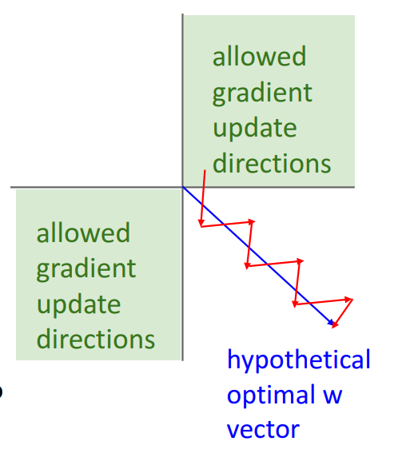

이 경우, `Minimum` 지점을 향할 때, **파란색 선을 따라 최적점으로 바로 가지 못 하고,** **빨간선처럼 지그재그 패턴을 그리며 비효율적으로 이동해야 한다.**

지금은 2-dim의 경우라 그렇게까지 비효율적으로 보이지 않을 수 있지만, **`Weight`의 차원이 커질수록 점점 비효율적으로 된다.**

하지만, 이 단점은 `Single Element` 사용하거나 `Mini-Batch`를 사용하지 않을 경우에만 발생한다.

- 왜냐하면 `Mini-batch`를 사용하면, **각 `Batch`에서의 결과를 평균**내기 때문에 **각 `Batch`에서의 `Weight`가 모두 양수이거나 음수여도 평균을 내면 각 `Element`가 각기 다른 방향으로 이동**할 수 있기 때문이다.

#### 3. exp() function is expensive to compute

`CPU`에서는 **exp()** 연산을 하는데 꽤 많은 **Cycle**이 소요된다.

- **ReLU function**이 약 **3배 빠르다.**

## Tanh

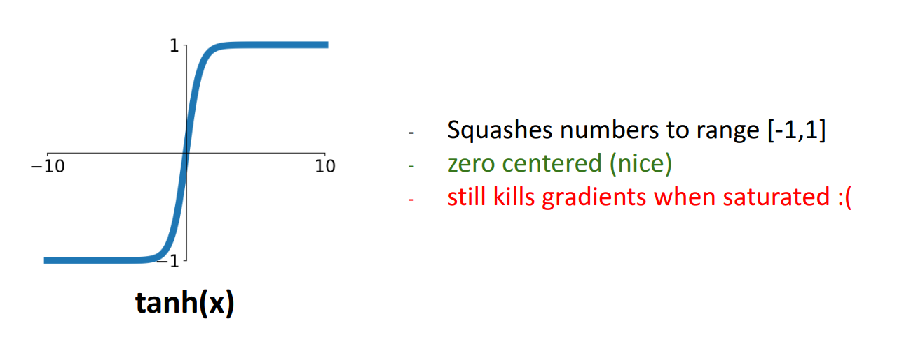

여기서는 수식이 나오진 않았지만, 수식을 살펴보면 **(2 * sigmoid) - 1** 형태이다.

- 이를 통해 `Output`이 **[-1, 1]의 범위**를 갖고, **Zero-Centered**이다.

`Sigmoid`와 다르게 특정 층의 `Input`이 모두 양수여도 해당 `Layer`만 **지그재그 문제**를 갖게 되고, **다른 Layer로 해당 문제가 전파되진 않는다.**

- `Tanh`는 음수도 `Output`으로 낼 수 있기 때문에, 다음 `Layer`로 항상 양수가 전달되거나 하지 않기 때문이다.

이러한 관점에서 `Tanh`가 `Sigmoid`보다 약간 더 나은 선택일 수 있다.

**그러나 그래프에서 기울기가 0인 부분이 여전히 남아있으므로 학습이 느려지는 문제는 남아있다.**

## ReLU

만약 `ReLu function`의 `Input` $x$가 **`Float`라면 MSB만 확인해서 음수라면 그냥 0**으로 만들 수 있으므로 **다른 `Activation function`에 비해 계산 속도가 훨씬 빠르다.**

**$x$가 양수인 경우에는 기울기가 항상 1**이므로 학습에도 전혀 문제가 없다.

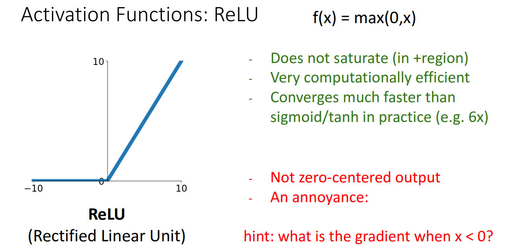

하지만, `ReLU function`은 **항상 출력값이 양수이거나 0이므로 지그재그 문제**를 겪을 수 있다.

가장 큰 문제점은 **$x$가 음수인 경우 `Gradient`가 0**이 된다는 점이다.

- `Sigmoid` 함수도 `Gradient`가 0에 가까워지는 것이였지 완전히 0이 되지는 않았다.

- 이 경우, **학습이 아예 진행조차 되지 않는다**는 문제점이 있다.

따라서 `ReLU`의 경우에는 **특정 특성에 대해서는 계속 음수가 되어 해당 특성은 절대 학습조차 되지 않는 문제가 발생**할 수도 있다.

- 특정 특성을 담당하는 `Neuron`이 `Dead Neuron`이 되어, 해당 `Neuron`이 **담당하는 특성은 영원히 학습되지 않을** 수 있다. 

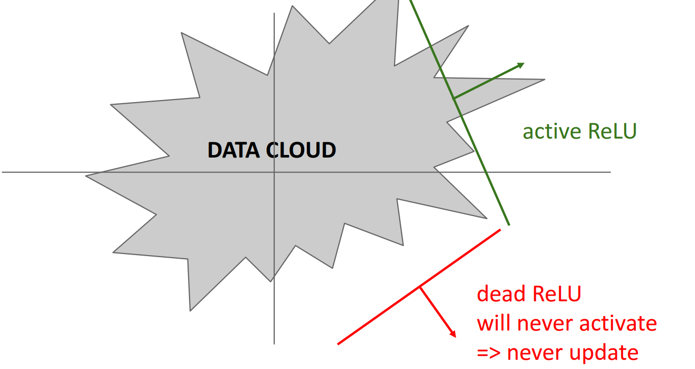

이를 해결하기 위해 **0.01과 같은 아주 작은 양수값을 Bias term으로 더하**기도 한다.

마지막으로 `ReLu`는 $x=0$에서 **미분이 불가능**하지만, 확률적으로 **정확히 $x=0$인 경우는 거의 없으므로 그냥 무시하고 사용하는 편**이다.

## Leaky ReLU

`ReLU`가 `Input`이 음수인 경우에, **`Gradient`가 0이 아니라는 점이 문제**였기 때문에 이를 해결하기 위해 **음수 영역에도 0.01의 작은 `Gradient`를 부여한 함수**

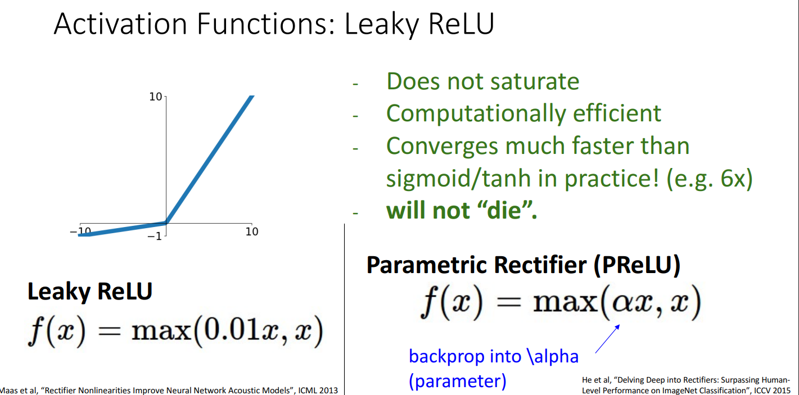

`ReLu`와 다르게 `Neuron`이 절대 죽지 않는다는 차이점이 있다.

음수 영역의 `Gradient`를 `Hyperparameter`로 지정하는 `PReLU`도 존재한다.

가장 큰 문제점은 **0에서 미분이 불가능하다는 점이다.**

- 그래프 상에서 $x=0$에서 꺾이는 것을 확인할 수 있다.

## Exponential Linear Unit (ELU)

`ReLU`의 문제점과 `Leaky ReLU`에서 $x=0$에서 미분이 불가능하다는 점을 해결하기 위해 사용하는 함수

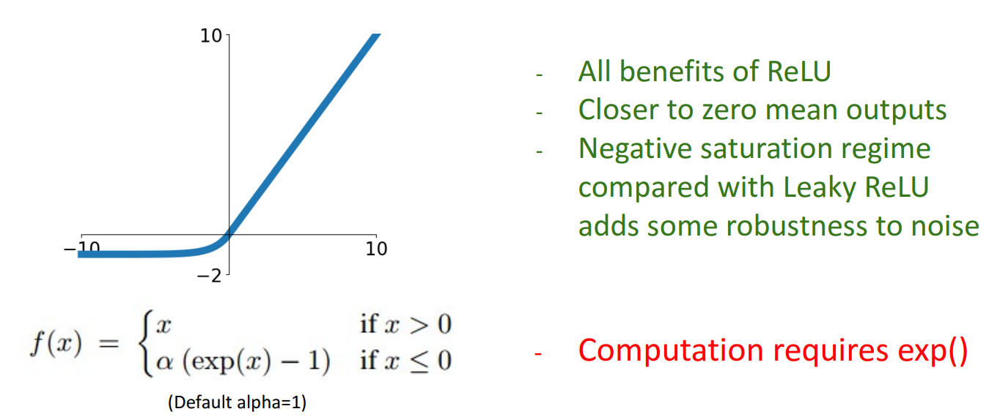

`Output`의 평균을 수학적으로 증명하면 0에 가깝다.

오래걸리는 `exp()` 연산이 포함된다는 점과 $\alpha$라는 추가적인 `Hyperparameter`를 갖는다는 점이 단점이다.

- `Hyperparameter`가 많을수록 모델을 학습시킬 때 힘들다.

## Scaled Exponential Linear Unit (SELU)

`ELU`와 다른 점은 $\lambda$가 추가되고, $\alpha$와 $\lambda$가 굉장히 긴 소수점 아래 수를 가진 상수로 고정된다는 점이다.

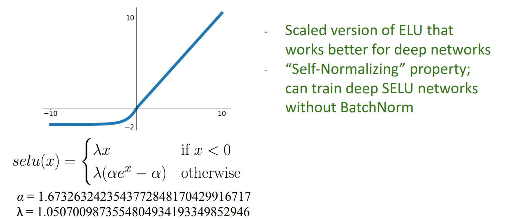

그림에 제시된 $\alpha$와 $\lambda$를 사용하면, `Batch Normalization`과 같은 추가적인 정규화 기법 없이도 `Self-Normalization`이 가능하다는 점이다.

- 이 때문에, 굉장히 깊은 `Neural Network`도 쉽게 훈련이 가능하다.

이에 대한 증명은 너무 어렵고 길어서 넘긴다.


## Summary

`CIFAR10` 데이터셋을 이용하여 각기 다른 `Model`과 다른 `Activation function`을 사용하여 그래프로 나타내면 아래와 같은 결과를 얻을 수 있다.

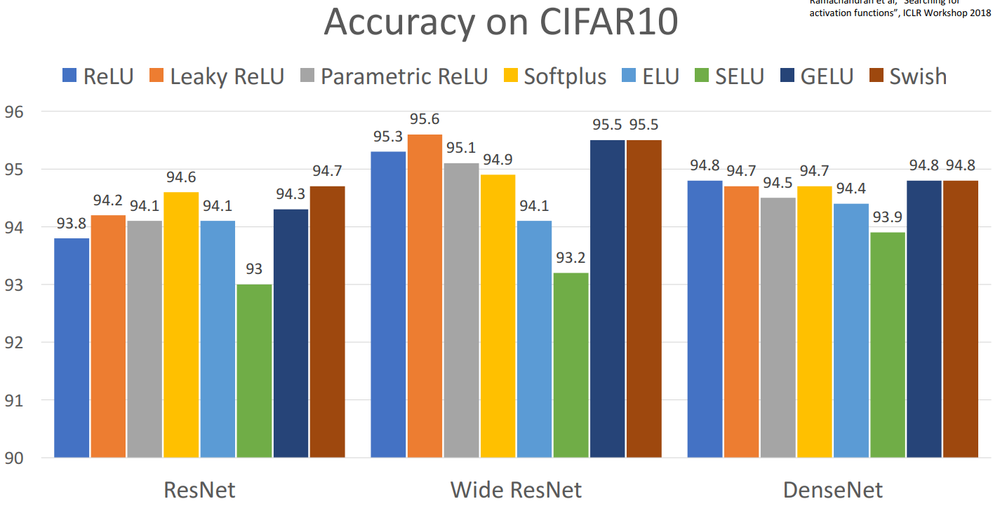

- 1 ~ 2%의 정확도 차이는 존재하지만, 중요한 점은 **1%의 정확도가 굉장히 중요한 상황이 아니라면**, **어떤 `Activation function`을 사용하던 꽤 괜찮은 성능을 얻을 수 있다는 점**이다.

따라서, 학습이 굉장이 느려질 수도 있는 **`Tanh`나 `Sigmoid`를 제외하고 다른 `Activation` 함수 어느 것이던 사용**해도 좋고, **특히 `ReLU`를 사용하는 것이 일반적으로 가장 좋다.**

**기본적으로는 `ReLU`를 사용**하고, **0.1%의 정확도까지 신경써야 하는 경우**에만 `Leaky ReLU`, `ELU`, `SELU` 등의 다른 `Activation function`을 사용하는 것이 좋다.

## Addition

**추가적인 질문에서 `Activation function`에서 증가하기만하는 함수를 사용해야 하는가?** 에 대한 질문이 나왔다. 

정답은 "**맞다**"이다.

`Sin`, `Cos`과 같이 **한 `y` 값이 여러 개의 `x` 값에 대응되는 경우, 학습에 어려움이 있을 수 있어 잘 사용하지 않는다**고 한다.

# Data Preprocessing

> **Data를 Model에 넣기 전에, 학습을 최대한 효율적으로 진행시키기 위해 데이터를 사전 처리할 수 있다.**

## Normalization

아래 그림으로 예를 들 수 있다.

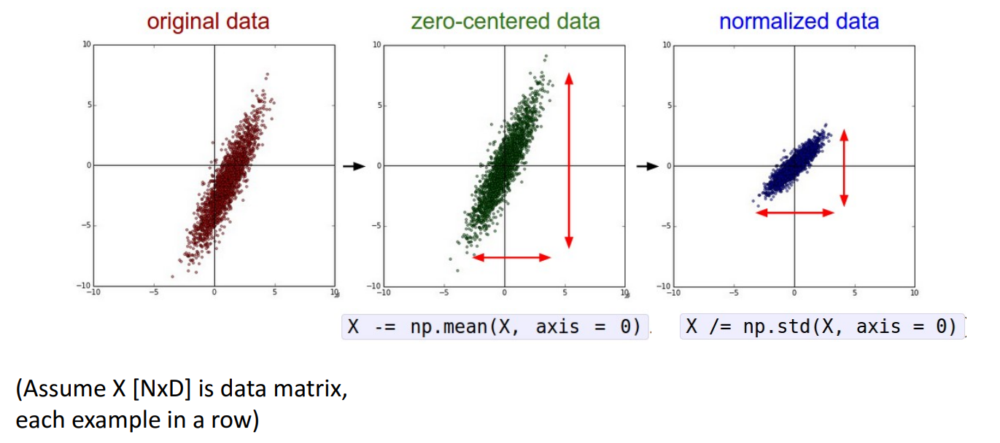

원래 데이터에 평균을 빼서 `Zero-centered data`로 만들 수 있다.

- 이 것은 `Activation funciton`에서 본 **지그재그 패턴 문제를 해결할 수 있다.**

- `Input Data`가 모두 양수가 아니기 때문이다.

이미지 데이터를 예를 들면, 이미제 데이터는 **픽셀값으로 0 ~ 255 사이의 값**을 가진다.

이 경우, 몇몇 픽셀 값은 **평균에서 너무 멀게 떨어져 있을 수 있다.**

이때, **표준편차로 나눔**으로써 원점으로부터 각 Pixel 값이 너무 멀리 떨어지지 않도록 만들 수 있다.

`Normalization`의 장점은 `Linear Classifier`에서도 직관적으로 확인할 수 있다.

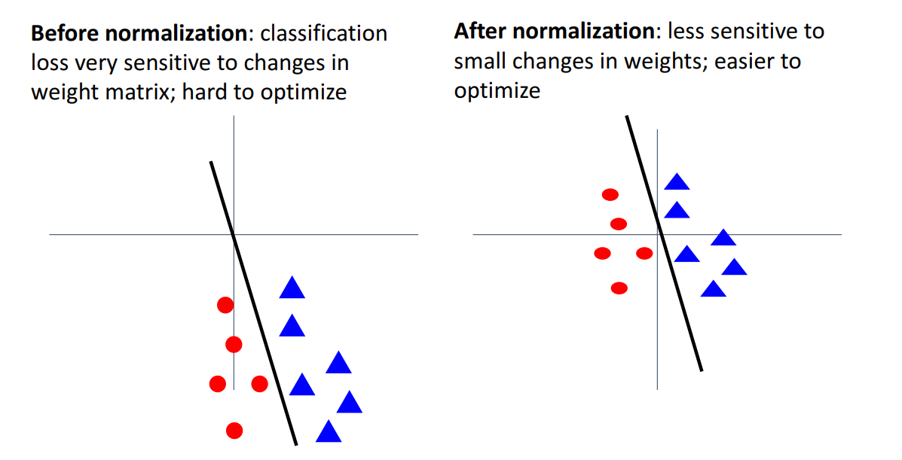

- `Normalization` 전에는 **$x$의 값이 원점으로부터 멀어 비교적 크기** 때문에, `Weight`를 작게 변화시키면 `Boundary`가 크게 변한다.

  - 때문에, `Weight`를 굉장히 세밀하게 조절해야 한다.

- `Normalization` 후에는 **$x$의 값이 원점으로부터 가까워 비교적 작기** 때문에, `Weight`를 작게 변화시키면 `Boundary`가 비교적 작게 변한다.

## PCA + Whitening

`Input Data`에 대한 `Covariance Matrix`를 아는 경우에는 `PCA + Whitening`도 시도할 수 있다.

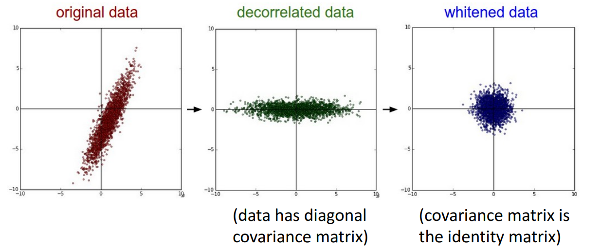

먼저 `PCA`는 **데이터를 고유벡터 방향으로 회전**시켜 `Covariance Matrix`에서 `Diagonal Element`만 남겨서 **특성 간의 상관 관계를 제거한다.**

이후, `Whitening`은 `PCA`를 적용한 `Covariance Matrix`에 **각 특성의 분산을 1으로 표준화**한다.

## Data Preprocessing for Images

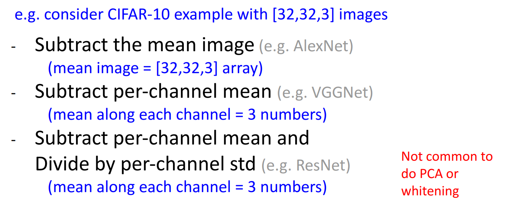

`Sample Image` 전체에서 평균을 구해 전체 이미지에서 평균을 빼는 경우도 있다.

`Sample Image`에서 각 `R`, `G`, `B` Channel 각각에 대한 평균을 구하고 각 Channel에서 빼는 경우도 있다.

## Addition

**Question)** `Neural Network` 내에서 `Batch Normalization`을 수행하는 데도 `Preprocessing`이 필요한가?

- `Batch Normalization`을 모델의 가장 앞에 넣어도 어느 정도 동작할 것이지만 모델 가장 앞에 `Batch Normalization`을 사용하는 것보다 **`Preprocessing`을 통해 명시적으로 `Normalization`하는 것이 더 잘 동작한다.**

# Weight Initialization

> **Model을 처음 사용하기 전에 모든 `Weight`를 특정 값으로 초기화할 필요가 있다.**

이 작업은 `Symmetry Breaking`라고도 부른다.

만약 **모든 뉴런의 `Weight`가 동일하게 초기화**되면, 모든 뉴런이 같은 값을 출력할 것이기 때문에, `Weight Initialization`을 통해 이 **대칭성을 깨야하기 때문이다.**

## 만약 모든 Weight = 0, Bias = 0이라면?

`Activation function`에 따라 다르겠지만, `ReLU`를 사용한다고 치면 **모델 전체의 모든 `Output`이 0일 것이고 `Gradient`도 0이 되어 학습이 진행되지 않는다.**

## Random Initialization

```python
W = 0.01 * np.random.randn(Din, Dout)
```

**rand 함수**를 통해, `Weight`를 **평균이 0, 표준편차가 1인 가우시안 분포를 따르는 랜덤한 값으로 초기화 할 수 있다.**

- 여기에, 우리가 원하는 분포를 얻기 위해 **표준편차 std**를 곱한다.

그러나 **std를 마음대로 선택하고** `Weight`를 `Random`하게 생성하는 방법만으로는 **`Neural Network`가 깊어질수록 잘 동작하지 않는다는 단점**이 존재한다.

## Activation Statistics

> **Weight를 어떤 크기로 초기하는지에 따라 어떤 문제점이 생기는 지 확인해보자.**

먼저, `Weight`를 너무 작은 값으로 초기화한 경우이다.

- **너무 작은 std**를 사용한 경우이다.

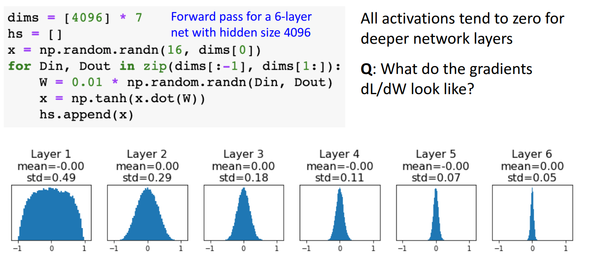

- `Weight`의 값이 작으면 `Layer`를 지날수록 계속 작은 값이 곱해지므로, `Activation` 값도 0에 가까워진다. 

- `Activation`의 값이 0에 가까워진다는 것은 학습이 진행되기 어렵다는 것을 의미한다.

- 다음 `Layer`로 전달되는 `Input`의 값이 계속 작아져, 전체적으로 `Gradient`가 작아진다.

반대로, `Weight`를 너무 큰 값으로 초기화한 경우를 보자.

- **너무 큰 std**를 사용한 경우이다.

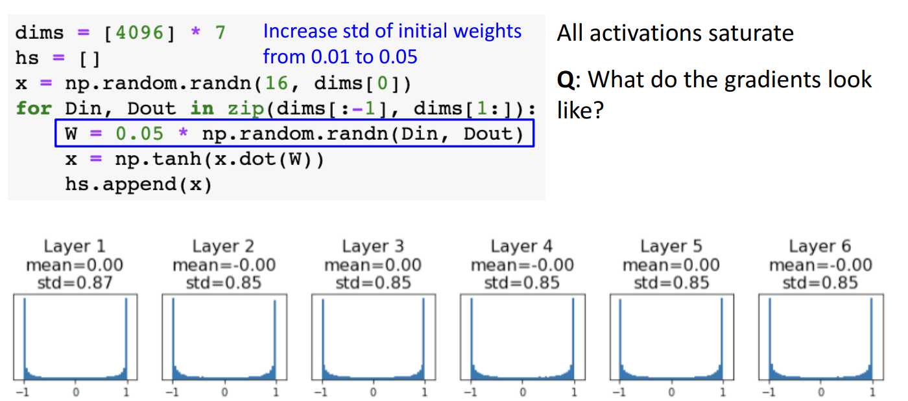

- `Weight` 값이 너무 크면, `Layer`를 지날수록 값이 0에서 멀어진다.

- `Activation function`으로 `ReLu`나 `Sigmoid`를 사용하면 `Local Gradient = 0`이 되어 학습이 어려워진다.

## Xavier Initialization

**std**을 `Hyperparameter`로 두지 말고, **`Weight`의 첫 번째 차원에 대한 제곱근을 사용하는 방법**이다.

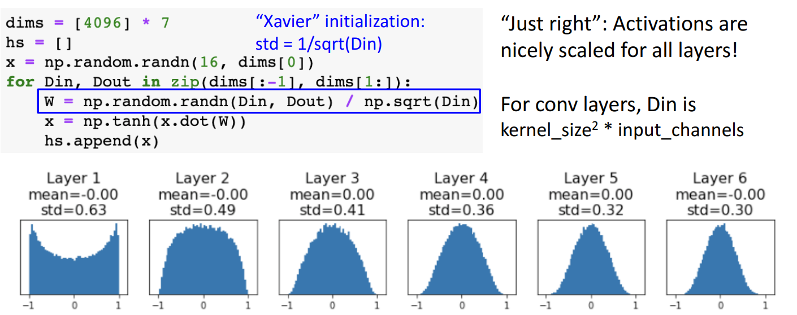

- `Layer`가 거듭되도 이상적인 결과를 얻은 것을 확인할 수 있다. 

### Derivation

> **가장 중요한 것은 `Output의 Variance`와 `Input의 Variance`가 동일해야 한다는 점이다.**

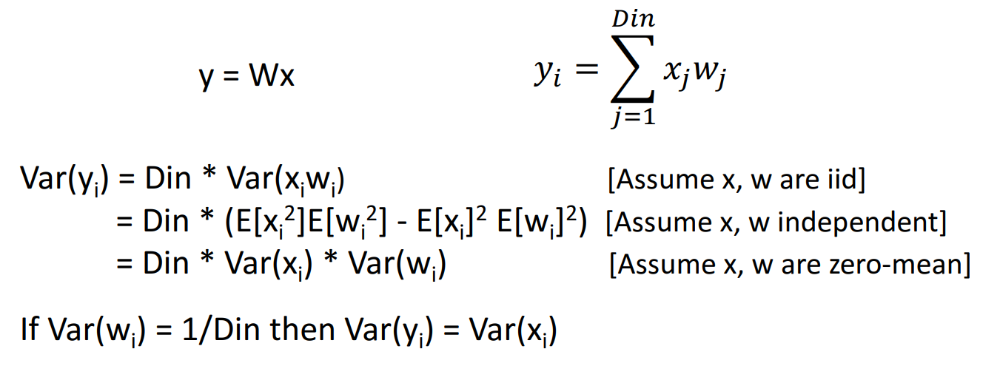

- 첫 번째 줄은 **std = 1/sqrt(din)**이라는 점과 분산의 성질 (**상수가 제곱이 붙어 빠져나옴**)을 이용한 것이다.

- 나머지 증명을 따라오면, `Weight`의 **std를 1/sqrt(Din)으로 설정**하면, `Output의 Variance`와 `Input의 Variance`가 동일하도록 만들 수 있다.

### Problem: ReLU

`Xavier Initialization`은 **평균이 0, std = 1/sqrt(Din)인 분포**를 사용하기 때문에, **`Input`이 음수와 양수 값을 모두 가지는 것을 기대한다.**

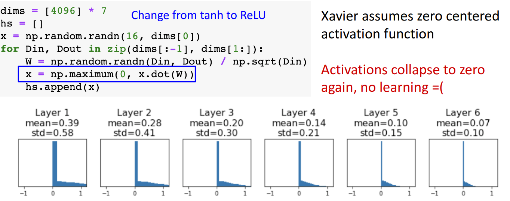

하지만 `ReLU` function과 같이 `Not-Zero-Centered`인 함수를 `Activation function`으로 사용하면, **음수 부분이 존재하지 않아, 음수 부분이 모두 0에 `Collapse`되는 문제가 발생**한다.

- 음수 부분이 죽어서 **`Input`의 Variance보다 `Output`의 Variance가 2배 작아진다.**
  
- 또 다시 학습이 느려지고, 어려워진다.

## Kaiming . MSRA Initialization

> **Xavier Initialization과 ReLU를 동시에 사용했을 때 생기는 문제를 해결하기 위한 방법**

**Xavier Initialization과 ReLU를 동시에 사용**하면 `Output`의 Variance가 2배 감소한다는 사실을 알기 때문에 **이를 보정하기 위해 애초에 std를 `Xavier Initialization`보다 2배 큰 값을 사용한다.**

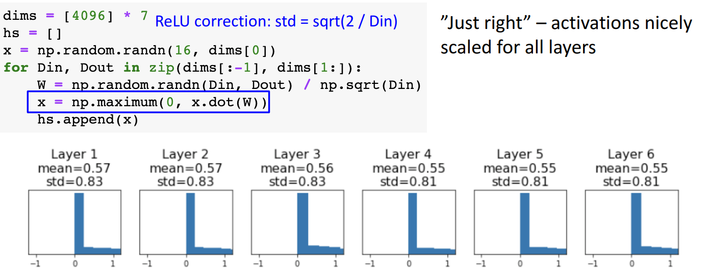

- 이 방법을 이용하면, `Batch Normalization` 없이도 `VGGNet`을 학습할 수 있었다.

### Problem: Residual Networks

`Residual Network`의 경우 `Output`에 **Identity term**안 $X$가 더해진다.

이에 따라 **`Output`과 `Input`의 Variance가 동일하게 맞춰지지 않는다.**

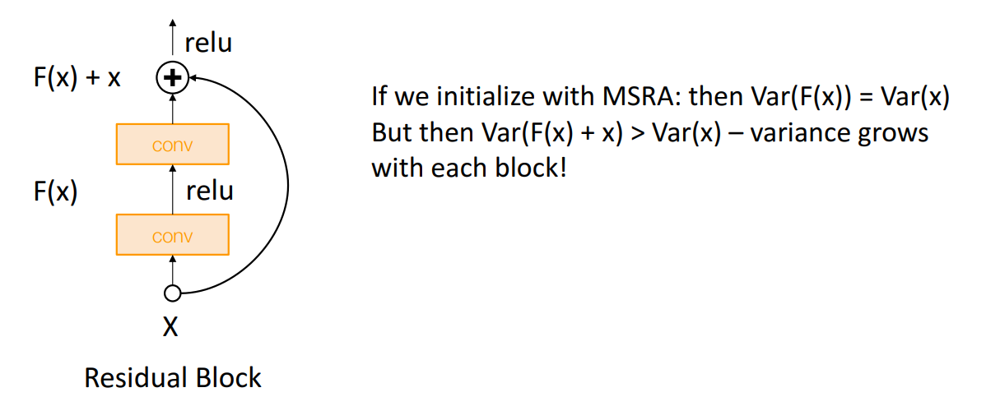

**해결책**은 `Residual Block`의 **첫 번째 Layer는 MSRA로 초기화**하고, **두 번째 Layer는 모두 0으로 초기화하는 것**이다.


## Addition

✅ Input과 Output의 분산을 같게 유지해야 하는 이유
 
**Forward Pass 안정화**

각 레이어의 출력 분산이 점점 커지거나 작아지면:

- 분산 증가 → Activation 폭발 → 값이 너무 커져 학습 불안정

- 분산 감소 → Activation 소멸 → 값이 0 근처로 수렴 → 학습 정체

따라서 레이어를 거칠수록 분산이 유지되어야 한다.

**Backward Pass 안정화**

역전파 시 `Gradient`는 레이어를 거치며 계속 곱해진다.

- 각 레이어에서 `Gradient 분산`이 작아지면 → Vanishing Gradient

- 커지면 → Exploding Gradient

분산을 일정하게 유지하면 안정적인 Gradient 흐름을 확보할 수 있다.

**학습 수렴 속도 및 안정성 향상**

Activation과 Gradient의 스케일이 일정하면:

- Loss 함수의 곡면이 **지나치게 평평하거나 가파르지 않는다.**

- Optimizer가 빠르게 수렴하고 튀지 않는다.

# Regularization

> **모델을 잘 최적화 했다면, Training을 하면 할 수록 Training Dataset에 Overfitting되게 된다. 이를 방지하는 방법이다.**

## Add term to the loss

대부분은 `Loss`를 최소화하려하기 때문에, `Regularization term`을 **추가적으로 더해 `Penalty`를 부여하는 방법**이다.

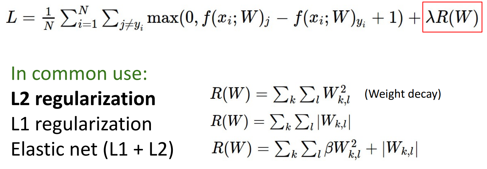

- 가장 많이 사용되는 방법이다.

## Drop Out

모델이 데이터를 처리하는데 **랜덤성을 부여**하기 위해 **랜덤하게 특정 Neuron을 사용하지 않도록 만드는 것**이다.

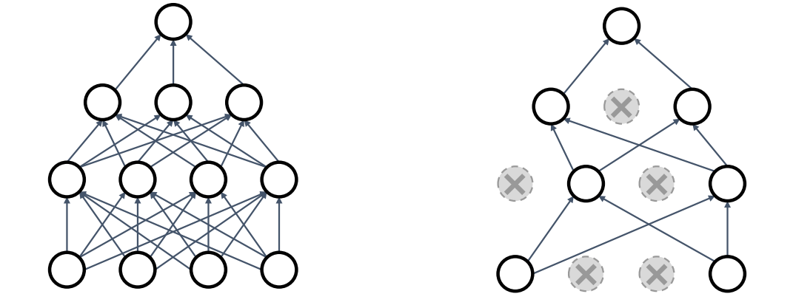

- 각 `Neuron`이 **Out될 확률을 지정하는 `Hyperparameter`가 추가로 사용된다.**

- 보통 **0.5**를 사용한다.

코드로 구현하는 것은 엄청 간단하다.

```python
p = 0.5

def train_step(X):
    H1 = np.maximum(0, np.dot(W1, X) + b1)
    U1 = np.random.rand(*H1.shape) < p # mask
    H1 *= Uq # drop!
```
### Interpretation 1

`Drop Out`을 통해 **각기 다른 Neuron이 중복된 특성을 학습하는 것을 방지한다.**

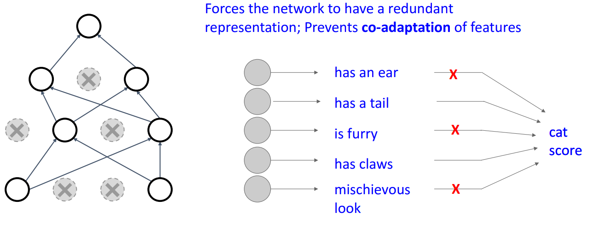

각 `Neuron`이 **객체를 설명하는 자신만의 고유한 벡터**를 가질 수 있도록 한다.

### Interpretation 2

`Drop Out`을 적용하지 않은 하나의 큰 Model이 있다고 했을 때, `Drop Out`을 적용한 모델은 **원래 모델의 Sub-Model이라고 할 수 있다.**

- 하나의 네트워크라도, 매 학습 스텝마다 서로 다른 `Mask`로 구성된 `Sub-Model` 집합을 학습하게 됨

- 이러한 관점에서, Training을 완료하면, **`Drop Out`은 수 많은 `Sub-Model`을 `Ensemble`한 것처럼 해석할 수 있다.**

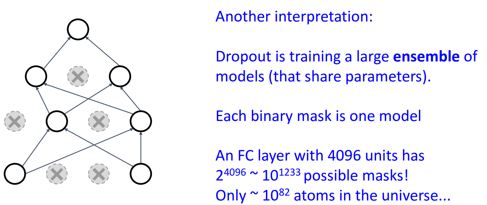

### Problem: Test Time

위 방법대로라면, **Test time**에서도 랜덤하게 `Neuron`이 선택되기 때문에 **결과도 랜덤하다는 문제점**이 있다.

- Model이 `Non-deterministic`하게 된다.

Model을 `Deterministic`하게 만들기 위해서는 **Mask**를 Input에 추가하여, **Mask가 부여하는 랜덤성을 평균**내야 한다.

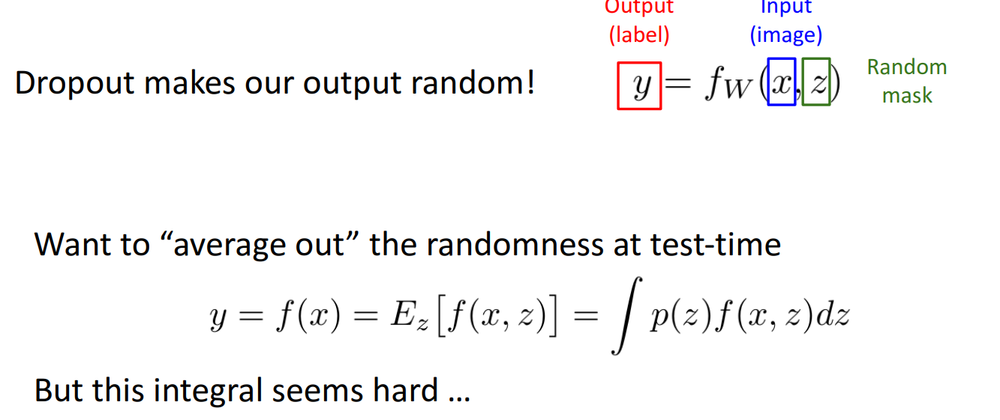

- 평균내기 위해서는 위 수식을 적분해야 한다.

여러 `Input`에 의해 영향을 받는 `Neuron`에 대해 적분을 계산하기 위해선 가능한 모든 경우에 대해 평균을 계산하면 된다.

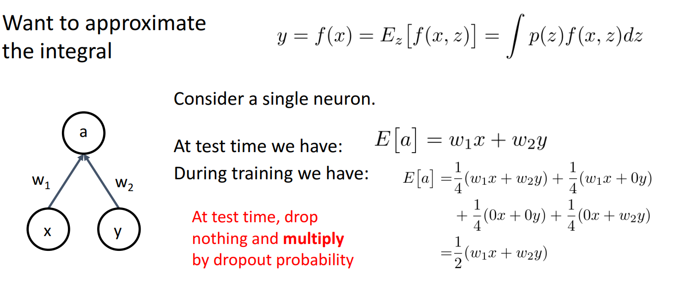

### Inverted Dropout

더 효율적인 방법은 **Test Time**에는 `Output`을 **Rescale하고 랜덤성을 제거한 채 모든 Neuron을 전부 사용하는 것이다.**

- 이를 위해 Training 때, Neuron이 확률 $p$만큼 줄어들었을 것이므로 확률 $p$를 곱해주는 `Rescale` 과정이 필요하다.

- 두 방법은 같은 목적을 이루지만, 더 효율적인 방법은 이 방법으로 `Inverted Dropout`이라고 부른다.

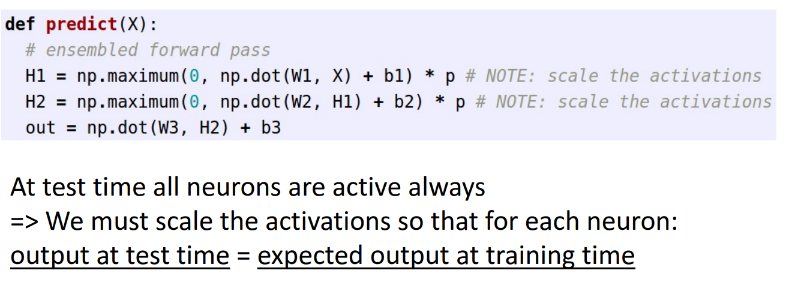


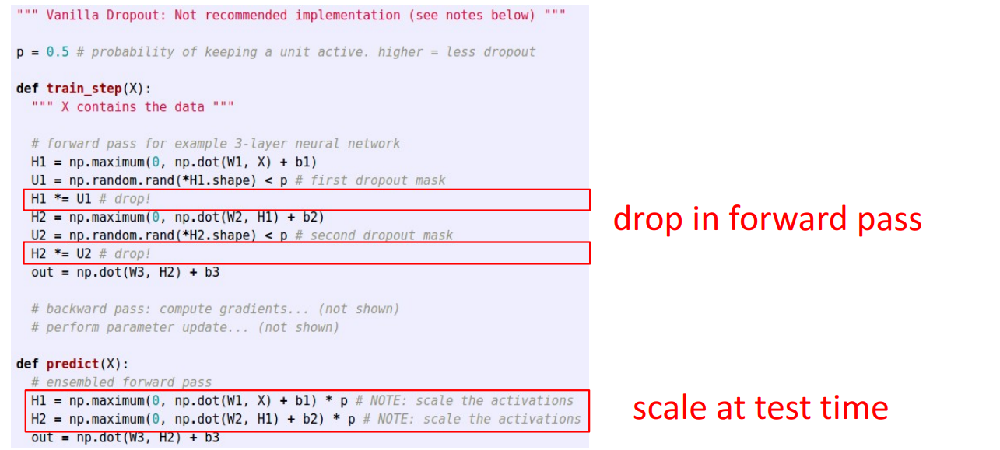


### Dropout Architecture

`Drop Out`을 Layer의 어디에 넣을 것인가?


`AlexNet`이나 `VGGNet`은 `Conv layer` 뒤 `FC Layer`에 넣었다.

2014년 이후 모델들은 `FC Layer` 대신 `Global Averaging Pooling`을 사용하는 경우가 많아 `Drop Out`을 사용하지 않은 경우가 많다.

## Commom Pattern

`Drop Out`처럼 `Training` 때는 랜덤성을 부여하고, `Testing` 때에는 랜덤성을 제거할 수도 있다.

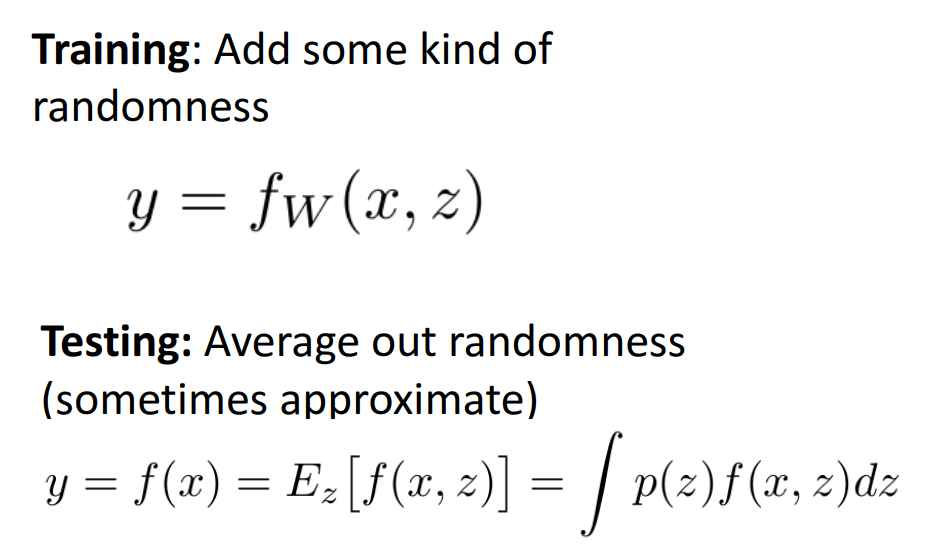

`Mini-batch`도 이 방법을 이용한 것이다.

- 랜덤하게 Batch가 선택되기 때문이다.

- 각 `mini-batch`마다 평균과 분산을 직접 계산해서 정규화한다.

- 즉, **매번 다른 데이터**가 들어오니까 그때그때 **다른 평균/분산**을 사용한다.

- `Testing` 때에는 **학습 중에 저장한 전체 데이터에 대한 평균**을 사용한다.

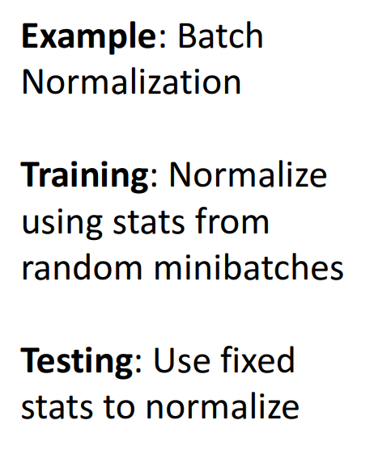

- `ResNet`이나 최신 모델들도 `L2 Regularization`이나 `Batch Normaliation`을 사용한다.

## Data Augmentation

모델에 **데이터를 넣기 전에 데이터를 랜덤하게 변환하여 전달하는 방법**이다.

- `Regularization`이라고 부르기엔 애매한 부분이 있긴 하다.

- `Training Dataset`이 **부족할 때도 사용**하는 방법이다.

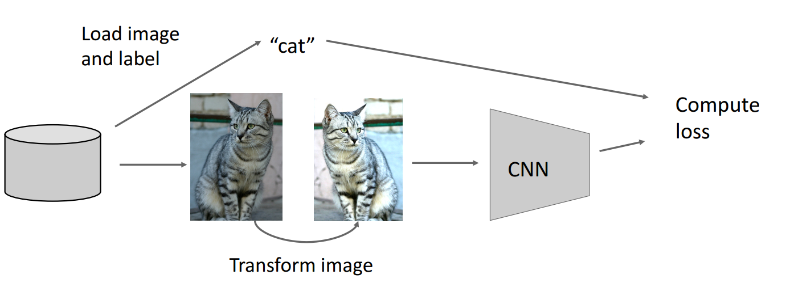

여러 가지 `Augmentation` 방법이 존재한다.

### Horizontal Flips

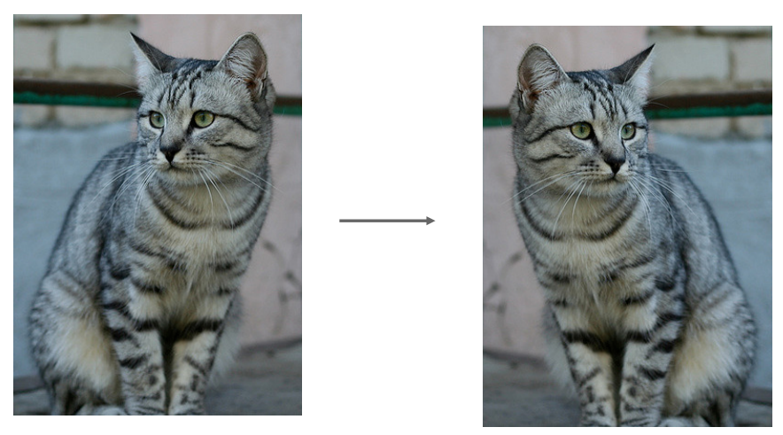

### Random Cops and Scale

**Random하게 잘린 이미지도 여전히 고양이로 인식되어야 한다.**

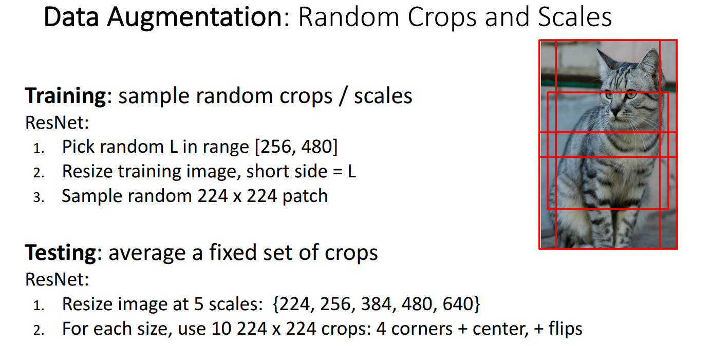

- `Testing` 때에 사용하는 방법은 `ResNet`에서 사용한 방법으로, **불확실성을 줄이고, Rubust한 예측 결과와 정확도를 높이기 위해 사용할 수 있는 방법** 중 하나이다.

### Data Augmentation에 사용할 수 있는 방법

원하는 방법대로 다 사용할 수 있다.

해결하고자 하는 문제에 따라 특정 `Data Augmentation`이 유리할 수도, 유리하지 않을 수도 있다.
- Domain에 따라 어떤 유형의 `Data Augmentation`이 유리할 수도, 유리하지 않을 수도 있다.

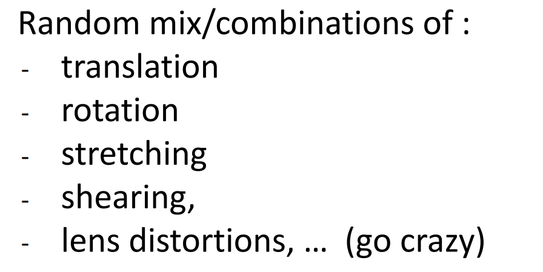


## Drop Connect

`Drop Out`처럼 특정 `Neuron`을 제거하는 대신 **랜덤하게 연결하는 방법**


## Fractional Max Pooling

`Max Pooling`과 비슷하지만, `Pooling`의 결과로 생긴 `Receptive Field`가 **1x1**과 **2x2** 사이에서 랜덤하게 결정되는 방법

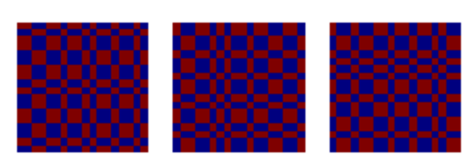

## Stochastic Depth

`Residual Block`에서 `Training` 시에는 랜덤하게 특정 `Block`을 사용하고, `Testing` 시에는 모든 `Block`을 사용하는 방법

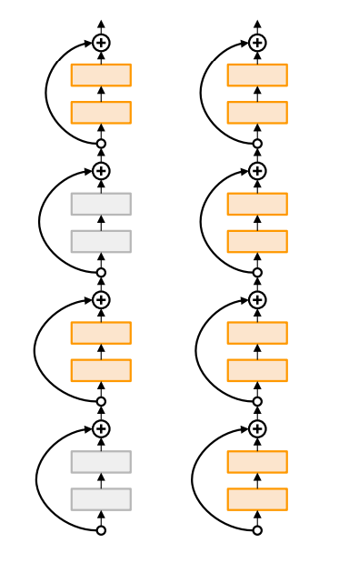

## Cut Out

`Training` 시 이미지의 일부를 잘라내서 사용하는 방법

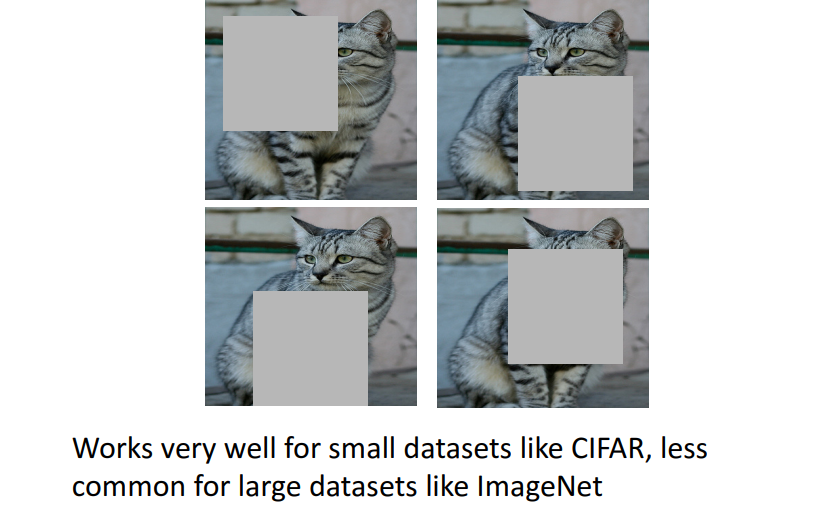


## Mixup

`Training Image`를 무작위로 섞는 방법

- 두 이미지를 어느 정도로 섞을 지에 대한 `Random Weight`가 필요하다.

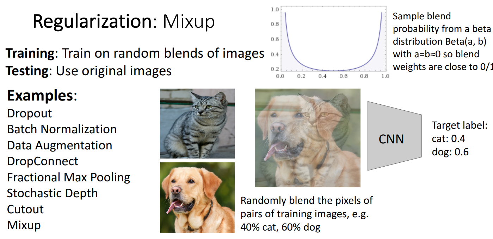

## Summary

요즘에 사용하는 것은 대부분 `Batch Normalization`과 `Data Augmentation` 방법이다.

`Drop Out`은 `Large FC Layer`에서만 고려되며, 최근에는 `Large FC Layer`는 잘 사용되지 않아 자주 사용하지 않는다.

`Cut Out`이나 `Mix Up`은 작은 데이터셋에서만 유용하다.
