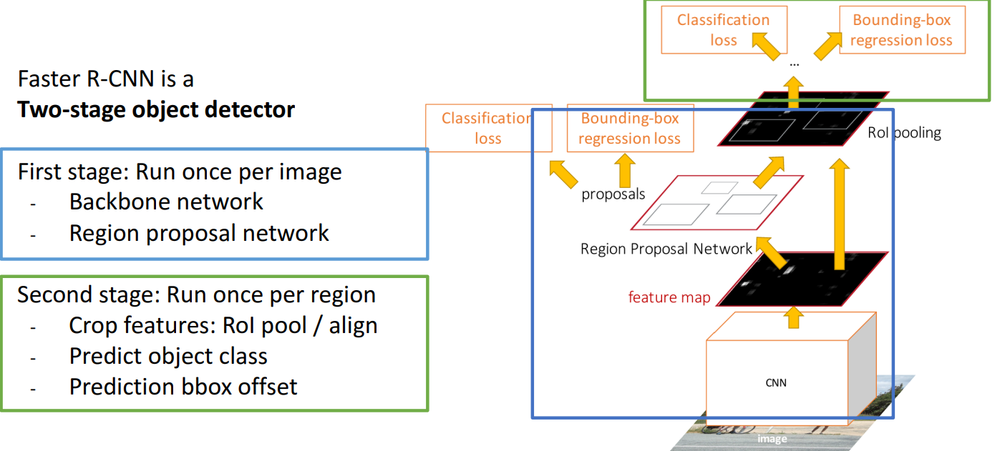

# 15. Object Detection

**`강의 영상`**                      

https://www.youtube.com/watch?v=qcSEP17uKKY&list=PL5-TkQAfAZFbzxjBHtzdVCWE0Zbhomg7r&index=15

**`강의 자료`**

https://web.eecs.umich.edu/~justincj/slides/eecs498/498_FA2019_lecture15.pdf

___

이전 강의까지는 `Computer vision` 분야에서 `Classification`에 대해서만 공부했지만, 이 강의에선 다른 `Task`에 대해 공부할 것이다.

- `Classification`에 비해 비교적 `Spatial information`이 중요한 분야로 아래 세 가지를 들 수 있다.

- 이 중, 오늘 강의에서는 `Object Detection`에 대해 자세히 알아보자.

# Object Detection

`Object Detection`은 하나의 `RGB Image`를 입력으로 받아, 감지된 물체에 대해 예측한 `Label`과 `Bounding box`를 출력한다.

`Output`을 자세히 살펴보면 아래와 같다.

- `Bounding box`는 한 모서리의 위치 ($x, y$)와 width, height의 **4개의 매개변수로 표현할 수 있다.**

예시는 아래와 같다.

`Object Detection`은 `Image Classification`에 비해 더 복잡하다.

`Object Detection`이 비교적 복잡한 이유로는 여러 가지가 있다.

1. 먼저, 하나의 `Output`이 아니라, 하나의 이미지에서 정해지지 않은 개수의 **여러 개의 Output을 가진다.**

    - `Output`의 개수가 `Object`의 개수에 따라 달라진다.

2. 두 번째로, `Output`이 `Label`과 `Bounding box` 두 종류로 나뉜다는 점이다.

    - `Label`은 객체의 종류 (**What**)이고, `Bounding box`는 객체의 위치 (**Where**)이다.

3. 마지막으로 `Classification`은 224 x 224의 Low resolution에서도 잘 동작하는 반면, `Object Detection`은 **800 x 600의 High resolution이 요구**된다. 

    - `Higher resolution`은 작은 `Batch size`로 이어지고, 계산 시간이 오래걸리게 된다.

## 한 이미지에서 하나의 객체만 감지하면 되는 경우 

한 이미지에서 여러 `Object`를 감지하는 일반적인 경우에 대해 알아보기 전에, **한 이미지에서 하나의 `Object`만 감지하는 모델을 설계하는 방법**에 대해 알아보자.

- 기본적으로, `CNN Architecture`는 하나의 `Feature vector`를 생성한다.

    - 일반적으로 `ImageNet`에 의해 `Pretrained`된 모델을 사용한다.

- 하나의 `Feature vector`로 `Label`을 예측하고, `Bounding box`도 예측하기 위해서 각각 다른 `FC Layer`를 사용한다.

- `Label`을 예측하기 위해 `4096-Label 개수 FC Layer`를 사용하고, `Bounding box`의 `Parameter`는 4개이기 때문에 `4096-4 FC Layer`를 사용한다.

- `Label`에 대한 `Loss`로 `Softmax Loss`를 사용하고, `Box`에 대한 `Loss`로는 `L2 Loss`를 사용한다.

- 우리가 **두 개 이상의 `Loss`에 대해 `Backpropagation`을 하는 방법**은 모르기 때문에, **두 개의 `Loss`를 가중합한 `Multitask Loss`를 사용**한다.

    - 두 개 이상의 `Loss`를 사용할 때, **일반적으로 사용**하는 방법이다.

    - 두 개의 `Loss` 중 어떤 것에 **가중치를 더 주어야 할지를 변경해야할 수도 있기 때문이다.**

이 모델은 **하나의 Object를 감지하는데는 쉽게 구현해 사용할 수 있지만,** **`Object Detecting`은 여러 개의 Object를 감지해야 하기 때문에, 사용하기 어렵다.**

여러 개의 Object를 감지하기 위해서는 **이미지마다 다른 개수의 `Output`를 내는 모델이 필요하다.**

## Sliding Window

> **`Object Detecting`을 위한 모델을 구현하는 대신, 기존 `CNN Architecture`를 이용하여 `Object Detecting`을 수행하는 방법이다.**

$H, W$의 이미지에서 $h, w$ 크기의 작은 `Box`를 **Sliding하며 각 영역에 대해 `Class`를 예측한다.**

`Background`라는 `Class`를 추가한다.

그러나 이 방법은 `Input image`에 대해 **모든 가능한 영역을 커버해야 하기 떄문에 굉장히 많이 `CNN Architecture`를 돌려야 한다.**

심지어 `Box` 크기가 고정이 아니라, 변해야하기 때문에 **굉장히 많은 양의 연산이 필요하다.**

## Region Proposals

> **`Neural Network`를 사용하지 않고 이미지에서 `Object`가 있을 만한 후보 영역 집합을 찾아주는 알고리즘**

그러나 , `Neural Network based model`에 의해 대체되었다.

## R-CNN: Region-Based CNN

> **`Neural Network` 기반의 대표적인 `Object Detection` 모델이다.**

1. 먼저 `Proposal method`를 이용해서 **2천개까지의 후보 영역**을 만든다.

2. 각 후보 영역의 크기와 상관없이 **각 후보 영역을 224 x 224 크기로 Warping한다.**

3. (2)의 결과를 **`Conv Layer`에 통과시키고 `Class`를 예측**하게 한다.

    - 모든 `Conv`는 같은 방식으로 동작해야 하기 때문에 **같은 `Weight`를 공유**한다.
  
일반적으로 `Training` 때는 `Multitask loss`를 이용하고 `Class`에 Background를 추가한다.

**`Proposal region`이 항상 적합하다고 보장할 수 없고**, **`Backpropagation`을 통해 `Proposal region`을 학습시킬 수도 없기 때문에 후보 영역을 Transform하기 위한 4개의 `Hyperparameter`를 사용한다.**

- `ROI`를 **warping하기 때문에 Transform의 일관성이 생긴다.**

**Box Regression의** 과정에 대해 더 자세히 알아보자.

- `Region`의 중심 좌표가 주어졌을 때, Model은 **해당 Region을 어떻게 수정할 지에 대한 정보를 예측**한다.

예측한 `Transform`과 `Region`의 정보를 이용하여 `Output box`를 구할 수 있다.

- `Ground Truth`를 이용하여 정답 `Target`인 `Transform`을 구해놓고, 해당 `Target`을 예측하도록 학습한다.

이때, `Box`에 대한 예측이 `Scale / Translation invariance` 하다는 점이 중요하다.

- `Cropping` **이후에는 절대적인 위치에 대한 학습이 굉장히 어렵기 때문에, 상대적인 위치에 (Transform) 대해 학습하는 것이 효율적**이다.

테스트 때는 아래와 같은 과정을 거친다.

3번 과정은 **너무 많은 `ROI`를 걸러내서 성능과 효율을 높이기 위해 필요**하며, 여러 구현 방법이 있다.

- 예측된 결과가 Backgroud일 확률이 임계값 이상인 `ROI`는 제거한다.

- 각 카테고리에 대해 확률이 가장 높은 $K$개의 `ROI`만 사용한다.

`Training` 때에는 `ROI`를 걸러내지 않는 이유가 **모든 가능한 `ROI`에 대해`Training`해야 하기 때문이다.**

4번 과정은 **모델의 성능을 평가하기 위해 필요하다.** 이를 위한 여러 방법이 존재한다.

- `Label`은 `Classification`을 비교하는 방법대로 하면 되고, **`Box`의 위치를 비교할 방법이 필요**하다.

- `Object Detector`의 성능을 일반적으로 평가하는 방법이다. 

### 방법 1. Intersection over Union (IoU)

`Ground Truth Box`와 `Prediction box`이 **서로 얼마나 겹치는지**를 나타낸다.

- 두 `Box`의 교집합을 합집합으로 나눈다.

- `IoU`는 0에서 1 사이의 값을 가진다.

- `IoU` 0.5 -> 적당함
- `IoU` 0.7 -> 꽤 좋음
- `IoU` 0.9 -> 완벽함

그러나 `Object Detecting` 모델이 일반적으로 **한 객체 중심에서 여러 개의 겹치는 `Box`를 반환한다는 점을 고려하면 사전 작업없이 `IoU`로 평가하는 것은 좋은 방법은 아니다.**

- 잘못된 `Box`가 여럿 섞이게 되면, 평가 성능이 저하된다.

## 방법 2. Non-Max Suppression (NMS) + IoU

> **한 객체에 대해 여러 개의 `Box`가 존재할 때, 중복되는 Box를 제거하는 방법**

**`NMS`은 `Box`를 평가하기 전에, 불필요한 `Box`를 줄여 평가 성능 저하를 막는다.**

1. **한 객체에 대해 Score가 가장 높은 Box**를 선택한다.

2. (1)에서 정한 Box와 **나머지 Box에 대해 `IoU`를 구하고, `IoU`가 임계값보다 크면 해당 `Box`를 제거**한다.

    - **같은 객체를 가리키는 `Box` 중 필요없는 `Box`를 제거하는 것**이다.

3. 남은 `Box`가 있다면 위 과정을 반복한다.

결론적으로 **한 객체에 가장 `Score`가 높은 한 `Box`만** 남는다.

그러나, `NMS`는 수많은 객체가 밀집돼 `Overlap`되어 있을 때 불리하다.

## 방법 3. Mean Average Precision (mAP)

> **`Object Detector`이 일반적으로 얼마나 잘 동작하는지에 대한 성능을 평가하는 방법**

먼저, Test Dataset에 대해 `NMS`를 사용하여 `Object Detector`를 돌린다.

- 불필요한 `Box`를 없앤다.

각 카테고리에 대해 `Average Precision`을 구한다.

`Average Precision`을 구하는 방법은 아래와 같다.

1. 먼저 각 카테고리의 모든 `Box`에 대해 `Score`의 내림차순으로 정렬한다.

    

2. 각 `Test Dataset`에 대해 모든 `Ground Truth`와 `IoU`를 계산한다. `Ground Truth` 중 `IoU`가 임계값을 넘는 `Ground Truth`는 제거한다.

3. (2)의 과정에서 `Precision`은 **지금까지 확인한 `Box` 중 `Ground Truth`와 일치하는 비율**이고 `Recall`은 **이때까지 확인한 `Box`까지 중에서 전체 `Ground Truth` 중 제거된 `Ground Truth`의 비율**이다.

    - `Box` 중 `Ground Truth`과 일치하는 것을 **True Positive**, 일치하지 않는 것을 **False Positive**하고 한다.

4. (3)에서 계산한 `Precision`과 `Recall`을 그래프에 점으로 나타낸다.

5. 모든 `Box`에 대해 위의 과정을 반복하고, `Precision-Recall Graph`의 아래 면적을 계산하면 `Average Precision`이다.

위 과정을 시각화하면 아래와 같다.

모든 카테고리에 대해 `Average Precision`을 구한다.

`Object Detection`을 이용하여 해야하는 작업 종류에 따라 더 **엄격한 `IoU` 임계값을 설정하기도 한다.**

`COCO mAP`: `IoU` **임계값을 0.5 ~ 0.95까지 0.05 단위로 바꿔가며 10번 평가**하는 방법

- 10번 테스트 결과를 평균내서 평가한다.

- 더 정확한 방식이다.

모든 과정을 표현하면 아래와 같다.

___

위의 모든 과정을 거쳐, `R-CNN`을 이용하여 `Object Detection`을 수행할 수는 있지만 이 방법은 문제가 있다.

**약 2천개의 `RoI`에 대해 각각 `CNN Architecture`를 `Forward`해야 하기 때문에 너무 느리다.**

이 방법을 해결하기 위해서 할 수 있는 방법은 **`Conv Net`을 적용하는 것과 `RoI`를 Warping하는 순서를 바꾸는 것이다.**

- 최근에는 이 방법을 `Fast R-CNN`이라고 부르고, 기존 방법은 `Slow R-CNN`이라고 부른다.

## Fast R-CNN

먼저 전체 이미지에 대해 `Pretrained ConvNet`을 적용한다.

이후, `Feature Vector`에 맞게 `RoI`를 설정하고, `Crop + Resize`한다.

- `RoI`를 찾을 때는 `Selective Search`라는 `Heuristic algorithm`을 사용한다.

- 원본 이미지에서 `RoI`를 찾고, `RoI`를 `Feature Space`에 맞추어 변경한다.

각 `RoI`에 대해 `CNN`을 통과시켜 카테고리와 `Box`를 예측하게 만든다.

- 이 때의 `CNN`은 비교적 `Light`한 것을 사용한다.

- 대부분의 계산은 처음 `ConvNet`에서 수행되고, `RoI`에 적용되는 `CNN`은 `lightweight`를 사용하여 계산량을 줄인다.

`RoI`에 적용하는 `CNN`의 구성은 `Backborn network`의 종류에 따라 달라진다.

`AlexNet`을 사용할 때에는 **`FC Layer`를 사용**한다.

`ResNet`을 사용할 때에는 **얕은 3*3 Conv Layer를 사용**한다.

그러나, 이런 모델을 구성하고 훈련시키기 위해서는 **Feature vector를 Crop하고 Resize하는 방식도 미분이 가능해야 한다.**

- Crop + Resize 방법에 대해 알아보자.

### 방법 1. RoI Pool

먼저, `Input image`에서의 `RoI`를 `Feature Space`에 맞게 맞춘다. 이때, 정확히 안 맞을 수도 있는데 이는 적당히 수정한다.

- 정렬하는 과정을 `Snapping`이라고 한다.

- 정수로 반올림한다.
  

이후, `Feature Space`에서의 `RoI`를 **Max-pooling이 가능하도록 N*N 형태로 나눈다.**

- 정확하게 N등분 되지 않으면 **각 크기가 비슷해지도록** 적당히 조절해서 나눈다.

`Feature Space` 속 `RoI`에 대해 `Max-pooling`을 진행한다.

위 방법을 통해 **`Feature Space`에서의 `RoI`를 항상 고정된 Size로 만들 수 있고 미분이 가능하기 때문에 `Backpropagation`도 가능하다.**

그러나 이 방법은 **`Input image`에서의 `RoI`를 정렬하는 과정에서 정보가 잘못 전달될 수 있다는 단점이 있다.**

추가로, `Grid Cell`에 `Snap`하게 되면 `Backpropagation`의 과정에서 `Forward`때 **`Snap`이 된 구역으로 `Gradient`를 전달할 수 없다.**

### 방법 2. RoI Align

방법 1에서 `Allignment error`를 줄이기 위해 `Bilinear interpolation`을 사용할 수 있다.

- 이를 위해 `Snapping`을 제거해야 한다!

먼저 `RoI`를 동일한 크기의 영역으로 나누고, 각 영역에서 동일한 개수로 특정 `Element`로 `Sampling`한다.

이후, 각 영역에서  `Bilinear Interpolation`을 적용하여 `Sampling`한다.

- 정수로 반올림하는 대신, 근처 4개의 정수 값을 가중합하여 소수값을 유지한다.

중요한 점은, `Bilinear Interpolation`은 **미분이 가능하다는 것이며, 이 때문에 `Input Image`나 `Bounding box`에 `Upstream Gradient`를 전달할 수 있게 된다.**

- 4개의 회색점이 원래 `Image`의 실제값이고, 초록색 점이 `Bilinear Interpolation`을 이용해 구한 `Sample` 값이다.

- 기존에 단순 `Snapping`한 것 대신, **위 식을 적용하면 `Sample`값을 실제값을 이용한 수식으로 구했기 때문에 `Gradient` 전달이 가능**하다.

이후, 각 `Sub-Region`에서 4개씩 `Sampling`을 했다면, 4개의 `Sample`에 대해 `Max-pooling`을 하여 일정한 크기의 `RoI` 를 얻을 수 있다.  

## Fast R-CNN vs Slow R-CNN

기본적인 차이점은 `ConvNet`과 `Crop`의 적용 순서이다.

`Fast R-CNN`이 `Slow R-CNN`에 비해 훨씬 빠른 것을 확인할 수 있다.

그러나 `Test time`에 `Fast R-CNN`에서 `Region Proposal`을 포함하는 경우와 포함하지 않는 경우를 살펴보면, **대부분의 시간을 `Region Proposal`이라는 휴리스틱 알고리즘에 사용하는 것을 확인할 수 있다.**

따라서, `Region Proposal` 역시, `Neural Network` 기반으로 동작하도록 할 필요가 있다.

## Faster R-CNN

> **Region Proposal까지 Neural Network에서 수행하는 Fast R-CNN**

`Pretrained CNN`으로 `Input Image`를 통과시켜 `Feature map`을 얻고, `Region Proposal Network (RPN)`이라는 `Network`를 통과시켜 `RoI`를 얻는다.

이후 과정은 `Fast R-CNN`과 동일하다.

### Region Proposal Network (RPN)

`CNN`을 통과시켜 얻은 `Feature Map`에 `Anchor box`라는 `box`를 `Sliding`하는 것을 상상할 수 있다.

- 가운데 하나의 `Cell`을 기준으로 고정된 `Anchor box`를 사용하고, 각 `Cell`에 대해 모든 `Anchor box`가 있다고 가정한다.

각 **`Anchor box`가 `Object`를 포함하고 있는지 아닌지의 두 가지 카테코리로 ConvNet을 학습**시키면 `Region Proposal Network`를 구현할 수 있다.

- 객체를 포함한다고 판단되면 양수값을, 객체를 포함하지 않는다고 판단되면 음수값을 반환하도록 하고, `Softmax`를 이용하여 `Loss`를 구한다.

- 파란색 `Cell`이 가운데 기준으로 있는 `Anchor box`들을 확인할 수 있다.

고정된 `Anchor box`가 특정 객체에 적합하지 않을 수 있으므로 `RPN`이 `Box Transform`까지 학습할 수 있게 할 수 있다.

`Box Transformation`을 사용하더라도 **하나의 객체에 하나의 `Anchor box`를 적용하는 것은 적합하지 않을 수 있다.**

이를 해결하기 위해, 각기 다른 크기의 여러 개($K$)의 `Anchor box`를 적용한다.

- 각 `Anchor`의 크기를 지정하는 $K$개의 `Hyperparameter`가 추가로 요구된다.

____

결론적으로 `Faster R-CNN`은 4개의 `Loss`를 갖는다.

`Faster R-CNN`은 `Test time`에 `Fast R-CNN`에 비해 10배 더 빠르다.

`Faster R-CNN`은 `Two-stage object detector`라고 불린다.

- `Feature map`과 `RoI`를 추출하는 부분과 실제 `Object`의 종류와 `Box regression`을 하는 부분으로 나뉜다.

그러나, **두 Stage로 나누는 대신, 한 Stage에 전부 해결할 수도 있다.**

___

### Single-Stage Object Detector (SSD)

`RPN`에서 `Object`인지 여부를 판단하는 대신, `Class score`를 예측하도록 하는 방법이다.

- `CNN` ~ `RPN`까지의 과정과 유사하고, $C+1$개의 `Category`에 대해 예측해야된다는 점이 다르다.

____

`Object Detection`에 위에서 배운 모든 `Network`를 사용할 수 있고, `Backbone CNN`으로 다른 종류의 `CNN`를 사용하거나 다른 `IoU` 임계값을 사용하는 등, **많은 `Hyperparamter`가 요구**된다.

- 당연하게도 어떤 것을 선택하는지에 따라 다른 성능을 보인다.

그러나, 일반적으로 좋은 성능을 보이는 방법은 있다.

- **`Faster R-CNN`은 `Single Stage` 방식보다 느리지만, 더 정확하다.**

    - `Image`를 살펴보기 위해 `CNN`을 적용하는 횟수가 다르기 때문에 `Image`를 살펴볼 기회가 `Faster R-CNN`이 더 많다.

- **`Backbone Network`가 클수록 정확도가 높은 경향**이 있다.

하지만 위의 정보는 2017년의 정보이고, 2019년에는 다른 경향을 보인다.

우선, `GPU`에 발전으로 인해 `Training`을 더 오래할 수 있었다.

`Feature pyramid Network`라는 것으로 `Multi-scale feature`을 얻고 `R-CNN`을 적용할 수 있었다.

`Backbone network`로 `ResNext`를 사용하는 것이 일반적으로 좋다.

`Single Stage` 방식의 성능이 `Faster R-CNN`과 견줄 정도로 좋아졌다.

`Mask R-CNN`이라는 굉장히 큰 모델이 생겼다.

- `Facebook`의 `Detectron`이라는 `Open source`에서 위 내용을 적용한 모델을 사용할 수 있다.

> **고려해야될 것이 굉장히 많기 때문에 `Open source`를 쓰거나 `Pretrained model`을 쓰는 것을 추천한다.**

