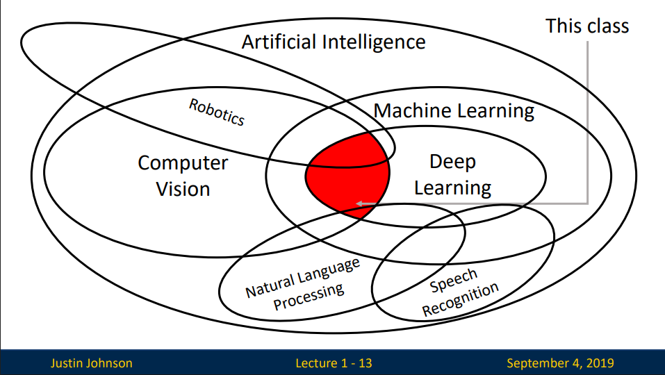
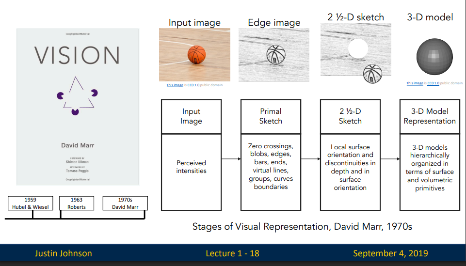
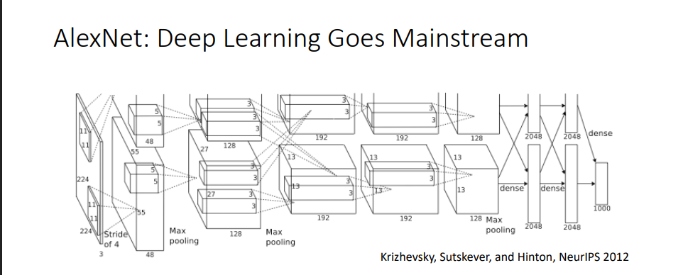

# 01. Introduction to Deep Learning for Computer Vision

**`강의 영상`**                      
https://www.youtube.com/watch?v=dJYGatp4SvA&list=PL5-TkQAfAZFbzxjBHtzdVCWE0Zbhomg7r&index=1

**`강의 자료`** https://web.eecs.umich.edu/~justincj/slides/eecs498/498_FA2019_lecture01.pdf

# Computer Vision
시각 데이터를 처리, 인지하는 인공적인 시스템

- `Deep learning` 기반으로 이루어진다.

### Learing
- `Data`와 `Experience`로부터 `Artificial System` 을 구성하는 것
### Deep Learning
- 뇌에서 영감을 받아, 많은 `Layer`를 이용한 `Hierarchical Learning`

이후 수업에서는 아래와 같이 General한 AI, ML, DL 영역 중,  **Conputer vision과 Deep Learning이 겹치는 일부 영역**을 공부할 예정이다.

# History of Computer Vision

시작은 컴퓨터와 전혀 관계없이, **고양이가 시작 정보를 어떻게 처리하는 지에 대한 연구**로부터 시작했다.
- 뇌에서의**특정 뉴런이 각각 다른 유형에 시각 자극**에 반응한다.

이후, 처음으로 사진을 컴퓨터로 가져와 `edge`를 특징점으로 하여 분류하는 연구가 진행된다.

1970년대부터, 사진으로부터 `Segment`, `object`를 분석하기 위한 연구가 진행된다.

점차,`Matching`, `Edge Detection` 등을 이용하여 사물, 얼굴 인식에 대한 연구가 진행되었다.

`Detecting`, `Classification`이 Conputer Vision에서의 주요한 Task가 되어가며, `ImageNet`과 같은 `Recognition Challenge`가 주요해졌다.

`2012년`, `AlexNet`이 처음으로 Deep Learning 기반 모델을 사용하였다.

# History of Deep Learning

먼저, `Perceptron`이라는 학습 알고리즘이 등장했다,

이후, `Neocognitron`이라는 Visual System 기반의 계층 구조를 가진 모델이 연구되었다.
- 이 모델은 Training algorithm을 가지지 못하여 실제로 사용되진 않았다.

`Back Propagation`이 등장하며, `Neural Network`를 Training할 수 있게 되었다.

`Convolution Network`가 `Back Propagation`을 이용하여 학습 가능한 Model로 등장하였다.

2000년대에 들어서 `Deep Learning` 이라는 용어가 등장하였으며, 다양한 유형의 `Neural Network`를 학습하기 위한 알고리즘이 연구되었다.

___

> `2012년`의 Deep Learning 열풍은 `Algorithm` + `Data` + `Computation` 모두의 발전이 있기에 가능했다.

- `Computation` 영역에서의 `GPU`의 역할은 굉장히 크다.