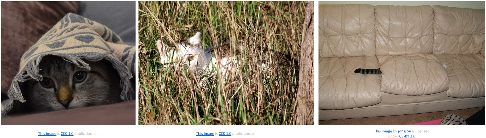

# 02. Image Classification

**`강의 영상`**                      

https://www.youtube.com/watch?v=0nqvO3AM2Vw&list=PL5-TkQAfAZFbzxjBHtzdVCWE0Zbhomg7r&index=2

**`강의 자료`**

 https://web.eecs.umich.edu/~justincj/slides/eecs498/498_FA2019_lecture02.pdf

# Image Classification

> `Image`를 입력으로 받아, category 중 하나로 분류하는 것


## **문제점**
`Semantic Gap`
- 사람은 직관적으로 수 많은 정보를 처리하고, 분류하는 능력을 가진다.
- 하지만 Computer는 **Image를 단지 [0, 255] 사이의 숫자를 가진 2차원 배열 형태로 인식한다.**
- 따라서 Image Classification을 위해선 이러한 `grid of numbers`를 구분하기 위한 `복잡한 알고리즘`이 필요하다.

## **Challenges**
> `grid of numbers`를 구분하기 위한 알고리즘을 잘 만들었다고 하더라도, **단순한 이미지의 변경은 해당 Image를 구성하는 숫자를 변경하며, 이는 알고리즘의 결과에도 영향**을 미친다. 

`Viewpoint Variation`


  - 정확히 같은 물체를 다른 시점에서 찍더라도, 컴퓨터가 이를 같은 물체라고 판단하는 것은 쉽지 않다.
  
`Intraclass Variation`


  - 같은 Category 내에서 줄무늬 등, 세부적인 부분이 다른 경우

`Fine-Grained Categories`


  - 큰 Category 내에서 세부적으로 분류해야 하는 경우

`Background Clutter`


  - 객체와 배경색이 유사한 경우

`Illumination Changes`


  - 같은 객체에 대해 조명 조건이 달라지는 경우

`Deformation`


  - 같은 객체가 다른 형태, 자세를 가지는 경우

`Occlusion`


  - 이미지에서 객체가 잘 보이지 않는 경우
  - 가장 오른쪽의 이미지에서 사람은 고양이라고 당연하게 인식할 수 있다는 점이 중요하다.

## **Goal**
> **Robust Algorithm**이 필요하다.
- **`pixel value`의 변화에도 불구하고 물체를 구별할 수 있는 알고리즘**이 필요하다.
  

`Image Classification`은 `Image Captioning`, `Object Detection`, `Playing go` 등의 하위 기술으로 사용되기 때문에, 굉장히 중요하다.

# Image Classifier

```python
def classify_image(image):
    # Some magic here?
    return class_label
```

우리는 `Image Classification`을 위해, 위와 같이 `2D grid`를 입력 받아 `class label`을 반환하는 함수를 작성해야 한다.

하지만, 큰 사이즈의 2D grid를 처리해 label로 반환하는 알고리즘을 구현하는 명확한 코드는 존재하지 않는다.

따라서 **사람이 사진 속 객체를 인식하는 방법**에 기반하여 코드를 작성하는 것이 좋다.


가장 먼저 실행해볼 수 있는 방법은 Computer Vision 역사에서 `특징점`으로 사용되었던 `Edge`에서 해석 가능한 패턴을 찾는 방법이다.

`Human knowledge`에 기반하여, 사람이 어떤 패턴에 반응하여 물체를 구별하는 지를 알고리즘으로 구현할 수 잇다.

하지만, 우리의 예상과 다른 형태의 객체가 있거나, Edge detecting에 실패하는 등의 문제점이 존재한다.

추가로, 특정 객체에 대해서만 알고리즘이 동작하기에 `확장 가능성`이 부족하다.


위에서 본 방법은 단점이 명확하다. 

우리는 다른 방법으로 `Machine Laerning`, `Data-Driven Approach`을 이용할 수 있다.

과정은 아래와 같다.
1. Dataset을 모으고, Labeling을 한다.
2. Classifier를 Train하기 위해 Machine Learning을 이용한다.
3. 기존 Dataset에 없는 개로운 이미지를 활용해 Classifier를 평가한다.

이 방법을 이용하게 되면, 우리는 새로운 객체에 대한 분류기를 만들 때 **Code를 수정할 필요없이 해당 객체에 대한 Dataset을 제공**하면 된다.

# DataSet

`MNIST`: 숫자 필기체 데이터셋


`CIFAR10`


`CIFAR100`


`ImageNet`


`MIT Places`


위 DataSet에서 확인할 수 있는 것처럼, `Image Classification`을 위한 **DataSet의 크기는 점점 커지고 있다.**

하지만 다른 방식으로, 적은 데이터로도 학습할 수 있도록 하는 DataSet도 존재한다.

`Omniglot`


- `Few shot Learning`에 특화되어 있다.
- 적은 수의 데이터로 학습이 가능하도록 한다.

# Classifier Algorithm
> 알고리즘을 구현할 때, 우리는 `train` 부분과 `predict` 부분으로 나누어 구현할 수 있다. 아래 설명하는 알고리즘 모두 두 부분으로 나누어 설명할 것이다.


## Nearest Neighbor

- Train: 모든 데이터와 Label을 기억하는 것
- Predict: 테스트 이미지와 가장 유사한 이미지를 찾고 그 이미지의 label을 사용

위 알고리즘을 구현하기 위해선, **두 이미지 사이에 유사도를 계산하는 방법이 존재해야 한다.**
- `Distance Metric` 을 이용해보자.


- 456이라는 숫자는 모든 pixel의 값을 더한 결과이다.
- 우리는 이 방법을 이용해 `Nearest Neighbor` 알고리즘을 충분히 구현할 수 있다.

```python
import numpy as np

class NearestNeighbor:
  def __init__(self):
    pass

  def train(self, X, y):
    # X: N x D where each row is an example
    # y: 1D of size N

    # Xtr, Ytr은 Nearest Neighbor에서 Train 시점에 X, y를 기억한다는 의미이다.
    self.Xtr = X
    self.ytr = y

  def predict(self, X):
    # X (N x D) is new image with N examples
    # Number of examples in new image
    num_test = X.shape[0]
    Ypred = np.zeros(num_test, dtype = self.ytr.dtype)

    for i in range(num_test):
      distances = np.sum(np.abs(self.Xtr - X[i,:]), axis = 1)
      # np.argmin()은 최솟값의 index를 반환
      min_index = np.argmin(distances)
      # min_index에 맞는 데이터의 label을 사용
      Ypred[i] = self.ytr[min_index] 

    return Ypred
```

  - `Training`에서는 시간 복잡도가 $O(1)$
  - `Testing`에서는 시간 복잡도가 $O(n)$ 인데, 이는 **굉장히 좋지 않다.**
  - 대부분의 머신 러닝에서는 `Training` 때 시간이 오래 걸리는 것은 괜찮아도 배포 후 `Testing` 시 오랜 시간이 소요되는 것은 허용하지 않기 때문이다.

`Testing` 시 $O(n)$이 소요되는 단점 때문에, `Nearest Neighbor` 알고리즘을 그대로 사용하는 대신, **`Approximation` 하여 다 빠르게 동작하는 알고리즘을 많이 사용한다.**


`Nearest Neighbor` 알고리즘의 결과는 아래와 같다.


- 빨간색 테두리가 칠해진 이미지 같이, `L1 distance`를 사용하게 되면 실제 정답 대신 유사한 이미지가 선택되는 경우가 많다.

좀 더 자세히 살펴보기 위해, `Nearest Neighbor`의 `Decision Boundary`를 확인해보자.


- 초록색 영역 한 가운데에 노란 점, 파란색 영역과 빨간색 영역 경계 부분에 Noisy한 부분처럼 **`Nearest Neighbor` 은 `Outlier`에 민감하고 `Noisy` 함을 확인할 수 있다.**

이런 단점을 줄이기 위해, `K-Nearest Neighbors`을 사용할 수 있다.

`K-Nearest`는 하나의 근접한 점만 확인하는 것이 아니라, K개의 근접한 점 중, 가장 많이 나온 Label을 선택하는 것이다.
- `Majority Voting`이라고도 한다.


- 기존에 비해, 결정 경계가 부드러워지고, Outlier의 영향이 감소한 것을 확인할 수 있다. 
- 그러나 `흰색 영역` 처럼 **어느 곳에도 속하지 않는 영역이 발생할 수 있다는 문제점이 있다.**

`L1 Distance` 를 사용하는 것은 명확한 한계가 존재한다. 따라서 우리는 다른 `Distance Metric` 을 고려해볼 수 있다.


`L1 distance` 대신 `L2 distance`를 고려해볼 수 있다.


- 그림에서 명확히 확인되지는 않지만, `L1 distance` 를 사용하는 경우에는 경계가 **수직선, 수평선, 45도 각도의 선**으로만 표현이 된다.
- `L2 distance`를 사용하는 경우에는 **경계를 구성하는 선의 방향 제한이 없다.**

`L1 distance`는 마름모 기반, `L2 distance`는 원 기반이기 때문에 `k = 1` 의 경우에 두 pixel의 차이로 인해 생기는 경계의 형태가 달라지게 된다.


> **결론적으로 상황에 맞는 Distance Metric을 잘 사용하면, KNN 알고리즘을 어느 타입의 데이터에도 적용할 수 있다!**


# Hyperparameters

`K-Nearest Neighbor` 알고리즘에서, 우리는 `K`의 값과 어떤 `Distance Metric`을 사용해야 할 지 정해야 한다.

위 두 가지가 `Hyperparameter` 의 예시이다.

`Hyperparameter`는 **근본적으로 알고리즘이 동작하는 방식과 관련**있기 때문에, 학습을 통해 결정되는 경우가 흔치 않다.

하지만, 대부분의 `Hyperparameter` 가 `Problem-dependent` 즉, 특정 작업과 관련된 경우가 대부분이기 때문에 General한 결정 방법이 존재하지 않는다.

그래도 `Hyperparameter`로 가능한 값을 추정하기 위한 좋은 방법론은 제공되고 있다.

## Setting Hyperparameters

**첫 번째 아이디어**는 내가 사용하는 Dataset에 대해 가장 좋은 성능을 보이는 `hyperparameter`를 선택해야 한다는 것이다.


- 그러나 `Overfitting`의 가능성이 큰 `Hyperparameter`는 사용하지 않는다.
- 예시로 KNN에서의 `K=1` 로 Training 하게 되면 Training data에 대해서는 완벽하게 작동할 것이나, 좋은 `Hyperparameter`는 아니다.

**두 번째 아이디어**는 Dataset을 `Train data`와 `Test data`로 나누고, `test data`에 잘 동작하는 `hyperparameter` 를 선택한다는 것이다.


- 기본적인 목표는 `Unseen data` 에 대한 성능을 높이는 것이기 때문에 충분히 설득력 있다. 
- 하지만, 이 경우에도 `Test data` 를 `Hyperparameter` 를 조정하는데 사용하였기 때문에 **`Testing` 결과는 좋게 나올 수 있어도 실제 `Unseen data`에 대한 성능이 보장되지 않는다.**

**세 번째 아이디어**는 Dataset을 `Train data`, `Validation data` 그리고 `Test data`로 나누고 `Validataion data`로 `Hyperparameter`를 조정하고 `Test data`는 최종 성능 평가할 때 한 번만 사용한다는 것이다.


- Machine Learning에서 성능을 확인하는데 가장 좋은 방법이다.

아이디어 3가 가장 좋은 방법임을 확인할 수 있었다. 아이디어 3에서 더욱 General한 성능을 얻기 위해 더 발전시킬 수 있다.

**네 번째 아이디어**는 하나의 Dataset을 세 번째 방법으로 나누는 대신, `fold`라는 더 작은 `chunk`로 나누고 `Validation data`를 바꾸어가며 여러 `Hyperparameter` 중 가장 좋은 것을 선택할 수 있도록 하는 방법이다.


- 이 방법은 `Cross-Validation` 이라고 부른다.
- 성능 상에서는 가장 좋지만, **여러 번 학습해야 되기 때문에 비싸다는 단점이 존재한다.**
- 따라서 작은 모델이나 작은 데이터셋을 사용하는 경우처럼, 계산량이 감당되는 경우에만 사용된다.

# KNN - Universal Approximation

> KNN의 경우, Dataset의 크기만 무한히 늘려준다면 어떠한 fucntion이던 완벽하게 학습할 수 있다.


- **파란색 선**: 우리가 학습하고자 하는 함수
- **검은색 점**: 데이터
- **초록색 선**: KNN의 결과로 나오는 함수

위 사진에서 오른쪽으로 갈 수록 데이터의 개수가 증가한다. 
**데이터셋의 크기가 커질수록 KNN의 결과로 나오는 함수가 실제 함수와 유사해짐을 확인할 수 있다.**

위의 `Nearest Neighbor` 의 코드에서 X의 `N` 즉, 데이터의 샘플 개수를 늘리는 것은 KNN의 성능을 향상시키는 데 좋다.

하지만, 원하는 만큼의 데이터를 얻기 위해서는 차원 (`D`)이 큰 데이터를 사용해야 하는 경우가 대부분이다.

**차원이 큰 데이터를 사용하는 것 `Curse of Dimensionality`에 의해 문제점이 존재한다.**
- 이 때문에 오히려 데이터의 개수를 늘렸음에도 불구하고 성능이 저하될 수 있다.

`Curse of Dimensionality`

> 특정 차원을 표현하기 위해선 해당 차원의 `exponential` 하게 수가 증가하는 데이터가 존재해야 한다.


예시로는 32 x 32 image에서 전체 pixel의 가능한 경우의 수는 `binary image`라고 가정해도 $2^{32*32}$ 이다. 

`Training` 에서는 위 이미지를 32*32 차원의 벡터로 인식하기 때문에 `Curse of Dimensionality` 를 피하기 위해선 $2^{32*32}$ 개의 데이터가 필요하다.

32*32 image는 비교적 작은 데도 불구하고, 많은 양의 데이터가 필요하다.


특히, 우주를 구성하는 입자의 개수가 $10^97$ 인 것에 비교하면 굉장히 큰 것을 확인할 수 있다.

위처럼 많은 데이터를 얻지 못 하여, KNN을 사용하지 못 하는 경우도 있지만, KNN을 일반적으로 사용하기 힘든 이유가 있다.

1. `Testing`에 너무 오랜 시간이 걸린다.

2. `L1`, `L2 distance` metrics을 사용하게 되면 `Imformative`하지 못 하다.


| 변형 타입   | 방식               | 수학적 영향 (예시)                          |
| ------- | ---------------- | ------------------------------------ |
| Boxed   | 특정 영역을 0으로 (마스킹) | 몇몇 픽셀만 큰 차이 (예: 50개 픽셀에서 255 차이)     |
| Shifted | 전체 이미지를 한두 칸 이동  | 많은 픽셀에 작은 차이 발생 (예: 1000개 픽셀에서 8 차이) |
| Tinted  | 전체 색조를 일정량 더함    | 전체 픽셀에 균일한 변화 (예: 모든 픽셀에 +30씩 더함)    |

  - `L2 distance`를 사용하면 Original image로부터 나머지 세 개의 이미지가 모두 같은 distance를 갖게 된다.
  - L1, L2 distance는 pixel 간의 값의 차이를 계산하는데, 위 세 이미지의 경우 pixel 값의 차이가 같도록 조정되어 같은 이미지로 분류된다. 

___ 
이러한 경우를 다 무시하고, KNN이 압도적인 성능을 보이는 경우가 존재한다.

**KNN을 `ConvNet`과 함께 사용하는 경우 성능이 굉장히 좋다.**

- `ConvNet`으로 얻은 `Feature vector`를 이용하여 KNN 알고리즘을 수행하게 되면 유사한 이미지를 얻을 수 있다.
- Pixel value가 매우 달라도 `Feature` 기반이기 때문에 유사한 이미지끼리 묶일 수 있다.