# 03. Linear Classifiers

**`강의 영상`**                      

https://www.youtube.com/watch?v=qcSEP17uKKY&list=PL5-TkQAfAZFbzxjBHtzdVCWE0Zbhomg7r&index=3

**`강의 자료`**

https://web.eecs.umich.edu/~justincj/slides/eecs498/498_FA2019_lecture03.pdf

# Neural Network

> `Nearal Network`를 구성할 때, 여러 Layer로 쌓게 된다. 여러 Layer에서 가장 기본적인 요소는 `Linear Calssifier` 라고 할 수 있다.

우리는 `Image Classification` 을 수행할 때, 가장 간단한 방법으로 `Parametric Approach` 를 사용할 수 있다.

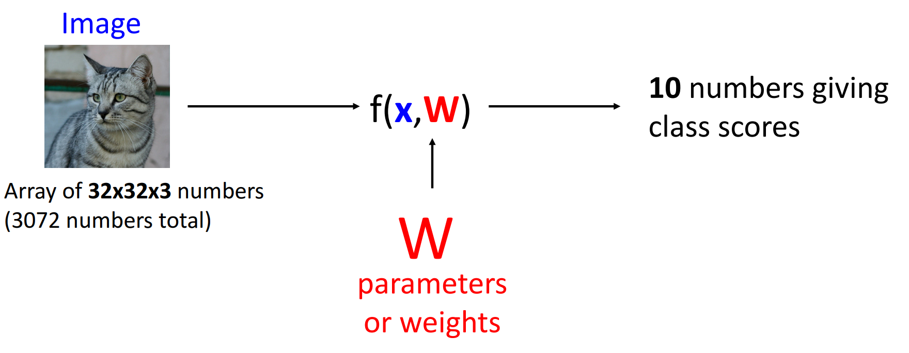

위 사진과 같이, 이미지를 입력으로 받아, 학습 가능한 `Parameter` 를 조정해가며 학습하는 방법이다. 

`Parametric Approach` 의 가장 간단한 방법으로 `Linear Classifier`가 있다.

# Linear Classifier

가장 간단한 `Linear Classifier` 는 아래와 같이 구성된다.

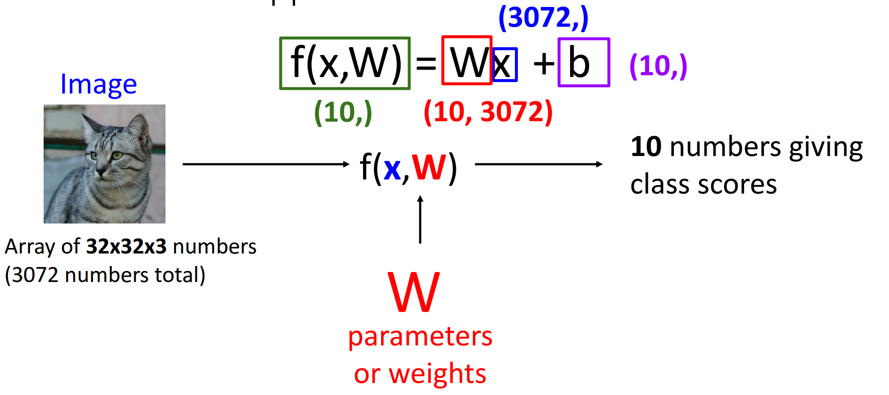

**32 * 32 * 3 size**의 Image를 입력받아 `Flatten` 한다.

`Flatten`의 결과 3072 크기의 1D vector `x`가 생성된다.

우리는 특정 이미지를 10개의 `class` 중 하나로 분류하기를 원하기 때문에, **10 * 3072 size**의 `Paratemer matrix`를 사용한다.

가장 간단한 형태의 `Function` 은 `W`와 `x`를 `matrix multiplication` 하는 방법이다.

위 `Matrix multiplication` 의 결과, 특정 이미지가 각 10개의 `class` 에 속할 `score` 가 만들어진다.

`b`는 `bias`로, 10개의 `class`에 대한 `offset` 을 의미한다. 

`Example` 은 아래와 같다.
2 x 2 `gray image` 와 3개의 `class` 를 사용한다고 가정한다,

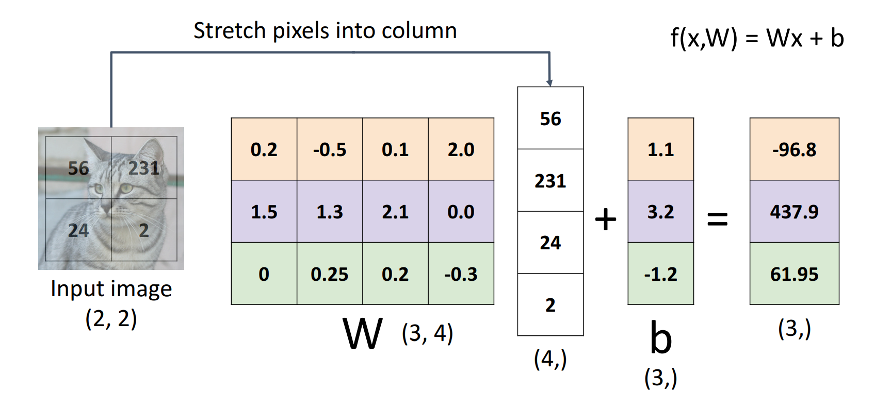

## First Viewpoint of Linear Classifier

위 `Example` 에서 `Algebraic` 한 특성을 확인할 수 있다.

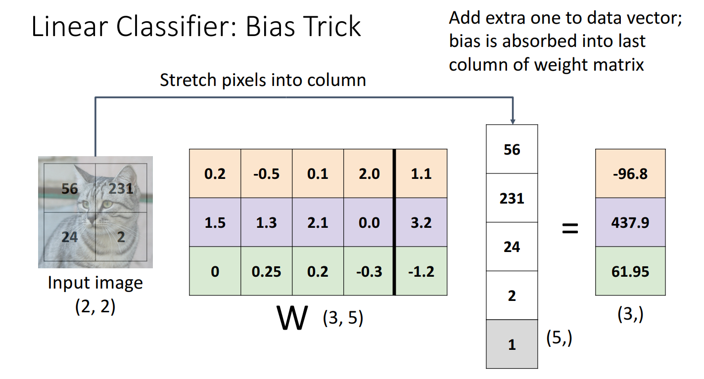

`Bias Trick` 은 `Weight Parameter` 에 하나의 추가적인 `column` 에 `bias` 값을 추가하고, `data` 에 값으로 1을 갖는 하나의 추가적인 `row`를 갖도록 하는 방법이다.

직접 계산을 수행해보면, **기존의 형태와 다르지만 계산 결과는 완벽히 동일한 것을 확인할 수 있다.**

`Bias Trick` 은 `Linear classifier` 에서 입력이 기본 벡터 형태인 경우에 자주 사용된다.

하지만, `Computer Vision` 에서는 `Convolution` 에 잘 사용되지 않기 때문에 드물게 사용되지만 알아두는 것이 좋다. 

### Linear

> `Linear classifier` 는 말처럼 "Linear"한 성질을 가진다.

위에서 확인했던 `Fucntion` 에서 `bias` 를 제외했다고 가정하자.

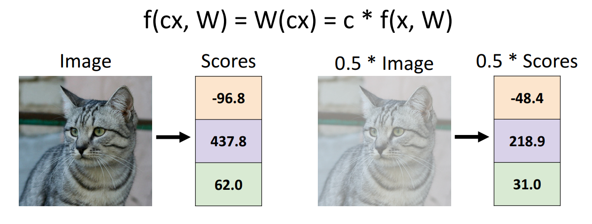

`Linear Classifier` 는 `Linear` 하기 때문에, 특정 상수가 곱해지면 모든 `Score`가 상수만큼 곱해진다.

하지만 **인간은 이미지가 0.5배 흐릿해진다고 해서, 예측 점수를 수정하지 않는다.**
- 이미지가 흐리더라도, 위 이미지 속 객체가 고양이라는 믿음을 변화시키지 않는다.

이러한 **선형적인 특징**은 `Linear classifier`에서 어떤 `Loss function`을 사용하는지에 따라 좋지 않은 영향을 끼칠 수도 있다. 

## Second Viewpoint of Linear Classifier

> 위에서 본 `Linear Classifier` 의 다른 형태의 계산 방법에 대해 살펴보자

우리는 Input image를 `Flatten` 하는 대신, Image의 형태에 맞게 `Weight Matrix`를 구성할 수 있다.

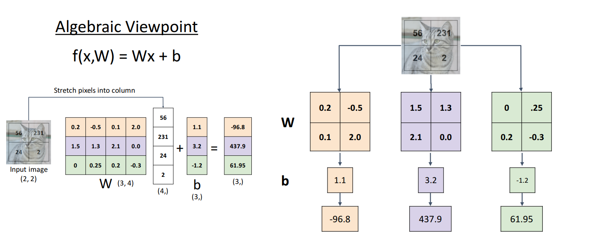

이 방법을 사용하면 더 직관적이다.

`Weight Matrix`의 형태가 `Input image`와 동일하기 때문에, `Weight Matrix`도 시각화해볼 수 있기 때문이다.
- 이 강의에서 이를 `Visual Viewpoint` 라고 명명한다.

이 경우, `Weight Matrix`는 각 `Categoty`에 대한 `Template` 처럼 동작하고, `Inner product`는 `Template Matching`처럼 동작하게 된다.

10개의 `class`에 대한 `Weight Matrix`를 시각화해보면 다음과 같다.

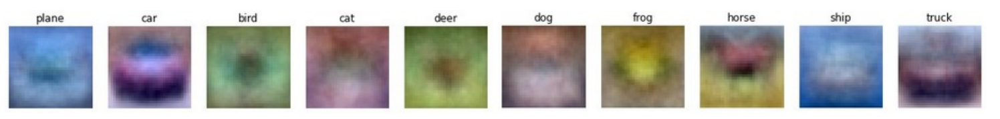

여기서 **`Linear Classifier`의 한계점**이 나타난다.

먼저 각 `class`에 대한 `weight matrix`는 **특정 맥락, 색 그리고 형태를 갖는 이미지**에 대해서만 해당 `class` 라고 분류할 수 있게 된다.

**초록 배경 속의 자동차와 같이 특이한 맥락** 속 특정 객체는 `deer class`로 잘못 분류하게 될 가능성이 있다.

`horse`에서 확인할 수 있는 것처럼, 특정 말이 오른쪽을 바라보는 모습과 왼쪽을 바라보는 모습 모두를 분류할 수 있도록 하기 위해서 **`weight matrix`는 머리가 두 개가 달린 말처럼 보이게 된다.**
- `Single template`은 한 data`에 대한 여러 `mode`를 모두 확인할 수 없다. 

## Third Viewpoint of Linear Classifier

한 이미지에서 나머지 pixel value는 모두 고정하고, 하나의 Pixel value만 바꾸어 본다고 생각해보자.

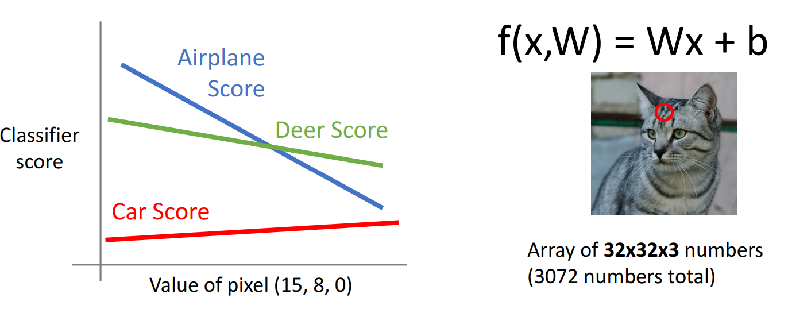

하나의 Pixel value가 바뀜에 따라, 각 `class`에 대응되는 `score`는 `Linear` 하게 바뀔 것이다.

이제 두 개의 Pixel value가 바뀌는 경우를 생각해보자.

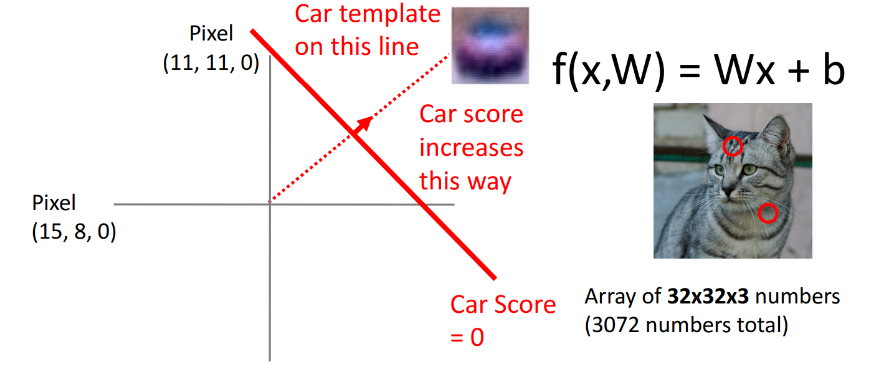

그림 상으로 나타나진 않지만, z축이 score라고 생각해보면, 두 pixel 값이 변함에 따라 `Hyperplane` 이 형성될 것이다.

`Hyperplane`이 xy 평면에 닿는 부분이 `빨간색 선`으로 표현되어 있다.

`Car score`는 $Wx + b$ 의 결과이므로, `Car score`가 0인 부분에서는 $W$와 `Car score를 나타내는 Hyperplane`이 `orthogonal` 한 부분일 것이다.
- 따라서 `Car template`은 그림에서 확인되는 방향으로 이루어지고, 해당 방향 쪽으로 갈 수록 `car score`가 증가함을 확인할 수 있다.

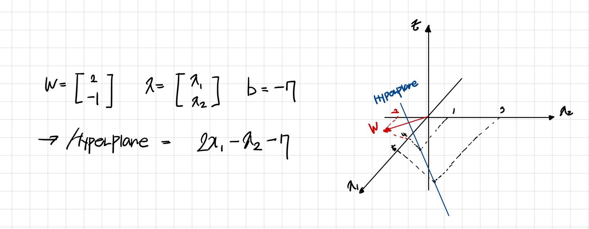

- `Hyperplane`과 $W$가 `Orthogonal` 함을 확인할 수 있다. 

두 개의 pixel을 바꾼 경우에서, 여러 class에 대해서도 확인할 수 있다. 

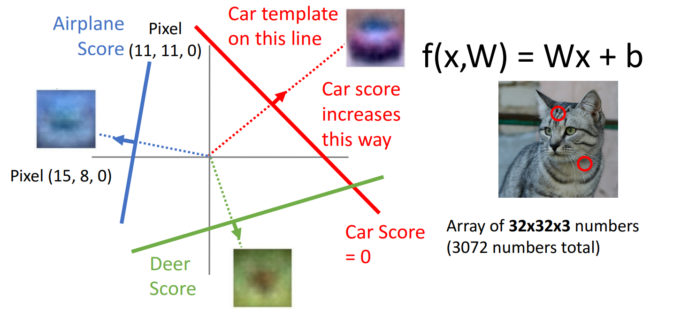

이 강의에서는 `Linear Classifier`의 이러한 관점을 `Geometric Veiwpoint`라고 한다.

2개의 pixel만을 움직이는 경우는 적기 때문에, **고차원으로 표현**하게 되면 수많은 개수의 pixel value에 따른 class 분류 값을 확인할 수 있다.

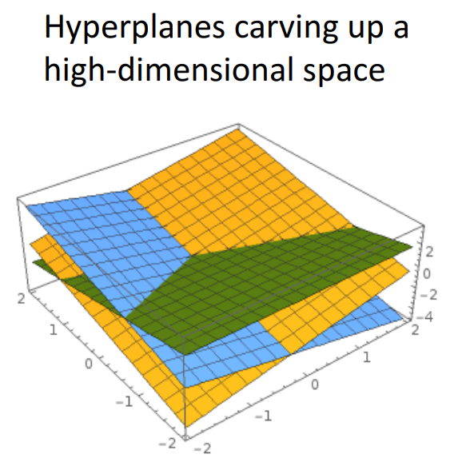