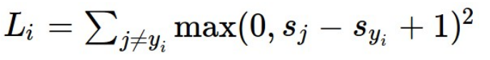
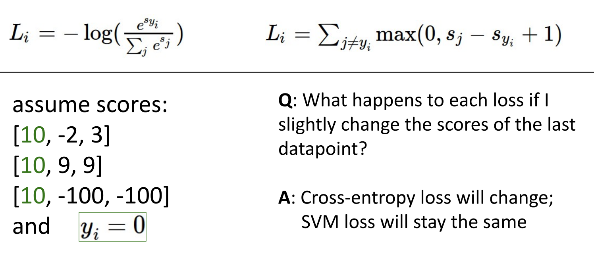

# 03. Linear Classifiers

**`강의 영상`**                      

https://www.youtube.com/watch?v=qcSEP17uKKY&list=PL5-TkQAfAZFbzxjBHtzdVCWE0Zbhomg7r&index=3

**`강의 자료`**

https://web.eecs.umich.edu/~justincj/slides/eecs498/498_FA2019_lecture03.pdf

# Neural Network

> `Nearal Network`를 구성할 때, 여러 Layer로 쌓게 된다. 여러 Layer에서 가장 기본적인 요소는 `Linear Calssifier` 라고 할 수 있다.

우리는 `Image Classification` 을 수행할 때, 가장 간단한 방법으로 `Parametric Approach` 를 사용할 수 있다.

위 사진과 같이, 이미지를 입력으로 받아, 학습 가능한 `Parameter` 를 조정해가며 학습하는 방법이다. 

`Parametric Approach` 의 가장 간단한 방법으로 `Linear Classifier`가 있다.

# Linear Classifier

가장 간단한 `Linear Classifier` 는 아래와 같이 구성된다.

**32 * 32 * 3 size**의 Image를 입력받아 `Flatten` 한다.

`Flatten`의 결과 3072 크기의 1D vector `x`가 생성된다.

우리는 특정 이미지를 10개의 `class` 중 하나로 분류하기를 원하기 때문에, **10 * 3072 size**의 `Paratemer matrix`를 사용한다.

가장 간단한 형태의 `Function` 은 `W`와 `x`를 `matrix multiplication` 하는 방법이다.

위 `Matrix multiplication` 의 결과, 특정 이미지가 각 10개의 `class` 에 속할 `score` 가 만들어진다.

`b`는 `bias`로, 10개의 `class`에 대한 `offset` 을 의미한다. 

`Example` 은 아래와 같다.
2 x 2 `gray image` 와 3개의 `class` 를 사용한다고 가정한다,

## First Viewpoint of Linear Classifier

위 `Example` 에서 `Algebraic` 한 특성을 확인할 수 있다.

`Bias Trick` 은 `Weight Parameter` 에 하나의 추가적인 `column` 에 `bias` 값을 추가하고, `data` 에 값으로 1을 갖는 하나의 추가적인 `row`를 갖도록 하는 방법이다.

직접 계산을 수행해보면, **기존의 형태와 다르지만 계산 결과는 완벽히 동일한 것을 확인할 수 있다.**

`Bias Trick` 은 `Linear classifier` 에서 입력이 기본 벡터 형태인 경우에 자주 사용된다.

하지만, `Computer Vision` 에서는 `Convolution` 에 잘 사용되지 않기 때문에 드물게 사용되지만 알아두는 것이 좋다. 

### Linear

> `Linear classifier` 는 말처럼 "Linear"한 성질을 가진다.

위에서 확인했던 `Fucntion` 에서 `bias` 를 제외했다고 가정하자.

`Linear Classifier` 는 `Linear` 하기 때문에, 특정 상수가 곱해지면 모든 `Score`가 상수만큼 곱해진다.

하지만 **인간은 이미지가 0.5배 흐릿해진다고 해서, 예측 점수를 수정하지 않는다.**
- 이미지가 흐리더라도, 위 이미지 속 객체가 고양이라는 믿음을 변화시키지 않는다.

이러한 **선형적인 특징**은 `Linear classifier`에서 어떤 `Loss function`을 사용하는지에 따라 좋지 않은 영향을 끼칠 수도 있다. 

## Second Viewpoint of Linear Classifier

> 위에서 본 `Linear Classifier` 의 다른 형태의 계산 방법에 대해 살펴보자

우리는 Input image를 `Flatten` 하는 대신, Image의 형태에 맞게 `Weight Matrix`를 구성할 수 있다.

이 방법을 사용하면 더 직관적이다.

`Weight Matrix`의 형태가 `Input image`와 동일하기 때문에, `Weight Matrix`도 시각화해볼 수 있기 때문이다.
- 이 강의에서 이를 `Visual Viewpoint` 라고 명명한다.

이 경우, `Weight Matrix`는 각 `Categoty`에 대한 `Template` 처럼 동작하고, `Inner product`는 `Template Matching`처럼 동작하게 된다.

10개의 `class`에 대한 `Weight Matrix`를 시각화해보면 다음과 같다.

여기서 **`Linear Classifier`의 한계점**이 나타난다.

먼저 각 `class`에 대한 `weight matrix`는 **특정 맥락, 색 그리고 형태를 갖는 이미지**에 대해서만 해당 `class` 라고 분류할 수 있게 된다.

**초록 배경 속의 자동차와 같이 특이한 맥락** 속 특정 객체는 `deer class`로 잘못 분류하게 될 가능성이 있다.

`horse`에서 확인할 수 있는 것처럼, 특정 말이 오른쪽을 바라보는 모습과 왼쪽을 바라보는 모습 모두를 분류할 수 있도록 하기 위해서 **`weight matrix`는 머리가 두 개가 달린 말처럼 보이게 된다.**
- `Single template`은 한 `data`에 대한 여러 `mode`를 모두 확인할 수 없다. 

## Third Viewpoint of Linear Classifier

한 이미지에서 나머지 pixel value는 모두 고정하고, 하나의 Pixel value만 바꾸어 본다고 생각해보자.

하나의 Pixel value가 바뀜에 따라, 각 `class`에 대응되는 `score`는 `Linear` 하게 바뀔 것이다.

이제 두 개의 Pixel value가 바뀌는 경우를 생각해보자.

그림 상으로 나타나진 않지만, z축이 score라고 생각해보면, 두 pixel 값이 변함에 따라 `Hyperplane` 이 형성될 것이다.

`Hyperplane`이 xy 평면에 닿는 부분이 `빨간색 선`으로 표현되어 있다.

`Car score`는 $Wx + b$ 의 결과이므로, `Car score`가 0인 부분에서는 $W$와 `Car score를 나타내는 Hyperplane`이 `orthogonal` 한 부분일 것이다.
- 따라서 `Car template`은 그림에서 확인되는 방향으로 이루어지고, 해당 방향 쪽으로 갈 수록 `car score`가 증가함을 확인할 수 있다.

- `Hyperplane`과 $W$가 `Orthogonal` 함을 확인할 수 있다. 

두 개의 pixel을 바꾼 경우에서, 여러 class에 대해서도 확인할 수 있다. 

이 강의에서는 `Linear Classifier`의 이러한 관점을 `Geometric Veiwpoint`라고 한다.

2개의 pixel만을 움직이는 경우는 적기 때문에, **고차원으로 표현**하게 되면 수많은 개수의 pixel value에 따른 class 분류 값을 확인할 수 있다.

## Hard case for a Linear Classifier 

아래 세 가지 경우 모두 `Linear Classifier` 로 구별할 수 없다.

가장 오른쪽의 있는 케이스는 같은 class의 data가 다른 형태, 모양을 띄고 있는 상황으로 생각할 수 있다.
- `Second viewpoint`에서 확인했던 `horse template`에서의 오른쪽을 보고 있는 말과 왼쪽을 보고 있는 말이 이 경우에 속한다.  

> Linear classifier을 여러 Viewpoint로 나누어서 생각해 볼 때, **표현 능력의 단점 중 일부가 더 명확해지는 것을 확인할 수 있다.**

## Perceptron

> 현재 시점에서 Perceptron의 수학적 특성을 살펴 보면, **Perceptoron은 Linear classifier로 분류된다.**

`Perceptorn`이 `Linear classifier`로 분류되기 때문에, Classify하지 못하는 많은 경우가 존재한다.

대표적인 경우는 `XOR` function이다.

오른쪽 그래프를 보면 초록색과 파란색을 구별할 수 있는 하나의 선을 긋는 것이 어려운 것을 확인할 수 있다.  

# Choosing a good W

`Score function` ($Wx + b$)을 사용하면 아래와 같은 결과를 얻을 수 있다.

하지만, 이 정보에서 우리는 `Parameter` $W$를 어떻게 설정하는지에 대한 정보를 얻을 수는 없다.

$W$를 설정하는 과정은 아래와 같다.
1. `Loss function`을 이용하여 $W$가 좋은 값인지를 확인한다.
2. `Loss function`을 최소화하는 $W$를 찾는다.

3강에서는 (1)번 과정에 대해서만 알아보고, (2)번 과정은 4강에서 공부할 것이다.

## Loss function

> `Objective function`, `Cost function`이라고도 불리며, 현재 Classifier가 얼마나 잘 동작하는지를 알 수 있게 해주는 function

**일반적으로 `MINIMIZE`해야 한다.**

모델에 따라 `Negative loss function`을 사용하여, `MAXIMIZE`하고자 하는 경우가 있다.
- 이런 함수들은 `Reward function`, `Profit function`, `Utility function`, `Fitness function` 등으로 불린다.

가장 **기본적인 `Loss function`의 형태**는 다음과 같다.

데이터를 {$(x_i, y_i)^N_{i=1}$} , $x_i$: **data**, $y_i$: **label** 이라고 하자. 

**Loss**는 $L_i(f(x_i, W), y_i)$라고 하자.

**Loss for the dataset**: $L = \frac{1}{N}\sum_iL_i(f(x_i, W), y_i)$ 
- 단순히 Sample 별 loss의 평균으로 구할 수 있다.

> 위에서 본 것은 가장 기본적인 `Loss function`의 형태이고, Model의 목적, task에 따라 다른 `Loss function`을 사용해야 할 수도 있다.

# Multiclass SVM Loss

> 기본적인 아이디어는 올바른 Class로 예측한 경우에는 작은 Loss를 갖도록, 알맞지 않은 Class로 예측한 경우에는 큰 Loss를 갖도록 하는 것이다.

> 특정 이미지에 대해 계산한 올바른 Class에 대한 Score가 알맞지 않은 Class에 대해 계산한 Score보다 커야한다는 생각에서 비롯되었다.

- 직관적인 방법이다!

- 그래프를 보면, 정답이 아닌 `Class` 중 가장 큰 `Score`보다 `Margin` 이상으로 큰 `Score`에 대해 0의 `Loss`를 준다.
  
-  문 여닫는 모습과 비슷해 `Hinge loss`라고도 한다.

-  **Loss가 발생하는 경우, Score에 따라 선형적으로 증가하는 형태를 갖는다.**

`Hinge loss`를 수식으로 나타내면 아래와 같다.

$s = f(x_i, W)$라고 하자

$i$ 번째 sample에 대한 `Loss`는 아래와 같이 구할 수 있다.

$L_i = \sum_{j!=y_i} max(0, s_j - s_y + 1)$ 

- `Loss`가 0보다 커지는 경우는 정답 Class ($y_i$)가 아닌 모든 다른 Class의 Score 중, $s_j > s_{y_i} - 1$ 인 경우이다. 

- 하나라도 $s_j > s_{y_i} - 1$인 class가 존재하면 `Loss`는 0보다 커진다.

예시를 확인해보자.

- Bold체로 적힌 숫자가 올바른 Class에 대한 Score이다.

- `Hinge loss`의 수식에 따라 계산해보면, `Loss`는 빨간 글씨에 맞게 계산된다.

> 위 예시로부터 `Hinge loss`의 **특징 몇 가지**를 확인할 수 있다.

1. 하나의 Sample이 올바르게 분류되면 즉, `Loss` = 0이라면, 해당 Class에 대한 Score를 약간 변경해도 `Loss`에 영향을 미치지 않는다는 것이다.

   - 위의 예시에서 `Car class`에 해당된다. 

2. `Minimum loss` = 0, `Maximum loss` = $\inf$
   
   - 모든 다른 Class의 Score가 **정답 Class의 Score보다 압도적으로 높은 경우**에 해당된다.

3. 만약 모든 `Weight Matrix`의 값이 `Random Value`라면, 처음 `Hinge loss`의 값은 $C-1$ 이다.
    - $C$는 Class의 개수이다.

    - 일반적으로 머신 러닝에서 처음 학습 시에는 `Gaussian distribution`에서 Random한 값을 가져와 `Weight`를 초기화한다.

    - 이때 예상되는 Score는 class에 관계없이 비슷하기 때문에, $s_j - s_y$ = 0에 가까워진다.

    - 결국 `Hinge loss`는 $(C-1) \cdot 1 = C-1$ 이다.

    - `Nearal Network`에서 `Weight`를 `Random`하게 초기화한 상태에서 처음 학습 시, $C-1$과 유사한 `Loss`가 나오지 않았다면, 어딘가 버그가 있을 수도 있다는 `Debugging` 기술로 사용할 수 있다.

4. 정답 Class를 포함하여 `Hinge loss`를 계산하면 모든 `loss`에 1이 추가된다.
   - 모두 1씩 증가하기 때문에, **Classifier의 선호도에 영향을 미치지 않는다.**

5. `Hinge loss`에서 전체 손실을 `sum`이 아닌 `mean`으로 계산하면, 결과적으로 손실은 데이터 샘플 수 C의 역수인 `1/C`만큼 스케일 조정된다. 이는 `monotonic transformation`이므로 최적화 과정에서 `동일한 선호도`를 유지한다.

6. 식을 아래와 같이 변경하면 어떻게 될까?
   
    
    - 제곱이 생겼기 때문에 비선형적이 되고, `Margin`을 많이 넘긴 가중치를 더 조정하려는 `선호도`가 생긴다.

    - 기존 방식에서 `Margin`을 크게 넘긴 것에 선형적으로 `Penalty`를 주는 것에 비해 더 많은 `Penalty`를 부여하게 되면서 선호도가 커지고 더 이상 `SVM Loss`라고 할 수 없게 된다.

`Question`: **만약 우리가 전체 `SVM Loss`를 0으로 만드는 Matrix $W$를 찾았을 때, 그 $W$는 `Unique`할까?**

답: `Unique`하지 않다!

- 왜냐하면 `SVM Loss`가 0이라는 말은 정답 Class의 Score가 다른 Class의 Score보다 1 이상씩 크다는 의미이다.
- 이 경우, 주어진 Matrix을 $K$ (k>=2)배 하면 똑같이 `SVM Loss`가 이 된다. 

그럼 우리가 `SVM Loss`를 0으로 만드는 $W$와 $2W$를 얻었다고 가정해보자.
- $2W$는 W에 2를 곱한 행렬이다.

두 Matrix 모두 `SVM Loss = 0`인데, 어떤 Matrix를 더 선호해야 할까?

이러한 경우에  `Regularization`을 사용할 수 있다.

# Regularization

> `Training Error`를 피하기 위해, Loss fucntion에 추가하여 사용한다.

우리가 직전까지 학습했던 `Loss function`은 `Data loss`라고 할 수 있다. 

`Data loss` 뒤에 `Regularization term`을 더하여 모델이 Training data에 `Overfitting` 되는 것을 방지할 수 있다.

$\lambda$: **Regularization 강도를 결정하는 Hyperparameter**

`Regularization term`에 사용하는 방법들은 기본적으로 다음과 같다.

- `Elastic net`은 L2 + L1 이다.
- `More complex` 부분은 `Neural Network`에 주로 사용된다.

### Purpose
1. `Data loss`를 최소화하는 것을 넘어, 개인의 `선호도`나 `사전 정보`를 `Regularization term`으로 추가할 수 있다.

    

    - 이 경우 `Data loss`만 이용하면 $W1$과 $W2$는 같은 선호도를 갖는다. 
    - `L2 Regularization`을 사용하면, $W2$를 사용하게 된다.
    - `L2 Regularization`은 같은 `Data loss`를 가질 때, `Weight`가 퍼져있는 즉, 모든 Feature를 사용하는 것을 선호한다.
    - *개별 기능에 노이즈가 있을 수 있고 모든 기능에 상관 관계가 있을 수 있으니 모든 특징을 사용하도록 하려면 `L2 Regularization`을 사용하는 것이 좋다.*
    - `L1 Regularization`은 **반대로 단일 기능에 모든 가중치를 두는 것을 선호**한다.

    
   - L1의 경우, 마름모의 꼭짓점에서 만나기 때문에 다른 `x`가 0이 되는 경우가 많다.
   - L2의 경우, 등고선에서 겹치는 부분에서 만나기 때문에 최대한 만든 Feature을 사용하게 된다.

2. `Overfitting`을 피하고, 일반화 성능을 키울 수 있다.
   
   

   - `Unseen data`에 대해 일반화 성능이 높을 수 있는 더 `Simple`한 모델인 $f2$를 선택하도록 할 수 있다.

3. `Curvature`(곡률)을 추가하여 `Optimization` 성능을 키울 수 있다.
   - `Gradient descent` 등에서 속도를 빠르게 만들 수 있다.

# Cross-Entropy Loss (Multinomial Logistic Regression)

> Multiclass SVM Loss에서는 Score를 $Wx + b$의 계산값으로만 인식했지 의미 부여를 하지는 않았다.

> **Score를 확률로서 해결해보자!**

Score를 확률로 계산하기 위해 `Softmax function`을 사용해야 한다.
- 우리가 `np.argmax()` 같은 함수를 사용하면 `index`를 반환해준다. 이 index를 `one-hot vector`로 나타낼 수 있다.
  
- 하지만, `one-hot vector`는 가장 큰 값을 제외하고 모두 0이기 때문에 **불연속이라 미분이 불가능**하다.
  
- 그래서 대신 **최댓값을 사용해야할 때, 미분이 가능**하도록 하기 위해 `Softmax` 함수를 사용한다.

- `Neural Network`에서 **최댓값을 사용하며, 미분이 필요하다고 생각이 들 때,** Softmax는 많이 사용된다.

`Softmax`를 이용하여 Score를 계산하는 과정은 아래와 같다.

Loss를 계산해보면, 위의 예시에서 정답 Class는 고양이이므로 아래 수식에 맞게 Cat class에 대한 loss를 구할 수 있다.

위의 `Loss`는 `Negative log-likelihood` 이다.
- Minimize 대상이다.

원래의 Softmax 함수는 `Likelihood` 형태이므로, log-likelihood를 `Maximum Likihood Estimation` 한다고 생각해도 된다.

결국 최종적인 `Loss function`은 아래와 같다.

우리는 정답 Class와 예측 Class간의 차이를 확인할 필요가 있다.
- `Loss function`과 관계없이, 예측된 Score vector와 정답 Score Vector를 비교할 수 있다.

오른쪽 Vector는 정답 Class를 `One-hot vector`로 나타낸 것이다.

두 Vector의 차이를 확인하기 위해, 수학적으로 `Kullbakc-Leibler divergence`를 이용할 수 있다.

이를 이용해 `Cross-Entropy`를 구해보자.

정답 자체의 불확실성: 
$H(P)$ — **우리가 바꿀 수 없음**

모델의 부정확성: 
$D_{KL}(P∥Q)$ — **이걸 줄이기 위해 학습**

>**결국 위에서의 `Loss function`을 Minimize하는 것은 $D_{KL}(P∥Q)$을 Minimize 하는 것과 동일하다.**
- 이름이 `Cross Entropy loss`인 이유

### 특징

1. `Minimum loss` = 0, `Maximum loss` = $\inf$

2. 모든 Score가 학습 초기에 Random Value라면 `Loss`의 값은?
   - $C$개의 Class가 있을 때, 특정 Class로 분류될 확률은 $1/C$ 이다.

   - 이를 `Loss`에 넣으면 $\log(C)$가 나온다.
   - 이 역시 `Debugging` 방법으로 사용 가능하다.

# Cross-Entropy vs SVM Loss

- SVM loss를 0으로 만드는 것이 비교적 쉽다

- SVM Loss와 달리 Cross-Entopy는 **잘못된 Class의 점수를 점점 낮추고 싶어하기 때문에 일 부분의 점수가 바뀌는 것의 영향이 크다.**

- SVM Loss는 0으로 유지되고, Cross-Entropy Loss는 감소한다.