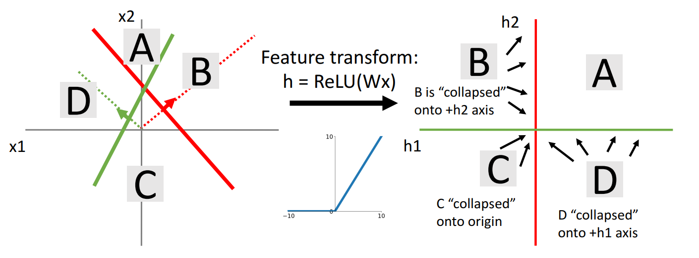
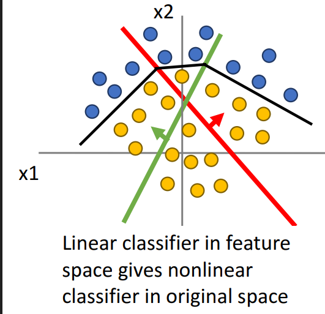
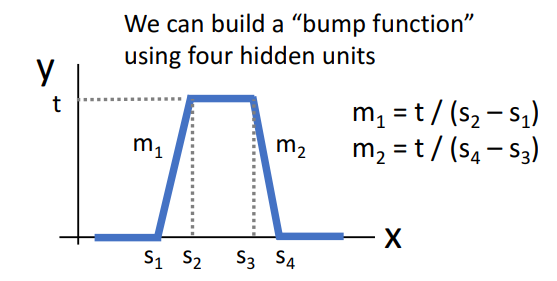

# 05. Neural Networks

**`강의 영상`**                      

https://www.youtube.com/watch?v=qcSEP17uKKY&list=PL5-TkQAfAZFbzxjBHtzdVCWE0Zbhomg7r&index=5

**`강의 자료`**

https://web.eecs.umich.edu/~justincj/slides/eecs498/498_FA2019_lecture05.pdf


___

## Linear Classifier의 문제점


- 표현할 수 있는 함수의 종류가 제한된다.
- 성능이 크게 좋지 않다.
- `Geometric Viewpoint`에서 초록색 점과 파란색 점을 구분할 수 없다.
- `Visual Viewpoint`에서 한 `template`은 각 `Class`의 한 형태만 인식할 수 있다.

Linear Classifier의 문제점을 극복할 방법을 알아보자.

## Feature Transforms

> 데이터가 특정 좌표계에서 선형 분리되지 않을 때, **해당 좌표계를 다른 좌표계로 변환**하여 선형 분리가 가능하도록 만다는 방법


- 원래의 입력 데이터 공간이 아니라 **데이터의 `feature space`에 대해 `Linear Classifier`를 적용**하고, **다시 원래의 입력 데이터 공간으로 변환하면 결과적으로는 `Nonlinear Classifier`처럼 동작한다.**
  
- 위의 예시에서는 `Polar Coordinate`로 변환했다.

`Computer Vision`에서 주로 사용하는 `Feature Transform` 방법을 알아보자.

### Color Histogram

> 이미지의 각 픽셀들을 색상 정보를 담고있는 Color Histogram에 대응하여 변환하는 것


- 색상 정보만 다루기 때문에 `Spatial Invarient` 하다.
  
- 정규화된 Histogram

- 같은 종류의 **모든 객체가 색상은 동일하고 이미지 상에서 다른 위치**에 나타날 수 있다고 할 때, `Color Histogram`을 이용하면 효과적이다.


### Histogram of Oriented Gradients (HoG)

> 이미지의 각 픽셀들을 Local Edge의 방향과 강도에 대응하여 변환하는 것


- 객체의 경계가 뚜렷할수록 `Strength`가 크다.
  
- 방향은 화살표로 표현된다.
  
- `Object Detecting`에 주로 사용된다.

**`Color Histogram`과 `HoG`은 사용할 때마다 어떠한 목적(색상 vs 형태)을 가지고 사용하는지와 데이터의 특성 (색상 vs 윤곽)이 무엇인지 생각해야 한다.**

**추가로 설계자가 Tranform 방법을 설계해야 한다.**

### Bag of Words

> `Training set`의 데이터에 의해 동작하는 `Feature transform` 방법 (Data-Driven)


- 이미지에서 특정 Patch를 뽑아낸다. 
  
- `Visual word`를 형성하기 위해 비슷한 특징을 가진 Patch를 Clustering
  
- `Visual word`를 모아 `Codebook` (사전)을 만든다.

- 이미지를 `Codebook`에 맞게 Encoding 한다.

- 설계자가 따로 지정할 필요없이 `Training Dataset`을 통해 `Visual word`와 `Codebook`은 자동으로 생성된다.

### Combining features

> 위에 제시된 여러 Feature Transform 방법을 섞어 사용할 수 있다.


- `Bag of Words`, `Hog` and `Color Histogram`을 각각 사용하여, **하나의 긴 Feature vector로 만들 수 있다.**

- 하나의 `Feature vector`가 여러 정보를 담을 수 있게 된다.

위와 같은 방법들을 사용하면 아래와 같이 `Feature Extraction`를 해서 얻은 `Feature Space` 위에서 `Linear Classifer`를 이용하여 이미지를 분류할 수 있다.


하지만 `Feature Extraction`에 `Bag of Words`와 같은 `Data-Driven` 방법을 사용하더라도 **Linear Classifier를 학습시킬 때 Feature Extraction도 같이 학습되지는 않는다.**
- `Bag of Words`가 자동으로 `Visual patch`와 `Codebook`을 만들긴 하지만, 학습을 통해 더 나은 `Visual patch`를 갖도록 만들 수는 없다.

때문에 위 방법 대신, `Feature Extraction`까지도 학습이 가능한 방법을 사용하고 있다.


- **시스템 전체의 가중치나 시스템 자체의 모든 부분을 자동으로 튜닝**할 수 있어 분류 정확도를 높일 수 있다.
  
- `End to End Pipeline`을 원한다.

# Neural Networks

가장 간단한 `2-Layer Neural Network`부터 살펴보자.


- Hidden Layer에 `ReLU Function` 사용
  
- $H$: Hidden Layer Size, $C$: # of Classes, $D$: # of features

- `Bias term`은 대부분 포함되어 있지만 표기상 안 쓰는 경우가 많음


- $W$에서 ($i$, $j$) element는 **다음 Layer의 vector의 $i$번째 element에 이전 Layer의 vector의 j번째 element가 미치는 영향을 의미한다.**
    - $Wx$에서 $W$의 각 행은 다음 Layer의 벡터의 각 Element에 대응되기 때문이다.

- 이 경우, **이전 Layer의 모든 element가 다음 Layer의 모든 element에 영향**을 미치는데 이를 `Fully-connected neural network` 또는 `Multi-Layer Perceptron (MLP)`이라고 부른다.

`Linear Classifier`에서 확인했던 것처럼, $W_1$을 시각화해보자.

`2-Layer Neural Network`에서는 첫 번째 Template에 input image가 반응한 정도를 두 번째 Template이 다시 확인하게 된다.


- 빨간색 테두리 칠해진 Template을 확인하면, `Liear Classifer`와 다르게 왼쪽을 보고있는 말과 오른쪽을 보고있는 말이 분리되어 있음을 확인할 수 있다.

- `Sub-Class` 구분이 가능하고 더 복잡한 Feature를 인식할 수 있다.


- `Distributed Representation`: 여러 뉴런들의 집합을 통해 정보가 표현된다.

- Hidden Layer에는 $H$개의 뉴런이 있는데 각 뉴런은 서로 다른 특징을 나타낸다.

- 입력 데이터에 따라 각 뉴런이 의미하는 정보를 나타나게 해주는 것은 $W_1$의 각 행이다.

- **두 번째 Layer의 가중치를 이용하여, Hidden Neuron 여러 개가 모여야(Recombining) 하나의 객체**가 명확해진다.

    - Template을 재구성하여 시각적인 특징을 더 자세하게 표현한다.

- 때문에 **여러 Template이 모여야 하나의 의미 있는 정보**가 형성되며, **각 Template이 어떤 특징을 나타내는지 확인하기 어렵다.**

- Template을 사람이 해석하기 힘든 이유이며, 객체 대신 공간 정보 등이 담겨있을 수 있다.

**Question)** **여러 중복되어 보이는 Template이 많은 이유?**

- 사람은 처음에 **색상 대비 (빨간색 vs 파란색)** 또는 **Oriented Edge (수평, 수직 Edge)에** 집중하는 경향이 있고 Neural Network도 마찬가지이다.

- 이 때문에 학습 초기에는 첫 번째 Layer의 가중치에 중복된 Template이 많은 경우가 있다.

- 이를 해결하기 위해 중복 제거 등의 방법이 있다.

## Deep Neural Network


- `Depth`는 일반적으로 `Weight Matrix`의 개수와 동일하며, 위 예시는 `6 Layer Neural Network` 이다.

- `Width`는 데이터의 `Dimension`이 되는 경우가 많고, 관례적으로 Hidden Layer의 `Width`는 일정하게 하는 경향이 있다.

## Activation Functions

> Neural Network를 **Non-Linear**하게 만들어주는 중요한 구성 요소로 아래와 같은 여러 함수를 사용할 수 있다.


- 가장 많이 사용되는 함수는 `ReLU function`으로, 이때까지의 예시에서도 `ReLU Function`을 사용하였다.

### ReLU


### Activation Function이 중요한 이유

`2-Layer Neural Network`에서 `Activation Funcion`이 없다고 가정해보자.

그렇다면 `score vector` $s = W_2W_1x$ 이다.

행렬 곱에는 **결합법칙(Associative Law)**이 적용되기 떄문에, `Activation Function`이 없다면 **$W_2W_1x$는 여전히 Linear이다.**

따라서 **Neural Network가 Non-linear 하게 동작하기 위해서는 `Activation Function`이 필수적**이다.

### Implement

`2-Layer Neural Network`는 20줄 이내로 구현할 수 있을 정도로 쉽다!

```python
import numpy as np
from numpy.random import randn

# Initialize weight and data
N, Din, H, Dout = 64, 1000, 100, 10
x, y = randn(N, Din), randn(N, Dout)
w1, w2 = randn(Din, H), rand(H, Dout)

for t in range(10000): # epoch: 10000
    # Forward Propagation
    h = 1.0 / (1.0 + np.exp(-x.dot(w1))) # sigmoid function
    y_pred = h.dot(w2)
    loss = np.square(y_pred - y).sum()

    # Back Propagation
    dy_pred = 2.0 * (y_pred - y)
    dw2 = h.T.dot(dy_pred)
    dh = dy_pred.dot(w2.T)
    dw1 = x.T.dot(dh * h * (1 - h))
    w1 -= 1e-4 * dw1 # Learning rate = 1e-4
    w2 -= 1e-4 * dw2
```

# 'Neural' Term

> Deep Learning을 공부함에 있어 계속 Neural Network라는 단어가 나올 것이기 때문에 우리의 뇌와 신경이 동작하는 방식을 대강 아는 것은 도움이 된다.


- 우리 뇌는 여러 개의 `Neuron`으로 이루어져 있다.

- `Neuron`은 여러 자극을 계속 입력받는데, `Cell body`를 통해 들어온 입력의 총합이 특정 임계치를 넘어가면 `Firing`하게 된다.

- `Neuron`이 `Firing`하게 되면, **전기 신호가 생성**되고 이 전기 신호는 `다음 Neuron`으로 이동한다.

과거에 이런 뇌의 동작에서 영감을 받아, 구성한 것이 기본적인 `Nueral Network`이다.


- 특히, $Wx$의 결과를 `Activation Function`의 입력으로 사용하여, 다음 뉴런으로 전달할 지 결정하는 부분이 가장 중요하다.

- **직전 $Wx$의 값을 뉴런의 입력 자극의 세기로 인식**한 부분이 뇌의 `Firing rate`를 모방한 것이며 이 것이 초기 주요 목표였다..

뇌와 신경망이 어느 정도의 유사성은 분명하게 가지고 있지만, 뇌에 너무 매몰되면 안 된다.

- 실제로 뇌는 신경망보다 훨씬 복잡하다.

- 뉴런 자체의 동작 방식도 여러 가지가 존재하며 복잡하다.

- `Firing rate` 기반의 인코딩은 충분하지 않을 수도 있다. 
  
  - 단순히 `Activation Function`을 이용한 값의 세기, 강도보다 실제 뉴런은 발화 시점, 간격 등이 더 중요할 수도 있다.

> **뇌와 인공신경망 사이의 유사성은 개념적 출발점일 뿐이며,
실제 성능 향상을 위해서는 그 유사성을 바탕으로 구축된 이론 위에서 반복된 실험과 연구를 통해 검증된 기법들을 이해하고 적용하는 것이 더 중요하다.**

# Space Warping

> Neural Network가 왜 **강력한 시스템**으로 여겨지는지에 대한 이유

먼저 $x$, $h$가 2차원인 `Linear Classifier`의 경우를 먼저 살펴보자.


- 이전 강의에서 봤던 것처럼, `Linear Classifier`에서 $x$ space에서 각 Class의 결정 경계는 법선 벡터가 $w$인 $w^Tx = 0$ 형태의 직선으로 나타났다.

- 이를 $h$ space에 대해 나타내면, 정확히 사분면으로 표현된다.


- 하지만, **원래 공간에서 선형 분리되지 않으면, $h$ space에서도 선형 분리가 되지 않는다.**

이제 `Linear Classifier`의 경우가 아니라, **`Activation Function`을 사용하는 경우**를 생각해보자.

- `Hidden Layer` $h$ = ReLU($Wx$) = max(0, $Wx$) 

 
- 위에서와 다르게, $h$에 **ReLU function**을 적용하면 $h1$ 과 $h2$가 음수인 부분은 모두 0이 된다.

- 따라서 $h$ space에서 **2사분면**의 모든 데이터가 $h2$축 위에 나타나고 **4사분면**의 모든 데이터가 $h1$축 위에 나타난다.

- **3사분면**의 모든 데이터는 원점 위에 나타난다.


- 데이터로 확인하면, $h$ space에서 위 사진과 같이 나타나며 선형 분리가 가능해짐을 알 수 있다.

- $h$ space 위에서 `Linear Classifier`를 사용하여 선형 분리할 수 있다.



- $h$ space에서 `Linear Classifer`로 분류한 것을 원래의 $x$ space로 복구하면 그림과 같이 `Non-linear Classifier`를 얻을 수 있다.

___

`Hidden Neuron`의 개수를 늘릴수록 Non-linear boundary가 넓어지고 구체적이게 되는 것을 확인할 수 있다.
- 모델이 **표현할 수 있는 함수 (Capacity)가** 늘어나게 된다.


- `Hidden Layer`의 수를 늘려도 마찬가지이다.

하지만 `Hidden Neuron`의 개수를 너무 크게하면 **복잡하고, Overfitting의 위험이 존재함을 확인할 수 있다.**

이를 방지하기 위해, `Hidden Layer`의 **size를 줄이는 것을 생각할 수 있다.**

하지만, 대부분 `Hidden Layer`의 **size를 줄이는 것은 고려하지 않고, `Regularization term`을 사용한다.**

- `Hidden Layer`의 size를 줄이면 `Capacity`가 줄어들기 때문이다. 


- `Regularization term`을 사용해서 일반화된 결과를 얻을 수 있다.

> **비선형적이고, 복잡한 Dicision Boundary를 생성**할 수 있는 것을 보면, Neural Network가 얼마나 강력한 방법인지 확인할 수 있다.

# Universal Approximation

> 위에서 Neural Network가 복잡한 Dicision Boundary를 형성하는 과정을 공식화


> **Neural Network는 제한된 입력 공간에서 어느 연속 함수도 근사할 수 있다.** 

### Example

`2-Layer Neural Network using ReLU Fucntion` (R -> R)


$y = u_i * max(0, w_i * x + b_i)$을 그래프로 그려보자.


- 이 함수는 `Shifted / Scaled ReLU function`이라고 부른다.

- $b_i$보다 작은 x에 대해서는 0이고 **기울기**는 결합 법칙에 따라 $u_i * w_i$이다.

- 현재 그래프 $b_i$은 음수, 기울기도 음수처럼 그려졌는데 값에 따라 다르게 그려진다.

이 예시에서는 `Bump function`도 사용한다.



- $m1, m2$는 기울기이다.
- 위 함수 모양처럼 생긴 함수를 `Bump function`이라고 한다.

아래 4개의 `Shifted / Scaled ReLU function`의 합으로 하나의 `Bump function`을 구성할 수 있다.


과정은 다음과 같다.


즉, 4K개의 `Hidden unit`으로 **원하는 위치와 높이에 K개의 `Bump`를 놓을 수 있다면, 어떤 함수라도 표현할 수 있다.**


- 더 좋은 근사를 위해서는 각 `Bump`의 간격을 더 좁게 만들 필요가 있다.

- 이를 위해선 **더 Deep한 Neural Network를 통해 더 많은 `Hidden Unit`과 `Hidden Layer`을 만들어야 한다.**

> **그러나 현실에서는 Neural Network가 실제 Bumps를 학습하는 것이 아니기 때문에 완벽하게 모든 함수를 표현하진 못 한다.**

- 실제로 모델이 학습하는 것은 `Bumps`가 아닌 **`ReLU Function`의 조합**이기 때문에 완벽한 표현은 어렵다.

- 실제로 특정 함수를 Neural Network가 완벽하게 표현하기 위한 **`Hidden Unit의 개수`나 `Training Data의 개수`를 완벽하게 지정할 수 없다.**

> `Universal Approximation`은 신경망이 **충분한 너비와 적절한 가중치 설정을 통해 임의의 연속 함수를 임의의 정밀도로 근사**할 수 있다는 사실만을 보장한다.

# 최적화 방법

> Neural Network가 수렴함을 확인할 수 있을까?

## Convex Functions 

정의는 아래와 같다.


- $t$는 0과 1사이의 값이다.

- **두 점 사이의 점을 $f$에 넣었을 때의 값이, 두 점을 이은 선보다 항상 아래**에 있으면 `Convex function`이라고 한다. 

### Example


`Multi-dimension`에서 `Convex function`은 그릇 (Bowl) 모양을 가진다.


- `Multi-dimension`에서의 `Convex function`은 **최적화하기 쉽다**.
- 이론적으로 **Global minimum으로 수렴함을 증명할 수 있다**는 것이 보장된다.
____

**`Linear Classifier`는 항상 `Convex function optimization problem`이다.**


- `softmax`, `svm` 등 loss function에 상관없이 `Linear Classifier`는 `Convex function`을 최적화 한다.

- **항상 수렴이 보장**된다는 이 성질 때문에 종종 `Linear Classifer`가 더 선호되기도 한다. 

___

> **Neural Network 기반 시스템에서는 항상 수렴이 보장됨을 확인할 수 있는 방법이 없다.**

- 신경망은 대부분 매우 고차원이기 때문이다.

대신 경험적으로 **우리가 할 수 있는 것은 `Weight`에 따라 `Loss function`이 어떻게 변하게 될 지를 확인하는 방법**이 있다.

`Loss function`을 시각화했을 때, 여러 가능성이 있다.

대부분의 경우 `Convex Function`처럼 보이게 된다.


하지만, `Convec Function`이 아닌 경우도 종종 발생한다.


언덕을 올라가야 하고, Local minimum까지 존재하는 최적화가 어려운 경우도 있다.


굉장히 wild한 경우도 존재한다.


> **따라서 Neural Network는 `Non-convex Optimization problem`이다.**

- 항상 수렴한다는 이론적인 보장이 없다.
  
- 대신, 경험적으로 수렴한다고 생각할 수는 있다.
  
  - 어쨋든 작동하긴 한다. 
