# 06. Back Propagation

**`강의 영상`**                      

https://www.youtube.com/watch?v=qcSEP17uKKY&list=PL5-TkQAfAZFbzxjBHtzdVCWE0Zbhomg7r&index=6

**`강의 자료`**

https://web.eecs.umich.edu/~justincj/slides/eecs498/498_FA2019_lecture06.pdf

___

아래 모든 과정에 앞서, 가장 중요하게 알아둬야할 부분이 있다.

> **$\partial y / \partial x$는 미분의 정의에 따라, $x$의 변화량에 따른 $y$의 변화량을 의미한다.**

# Q) How to compute gradients?

`Loss function`을 특정 방식으로 작성해서 `Neural Net`이든 `Linear classifier`든 `Optimization`할 수 있다.

**그렇다면 `Gradient`는 어떻게 계산할 수 있을까?**

- `Gradient`를 계산하는 방법만 찾을 수 있다면, 4강에서 배운 `Optimization` 방법을 이용할 수 있다.

`Gradient`를 계산하기 위해 여러 방법을 사용할 수 있다.

## 1. Drive $\nabla_wL$ on paper

> **모델에 사용되는 모든 가중치에 대한 Gradient를 직접 계산하는 방법이다.**

별로 좋지 않은 방법으로 여러 단점이 존재한다.

- Matrix 계산량이 많고 지루하다.
- 복잡한 모델에 대해 **확장이 불가능**하다.
- 아키텍쳐의 깊이, 사용하는 Loss function의 종류에 따라 다시 계산해야 해서 **모듈화가 불가능**하다.

## 2. Computational Graphs

> **컴퓨터 과학자들이 Gradient를 구하는 데 도움이 되는 데이터 구조와 알고리즘**

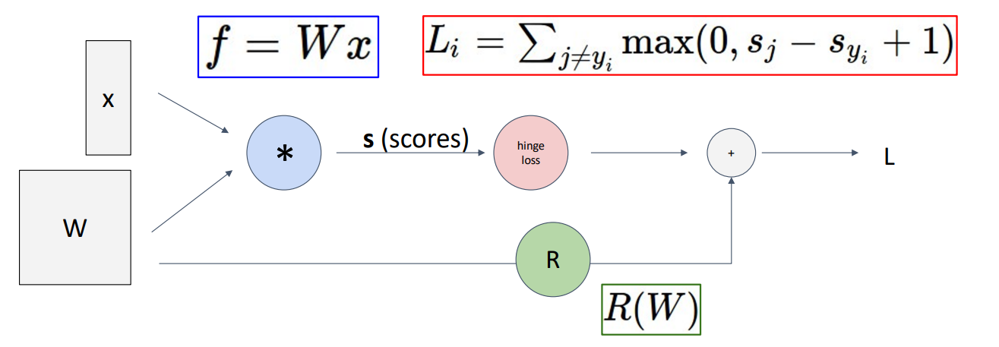

- 왼쪽에서 오른쪽으로 가며 계산을 진행
- 초록색 Node는 Regularization term

`Computational Graph`는 모델이 복잡해질수록 유용하다.
- `Neural Turing Machine`이나 `AlexNet` 등의 Graph를 보면 (1)의 방법으로 직접 계산하긴 힘들다.

### Simple Example

아래 상황을 생각해보자. $q$와 $f$는 출력값이다.

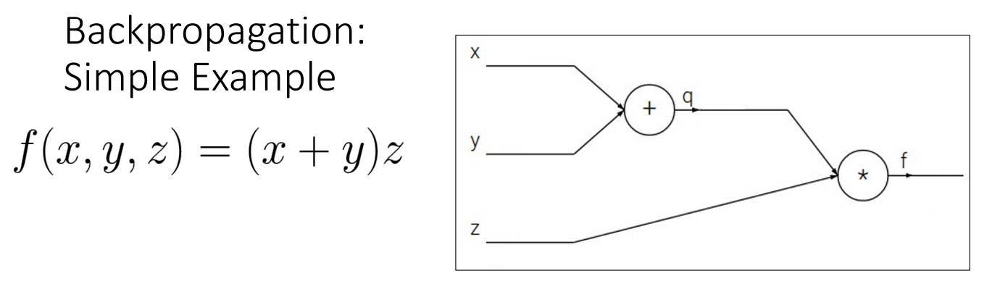

전체 $x, y, z$의 공간 중, **$x$ = -2, $y$ = 5, $z$ = -4**인 점에 대해 살펴보자.

먼저, `Forward pass`를 계산해보자. **입력으로부터 출력을 계산하는 단계이다.**

더하는 단계를 $q$, 곱하는 단계를 $f$라고 할 수 있다.

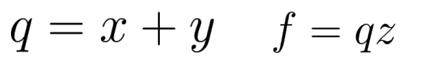

계산하면 출력은 12가 나온다.

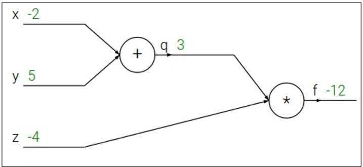

다음으로 `Backward pass`에 대해 알아보자. **출력(loss)에 대한 각 입력의 미분값(gradient)을 계산하는 단계이다.**
- `Backpropagation`이라는 알고리즘을 사용한다.

`Backward pass`의 목표는 아래와 같다.

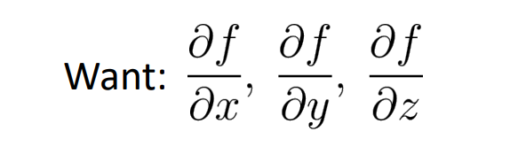

가장 먼저 $\partial{f} / \partial{f}$를 구해보자. 값은 1이다.

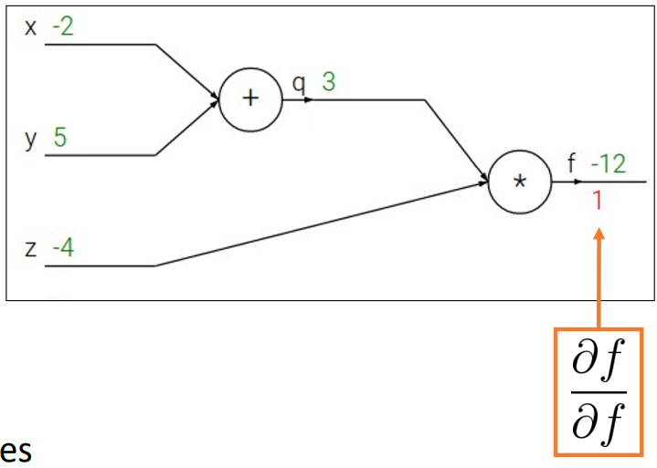

- $\partial{f} / \partial{f}$를 `Base case`라고 부른다.

다음으로 $\partial{f} / \partial{z}$를 구해보자. 값은 3이다.


다음으로 $\partial{f} / \partial{y}$를 구해보자. 값은 -4이다.

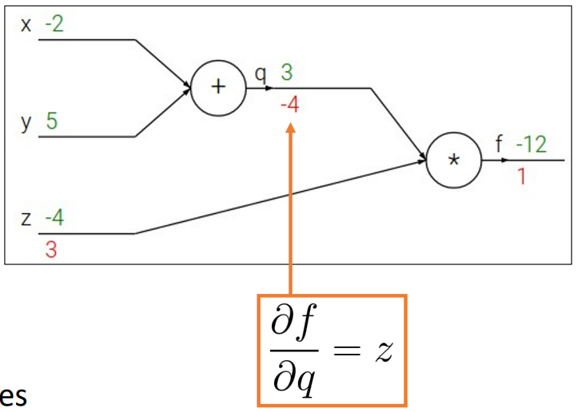

다음으로 $\partial{f} / \partial{y}$를 구해보자. 값은 -4이다.

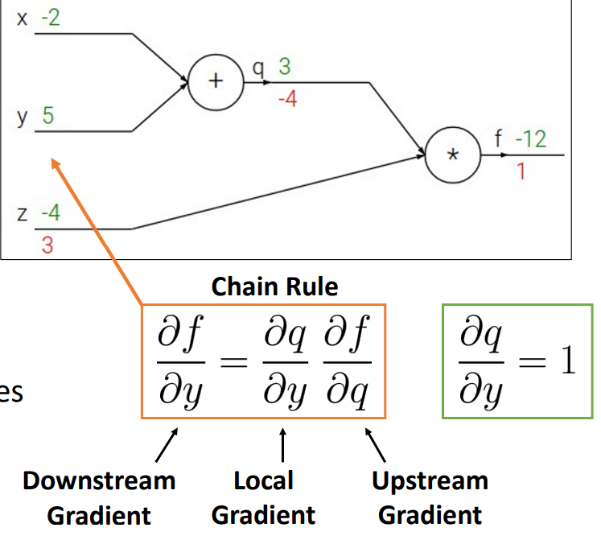

- 여기서 미적분학의 `chain rule`을 이용해야 한다.
  
- $y$와 $f$가 직접 연결되어 있지 않으므로, $y$가 바뀌면 $q$에 영향이 가고 $q$가 바뀌면 $f$에 영향이 가는 것을 이용한다.

- `Downstream Gradient`: 현재 계산되어 다음 (하위) 단계로 넘어가는 Gradient

- `Local Gradient`: 현재 Node의 입력이 출력에 어떤 영향을 미치는지 나타내는 Gradient

- `Upstream Gradient`: 현재 Node에서의 출력이 최종 출력 (Loss)에 어떤 영향을 미치는지 나타내는 Gradient


다음으로 $\partial{f} / \partial{y}$를 구해보자. 값은 -4이다.

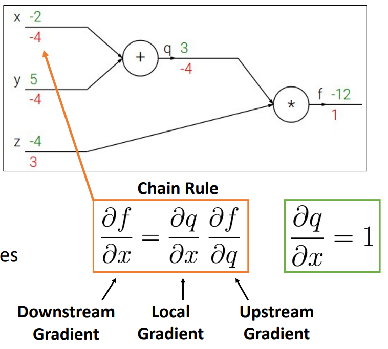

- $\partial{f} / \partial{x}$와 동일하다.

더욱 구체적으로 살펴보기 위해 Node 하나를 확대해서 살펴보자.
여기서 $f$는 함수이고, $z = f(x, y)$ 이다.

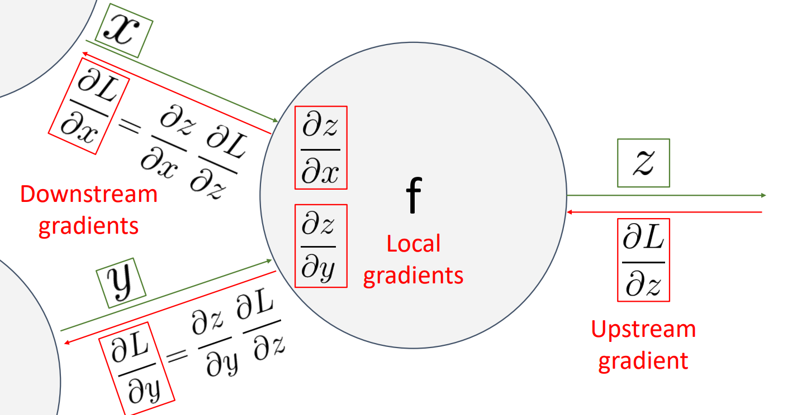

- `Backpropagation`이 시작되면 출력에서부터 계산된 `Upstream Gradient`가 넘어온다.

- 한 Node에서 `Local output`에 대한 `Local input`의 Gradient를 계산하면 `Local Gradient`가 나온다.

- `Upstream Gradient`와 `Local Gradient`를 곱하면 `Downstream Gradient`가 생성되고, 다음 Node에 `Downstream Gradient`를 넘겨준다.

### Another Example

> **이 예시에서는 forward / Backward의 과정보다 Computational Graph의 특징 위주로 알아보자.**

`Loss function`으로 `Sigmoid function`을 사용하고

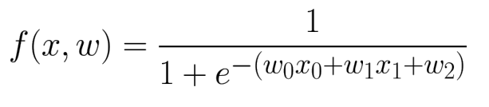

아래 구조의 `Computational graph`를 가진 경우를 생각해보자.

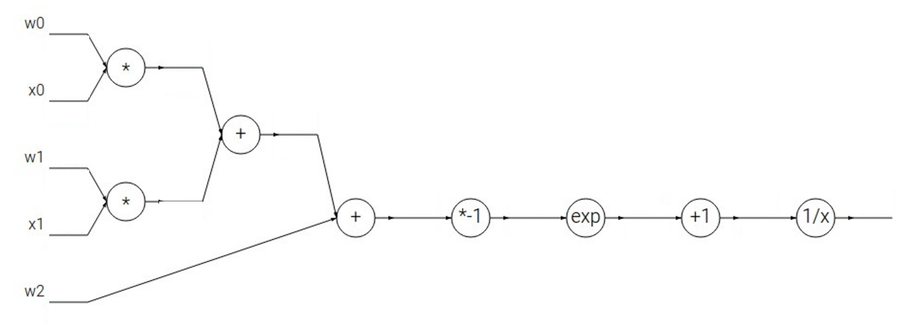

`Forward pass`를 끝내면 아래와 같아진다.

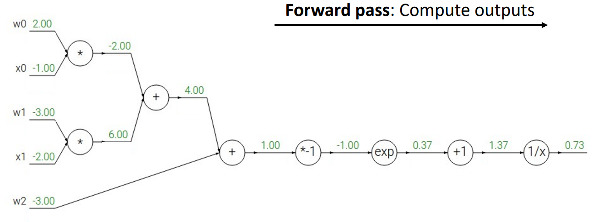

`Backward pass`를 끝내면 아래와 같아진다.

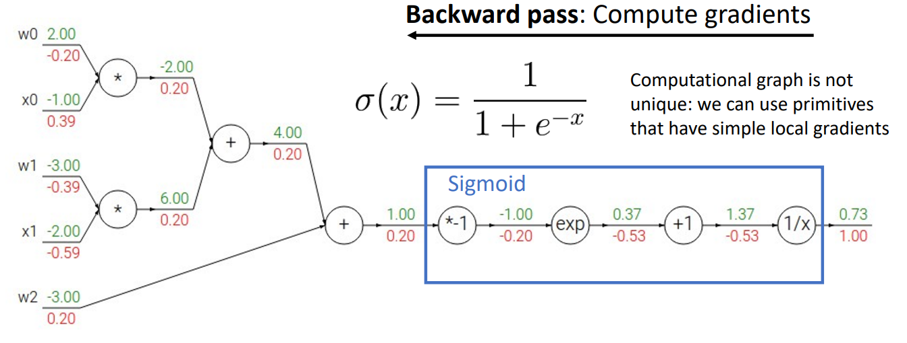

`Backward pass`까지 끝낸 상태를 보면 **중요한 특징**을 확인할 수 있다.

- `Computational graph`는 **Graph 설계자에 따라 다른 형태를 가질 수 있으며** 이 예시에서는 **파란색 박스가 쳐진 4개의 부분을 하나의 sigmoid node로 대체**할 수 있다.

- 기존의 형태는 사칙연산과 같은 **Primitive operation**으로 이루어져 있었지만, **`Sigmoid`와 같이 미분 (Local Gradient) 결과가 간단한 형태인 것을 사용하면 더 효율적일 수 있다.**

실제로 `Sigmoid function`의 미분은 아래와 같이 간단하게 나타난다.

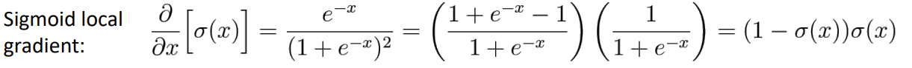

이를 이용해 위 예시에서 Gradient를 다시 계산해보면 4개의 Node에 걸쳤던 계산을 한 번에 수행할 수 있는 것을 확인할 수 있다.

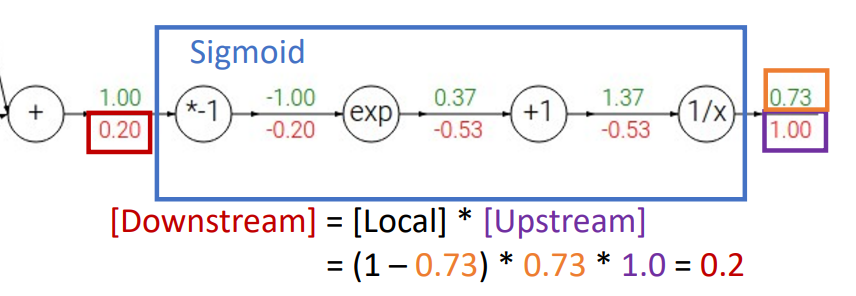

결론적으로, **우리는 `Computational Graph`를 의미있고 효율적으로 만들기 위해 더 많은 작업**을 해야 한다.


## Patterns in Gradient Flow

> **Backward pass를 진행하는 과정에서 특정 패턴을 발견할 수 있다. 이 패턴은 Backward pass 과정을 직관적으로 이해하기 위한 도움을 준다.**

`Add gate`

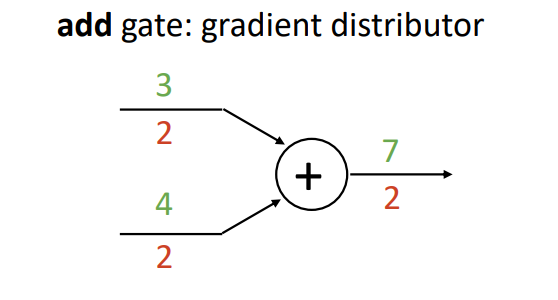

- `Downstream gradient`에 `Upstream gradient`를 복사

- 2X + y는 2*X + y의 두 개의 Node로 분리되기 때문에 `add gate` 자체는 위와 같이 동작한다.

`Copy gate`

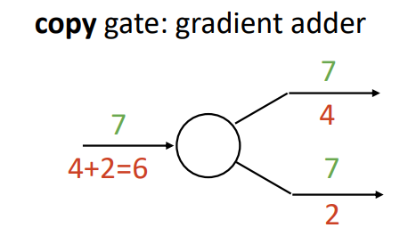

- 하나의 입력을 받아 두 개의 출력으로 복사

- 모델의 한 Term을 여러 곳에서 사용하고자 할 때 사용
    
    - Weight를 모델의 Score 계산과 Regularization에 사용하는 등

- 두 개의 출력에서 받은 `Upstream gradient`는 다를 수 있지만, **`Downstream gradient`는 두 개의 `Upstream gradient`를 더한 값이다.**

- 하나의 입력이 두 개의 출력에 영향을 미치기 때문에 두 Gradient를 
더한다고 생각하면 된다.
  
`Mul gate`

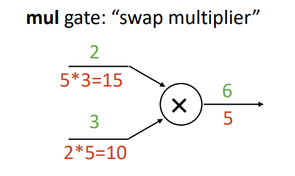

- `Downstream gradient`는 하나의 `Upstream gradient`에 자신과 곱해지는 다른 입력의 값을 곱한 값이다.

- 곱셈의 미분을 생각하면 명확하다.

`Max gate` 

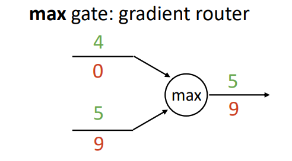

- `Downstream Gradient`는 두 입력 중 더 큰 값인 곳에 `Upstream gradient`가 전달되고, 더 작은 값에는 0이 전달된다.

- 때문에 더 작은 값을 갖는 쪽의 Gradient는 전부 0이 된다.
  
  -  Gradient Flow가 이상적이지 않게 된다.


# Backpropagation Implement (Code)

두 가지 방법이 있다.

## 1. "Flat" gradient code

> **파이썬 함수 하나로 모든 Backpropagation 계산 과정을 하나씩 구현하는 것**

- 수학적으로 계산을 하지 않고, **패턴 및 전송 단계에 대해서만 생각한다.**
- Assignment 2에서 이 방법을 사용한다.

`Example`

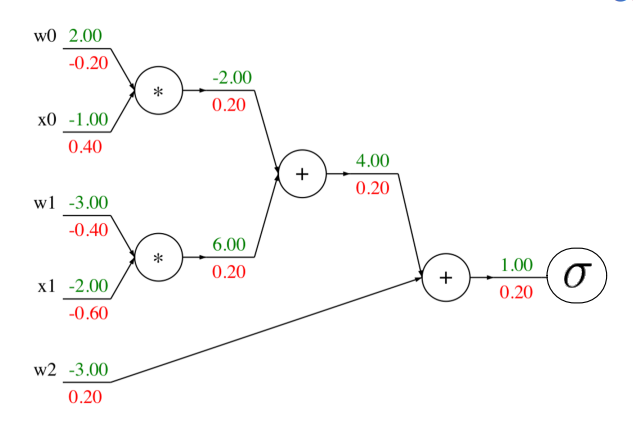

위 `Computational graph`에 대해서 `Forward pass`와 `Backward pass`을 진행하는 아래의 코드를 작성할 수 있다.

```python

def f(w0, x0, w1, x1, w2):
    # Forward pass
    s0 = w0 * x0
    s1 = w1 * x1
    s2 = s0 + s1
    s3 = s2 + w2
    L = sigmoid(s3)

    # Backward pass
    grad_L = 1.0 # Base

    grad_s3 = grad_L * (1 - L) * L # sigmoid

    grad_w2 = grad_s3 # add gate
    grad_s2 = grad_s3 # add gate

    grad_s0 = grad_s2 # add gate
    grad_s1 = grad_s2 # add gate

    grad_w1 = grad_s1 * x1 # mul gate
    grad_x1 = grad_s1 * w1 # mul gate

    grad_w0 = grad_s0 * x0 # mul gate
    grad_x0 = grad_s0 * w0 # mul gate

```

## 2. Modular API

> **Computational graph에서 forward, backward 과정을 진행하기 위해 모듈화하여 구현할 수 있다.**

일반적인 `Computational Graph`에서 동작하는 `Pseudo code`를 아래와 같이 작성해볼 수 있다.

```python
class Computational_graph(object):
    # ...
    def forward(inputs):
        # 1. [pass imputs to input gate]
        # 2. forward the computational graph
        for gate in self.graph.nodes_topologically_sorted():
            gate.forward()
        return loss
    
    def backward():
        for gate in self.graph.nodes_topologically_sorted():
            gate.backward()
        return inputs_gradients
```

실제 사용하는 `pytorch Autograd Function`에 대해 살펴보자.

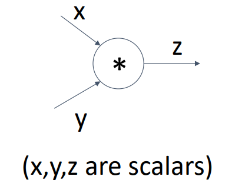

위 구조의 Computational graph에 대해 동작하는 class를 직접 구현할 수 있다.

**`pytorch`의 `autograd.Function`을 상속하여 하위 Class로 내가 가진 `Computational graph`에 대해 동작하는 API를 구현할 수 있다.**

```python
class Multiply(torch.autograd.Function):
    @staticmethod
    def forward(ctx, x, y):
        # Backward에서 사용하기 위해 x, y를 저장
        ctx.save_fot_backward(x, y)
        z = x * y
        return z
    
    @staticmethod
    def backward(ctx, grad_z):
        # forward에 저장한 x, y를 가져옴
        x, y = stx.saved_tensors
        grad_x = y * grad_z
        grad_y = x * grad_z
        return grad_x, grad_y
```

대부분 `Pytorch`에 구현된 함수가 많아 그대로 이용하는 것을 추천한다.

___

지금까지 **Scalar value에 대한 Backpropagation 과정을 살펴봤다.**

**우리는 Vector에 대한 Backpropagation 과정도 알아야 할 필요가 있다.**

그에 앞서, **Vector Derivatives**에 대해 살펴보자.

# Vector Derivatives

**`Scalar` $y$를 `Vector` $x$로 미분하면?**
   
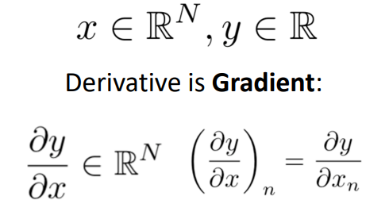

- 미분 결과는 $x$와 같은 크기의 `Vector`이며, `Gradient`라고 부른다.

- $x$의 각 Element가 출력 $y$에 어떤 영향을 미치는 지를 나타낸다. 

**`Vector` $y$를 `Vector` $x$로 미분하면?**

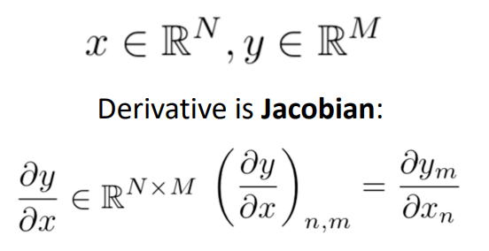

- 미분 결과는 ($x$ 크기 * $y$의 크기)의 `Matrix`이며, `Jacobian`라고 부른다.

- $x$의 각 Element가 출력 $y$의 각 Element에 어떤 영향을 미치는 지를 나타낸다. 

# Backpropagation with vectors

> **입력이 Vector 형태인 경우를 살펴보자. 전체 과정을 보는 대신, 한 Node에 대해서만 확인하고 그것을 시간 순으로 반복하자.**

아래 그림을 기준으로 보자.

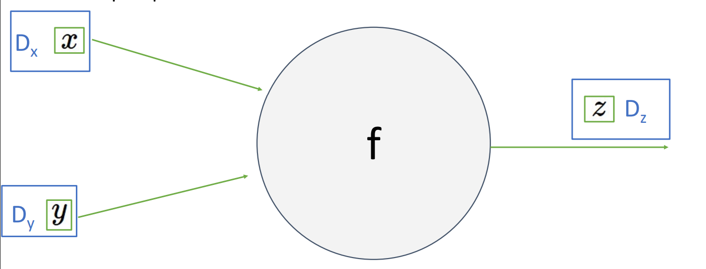

먼저 `최종 Loss`에 대한 `Gradient`를 계산할 수 있다. 여기서 `최종 Loss`는 여전히 `Scalar` 값이므로 미분 결과는 `Gradient`이다.

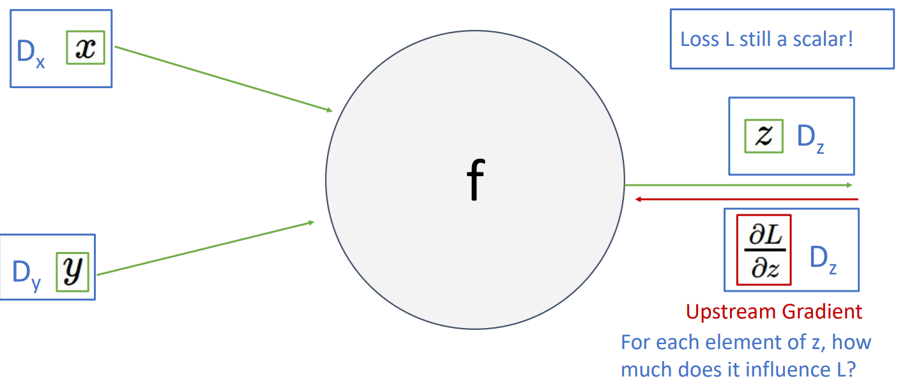

이제 Node f에 대한 `Local Jacobian matrices`를 구할 수 있다.

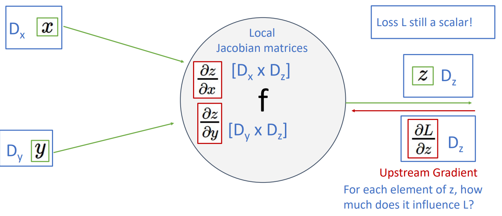

`Local Jacobian matrices`와 `Upstream Gradient`를 곱하여 `Downstream gradient`를 구할 수 있다. 여기서 `Downstream gradient`는 **Matrix * Vector의 결과로 vector 형태**이다.

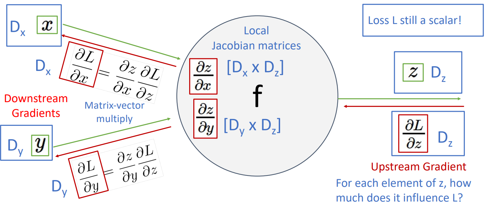

- **`Downstream gradient`의 크기가 input과 동일하다는 점을 주의해야 한다.**

### Example using ReLU function

우리가 사용할 예시는 **Element-wise (ex. ReLU) 함수를 사용**하는 경우이다.

먼저, `Forward pass` 과정부터 살펴보자.

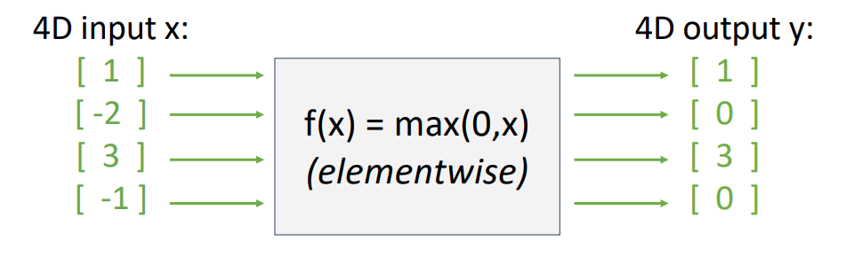

다음으로 `Backward pass` 과정을 살펴보자. 상위 단계로부터 아래와 같은 `Upstream gradient`를 얻었다고 가정하자.

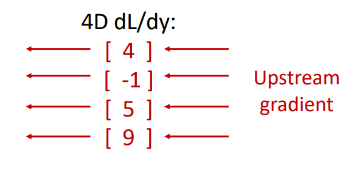

그렇다면 우리는 아래와 같은 `Jacobian matrix`를 얻을 수 있다.

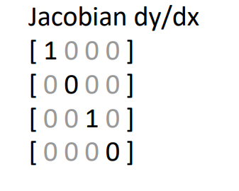

- `Element-wise function`을 사용했을 때에는 특이하게, **하나의 $x$ element가 오직 하나의 $y$ element에만 영향**을 주고, 이것이 **diagonal element만이 0이 아닌 값을 가지고 있는 형태로 나타난다.**

- `Softmax function` 등 다른 함수를 사용하면 `Jacobian`이 저 형태로 나오지 않는다.

이제 `Jacobian matrix`와 `Upstream gradient`를 곱하여 `Downstream gradient`를 얻을 수 있다.

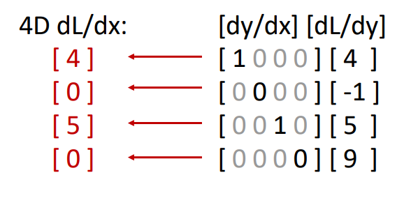

`Backward pass`의 전체 과정은 다음과 같다.

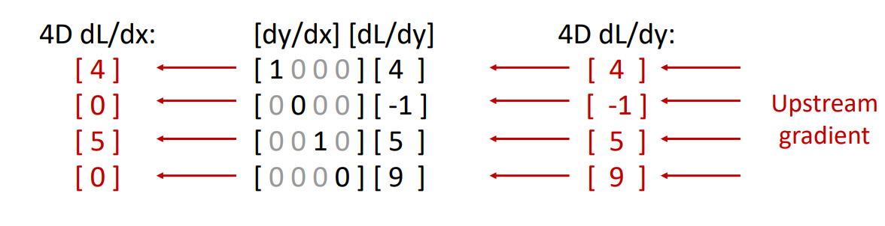

`Element-wise` 함수를 사용하는 경우, **Jacobian matrix를 Sparse**하다고 할 수 있다.
- Matrix가 Diagonal이고 대부분 0

이 경우에는 **출력의 각 Element에 해당하는 X에만 Gradient를 전달**해주면 된다.
     
`Jacobian matrix`를 명시적으로 형성하게 되면, 메모리 소모가 심해지므로 명시적으로 형성하는 경우는 거의 없다.

즉, **Matrix * Vector**의 `Explicit multiplication`은 거의 하지 않고, `Implicit multiplication`을 사용한다.

위에 예시를 예로 들면, **Matrix * Vector** 대신 아래의 수식 구조를 사용하게 된다.

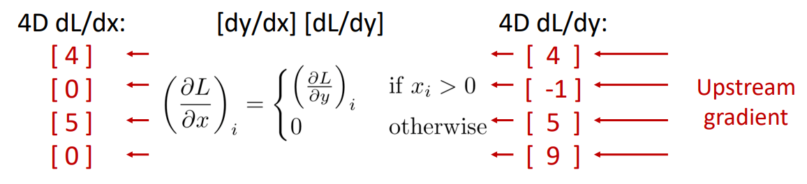

**모델이 커지고, 입출력의 차원이 커짐에 따라 더 효율적인 방법이다.**

# Backpropagation with Matrices

> **이제 입력이 Matix인 경우에 대해 살펴보자.**

`Upstream gradient`의 경우, 여전히 `Loss`는 Scalar 값이기 때문에, Scalar 값에 대한 미분은 Matrix 형태여도 `Gradient`라고 부른다.

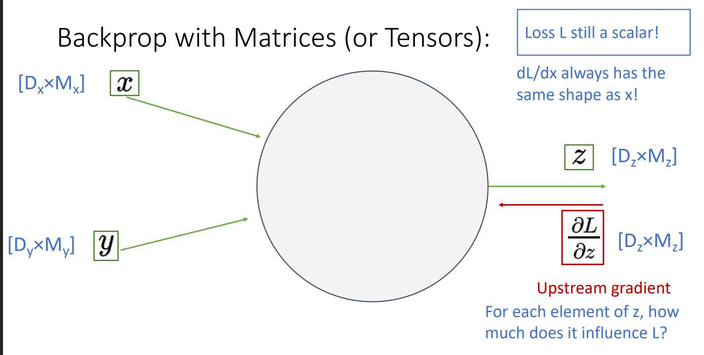

`Local Jacobian matrix`를 구해보자

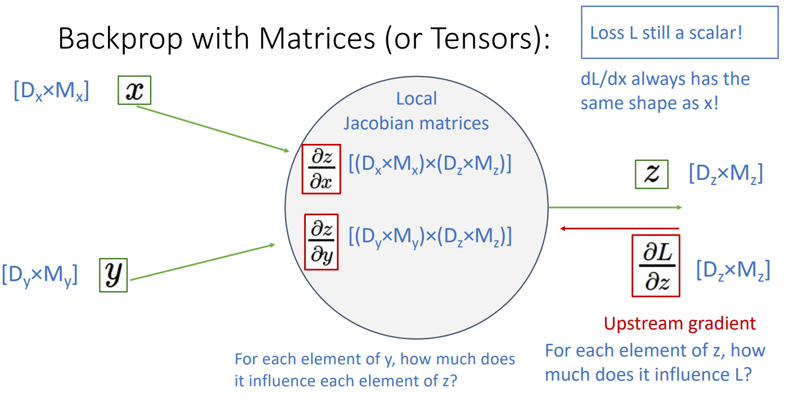

- 보통 이 과정에서 `Grouping`을 진행한다.

- $x$와 $z$를 **Flatten**하여 Jacobian matrix를 구성한다.
  
- 즉, $x$를 Flatten하면 ($D_X$ x $M_X$)의 vector가 생기고, $\partial L / \partial z$를 Flatten하면 ($D_Z$ x $M_Z$)의 Vector가 생긴다.

- 이후 Flatten한 Vector에서 Jacobian matrix를 구성하는 방식대로 만든다. 

`Downstream Gradient`

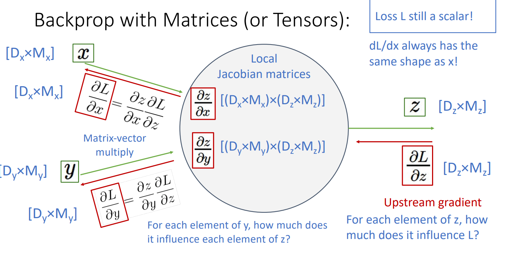

- 이 과정에서는 `Matrix Multiplication`의 비용이 너무 크기 때문에, **$z$를 Flatten하여 Matrix * Vector 연산을 진행한다.**

입력의 차원이 커지면서, 계산 과정이 매우 복잡해진다. **따라서 고차원 Tensor에 대해 생각하지 않고 계산할 수 있는 방법이 필요하다.**

### Example: Matrix Multiplication

아래 과정을 따라 `Gradient`를 계산하는 것을 생각해보자.

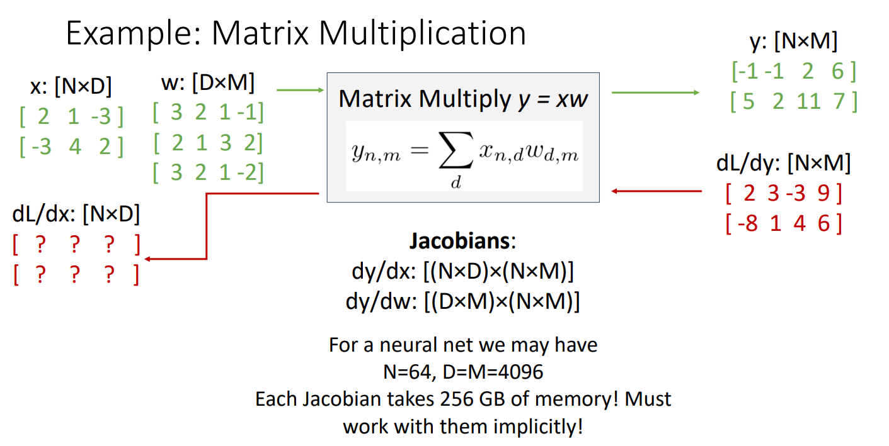

만약 우리가 `Jacobian matirx`를 직접 계산하여서 구한다면 메모리 공간을 많이 차지하게 된다.

즉, **우리는 `Jacobian matirx`를 형성하는 `Implicit`한 방법을 찾아야 한다.**

`Gradient`를 계산할 때, 전체 입력 $x, w$를 살펴보는 대신, 입력 $x, w$의 Element 하나에 대해서만 Gradient를 생각해 볼 수 있다. 이 방법은 `Local Gradient Slice`라고 부른다.

#### Local Gradient Slice

> **입력 $x$의 한 Element마다 Gradient를 구해서 `Upstream Gradient`와 Matrix * Vector 연산을 통해 `Downstream Gradient`를 하나씩 구하는 방법**

$x_{1, 1}$에 대해 `Local Gradient Slice`하는 과정을 살펴보자.

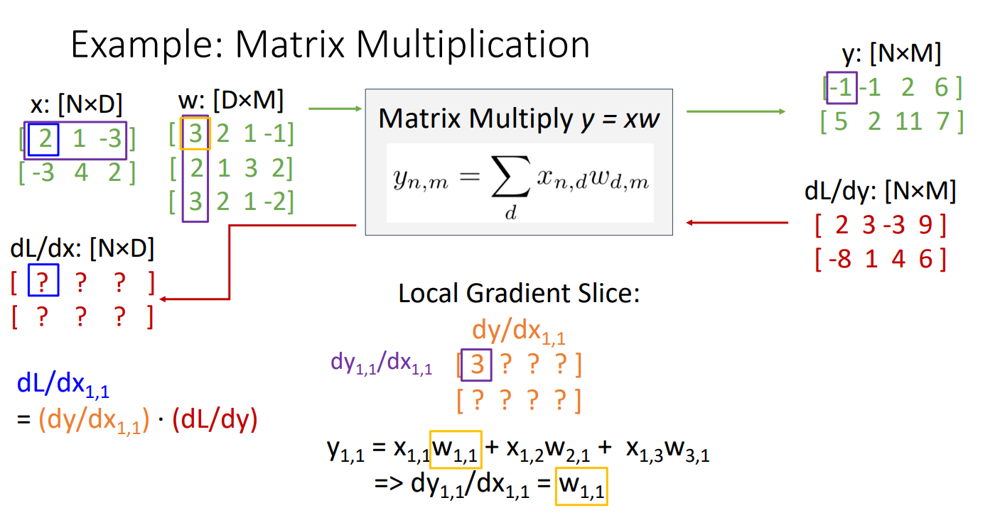
- $y_{1, 1}$을 $x_{1, 1}$에 대해 미분해서 $dy/dx_{1, 1}$의 (1, 1) 위치에 채운다.

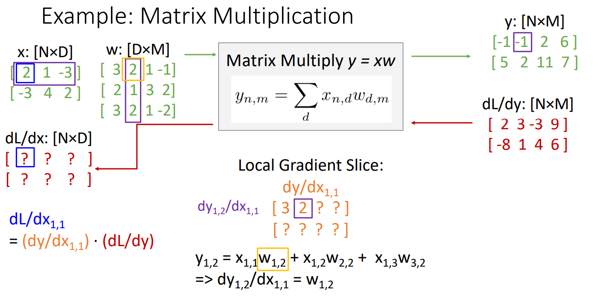

- $y_{1, 2}$을 $x_{1, 1}$에 대해 미분해서 $dy/dx_{1, 1}$의 (1, 2) 위치에 채운다.

위 과정을 반복하면 $x_{1, 1}$에 대한 `Local Gradient`는 아래와 같이 구해진다.

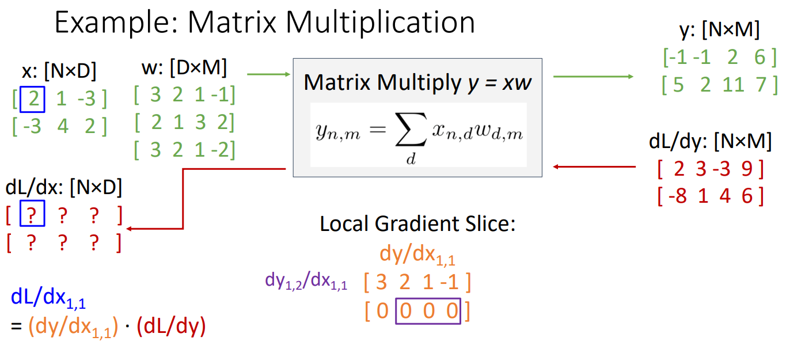

`Downstream gradient`는 $dy/dx_{1, 1}$을 $dL/dy$와 내적해서 구할 수 있다. 
$dy/dx_{1, 1}$을 $dL/dy$를 **내적**하면 `Downstream gradient`의 (1, 1) 위치가 채워지게 된다.

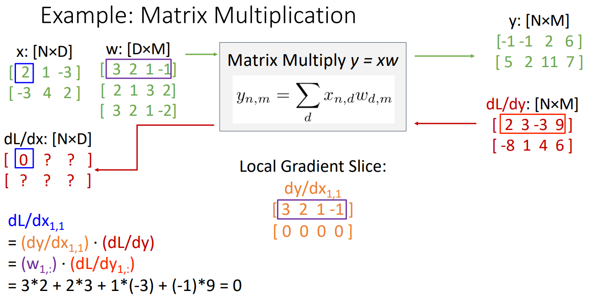
- 이 경우에서는 $y = xw$ 형태이므로 특정 $x$ Element에 대한 `Local Gradient Slice`가 $w$의 특정 행에 대응되는 것을 확인할 수 있다.

위 과정은 $x$의 다른 원소에 대해 반복해서 적용하면 전체 `Downstream Gradient`를 얻을 수 있다.

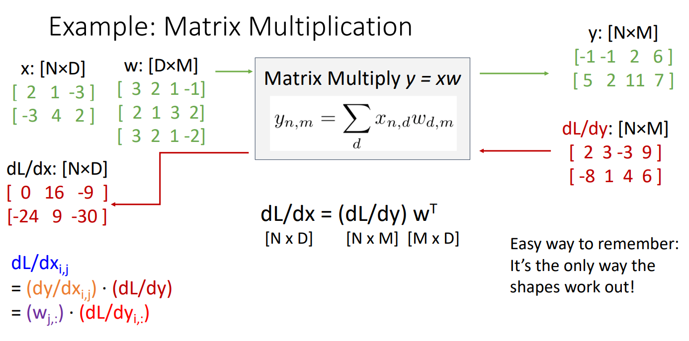
- 이 예시에서는 `Upstream Gradient`와 $w$의 Matirx Multiplication으로 나타낼 수 있다.

- $dL/dx$ 수식이 의미하는 것은 **실제 Jacobian Matrix를 형성하는 것이 아니라 `Implicit Jacobian`과 `Upstream Gradient`간의 Matrix * Vector multiplication**이다.

- `Implicit Jacobian`은 여기서 `실제 Jacobian`의 역할을 대신하는 $w$를 의미한다. 

- 또한 `Local Gradient Slice`에 의해 Element 하나씩 보면, `Upstream Gradient`와 **$W$는 Matirx * Vector multiplication의 형태를 가지는 것을 확인**할 수 있다.

$w$에 대한 `Downstream Gradient`를 구해보면 아래와 같은 수식을 얻을 수 있다.

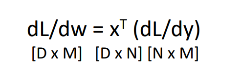

위 형태를 기억하는 가장 쉬운 방법은 `Downstream Gradient`를 구하기 위해서는 `Upstream Gradient`가 필수적으로 포함되어야 하는데, **`Upstream Gradient`로 `Downstream Gradient`의 차원을 맞추려면 하나의 방법밖에 없다는 것을 알면 된다.**


# Backpropagation: Another View

## Reverse-Mode Automatic Differentiation

> **최종 loss L이 어떻게 x에 영향을 주는지를 계산**

우리가 지금까지 본 방법은 아래 구조를 갖는다.

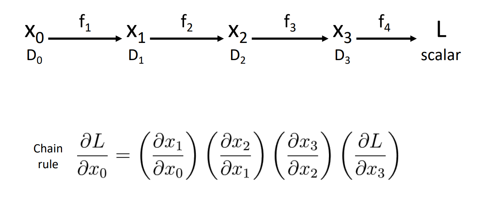

가장 중요한 것은 **Matrix multiplication은 Associative하기 때문에 왼쪽에서 오른쪽으로 계산해도 되고 오른쪽에서 왼쪽으로 계산해도 된다는 것이다.**

우리가 지금까지 본 방법은 **오른쪽에서 왼쪽으로 계산한 방법이다.**

- 이 방법을 `Reverse-Mode Automatic Differentiation`이라고 부른다.

- 이 방법은 계산 효율 측면에서 뛰어나지만, 한 가지 단점은 **최종 스칼라 값을 반드시 계산해야지 전체 동작이 가능하다는 점이다.**

- 지금까지의 작업이 아닌 다른 목적의 작업을 하고 싶은 경우에는 **최종 스칼라 값을 계산해야 된다는 점이 유용하지 않거나 비효율적일 수 있다.**

## Forward-Mode Automatic Differentiation

> **입력 a가 어떻게 Loss L에 영향을 주는지를 계산**

아래 구조를 갖는다.

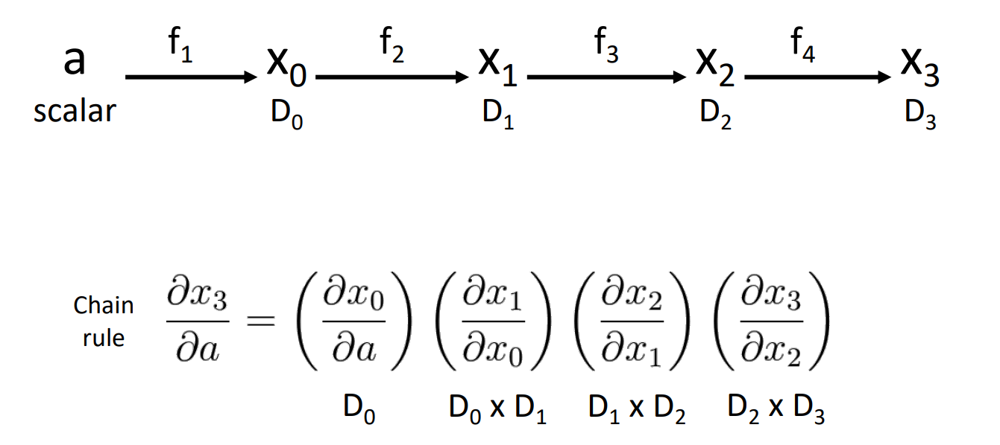

- 입력을 바꾸었을 때, 출력이 어떻게 변화를 확인한다.

`단점`은 **`pytorch`나 `tensorflow`와 같은 대규모 프레임워크가 `Forward-Mode`를 지원하지 않는다**는 점이다.

추가로, 한 번의 하나의 입력 변수만을 가지고 계산할 수 있기 때문에 **입력의 개수가 많은 경우 시간이 오래 걸린다.**

- 입력 Parameter가 많은 `Deep Learning`에서 주로 사용하지 않는 이유

## Higher-Order Derivatives

> **`Jacobian`은 1차 미분이다. `Newton's Method` 등을 이용하기 위해 2차 이상의 미분을 얻고 싶을 때 사용하는 방법이다.**

아래와 같은 `Computational Gragh`가 있다고 가정하자.

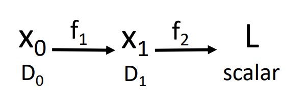

우리는 이계 도함수를 모은 행렬을 `Hessian matrix`라고 한다.

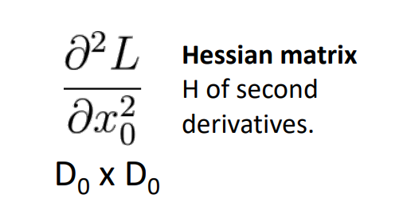

- 기울기가 얼마나 빠르게 변하는 지에 대한 **Curvature** 정보

Matrix multiplicaion은 Linear 연산이기 때문에, `Hessian Matrix` * Vector 연산은 아래와 같이 나타낼 수 있다.

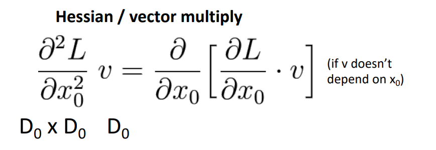

- `Jacobian`도 크고 느린데, `Hessian`은 더 많은 정보를 담은 행렬이라 더욱 메모리 부담이 크다.

- 따라서 **explicit Hessian matrix를 구하지 않고, Hessian-vector product만 효율적으로 계산**하는 방식이 주로 사용됨

아래와 같은 방법을 통해 `Hessian matrix`를 직접 구하지 않고, 효율적으로 계산할 수 있다. 이를 위해, 이전과 동일하게 `forward pass`를 진행 후에 `Backpropagation`을 진행할 수 있다.

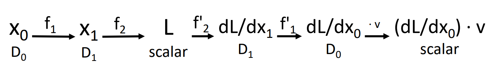
- 결과로 vector를 얻고 특정 방향의 **Curvature** 정보만을 알고싶다면 해당 방향의 정보를 담은 vector $v$를 내적한다.

- 그 결과 Scalar 값을 얻을 수 있다.

이후 결과로 나온 $dL/dx_0 \cdot v$의 scalar 값에 대해 `Backpropagation`을 다시 진행하자.

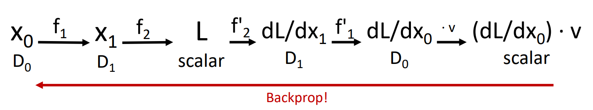

결과적으로 $x_0$에 대한 `Hessian matrix`를 얻을 수 있다.

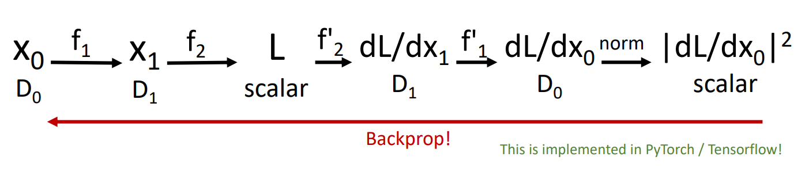

이 방법은 `pytorch`나 `tensorflow`에도 구현되어져 있다.

### Example

우리가 흔히 사용하는 `L2 Regularization Term`을 미분하면 `Hessian matrix`를 얻을 수 있다.

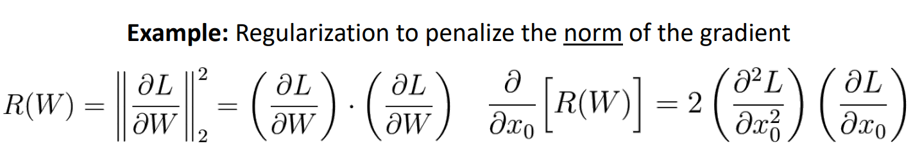
- $W$ = $x_0$ 인 경우