# 07. Convolution Networks

**`강의 영상`**                      

https://www.youtube.com/watch?v=qcSEP17uKKY&list=PL5-TkQAfAZFbzxjBHtzdVCWE0Zbhomg7r&index=7

**`강의 자료`**

https://web.eecs.umich.edu/~justincj/slides/eecs498/498_FA2019_lecture07.pdf

___

`Fully-connected Neural Network`는 다양한 함수들을 표현할 수 있지만, **입력 이미지의 2차원 `Spatial structure`를 고려하지 않는다는 문제점**이 있다.

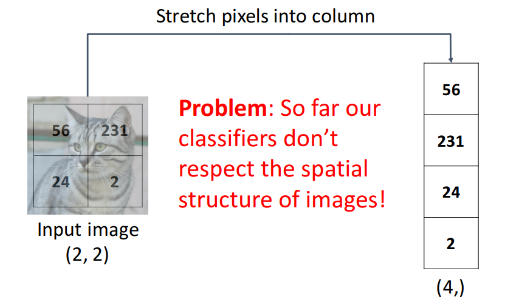

- 지금까지는 2차원 이미지 배열을 **Flatten**하여 사용해서, `Spatial structure`가 제대로 보존되지 않았다.

이 문제점을 **`Spatial Structure`를 보존하는 연산자나 모델**을 새로 정의하여 해결할 수 있다.

# Convolution Network

`Fully-connected linear classifier`에서 사용하는 2개의 Element에 더하여 **아래 3개의 Element가 추가적으로 필요**하다.

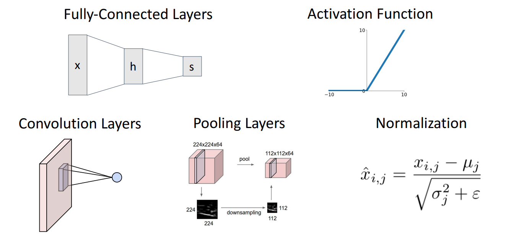

`Convolution Network`를 구성하는 3개의 Element를 순서대로 살펴보자.

# 1. Convolution Layers

> **이미지 배열의 2차원 Spatial sturcture을 보존할 수 있도록 한다.**

우선, `Fully-connected layer`가 vector를 입력받았던 것과 다르게 **3차원 Tensor를 입력**으로 받는다.

입력이 3차원 Tensor이기 때문에, **`Weight` 역시 3차원 Tensor의 형태**를 가진다.
- **단, 반드시 `Input`의 `Depth`와 `Weight`의 `Depth`는 동일해야 한다.**

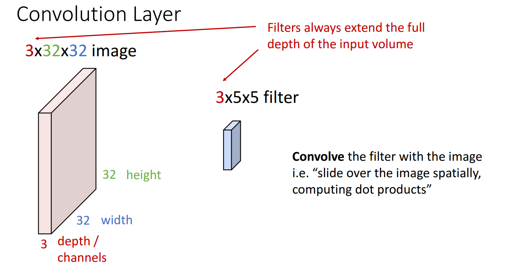

이후, **입력 이미지에서 `Weight = Filter`에 맞는 크기만큼의 `Chunk`에 대해 `Inner Product`를 실행하고 `Bias`를 더한다.**
- 이 결과, Scalar 값이 결과로 나온다.

- 이 계산 결과는 **입력 Tensor의 각 Element가 대응되는 `Filter`의 각 Element와 얼마나 일치**하는지에 대한 정보이다.

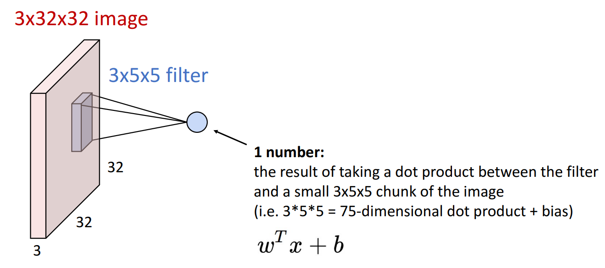

같은 `Filter`에 대해 입력 이미지에서 `Filter`를 놓을 수 있는 모든 가능한 공간에 대해 적용하고 대응되는 위치에 저장하면  `Activation map`이 나온다.

- `Activation map`이라고 부르는 이유는 **각 Element가 입력의 각 부분이 `Filter`에 얼마나 많은 응답**을 하는지 보여주기 때문이다.

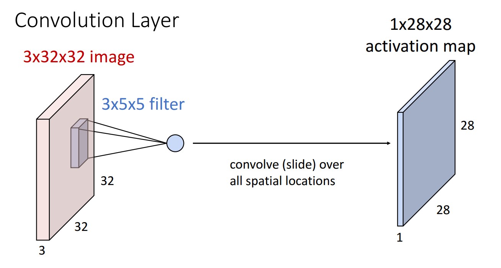

정확히 동일한 동작을 다른 값을 가진 `Weight`에 대해 적용할 수 있다.

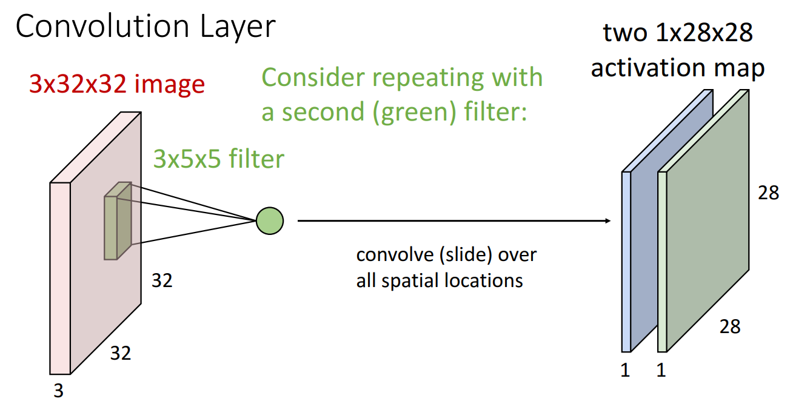

6개의 `Filter`의 대해 적용하는 `Convolution Layer`가 있다고 가정하면 아래와 같은 결과를 얻을 수 있다.
- 6개의 `Activation map`을 얻을 수 있으며 이를 모두 연결하면 **6 * 28 * 28 크기**의 결과를 얻을 수 있다.

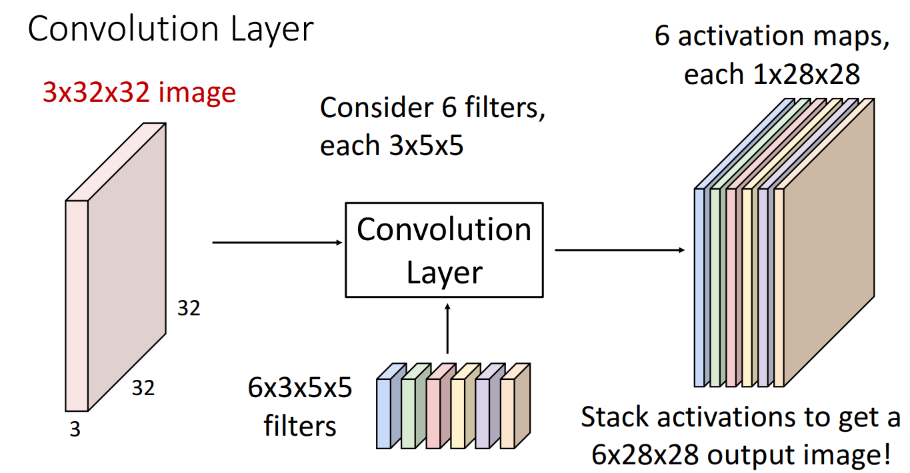

또한 각 `Filter`마다 각각의 `Bias term`을 가질 수 있다.
`Bias term`까지 적용한 결과는 아래와 같다.
- 이때, 한 차원의 `Bias`는 28 * 28 grid에 **전부 같은 값이 더해지도록** 한다.

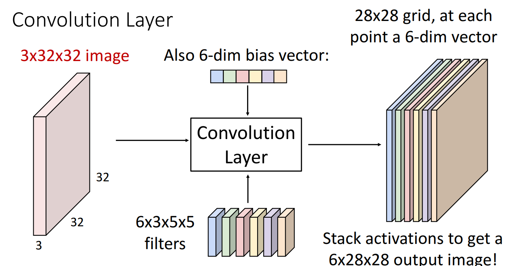

결과로 나온 `Activation map`에 대해 **두 가지 설명**을 할 수 있다.

1. 출력을 **6 * 28 * 28 ($d * i * j$)**로 보면 **($i, j$) 위치는 6-dim vector**로 생각할 수 있다.

    - 이를 `Grid of feature vector`라고 한다.
    - 출력을 **입력 공간 (28 * 28)과 동일한 공간**으로 생각하는 관점이다.

2. 결과로 나온 **6-dim에 대해 각 차원마다 28 * 28 grid**를 가지고 있는 것으로 생각할 수 있다.

    - 이 관점은 `Stack of 2D feature maps`이라고 한다.
    - 입력 이미지의 **한 부분이 `Filter`에 대응되는 정도**를 나타낸다.

마지막으로, 일반적으로 하나의 이미지만을 가지고 `Convolution Latey`를 사용하지 않고 `Batch size`만큼의 여러 이미지를 이용한다. 

- 입력의 맨 앞에 `Batch size`라는 dimension을 추가하고, **4차원 Tensor처럼 다룰 수 있다.**

- 이 경우 각 이미지에 대한 6개의 `Activation` 맵이 `Batch size`만큼 나온다.

- 즉, 총 `Output size` * `Batch size`만큼의 `Activation map`이 생긴다.

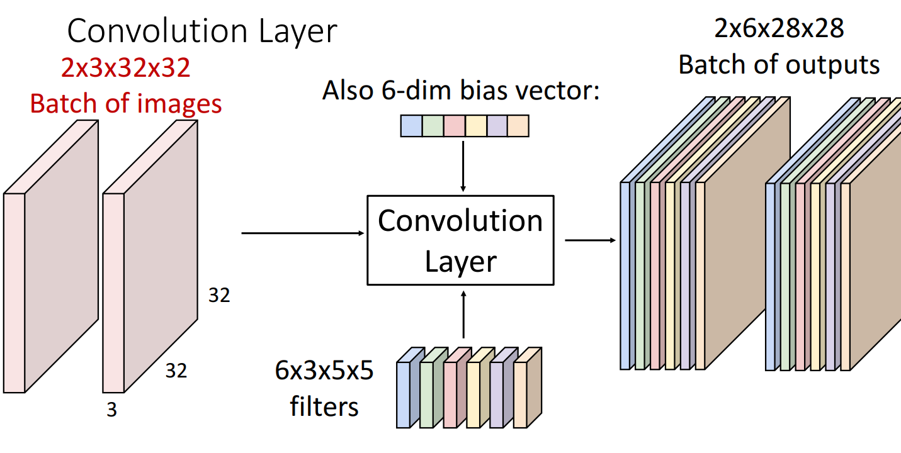

Batch까지 사용하는 것을 포함하여, 전체 `Convolution Layer`의 과정을 일반화하면 아래와 같다.
- $N$: Batch size
- $C_{in}$" Input size
- $C_{out}$: Output size
- $H$: Input iamge row size 
- $W$: Input image col size
- $K_w$: Filter col size
- $K_h$: Filter row size

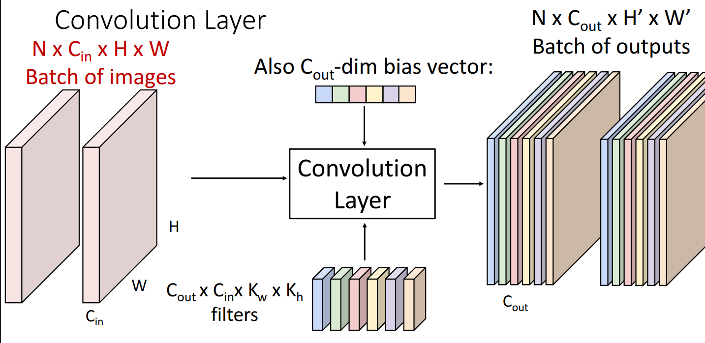

## Stacking Convolutions

> **Input Image에 대해 하나의 `Convolution layer`만 적용하는 것이 아니라 여러 `Convolution Layer`를 적용할 수 있다.**

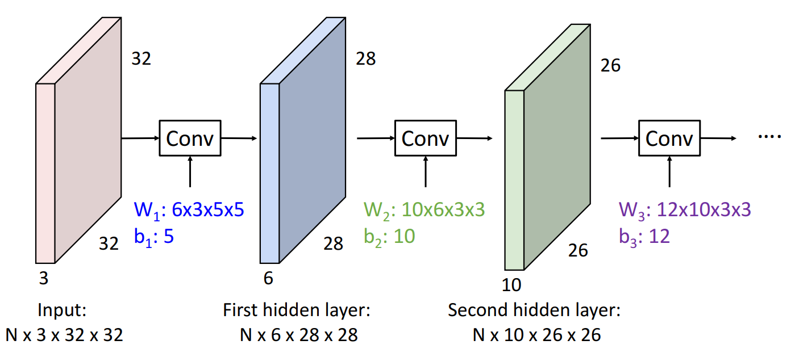

- 이전 `Convolution Layer`의 결과에 따라 다음 Layer에서 사용하는 `Layer`의 `Depth`가 다른 것을 확인할 수 있다.

- $b_1$은 오타로, 6이 되어야 한다.

- `Fully-connected layer`와 동일하게 중간에 숨겨진 부분은 `Hidden Layer`라고 부른다.

위 상황에서는 단순히 `Weight`를 이전 `Layer`에서 얻은 결과에 대해 `Convolution` 연산만 하고 있다.

이 상황처럼 **단순히 `Stacking`하면 `Convolution` 결과에 대해 또 다른 `Convolution`을 실행**한 것과 동일하다. 

`Convolution` 역시 **Linear operation**이기 때문에, 단순히 **`Stacking`만 하는 것**은 `Fully-connected layer`와 마찬가지로 **하나의 `Convolution Layer`를 사용하는 것과 동일**하다.

- `Fullt-connected layer`에서 `Activation function` 없이 단순히 `Stacking`만 하는 것은 다른 큰 `Weight`를 가진 하나의 `Fully-connected layer`를 사용하는 것과 동일하다.

해결하는 방법 역시 `Fully-connected layer`와 동일하다. `Layer` 사이에 **`ReLU`와 같은 `Activation function`을 사용하면 된다.**

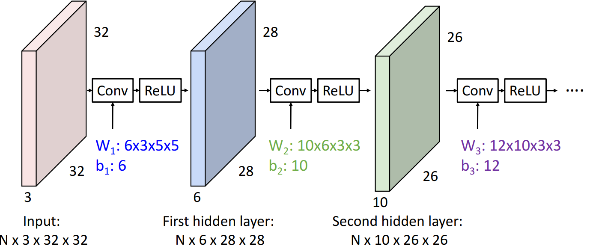

## What do Convolution filters learn?

> **`Fully-connected layer`와 동일하게, `Convolution Layer`도 `Weight`를 시각화해서 Model이 어떤 것을 학습하는지 알아볼 수 있다.**

그 중, **첫 번째 Layer에서 사용되는 Weight**를 시각화해보자.

아래 예시는 `Convolution Neural Network`의 `AlexNet`이라는 모델의 첫 번째 `Weight`를 시각화한 것이다.

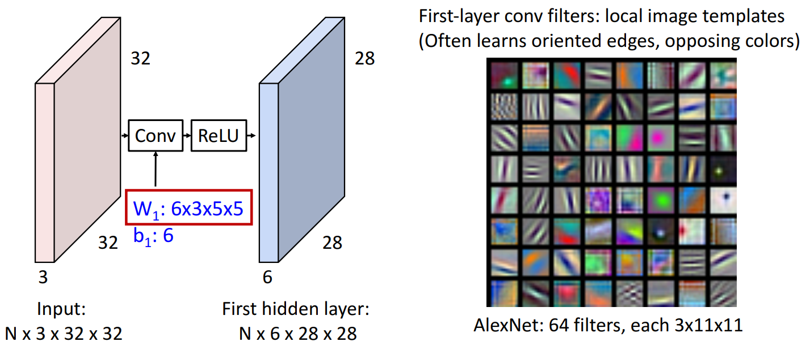

- 첫 번쨰 `filter`는 대부분 **방향성을 가진 edge**나 `색상 대비가 일어나는 부분`으로 이루어져 있다.

- `Grid of feature vector` 관점에서 보면, `Activation map`의 공간에서 특정 위치 ($i, j$)에 대응되는 Vector는 **각 filter에 이미지의 부분이 반응하는 정도**를 저장하고 있다.

## A closer look at spatial dimensions

입력 이미지에서 Filter를 한 칸씩 이동하면 `Activation map`의 크기가 어떻게 될 지 살펴보자.

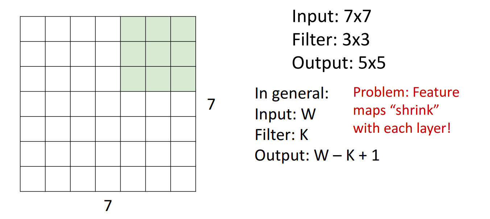

일반적으로는 `input`: $W$ x $W$, `filter`: $K$ x $K$ 일 때, `output`은 ($W - K + 1$) x ($W - K + 1$) 이다.

하지만 이 경우 문제점이 있다. 

**한 Layer를 통과할 때마다, 한 행당 $K-1$ 개의 Pixel이 없어지게 된다.**

- 결국, 이 경우에는 **Input size에 의해 Network의 깊이가 제한**될 수 있다.

해결책은 `Padding`이라는 방법이다.

### Padding

`Input image`의 **size가 Layer를 통과할수록 너무 작아**지는 것을 방지하기 위해, **`Convolution` 연산 하기 전 `Input image`에 몇 개의 Pixel을 추가하는 방법**

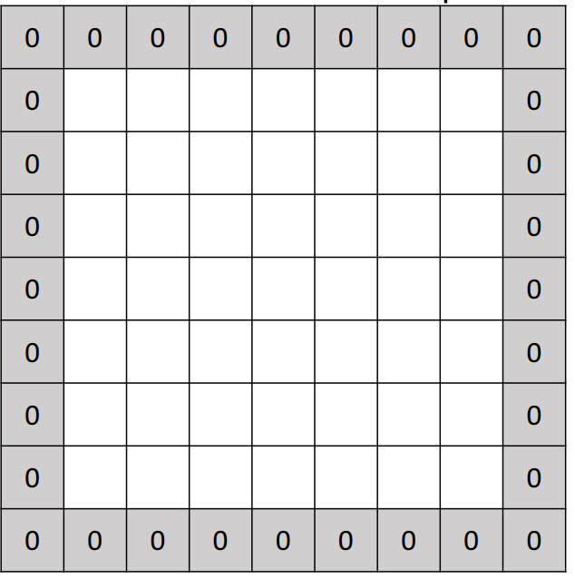

- `Padding`의 종류가 여러 가지 있지만, 여기서 사용한 방법은 `Zero padding`이다.

`Padding`은 $P$라는 `Hyperparameter`를 새롭게 추가해야 한다.
- $P$는 **한쪽 변에 추가할 Pixel의 개수**를 의미한다.

가장 많이 사용하는 $P$ = $K - 1$이다.
- 이 방법은 `Same padding`이라고 부른다.

- `Layer`를 통과해도 입력 이미지의 크기가 고정되어 `Layer`가 거듭되도 size 추론이 쉽기 때문이다.

`Padding`까지 사용한다면, 필요한 `Hyperparameter`는 아래와 같다.

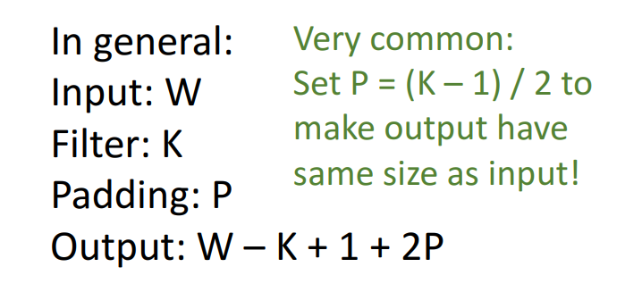

## Receptive Fields

> **Output tensor가 Input Tensor의 어느 부분을 참조하는지를 나타낸다.**

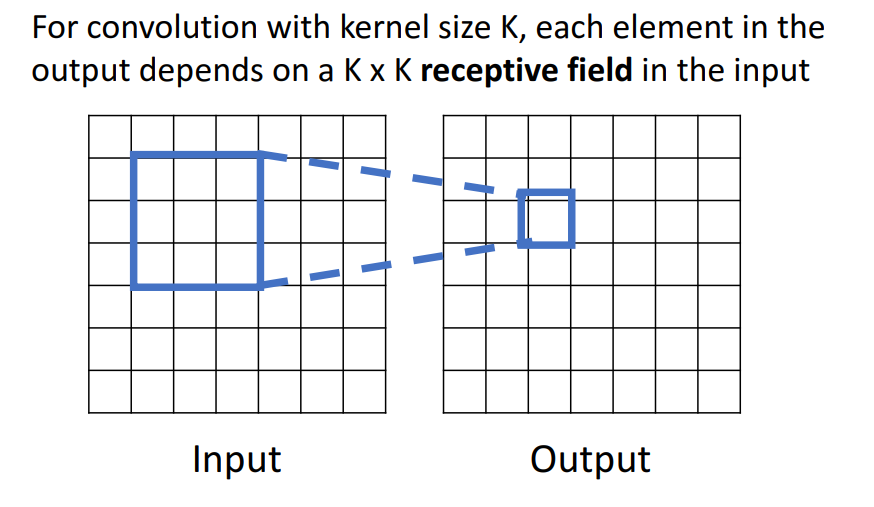

- 여기서 $K$는 kernel의 한 dimension의 크기를 의미한다.

- 직전 Layer에 대한 `Receptive field` 즉, `Receptive Field in the previous layer`는 직전 `Filter`의 크기이다.

`Receptive Field`는 하나의 Layer에 대해서가 아니라 여러 Layer에 대해서도 나타낼 수 있다.

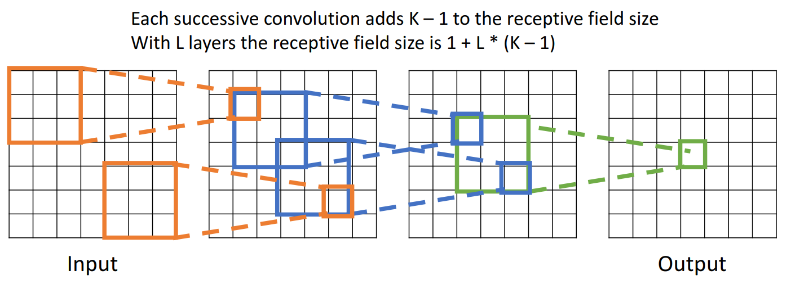
  
- $L$이 Layer의 개수라고 할 때, **현재 시점으로부터 $L$번째 Layer 뒤에 있는 `Receptive field`의 크기**는 $1 + L * (K-1)$ 이다.

- `Receptive field in the input image`는 **해당 뉴런이 `Input image`에서 몇 개의 Pixel을 보고있는지**를 의미한다.

하지만, 여기서 문제점이 있다.

만약, `Input image`가 엄청 나게 큰 경우, **하나의 뉴런이 `input image`의 전체 영역에 대한 정보를 담고있으려면 굉장히 많은 `Layer`가 필요하다.**

큰 `Receptive Field`를 얻기 위해서도 많은 `Layer`가 필요하다.

해결법은 `Stride`라는 `Hyperparameter`를 추가하여 `Input image` 또는 `Convolution layer output`을 `Downsampling` 하는 것이다.

## Strided Convolution

> **이전까지 배웠던 `Convolution Layer`는 `Stride = 1`인 `Convolution Layer`이다. 1보다 큰 `Stride`를 갖는 `Convolution Layer`를 `Strided Convolution Layer`라고 한다.**

`Stride = 2`인 경우를 살펴보자.

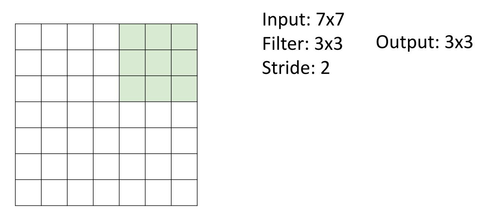

- `Stride`만 바뀌었는데 `Output size`가 줄어든 것을 확인할 수 있다.

- `Output size`가 줄어들기 때문에 `Downsampling`이라고 한다.

- `Receptive field`를 구해보면, **기존에 비해 2배 커진 것**을 확인할 수 있다. 

`Hyperparameter`에 `Stride` 크기를 의미하는 $S$가 추가되고, `Output size`를 구하는 공식도 바뀐다.

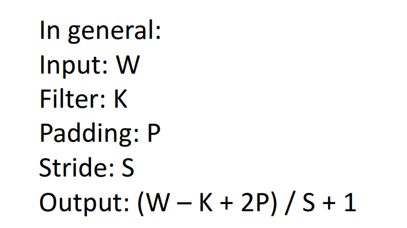

- 나누는 부분이 나누어 떨어지지 않을 때, 반올림할 수도 있고 나머지를 버릴 수도 있다.

## Example

아래와 같은 상황이 있다고 가정하자.

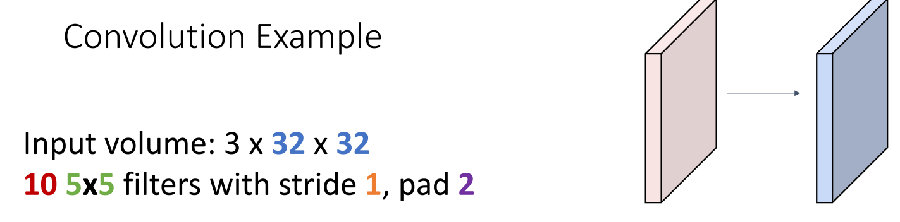

`Padding`과 `Stride`까지 고려한 `Output size` 공식을 적용하면 아래와 같이 구할 수 있다.

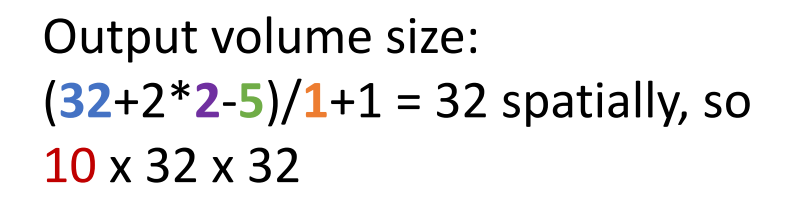

`Learnable Parameter`의 개수는 **`Filter`의 Element의 총 개수**와 동일하므로 아래와 같이 구할 수 있다. 

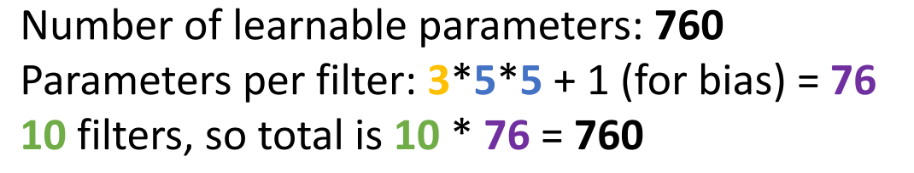

`Multiply-add Operation`은 `Input image`에서 **`Filter size`와 동일한 크기의 두 Tensor 끼리의 내적**이고, **해당 내적의 계산 횟수는 `Output size`와 동일**하므로, `Multiply-add Operation`의 개수는 아래와 같이 구할 수 있다.

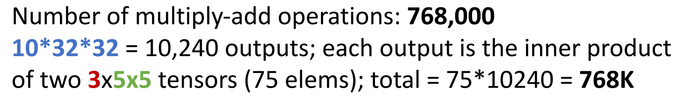

### 1 x 1 Convolution

> **`Filter`의 크기가 1 x 1 x depth인 `Convolution`**

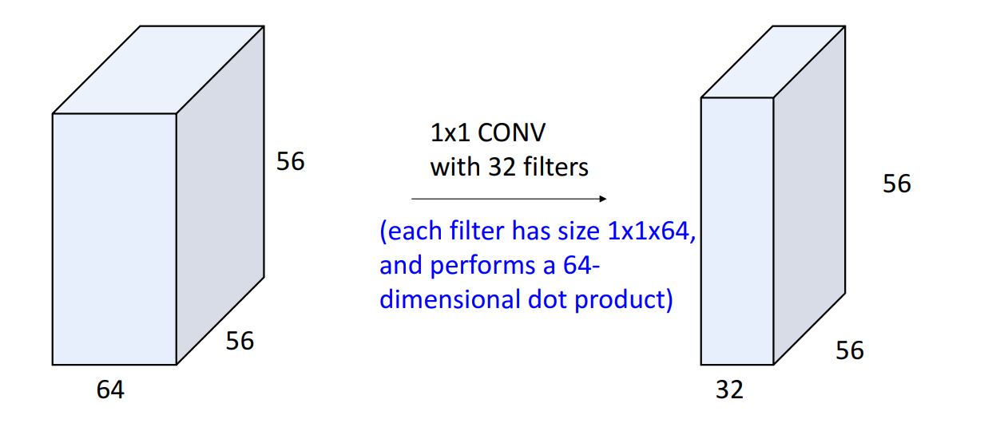

`Output`을 `grid of feature vector` 관점으로 보면, **`1 x 1 filter`는 각 `Feature vector`에 대해 독립적으로 동작한다.**

- 이 관점에서 보면, 64-dim $x$를 32-dim $x'$ 으로 바꾸는데 이는 `Fully-connected layer`와 완전히 같은 역할을 수행한다.

- 따라서, `1×1 Convolution`은`Convolution layer` 안에서 위치별로 `MLP(Fully Connected Layer)`를 적용하는 구조이기 때문에 이를 `Network in Network`라고 부른다.

`1 x 1 Convolution`은 **Feature space 축소 / 확장**, **channel간의 정보 결합**, **연산량 감소** 등의 이유로 사용된다.

#### 1 x 1 Convolution vs MLP

> **둘은 해석에 따른 차이가 존재한다.**

`1 x 1 Convolution`은 Network 내에서 `Channel Space`의 차원을 다음 Layer에 맞게 변경하는 등, **차원의 수를 변경**하기 위해 주로 사용된다.

- Network내에서 일종의 `Adapter`로 사용된다.

`MLP`는 `Vector`를 입력으로 받거나 `Flatten`하여 Vector 형태의 출력을 생성한다.

- 즉, 입력 공간 자체를 파괴한다.
- Class에 따른 Score를 생성해야 할 때 주로 사용된다.

## Summary of 2D convolution

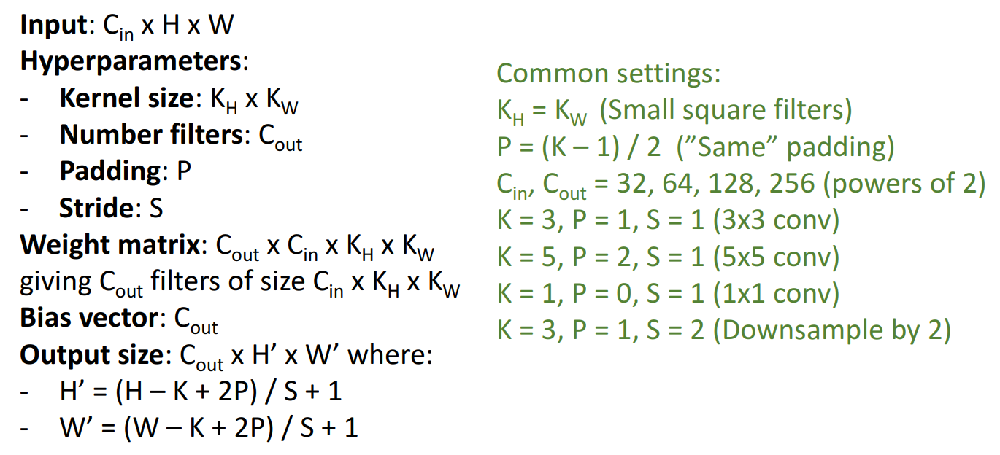

## Other type of Convolution

> **지금까지 본 Convolution은 전부 2D Convolution이다. 다른 유형의 Convolution에 대해서도 알아보자.**

### 1D Convolution

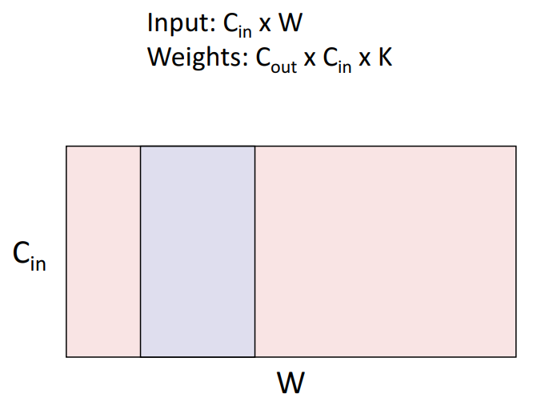

- 오른쪽으로 이동하며 `Convolution` 연산을 수행

- 오디오 데이터나 텍스트 데이터에서 주로 사용된다.

### 3D Convolution

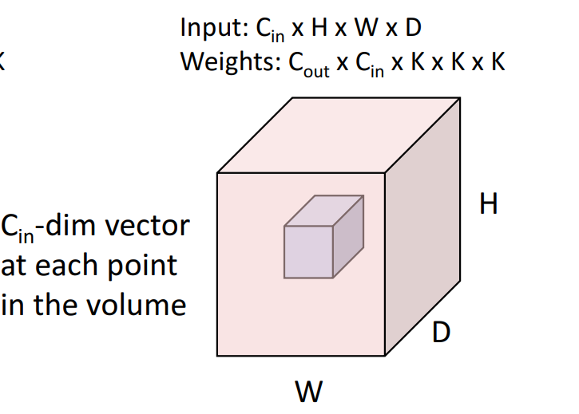

- 4D를 표현할 수 없어 3D grid에서 **$C_{in}$-dim feature vector**로 표현했다.
- 3D 데이터를 처리하는데 주로 사용된다.

## Pytorch Convolution Layer

`Conv2d`라는 함수를 통해, `2D Convolution layer`를 구현할 수 있다.

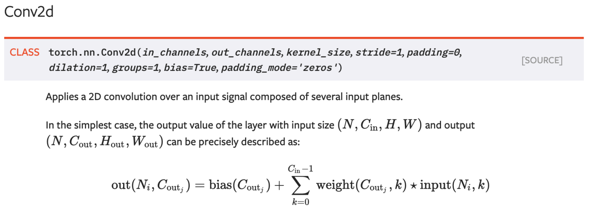

`1D Convolution layer`와 `3D Convolution layer`를 구현하는 함수도 지원한다.

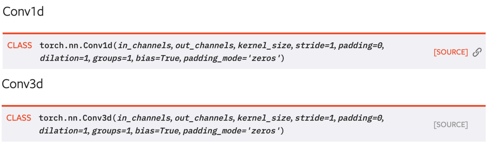

# 2. Pooling Layers

> **Input값의 집합을 받아 하나의 출력 값으로 줄여주는 `Downsampling`을 하는 방법**

`Convolution Layer`에서 사용한 `Downsampling` 방법은 **`Kernel size`를 늘리는 방법** 그리고 **`Stride`를 크게 하는 방법**이 있었다.

두 방법 외에도 `Pooling`을 통해 `Downsampling`을 할 수 있다.

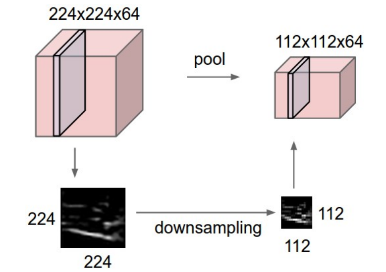

`Pooling`의 방법을 지정하는 `Pooling function`이 `Hyperparameter`로 사용된다.

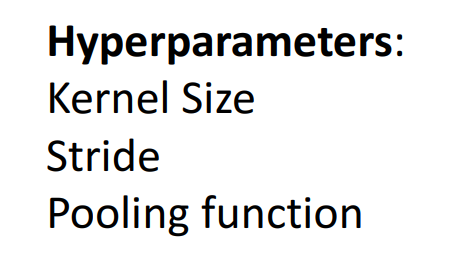

- `Stride`와 `Kernel size`에 따라 **Pooling할 범위**가 정해진다.

## Max Pooling

> **가장 많이 사용되는 Pooling function**

`2 x 2 Max Pooling`을 예시로 살펴보자.

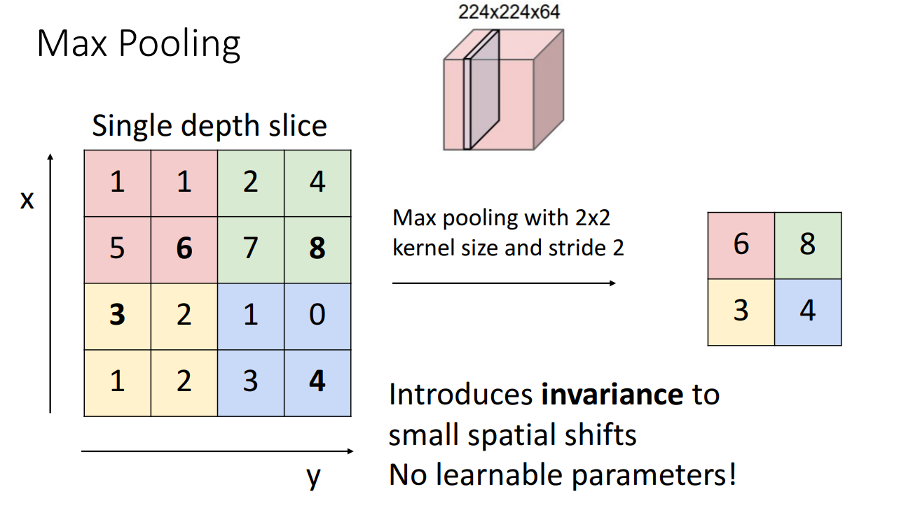

- **`Kernel size`와 `Stride`를 같게 설정**하면, Input에서 `Filter`가 적용되는 위치가 겹치지 않는다.
    
    - 이 때문에 일반적으로 같게 설정한다.

- `Pooling function`으로 `Max function`을 사용한다.

`Downsampling`을 위해 `Convolution layer`를 사용할 수 있는데 **굳이 `Pooling`을 사용하는 이유**는 아래와 같다.

1. `Convolution layer`의 `Weight`처럼 **`Learnable Paramter`가 필요 없다.**

2. `Max pooling`의 경우 특정 영역에서 최댓값만 가져오기 때문에, **`Input image`가 일부 수정되더라도 최댓값은 거의 변하지 않는다는 믿음**을 기반으로 **어느 정도의 `Invariance` (불변성)을 보장**할 수 있다.

    - 가장 강한 `Activation` (반응)만을 전달하기 때문이다.

### Convolution vs Pooling

___
`Convolution`은 **`weight`와 `input patch` 간의 `dot product`을 통해 출력을 계산**한다.

하지만, `Pooling`은 **학습 가능한 가중치 없이, 해당 영역에 고정된 연산(max, avg 등)을 적용하여 출력**을 만든다.

이처럼 `Pooling`은 **정해진 영역에 대해 항상 동일한 연산**을 수행하기 때문에, **출력값이 규칙적으로 동기화(synchronized)**된다.

- 출력 값이 **예측 가능하고 정규화**된 방식으로 정해진다

### Averaging Pooling

___

> **Max Pooling처럼 자주 사용되는 Pooling 기법 중 하나이다.**

- **입력 집합의 평균값**을 사용한다.

## Summary

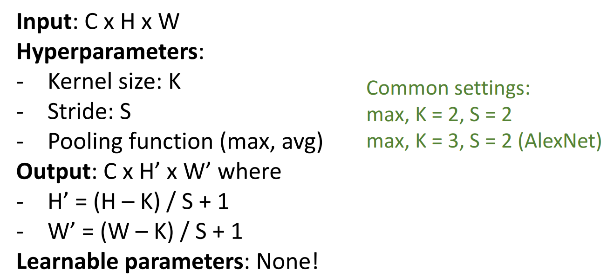