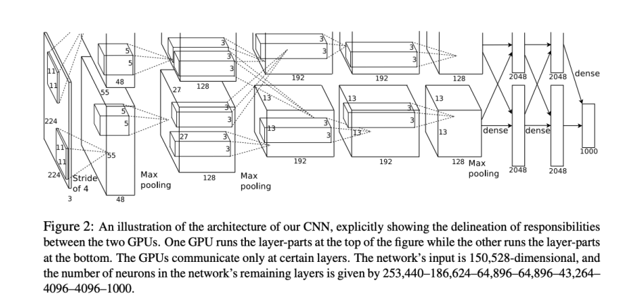

# 08. CNN Architectures

**`강의 영상`**                      

https://www.youtube.com/watch?v=qcSEP17uKKY&list=PL5-TkQAfAZFbzxjBHtzdVCWE0Zbhomg7r&index=8

**`강의 자료`**

https://web.eecs.umich.edu/~justincj/slides/eecs498/498_FA2019_lecture08.pdf

___

`ImageNet Classification Challenge`를 기준으로 `CNN Architecture`의 역사에 대해 알아보자.

아래 나오는 모델들은 각각 년도별 `ImageNet Classification Challenge`의 우승 모델들이다.

# AlexNet (2012)

> **`2012`년에 처음으로 `Image classification problem`에 `Convolutional Neural Network`를 사용한 모델**

`AlexNet`은 아래와 같이 구성된다.

`AlexNet`은 두 가지 특이한 점을 갖는다.

1. `Local Response Normalization`을 사용했다.

   - 최근에는 사용하지 않는 Normalization 기법이다.

2. 메모리가 3GB인 두 개의 `GTX 580 GPU`를 이용하여 Training 하였다.

    - 이 당시, GPU에 한계가 있었기 때문에, 네트워크를 두 부분으로 나누어 각각 다른 GPU로 학습하였다.

### AlexNet Structure

Layer에 따라 나누어서 살펴보자.

우선, 첫 번째 Layer만 자세히 살펴보자.
첫 번째 `Convolutional Layer`와 `Pooling Layer`에서의 결과를 나타내면 아래와 같다.

`Input size`의 `Layer's Filter` 정보를 알 때, 나머지 정보는 어떻게 구할 수 있는지 살펴보자.

먼저, Output의 `channel`은 해당 Layer에서 사용한 Filter의 개수와 동일하고, `Size`는 공식을 이용하여 구할 수 있다.

`Memory`는 각각의 `Pixel`이 **Float-type (4 Byte)이라고** 가정을 하고, `Output`의 전체 pixel 개수를 구하여 계산할 수 있다.

`Parameter`의 개수는 `Weight`와 `Bias`의 Pixel 개수로 구할 수 있다.

`Floating point operation`의 횟수는 `Output`의 한 pixel마다 `Filter`의 크기만큼의 연산이 일어나므로, `Filter`의 크기와 `Output`의 pixel 개수를 곱하면 구할 수 있다.

`Pooling Layer`에 대한 정보도 유사하게 구할 수 있다.

먼저 `Output size`는 공식을 이용하여 구할 수 있다.

`Memory`도 `Convolutional Layer`에서와 같은 방법으로 구할 수 있다.

`Pooling`은 `Parameter`를 갖지 않기 때문에 값은 0이다.

`Floating Point Operation` 역시 `Convolutional Layer`와 같은 방법으로 구할 수 있다.

- Million 단위로 나타내고 반올림하면, 0에 가까운 것을 확인할 수 있다. 

- `Pooling layer`에서는 `Operation`의 횟수가 `Convolution layer`에 비해 확연히 적음을 확인할 수 있다.

5개의 `Convolution layer`와 `Pooling layer`를 적용한 결과를 확인해보자.

- 여기서 `Convolution Layer` 사이에 `ReLU fucntion`의 사용은 일반적이므로 생략되었다.

5개의 `Convolutional Layer`와 2개의 `Pooling Layer` 이후 **256 * 6 * 6**의 `Output`을 얻었다.

이 `Output`을 `Cully-Connected Layer`에 넘겨주기 위해 **Flatten**을 하여, **9216 크기의 Vector**를 얻는다.

마찬가지로, 첫 번째 `FC Layer`에 대해 자세히 살펴보자.

먼저, 사용한 `Filter의 size`는 **9216 * 4096**이고 `Bias`는 **4096**이다.

따라서 `Parameter`의 개수는 아래와 같이 구할 수 있다.

`Floating Point Operation`의 횟수는 `Matrix`와 `Vector` 간의 곱셈이기 때문에, **$C_{in}$과 $C_{out}$의 곱셈**으로 구할 수 있다.

나머지 `FC Layer`까지 통과한 후의 결과는 아래와 같다.

- `마지막 Output`이 **1000**의 크기를 가지는 이유는, `ImageNet`의 `Class`가 1000개이기 때문이다. 

그렇다면, 위에서 **각 `Layer`의 `Filter size`는 어떻게 정한 것**일까?

- `Trial and Error`, 시행착오를 겪어서 얻은 것이다.

하지만, `Memory`, `Params`, `Flop` 부분을 보면 특이한 것을 확인할 수 있다.

**`Pooling layer`가 `Output = Feature map`의 크기를 줄여, 다음 `Layer`에서의 `Memory` 부담을 줄이고, 중요한 특징만을 유지할 수 있도록 한다는 것이다.**

- 특히, `Pooling Layer`는 적은 `Floating Point Operation`으로 이 작업이 가능하다.

- 우선 `Super resolution`은 $H$ x $W$를 의미하며, **이미지의 크기**를 의미한다.

- `Memory` 부분을 보면, `High Super Resolution`인 앞 부분의 Memory 사용량이 크고, **이후 `Layer`로 갈수록 작아지는 것**을 확인할 수 있다.

    - Deep Learning 학습을 위해선, 각 `Layer`의 `Output`인 `Activation`을 저장해놔야 하는데, **첫 번째 Layer의 `Activation`이 클 경우에는 이 것이 병목이 될 수 있다.**

- `Parameter`는 `Convolutional Layer`에서는 적고, **`FC Layer`에서는 많은 것**을 확인할 수 있다.

- `Floating Point Operation`은 **일반적으로 `Higher Super resolution`에서 많다.**

# ZFNet (2013)

> **AlexNet에서 Parameter를 조정하여 더 좋은 성능을 얻은 모델**

기존 `AlexNet`에서 **더 많은 `Trial and Error`를 겪어 얻은 모델**

`AlexNet`이 첫 번째 `Layer Filter`로 **size: 11 x 11, stride: 4**를 사용한 대신에 `ZFNet`은 첫 번째 `Layer Filter`로 **size: 7 x 7, stride: 2**를 사용한다.

- **첫 번째 Layer에 `Stride`와 `Size`가 더 작은 `Filter`를 사용한다는 것은 `Downsampling`을 적게하여 이후 `Layer`에 `High Resolution image`를 넘겨준다는 것을 의미한다.**

- 계산량은 기존보다 증가하지만, 결과적으로 더 좋은 성능을 얻었다.

- 계산량과 Parameter의 개수가 증가해 **더 큰 `network`가 필요**했기 때문에 `Bigger AlexNet`이라고도 부른다.

세 번째, 네 번째, 다섯 번째 `Layer Filter`도 **384, 384, 256 크기**의 `Filter`를 사용하는 대신 **512, 1024, 512 크기**의 `Filter`를 사용하였다,

### 한계점

시행착오를 겪어, 수동으로 만든 모델이기 때문에 **네트워크를 확장하거나 축소하기 매우 어려웠다.**

이를 보완하기 위해 `Design Principal`이 있는 `Architecture`에 대한 연구가 진행되었다.

# VGGNet (2014)

> **최초로 간단한 `Design Principal`을 제시한 `Architecture`**

> **2014년 우승 모델(GoogLeNet)은 아니지만, 의미가 있는 모델이다.** 

### VGG Design rules

- 위 3가지 규칙을 이용하여, **`Network`를 자유롭게 확장하거나 축소할 수 있도록 한다.**

- 설계자는 위 3가치 `Conv`, `Pooling` 규칙만 따른다면, **자유롭게** `Network`를 설계할 수 있다.

### VGG Sturcture

가장 유명한 모델은 `VGG-16`, `VGG-19`이다.

각각 **16개의 Layer와 19개의 Layer**로 이루어져 있다.

각 `Stage`는 아래의 `Layer`로 구성된다.

### Why only 3 x 3 Filter?

**3 x 3 Filter**를 사용하는 경우와, **5 x 5 Fliter**를 사용하는 경우를 비교해보자.

먼저, **5 x 5 Fliter**를 사용하는 경우를 살펴보자.

`Filter`의 크기는 **C x C x 5 x 5**이고, `Output`이 **C x H x W**라고 할 때, `Parameter`의 개수와 `Floating Point Operation`의 횟수는 아래와 같다.

다음으로 **3 x 3 Fliter**를 사용하는 `Layer`를 두 번 적용한 경우를 살펴보자.

한 `Layer`에서 `Filter`의 크기는 **C x C x 3 x 3**이고, `Output`이 **C x H x W**라고 할 때, `Parameter`의 개수와 `Floating Point Operation`의 횟수는 아래와 같다.

**한 번 5 x 5 Conv Layer**를 적용했을 때와 **두 번 3 x 3 Conv Layer**를 적용했을 때, `Receptive Field`는 완벽하게 동일하다.

**하지만, Parameter의 개수와 Floating Point Operation의 횟수는 3 x 3 Filter를 두 번 사용한 경우가 훨씬 적은 것을 확인할 수 있다.**

추가적으로, **여러 크기의 Filter**를 사용하지 않고, **3 x 3 Filter**만을 사용하면 `Hyperparameter`가 **각 Layer마다 어떤 size의 Filter를 사용할 지에서 몇 개의 Layer를 사용할 지에 대한 정보 하나로 바뀌게 된다.**

또, **하나의 5 x 5 Conv** 대신, **두 개의 3 x 3 Conv**를 사용하면 두 개의 Conv Layer 사이에 **ReLU**를 넣을 수 있어 **비선형성**이 증가하고, 깊이가 깊어진다.

### Why 2 x 2 max pool and double #channel?

먼저, **pooling** 없이 **3 x 3 Filter**만 사용한 경우에 대해 살펴보자

이번엔 **pooling** 있이 **3 x 3 Filter**를 사용하고, 마지막엔 **Channel을 2배한 경우까지 알아보자**

두 경우를 비교해보면, `Params`는 증가했지만, `FLOPs`는 동일한 것을 확인할 수 있다. 

즉, `Pooling`을 사용하면서 표현력을 늘림과 동시에, `Floting Point Operation`의 횟수는 동일하게 하기 위해 위 방법을 사용한다.

`Channel`을 2배하는 이유는 **`Stride`가 2인 `Pooling`을 사용하면 `Image`가 4배 `Downsampling`**되는데 이 **`Downsampling`을 어느정도 보완하면서 `Floating Point Operation`의 횟수는 유지하기 위해 2배까지만 하는 것**이다.

### AlexNet vs VGG-16

**전체적인 부분에서 `VGG-16`이 `AlexNet`에 비해 훨씬 큰 네트워크임을 확인할 수 있다.**

훨씬 큰 네트워크임에도 불구하고, 중요한 것은 **`VGG`는 훨씬 적은 `Hyperparamter`를 가지며 쉽게 네트워크를 확장하거나 축소할 수 있다**는 점이다.

### Training

`AlexNet`처럼 모델 자체를 다른 GPU에 분산하는 대신, **데이터를 여러 `Batch`로 나눠서 각 `Batch`를 다른 GPU에서 학습**시켰다.

# GoogLeNet (2014) 

> **가장 큰 목표는 효율적인 Convolution Neural Network를 만드는 것이였다. 이에 따라 `AlexNet` -> `ZFNet` 에서 이어진 흐름인 `Bigger Network`를 만드는데 집중하지 않았다.**

모바일에서 동작시키기 위해 **가장 효율적인 모델**을 구상하고자 하였다.

### Overall Sturucture

아래에서 각 `Stage`에서 주요하게 사용된 기술을 살펴보자.

#### 1. Aggressive stem

**먼저, High super resolution에서의 많은 연산을 피하기 위해, 첫 번째 Step에서 빠르게 Downsampling 하였다.**

- 첫 번째 `Conv layer`에서 큰 **7 x 7 Filter**를 사용하고 `Pooling`도 이용하여 빠르게 `Downsampling` 한다.

- 첫 번째 Stage에서 **224 -> 28**까지 `Spatial Resolution`을 줄였다.

- `AlexNet`에 비해 **약 18배 적은 연산 횟수**를 얻을 수 있었다.

#### 2. Inception Module

`GoogLeNet`은 `Inception Module`이 계속 쌓여나가는 구조이다.

4개의 `Conv` 연산을 동시에 수행하기 때문에 `Parallel braches`라고도 부른다.

- 특히, 하나의 **3 x 3 Conv**와 **5 x 5 Conv**를 사용하기로 정해져 있기 때문에, **각 `Layer`마다 어떤 `Filter`를 사용할 것인지에 대한 `Hyperparameter`가 필요없다.**

`Inception module` 내에 **1 x 1 Conv layer**는 `Bottleneck layer`라고 부른다.

- 이 `Bottleneck layer`는 비교적 비싼 **3 x 3 conv, 5 x 5 conv** 앞에 사용되어 **`Channel`의 수를 줄여 연산 횟수를 줄이는 데 사용되었다.**

#### 3. Global Average Pooling

`AlexNet`이나 `ZFNet`의 경우를 살펴보면, 많은 수의 `Params`는 `FC Layer`에 분포되어 있었다.

때문에, `GoogLeNet`에서는 마지막 `Score`를 내는 `FC Layer`를 제외한 나머지 `FC Layer` 대신 `Global Average Pooling`을 사용한다.

- 마지막 `Score`를 내는 `FC Layer` 이전에 **마지막 `Inception Module`에서의 `Spatial resolution`의 크기와 동일한 크기의 `Kernel`을 사용해서 Vector**로 만들고 이를 마지막 `FC Layer`에 전달한다.

- `VGG-16`과 비교했을 때, 확실히 적은 `Params`가 사용된다.

#### 4. Auxiliary Classifiers

`GoogLeNet`은 `Batch Normalization` 이전에 만들어져서 10개 이상의 Layer를 가진 모델을 훈련하는 것이 힘들었다.

이 때, `Neural Network`가 깊으면, **끝에서의 `Gradient`가 제대로 전달되지 않는 문제**가 있었다. 

이를 해결하기 위해 `GoogLeNet`은 `Network`의 중간 중간에 **Score vector를 생성하고 Loss를 계산하는 Classifier를 추가로 만들었다.**

**중간 Classifier**에서도 `Gradient`가 전달되며 `Network` 전체에 `Gradient`가 잘 전달될 수 있었다.

___

**Question) 2014년에 Batch Normalization이 없었다면 VGG는 어떻게 Training?**

- `VGG` 역시 **어떤 Trick**을 사용해서 학습이 가능하도록 만든 것이고, **`Batch Normalization`은 사용하지 않았다.**

이후, 2014 ~ 2015년 사이에 `Batch Normalization`이 등장하였다.

# ResNet

> **기존 Network에 비해 압도적으로 많은 Layer를 사용한 모델**

`ResNet`은 여러 `Residual Block`의 겹침으로 이루어져 있다.

`ResNet`은 `VGG`와 `GoogLeNet`의 장점을 모아놓았다.

- `VGG`와 유사하게 **3 x 3 Filter**만을 사용하였다.

- `GoogLeNet`과 비슷하게 `Network`의 첫 번째 `Layer`에서 빠르게 `Downsampling`하였고, `Channel`의 수를 2배 늘렸으며 마지막 `Layer`에서는 `Global Averaging Pooling`을 사용하였다.

- `Network`를 `stage`로 나누었다.
  

- `GoogLeNet`과 비슷하게 빠르게 `Downsampling`한 것을 확인할 수 있다.

### Residual Network

#### 기존 모델의 문제점

`Batch Normalization`이 등장하고, **더 깊은 모델의 학습**이 가능해짐에 따라, 연구가 진행되었다.

이때, `Deeper Model`은 `Shallow Modle`에 비해 좋은 성능을 내야함에도 불구하고, **더 좋지 않은 성능을 보이는 경우**가 있다는 것이 발견되었다.

이러한 문제에 대한 **첫 번째 가정**은 **모델이 깊어짐에 따라, 모델이 `Overfitting`되었다는** 것이다.

하지만 위 그림에서 확인할 수 있듯이, Model이 `Underfitting`인 상태에서도 **`Deeper Model`이 좋지 않은 성능을 내는 경우**가 있었다.

일반적으로는 `Deeper Model`은 `Shallow Model`을 **Emulate**할 수 있어야 한다.

- `Shallow Model`을 그대로 복사하고, 연결되는 부분의 `Layer`는 `Identity Function`을 사용하면 되기 때문이다.

- 따라서, 일반적으로 `Shallow Model`의 성능은 `Deeper Model`보다 좋아야 한다.

즉, **`Batch Normalization` 이후에도 매우 깊은 모델은 효율적으로 최적화되지 못 한다는 것을 의미**한다.

- 단순히 `Identity function`만을 학습하면 되는 상황에서도, **`Deeper Model`은 학습 자체가 어려워서 더 낮은 성능을 갖는다.** 

#### 해결책

> **Identity function을 더 쉽게 학습할 수 있도록 만들자**

`Residual Block`은 기존 Block에 `Shortcut`을 추가한다.

- $X$는 학습되지 않고, 단순히 학습되는 함수 $F(X)$에 더해지는 것이다.

이 방법은 `Identity function`의 학습을 쉽게 만든다.

- 만약 2개의 `Conv Layer`의 `Weight`가 모두 0이라면, `Identity function`을 사용하는 것과 동일하게 된다.

- 기존 모델은 $H(x)$가 `Identity function`이 되도록 유도해야 했지만, `ResNet`은 학습하는 대신, `F(x) = 0`이 되도록 하면 된다.

추가로 `Backpropagation` 시에 `Gradient`가 전달되는 하나의 경로를 추가적으로 만들어, 학습을 효율적으로 만든다.

- 추가적인 `Gradient`를 사용하여 `Vanishing Gradient` 문제를 해결할 수 있다.

#### Basic Residual Block

**가장 기본적으로 사용되는 `Residual Block`**

#### Bottleneck Block

`Basic Residual Block`에 비해 4배 큰 `Channel input`을 허용한 `Residual Block`

- **가장 큰 특징은 Layer가 더 많은데도 계산량은 더 적다는 것이다.**

- 즉, **계산량을 유지하**며 더 많은 **비선형성 부여**와 **순차적인 계산**이 가능하도록 하여 **더 복잡한 함수의 표현이 가능하도록 한다.**

### Structure

`Layer`의 개수에 따라 2개의 버전이 존재한다.

- `Floating Point Operation`의 횟수가 굉장히 적어 `ImageNet`에서 오류가 적다.

`VGG`와 비교했을 때, `GFLOP`이 훨씬 낮은 것을 확인할 수가 있다.

### Results

- `ResNet-50`은 `ResNet-34`와 `Residual Block` 종류 차이만 존재하는 모델이다. `Bottleneck`을 사용하는 경우가 에러가 더 적은 것을 확인할 수 있다.

`ResNet-101`과 `ResNet-152` 모델은 더 깊은 모델이라 `Computationally Heavy` 하지만, 에러는 더 적은 것을 확인할 수 있다.

`Computer Vision` 역사에서 가장 강력한 결과를 낸 모델 중 하나이다.

> 기존 모델들의 장점을 엮어 **`152개`의 압도적인 개수의 Layer를 가진 `Deeper Model`을 구현했다는 점이 중요하다.**

# Comparing Complexity

> **`AlexNet`부터 `ResNet`까지의 모델의 성능들을 비교해보자**

- `Inception-V4`는 `Inception` + `Residual Block`으로 구성된다.

- `AlexNet`: Low Compute, lots of parameter

- `VGG`: Highest Memory, Most operation

- `GoogLeNet`: Very Efficient

- `ResNet`: Simple design,	Moderate efficiency, High accuracy

# Model	Ensembles (2016)

> **2016년의 ILSVRC 우승 모델은 기존의 모델들을 `Ensemble`한 모델이다**

# ResNeXt (2017)

> **`ResNet`의 `Bottleneck Residual Block`을 보완한 모델**

`ResNet`의 `Bottleneck Conv layer` 부분을 **병렬로 처리해보려는 시도에서 생긴 모델**

- 왼쪽의 `Bottleneck Residual Block`을 오른쪽의 `G`개의 **parallel**한 작은 `Bottleneck Residual Block`으로 나눌 수 있다.

- 아래 보이는 방정식을 풀어서 `c` (Small c)를 구하면 **계산량을 변하지 않게 하면서 더 빠르게 계산할 수 있도록 할 수 있다.**

- `Group` 전체에 대한 `Identity function`을 넘겨준다.

### Example: Groups = G

### Example: PyTorch

### Results

`ResNeXt`가 `ResNet`에 비해 성능이 더 좋은 것을 확인할 수 있다.

`ResNet`은 `Residual Block`을 이용하면 **`Deeper Model`이 `Shallow Model`보다 항상 좋다는 것을 증명했다.**

이는 후속 연구가 **Deep한 모델**을 만들고자 하는 방향성을 갖도록 했다.

하지만, 모델의 `Layer`가 많을수록 `GPU Memory`에 의해 제한되는 부분도 있었다.

____

`2017`년 이후, `ImageNet Classification Challenge`는 종료되었다.

`ImageNet Classification Challenge`의 과정을 시각화해보면 아래와 같다.

하지만 이후에도 흥미로운 `Architecture`는 계속 나왔기 때문에 이를 살펴보자.

# Densely Connected Neural Network

> **직전 `Layer`에 해당하는 결과만 받는 대신, 모든 이전 `Layer`의 결과를 넘겨받는 모델**

**각 `Layer`는 이전의 모든 `Layer`로부터 feature map을 입력받고, 자신의 출력을 이후의 모든 `Layer`에 전달한다.**

- 이전 Layer에서의 **`Feature`를 재사용**할 수 있다.

- `Vanishing Gradient`를 제거할 수 있다.

- `Feature`들이 다음 `Layer`로 잘 전달된다.

# MobileNets: Tiny Networks (For mobile devices)

> **정확도를 어느정도 희생하고 모바일에서도 실행할 수 있도록 매우 적은 연산량을 가진 모델**

# Neural Architecture Search

> **위에서 본 모든 모델은 모델 자체를 설계하는데 시간, 돈, 인력이 소모된다. `Neural Architecture Search`은 이를 해결하기 위한 방법 중 하나이다.**

> **Deep Learning 구조도 Deep Learning 모델이 자동으로 설계하자!**

`Controller Neural Network`는 `Output`으로 다른 `Neural Network`를 내놓는다.

### 학습 과정

1. **모델의 구조를 Sampling**하여 얻고, 그에 따라 `Child Neural Network`를 구성한다.

2. `Child Neural Network`를 학습시켜서 `Reward (정확도)`를 얻고, `Reward`에 맞춰서 `Gradient`를 계산한다.

3. 위에서 구한 `Gradient(Policy Gradient)`를 이용하여 `Child`가 아니라 `Controller`를 업데이트 한다.

이 과정이 반복되면서 `Controller`는 점점 좋은 모델을 구성해나간다.

### 문제점

**학습하는데 너무 오랜 시간이 걸려 거의 사용하지 못 한다..**

### Results

- `Neural Architecture Search`를 이용하여 얻은 `Architecture`는 다른 `CNN Architecture`에 비해 **더 적은 계산량으로 더 좋은 성능**을 낸다.

# CNN Architecture Summary

마지막으로, 일반적으로 우수한 `Architecture`를 직접 설계하고자 하는 것은 말도 안 되고, **기존 `Architecture`를 상황, 데이터에 맞게 조절하여 사용하는게 좋다.**
