# 09. Hardware and Software

**`강의 영상`**                      

https://www.youtube.com/watch?v=qcSEP17uKKY&list=PL5-TkQAfAZFbzxjBHtzdVCWE0Zbhomg7r&index=9

**`강의 자료`**

https://web.eecs.umich.edu/~justincj/slides/eecs498/498_FA2019_lecture09.pdf

___

# Deep Learning Hardware

## NVIDIA

먼저 `NVIDIA GPU` 기준으로 살펴보자. 

특정 Hardware가 지원하는 `GFLOPS`를 가격으로 나눈 그래프를 살펴보자.

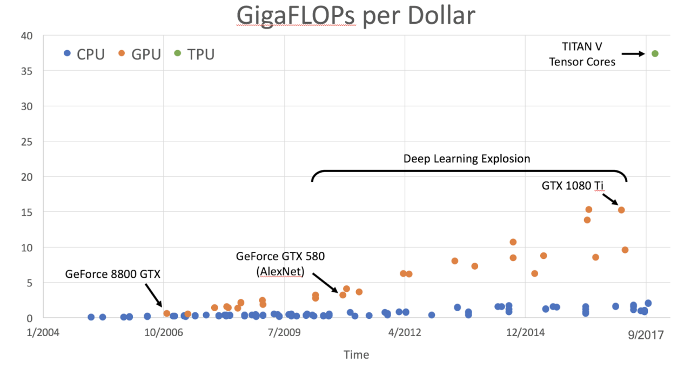

- `CPU`와 `GPU` 모두 시간이 지날수록 **우상향**하지만, `GPU`의 성장률이 압도적으로 크다.

- `GPU`와 `CPU`의 **연산량의 차이**가 크다.

### CPU vs GPU

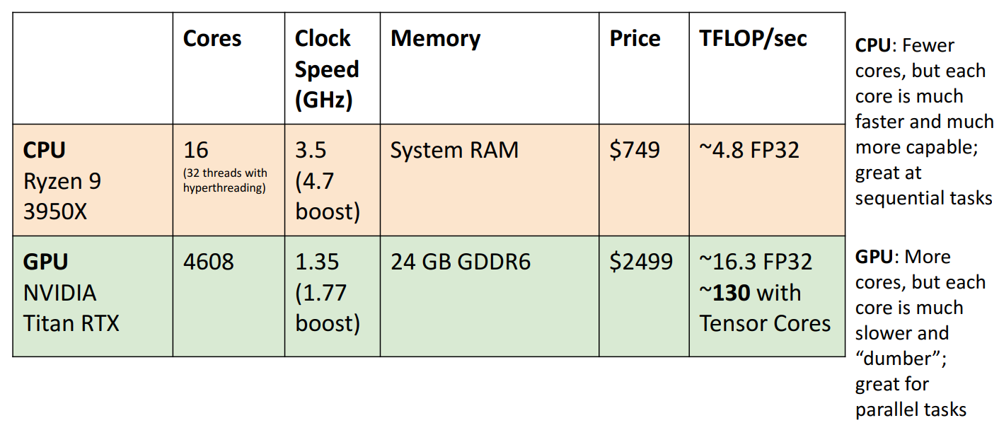

- `GPU`는 `On-device memory`를 갖고있고, 가격을 제외한 거의 모든 부분에서 `CPU`보다 우수하다.

- `CPU`는 `GPU`보다 `Core`의 개수가 적지만, 각 `Core`는 `GPU`보다 **2~3배 좋은 성능**을 갖는다. 

  - 그러나, `Core` 개수의 차이 때문에 전체 연산량은 `GPU`가 크다. 

- `Tensor Core`에 대해서는 아래에서 설명할 것이다.

### Inside a GPU: RTX Titan

#### Memory

먼저 아래 사진의 파란색 부분에 **12개의 2GB Memory**를 갖는다.

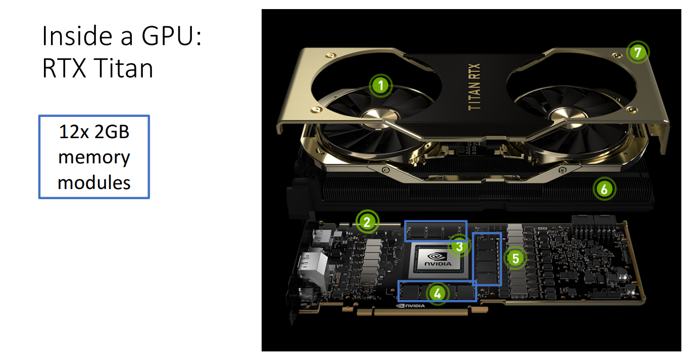

#### Processor

`Processor`는 아래 사진에서 빨간색 부분이다.

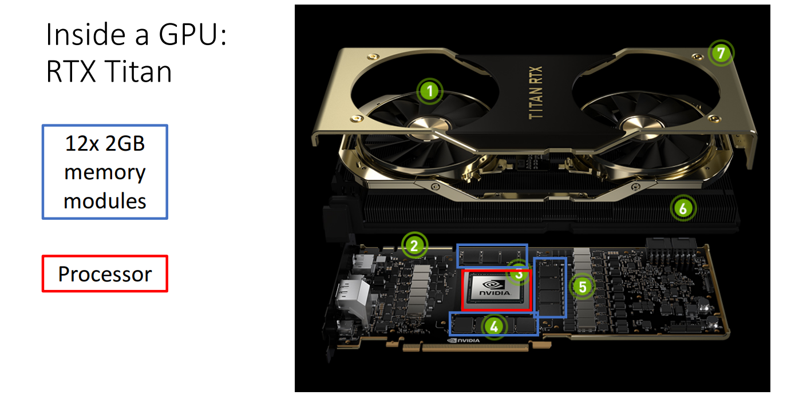

하나의 `Processor`는 **72개의 `Streaming Processor`로** 이루어져 있다.

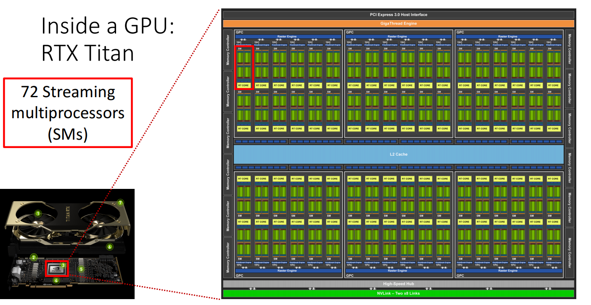

하나의 `Streaming Processor` 내에 **64개의 `FP32 Core`로** 이루어져 있고, 각 `Core`는 **한 Cycle에 2번의 Floating Point 연산**이 가능하다.

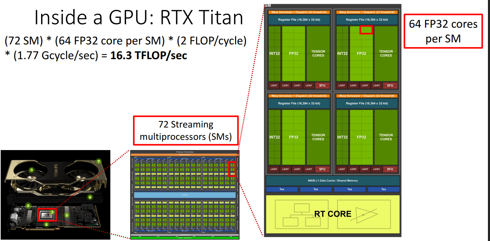

- 이에 따라 하나의 `GPU`에서 **`FP32 Core`를 이용하여 1초에 연산 가능한 Floating Point 연산**은 **16.3 TFLOP**이다. 

또한, 하나의 `Streaming Processor` 내에 **8개의 `Tensor Core`도** 존재한다.

`Tensor Core`는 **딥러닝을 위해 제작한 특별한 하드웨어**로, $A, B, C$가 모두 **4 x 4 Matrix일** 때, $AB + C$ (**Matrix multiplication + Bias**) 연산을 빠르게 할 수 있도록 도와준다.

- 강의 시점 기준, `Tensor Core`는 **4 x 4 Matrix Multiplication + Addition**만 지원한다.

- 이 때, $AB + C$에서의 `FLOP` 연산은 **총 128번 발생**한다.

이에 따라 `Tensor Core`를 사용했을 때, 1초에 연산 가능한 `Floating Point Operation`의 횟수를 구하면, **130 TFLOP**인 것을 확인할 수 있다.

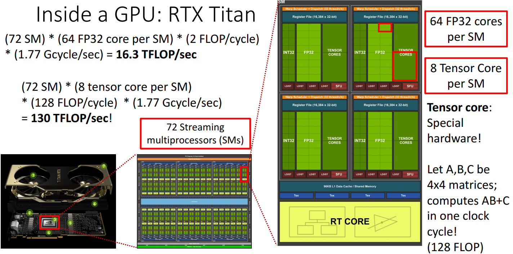

추가로, PyTorch에서 `Tensor Core`의 장점을 극대화하려면, **필요한 하드웨어와 드라이버를 설치**하고, **데이터를 16bit**로 맞춰주는 것이 좋다.

- 이 작업만 이루어지면, 가속 가능한 모든 계산이 자동으로 가속된다.

#### Example of Accelerating

`Matrix Multiplication`의 경우에, `Output`의 **각 Element는 큰 두 개의 Vector의 곱**이다.

이를 이용하여 `Output`의 각 `Element`에 해당하는 계산을 따로 **병렬적으로 처리**할 수 있다.

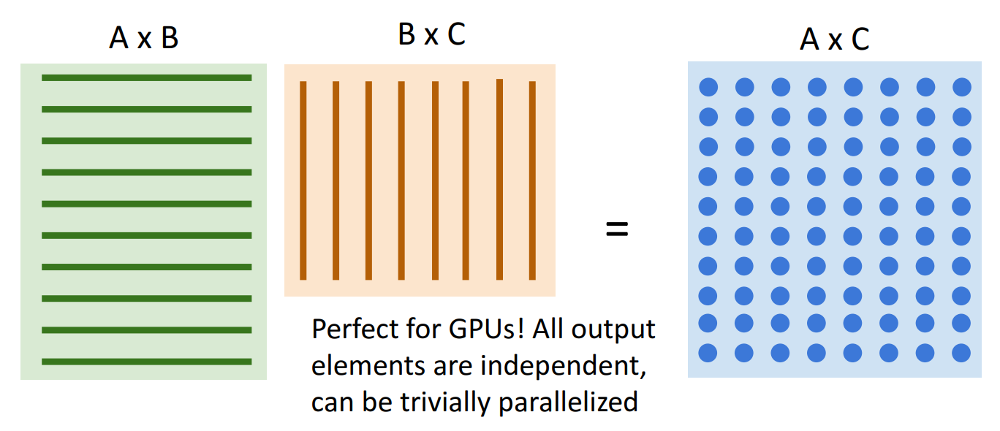

- **4 x 4 matrix multiplication + addition**은 `PyTorch`에서는 자동으로 Padding을 한다던가, 하위 API 등을 호출하는 등을 이용하여,  **자동으로 **4x4** 크기로 맞추거나 잘라서 `Tensor Core`를 이용할 수 있도록 한다.**

#### Programing GPUS

`CUDA`라는 프로그램 언어를 이용하여, `GPU` 위에서 직접 동작하는 코드를 구현할 수 있다.

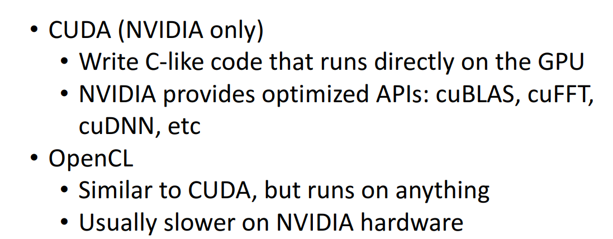

하지만, Deep Learning 실무자들은 **Layer의 구성에 더 신경**써야하기 때문에, 대부분 `PyTorch`를 사용하고, **최적화 관련되서는 이미 작성된 라이브러리나 코드를 사용**한다.

#### Scailing Up: 8 GPUs per Server

요즘에는 하나의 Server 안에 여러개의 `GPU`를 사용하여, **계산을 각 GPU에 분산하거나 학습을 분산**한다.


## Google

`Google`이 자체적으로 많은 양의 연산을 지원하는 하드웨어를 만든 결과.

### Google Tensor Processing Units

가장 기본적인 Hardware는 `Cloud TPU v2`이다. 

세부적인 동작 과정은 밝혀지지 않았지만, `NVIDIA`의 `GPU`와 비슷할 것으로 추정된다.

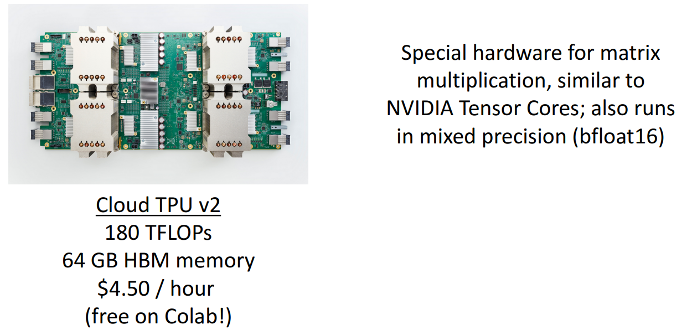

`Cloud TPU v2`는 여러 개끼리 연결될 때 큰 효율을 보여준다.

`Cloud TPU v2 pod`는 여러 개의 `Cloud TPU v2`를 연결한 것이다.

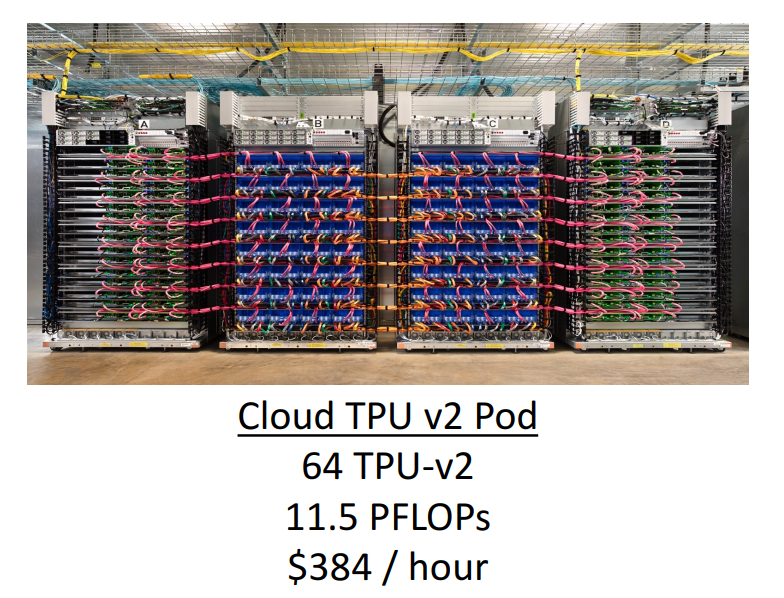

`Cloud TPU v3`에 관련된 것도 있다.

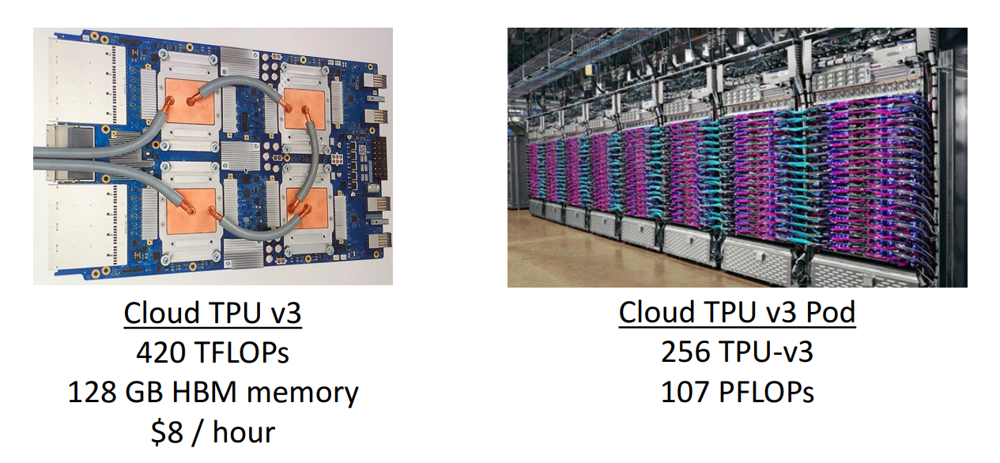

### 단점

`TPU`를 사용하려면 `Google`의 **Deep Learning Framework**인 `TensorFlow`를 사용하는 것이 원칙이다.

하지만, 점점 `PyTorch` 등에서도 `TPU`를 제한적으로 사용할 수 있는 방법이 개발되고 있다.

# Deep Learning Software

Hardware과 다르게 비싼 비용을 지불하지 않고도 여러 `Deep Learning Software`를 사용할 수 있다.

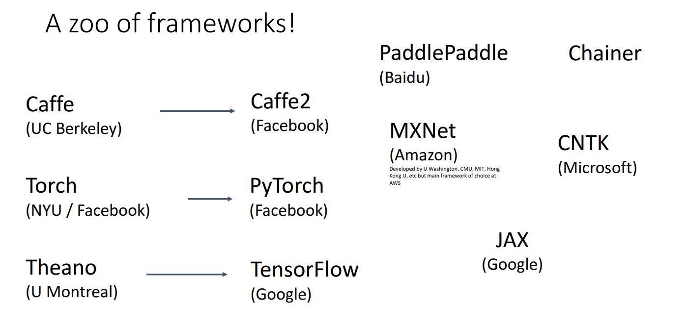

이 강의에서는 주요하게 사용되는 `Framework`인 `PyTorch`와 `TensorFlow`를 중점적으로 살펴볼 것이다.

`Framework`를 알아보기에 앞서, `Deep Learning Framework`에 **요구되는 사항**에 대해 먼저 알아보자.

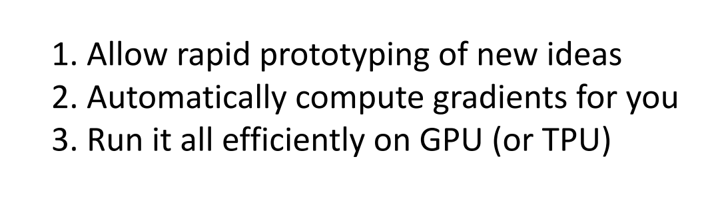

1. 아이디어를 **코드 몇 줄로 빠르게 구현**할 수 있어야 한다.

2. `Computation Graph`를 이용하여 `Autograd`가 가능해야 한다.

3. `GPU`에서 **학습이 가능**해야 한다.


## PyTorch

이 수업에서는 **PyTorch 1.2 Version**을 사용한다.

### Fundamental Concepts

`Tensor`: `Numpy array`와 비슷하지만, `GPU`에서 실행 가능하다.

`Autograd`: `Computation Graph`를 자동으로 구축하고, 이를 통해 `Backpropagation`을 진행한다.

`Module`: 각 `Layer`가 자신의 `State`나 `Weight`를 `Object Oriented`와 비슷하게 저장한다.

### Tensors

> `L2 Loss`를 이용하여 `2-Layer ReLU Network`를 학습하는 코드를 살펴보자.

```python
import torch

# CPU version
device = torch.device('CPU')
# GPU version
device = torch.device('cuda:0')

# Random Tensors 생성
N, D_in, H, D_out = 64, 1000, 100, 10
x = torch.randn(N, D_in, device=device)
y = torch.randn(N, D_out, device=device)
w1 = torch.randn(D_in, H, device=device)
w2 = torch.randn(H, D_out, device=device)

learning_rate = 1e-6
for t in range(500):
    # Forward Pass
    h = x.mm(w1)
    # ReLU -> clamp(min=a, max=b)
    # a ~ b 사이 값만 남기고 나머진 0으로 저장
    h_relu = h.clamp(min=0)
    y_pred = h_relu.mm(w2)
    loss = (y_pred - y).pow(2).sum()

    # Backward Pass
    grad_y_pred = 2.0 * (y_pred - y)
    grad_w2 = h_relu.t().mm(grad_y_pred)
    grad_h_relu = grad_y_pred.mm(w2.t())
    grad_h = grad_h_relu.clone()
    grad_h[h < 0] = 0
    grad_w1 = x.t().mm(grad_h)

    # Update Gradient
    w1 -= learning_rate * grad_w1
    w2 -= learning_rate * grad_w2
```

### Autograd

> `Autograd`를 사용하기 위해선, `Tensor`를 생성할 때, `requires_grad=True`를 사용해야 한다.

- `requires_grad=True`로 생성된 `Tensor`에 대해선 자동으로 `Computation Graph`를 생성하여 추적한다.

- **`requires_grad=True`로 생성된 `Tensor`가 포함된 모든 연산은 `Computation Graph`에 포함된다.**

  - 연산 결과도 `requires_grad=True`인 `Tensor`가 된다.

```python
import torch

N, D_in, H, D_out = 64, 1000, 100, 10
x = torch.randn(N, D_in)
y = torch.randn(N, D_out)
w1 = torch.randn(D_in, H, requires_grad=True)
w2 = torch.randn(H, D_out, requires_grad=True)

learning_rate = 1e-6
for t in range(500):
    # Forward Pass
    y_pred = x.mm(w1).clamp(min=0).mm(w2)
    loss = (y_pred - y).pow(2).sum()

    # Backward Pass
    loss.backward()

    # Update
    with torch.no_grad():
        w1 -= learning_rate * w1.grad
        w2 -= learning_rate * w2.grad
        # w1, w2의 Gradient를 0으로 반드시 초기화해주어야 한다.
        w1.grad.zero_()
        w2.grad.zero_()
```

- **가장 중요하게, Autograd를 사용하기 때문에 중간 단계의 계산 결과 (ex. h_relu) 등을 따로 변수로 저장할 필요가 없다.**

`Forward Pass`에서 x.mm(w1), clamp(min=0), mm(w2)의 결과 모두 `requires_grad=True`이며, `Computation Graph`에 추가된다.

`Forward Pass`의 결과로 생기는 `Computation Graph`는 아래와 같다.

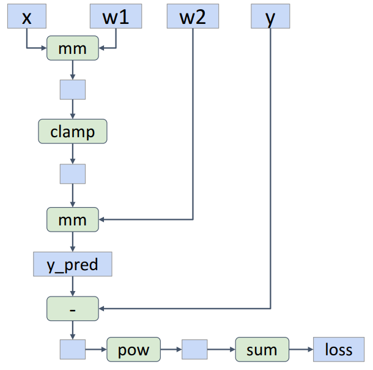

`Backward Pass`에서는 `requires_grad=True`인 모든 결과에 대해 `Backpropagation`을 진행한다.

**loss.backward()** 함수는 자동으로 `Loss`에 대한 `Gradient`를 계산하고 **`w1`과 `w2`의 `Gradient`를 **w1.grad, w2.grad**에 저장**하고 **`Computation Graph`는 제거**한다.

`Update`에서는 `Weight`를 업데이트한다.

- `Weight`를 업데이트할 때, `Computation Graph`를 계산할 필요가 없으므로 **with no_grad(): scope 내**에서 업데이트한다.

여기서, 매 `Epoch`마다 새롭게 계산된 `Gradient`를 사용해야 하기 때문에 `w.grad.zero_()`를 반드시 사용해야 한다.

### New Functions

`PyTorch`를 사용함과 동시에, `Activation / Loss function` 같은 경우 직접 **파이썬 함수를 정의하여 사용**할 수도 있다.

**`sigmoid` 함수를 직접 파이썬으로 구현**한 예시를 살펴보자.

`sigmoid` 함수를 `Activation function`으로 사용할 때, 직접 파이썬으로 정의한 함수를 `Layer` 안에서 사용해야 한다.

이 경우, `PyTorch`가 `Computation Graph`를 구성할 때 **직접 구현한 함수에 대해서도 `Computation Graph`를 작성할 수 있어야 함을 의미한다.**

하지만, **`PyTorch`는 사용자가 정의한 함수의 내용에 대해서는 알지 못 하기** 때문에, 아래와 같이 **코드를 하나씩 연결**하여 **비교적 큰 `Computation Graph`를** 만들게 된다.

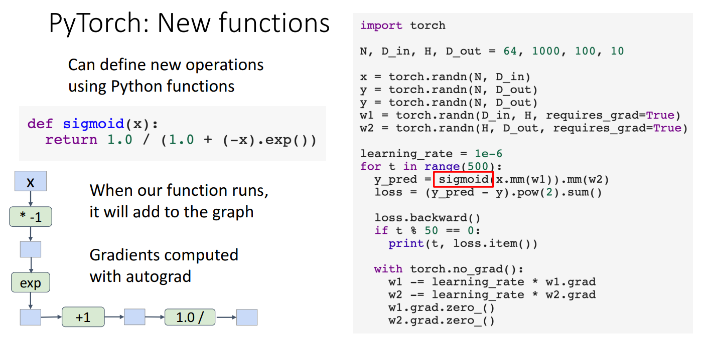

위 사진과 같이 `Computation Graph`가 만들어지면, `Overflow` 등으로 인하여 **수치적으로 불안정**할 수 있다.

이를 해결하기 위해, `PyTorch`에서는 `Autograd`를 지원하는 `API`를 구현할 수 있다.

- 이를 `custom autograd function`이라고 부른다. 

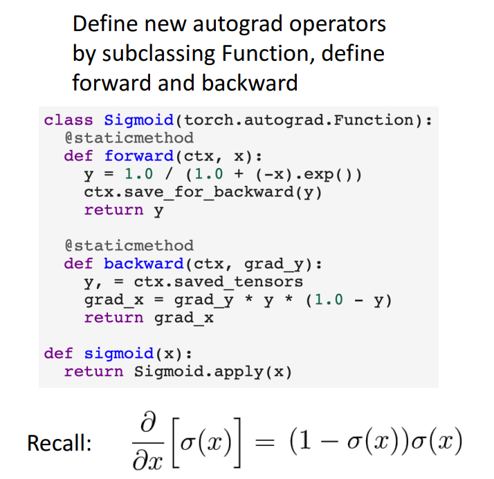
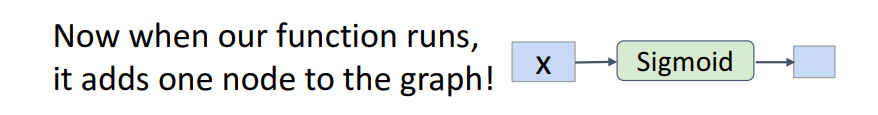

- `Sigmoid` 함수의 미분은 수학적으로 이쁘게 정리된다는 점이 주요하다.
  
- **`Forward`와 `Backward` 함수는 모두 필수적으로 구현**되어야 한다.

  - **apply()** 함수의 내부적으로 **forward()를** 호출하고, **loss.backward()에서** **backward()를** 호출하기 때문이다.

  - `Instance` 없이 사용되기 때문에, **@staticmethod**로 구현된 것을 확인할 수 있다. 

- 이 것을 사용하면 `Comutational Graph`에서 여러 Node 대신, 하나의 Node로 `Sigmoid` 함수를 사용할 수 있다.

하지만, **Python 함수를 직접 구현하는 것이 일반적이다.**


### nn

> **Neural Network를 정의할 때 사용하는 High-Level wrapper**

```python
import torch

N, D_in, H, D_out = 64, 1000, 100, 10
x = torch.randn(N, D_in)
y = torch.randn(N, D_out)

# Model define
model = torch.nn.Sequential(
    torch.nn.Linear(D_in, H), # () 안에는 Weight의 차원
    torch.nn.ReLU(),
    torch.nn.Linear(H, D_out)
)

learning_rate = 1e-2
for t in range(500):
    y_pred = model(x)
    loss = torch.nn.functional.mse_loss(y_pred, y)

    loss.backward()

    with torch.no_grad():
        for param in model.parameters():
            param -= learning_rate * param.grad

    # Model 전체의 Gradient를 0으로 세팅
    model.zero_grad()

```

- **nn.Sequential()은** 각 Layer가 `Weight tensor`를 갖도록 하고, 순서대로 구현할 수 있는 **Object-oriented	API**

- **torch.nn.functional**은 `Loss function`에 대한 다양한 **Helper 함수**를 갖는다.

### optim

```python
import torch

N, D_in, H, D_out = 64, 1000, 100, 10
x = torch.randn(N, D_in)
y = torch.randn(N, D_out)

model = torch.nn.Sequential(
    torch.nn.Linear(D_in, H),
    torch.nn.ReLU(),
    torch.nn.Linear(H, D_out)
)

learning_rate = 1e-4
optimizer = torch.optim.Adam(model.parameters(), lr=learning_rate)

for t in range(500):
    y_pred = model(x)
    loss = torch.nn.functional.mse_loss(y_pred, y)

    loss.backward()
    optimizer.step()
    optimizer.zero_grad()

```

- **torch.optim**은 다양한 규칙을 가진 **Optimizer**를 포함하고 있다.

- **Training**의 끝에, 항상 **optimizer.step()과 zero_grad()를** 반드시 해주어야 한다.

    - `step()`: `Weight` 변경 적용
  
    - `zero_grad()`: Gradient 초기화

### nn.Modules

위에서 본 **nn.Sequential()** 함수를 사용하여 Model을 정의하는 대신, **torch.nn.Module**의 **하위 Class를 정의**하여 Model을 정의하는 방법도 있다.

```python
import torch

class TwoLayerNet(torch.nn.Module):
    # Initialize
    def __init__(self, D_in, H, D_out):
        # nn.Module의 내부 구조 초기화
        super(TwoLayerNet, self).__init__()
        self.linear1 = torch.nn.Linear(D_in, H)
        self.linear2 = torch.nn.Linear(H, D_out)

    def forward(self, x):
        h_relu = self.linear1(x).clamp(min=0)
        y_pred = self.linear2(h_relu)
        return y_pred

N, D_in, H, D_out = 64, 1000, 100, 10
x = torch.randn(N, D_in)
y = torch.randn(N, D_out)

model = TwoLayerNet(D_in, H, D_out)
optimizer = torch.optim.SGD(model.parameters(), lr=1e-4)

for t in range(500):
    y_pred = model(x)
    loss = torch.nn.functional.mse_loss(y_pred, y)

    loss.backward()
    optimizer.step()
    optimizer.zero_grad()

```

- **backward()를** 저장할 필요없이, `Autograd`가 자동으로 `Backward`를 지원한다.

**한 Module안에 다른 SubModule을 사용할 수도 있다.**

8강에서 배웠던 `CNN Model` 중, `Block` 구조를 사용하는 Model을 생각하면 된다.


```python
import torch

class ParallelBlock(torch.nn.Module):
    def __init__(self, D_in, D_out):
        super(ParallelBlock, self).__init__()
        self.linear1 = torch.nn.Linear(D_in, D_out)
        self.linear2 = torch.nn.Linear(D_in, D_out)

    def forward(self, x):
        h1 = self.linear1(x)
        h2 = self.linear2(x)
        return (h1 * h2).clamp(min=0)

N, D_in, H, D_out = 64, 1000, 100, 10
x = torch.randn(N, D_in)
y = torch.randn(N, D_out)

model = torch.nn.Sequential(
    ParallelBlock(D_in, H),
    ParallelBlock(H, H),
    torch.nn.Linear(H, D_out)
)

optimizer = torch.optim.Adam(model.parameters(), lr=1e-4)

for t in range(500):
    y_pred = model(x)
    loss = torch.nn.functional.mse_loss(y_pred, y)
    loss.backward()
    optimizer.step()
    optimizer.zero_grad()
```

이 구조는 **전체 `Module`이 2개의 `ParallelBlock`을 감싸고** 있는 구조이다.

그림으로 보면 아래와 같다.

`ParallelBlock`

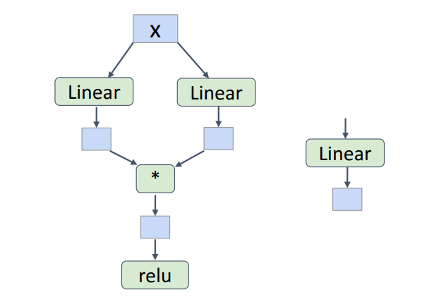

`전체 Model`


### DataLoaders

`DataLoader`는 `Dataset class`를 감싸고 있으며, **Mini-batching**와 **shuffle** 등을 지원한다.

```python
import torch
from torch.utils.data import TensorDataset, DataLoader

N, D_in, H, D_out = 64, 1000, 100, 10
x = torch.randn(N, D_in)
y = torch.randn(N, D_out)

loader = DataLoader(TensorDataset(x, y), batch_size=8)

model = TwoLayerNet(D_in, H, D_out)
optimizer = torch.optim.SGD(model.parameters(), lr=1e-2)

for epoch in range(20):
    for x_batch, y_batch in loader:
        y_pred = model(x_batch)
        loss = torch.nn.functional.mse_loss(y_pred, y_batch)

        loss.backward()
        optimizer.step()
        optimizer.zero_grad()
```

### Pretrained Model

**import torchvision.models**를 이용하여 `Pretrained Model`을 불러올 수 있다.

```python
import torch
import torchvision

alexnet = torchvision.models.alexnet(pretrained=True)
vgg16 = torchvision.models.vgg16(pretrained=True)
resnet101 = torchvision.models.resnet101(pretrained=True)
```

### Dynamic Computation Graph

`PyTorch`는 기본적으로 `Dynamic Computation Graph` 방식을 따른다. 

즉, **Model을 Training할 때마다 `Computation Graph`가 자동으로, 동적으로 생성된다는 것이다.**

- 위에서 정리한 `PyTorch-Autograd` 부분을 보면, `Loss`에 대해 **backward()를 진행하고 생성했던 `Computation Graph`는 없어진다**는 것을 알 수 있다.

- 각 `Training` 단계의 `Forward pass`에서 **if, while, for와 같은 제어문**을 **자유롭게 사용**할 수 있다는 뜻이다.

- 모델을 자유롭게 변경할 수 있다.

`RNN`, `Recurrent Network` 또는 `Modular Network` 등에서 주로 사용되는 방법이다.

#### Example

```python
import torch

N, D_in, H, D_out = 64, 1000, 100, 10
x = torch.randn(N, D_in)
y = torch.randn(N, D_out)
w1 = torch.randn(D_in, H, requires_grad=True)
w2a = torch.randn(H, D_out, requires_grad=True)
w2b = torch.randn(H, D_out, requires_grad=True)

learning_rate = 1e-6
prev_loss = 5.0

for t in range(500):
    ######################################
    |w2 = w2a if prev_loss < 5.0 else w2b|
    ######################################

    y_pred = x.mm(w1).clamp(min=0).mm(w2)
    loss = (y_pred - y).pow(2).sum()

    loss.backward()
    prev_loss = loss.item()

```

- 주석으로 감싸진 부분을 보면, **if**문을 이용하여, 직전 `Loss`의 값에 따라 다른 `Weight`를 사용할 수 있도록 하였다.

**설계자가 `Computation Graph`를 지정**할 수 있다는 장점이 있지만, **사용하지도 않고 사용이 권장되지도 않는다.**

### Static Computation Graph

> **Dynamic Computation Graph와 다르게, 한 번 정의된 Computation Graph를 다음 Training 때도 고정적으로 사용한다.**

#### PyTorch JIT

`PyTorch`에서는 `Jusi-In-Time(JIT) Compilation`을 이용하여 `Static Computation Graph`를 사용할 수 있다.

```python
import torch

### 더 쉽게 Static Graph를 사용하려면 아래와 같은 방법도 가능하다.
@torch.jit.script
def model(x, y, w1, w2a, w2b, prev_loss):
    w2 = w2a if prev_loss < 5.0 else w2b
    y_pred = x.mm(w1).clamp(min=0).mm(w2)
    loss = (y_pred - y).pow(2).sum()
    return loss

N, D_in, H, D_out = 64, 1000, 100, 10
x = torch.randn(N, D_in)
y = torch.randn(N, D_out)
w1 = torch.randn(D_in, H, requires_grad=True)
w2a = torch.randn(H, D_out, requires_grad=True)
w2b = torch.randn(H, D_out, requires_grad=True)

### 이 부분을 통해 model에서 dynamic 대신 static을 사용하도록 할 수 있다.
### @torch.jit.script 코드가 있다면, 없어도 되는 코드이다.
graph = torch.jit.script(model)

prev_loss = 5.0
learning_rate = 1e-6

for t in range(500):
    ### @torch.jit.script 코드가 있다면, loss = model()로 사용한다.
    loss = graph(x, y, w1, w2a, w2b, prev_loss)

    loss.backward()
    prev_loss = loss.item()
```

위 코드를 실행하면, 우선 `Static Graph Object`로 `Compile`된다.

- `Dynamic`과 다르게 `Compile` 방식을 사용한다.

- 코드를 전체적으로 **한 번 훑어 흐름을 파악**한 다음 `Static Graph`를 생성한다.

위 코드에 대해 `Static Computation Graph`를 만들어 보면, 아래와 같이 만들어 진다.

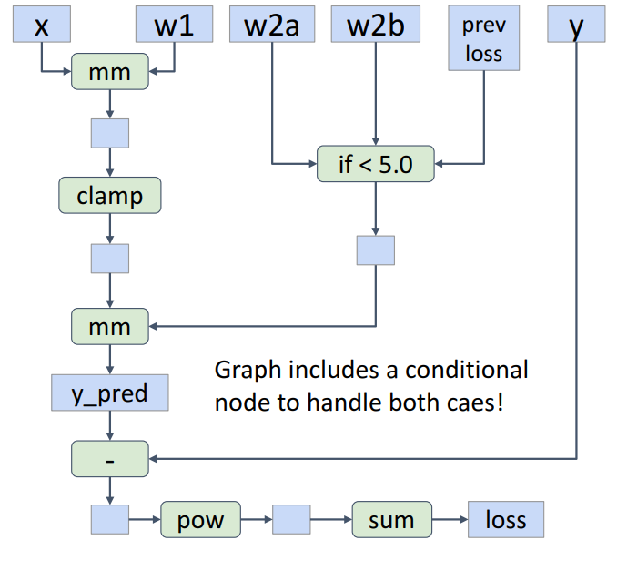

- 추가로, `Static Computataion Graph`를 사용하는 경우, 일반 상수에 대한 조건문은 위와 같이 `Conditional node`를 추가하여 구현할 수 있다고 한다.

- **제어문을 제외한 나머지 파이썬 내장 함수**를 사용하면 **불가능**하다.

### Static vs Dynamic Graphs

#### Optimization

아래의 경우를 예시로 생각해보자.

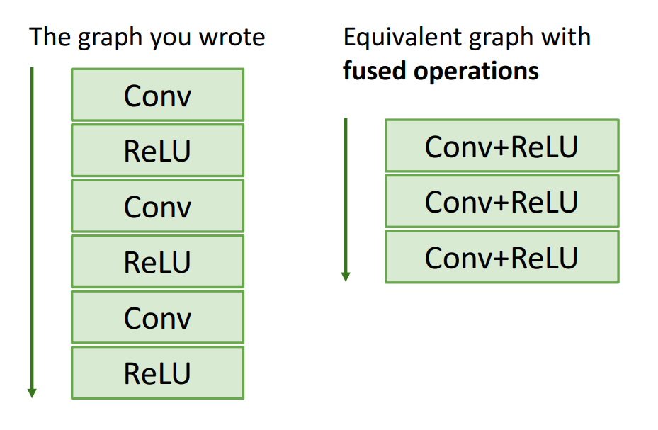

위 경우, `Dynamic`은 `Conv`와 `ReLu` Node를 따로 생성해야 하는데, `Static`은 미리 코드를 한 번 훑어보기 때문에, `Conv + ReLU`로 이루어진 하나의 Node를 이용하여 `Graph`를 만들 수 있다.

**`Optimization` 관점에서는 `Static` 방법이 더 유리하다.**


#### Serialization

> **데이터 구조나 오브젝트 상태를 동일하거나 다른 컴퓨터 환경에 저장하고 나중에 재구성할 수 있는 포맷으로 변환하는 과정**

`Static`은 `Graph`가 만들어서 저장되어있기 때문에, Graph를 외부 `C++ API` 등에 쉽게 넘겨줄 수 있다.

하지만 `Dynamic`은 `Graph`를 따로 저장하지 않기 때문에, 넘겨줄 `Graph`를 생성하려면 **`Python Interpreter`에 의해 실행되는 과정이 최소한 한 번은 필요**하다.


#### Debugging

`Static`은 코드가 실행되는 것과 `Graph`간의 **어느 정도의 불일치가 존재**할 수 있다.

그러나, **`Dynamic`은 항상 코드가 실행되는 것과 `Graph`가 동일**하게 때문에 `Debugging`이 비교적 쉽다.


## TensorFlow

`TensorFlow 1.0`는 기본적으로 `Static Graph`를 사용하고, `TensorFlow 2.0`는 기본적으로 `Dynamic Graph`를 사용한다.

### Static Graph (1.0)

`TensorFLow 1.0`에서는 코드가 항상 두 구조로 나뉘어져 있었다.

1. `Computation Graph`를 정의하는 부분

2. `Graph`를 반복적으로 실행하는 부분

```python
import tensorflow as tf
import numpy as np

N, D, H = 64, 1000, 100

#### 1. Static Graph 정의
x = tf.placeholder(tf.float32, shape=(N, D))
y = tf.placeholder(tf.float32, shape=(N, D))
w1 = tf.placeholder(tf.float32, shape=(D, H))
w2 = tf.placeholder(tf.float32, shape=(H, D))

h = tf.maximum(tf.matmul(x, w1), 0)
y_pred = tf.matmul(h, w2)
diff = y_pred - y
loss = tf.reduce_mean(tf.reduce_sum(diff ** 2, axis=1))

grad_w1, grad_w2 = tf.gradients(loss, [w1, w2])

#### 2. Running
with tf.Session() as sess:
    values = {
        x: np.random.randn(N, D),
        y: np.random.randn(N, D),
        w1: np.random.randn(D, H),
        w2: np.random.randn(H, D)
    }

    out = sess.run([loss, grad_w1, grad_w2], feed_dict=values)
    loss_val, grad_w1_val, grad_w2_val = out
```

`Graph`를 정의하는 부분에서 **많은 Error가 있어도 두 번째 부분을 실행할 때에만 Error 메세지**가 나오기 때문에 `Debugging`이 어렵다.

### Dynamic Graph (2.0)

이 방법은 `PyTorch`와 굉장히 유사하다.

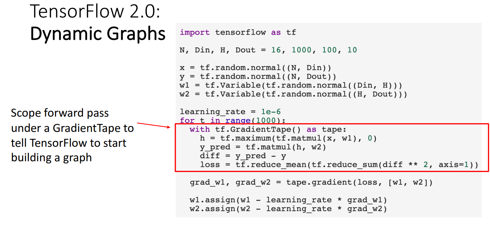

### Static Graph (2.0)

`Static Graph`를 사용하려면 **step()** 함수를 정의하여, **forward, backward, update 과정을 구현해야 한다.**

- **Backward 와 Update 부분이 포함되어야 한다는 점이 `PyTorch`와 다르다.**


- 가장 마지막에 **for loop**를 통해 `Compile`된다.

## Keras

두 가지 버전이 있다.

먼저, `Optimizer`를 사용하는 방법이다.

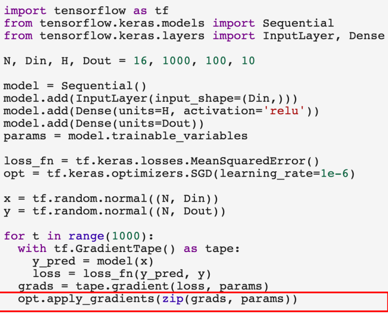

두 번째로 `Loss`를 반환하는 함수를 정의하여 Update하는 방법이다.

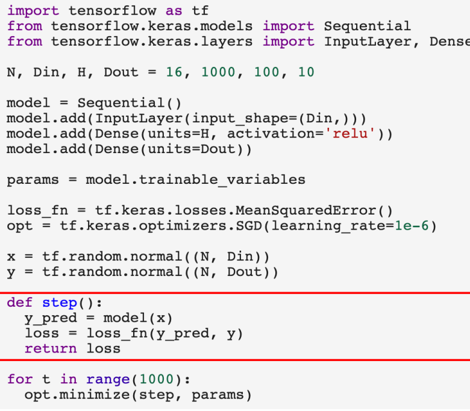

## TensorBoard

코드 내에 `Log`를 출력하는 코드를 추가하고, **loss, stats, etc**을 기록하면 **모델에 대한 통계를 시각화해주는 Software**

**torch.utils.tensorboard**를 통해 `PyTorch`에서도 사용할 수 있다.

## PyTorch vs TensorFlow

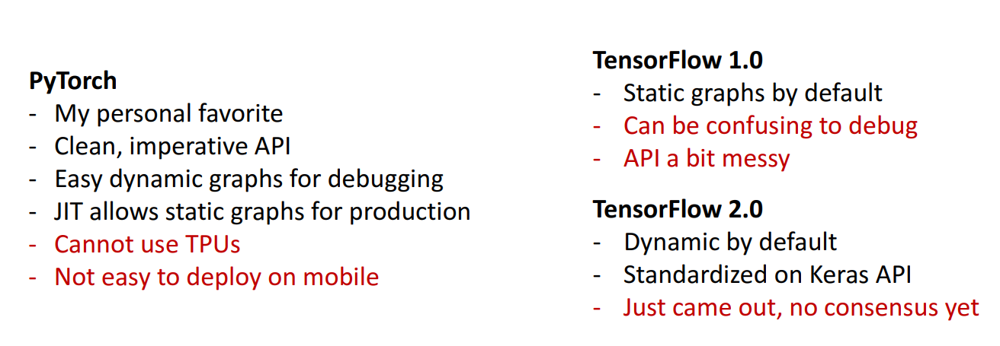
