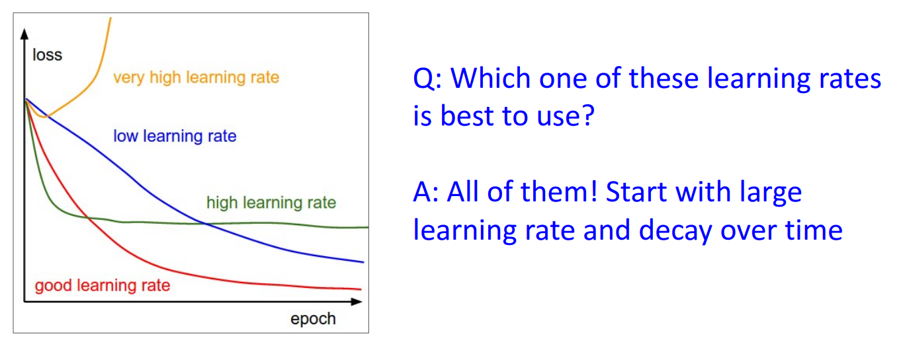
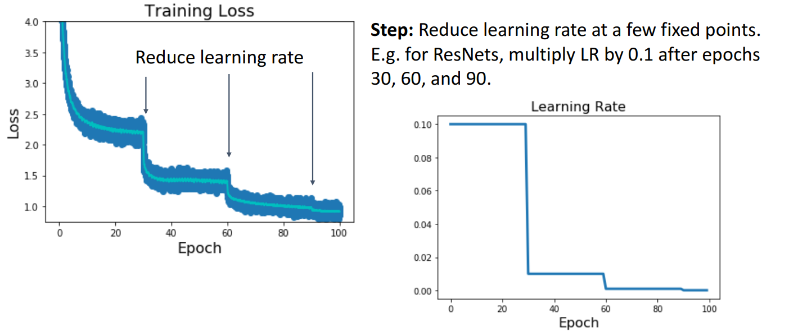
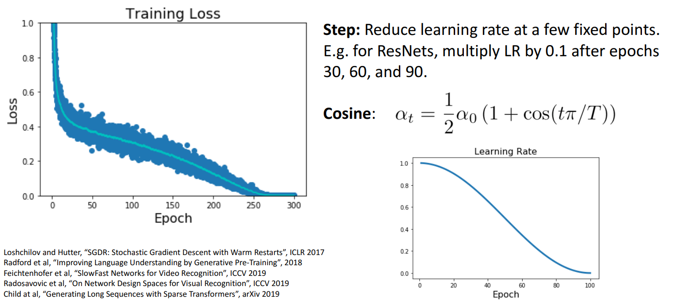
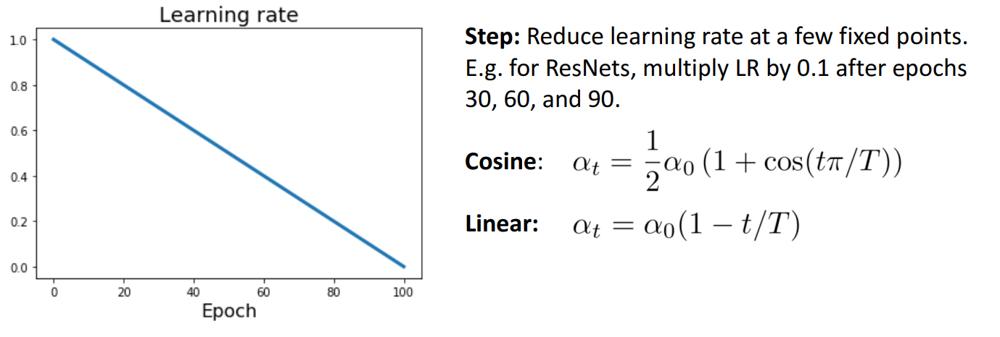
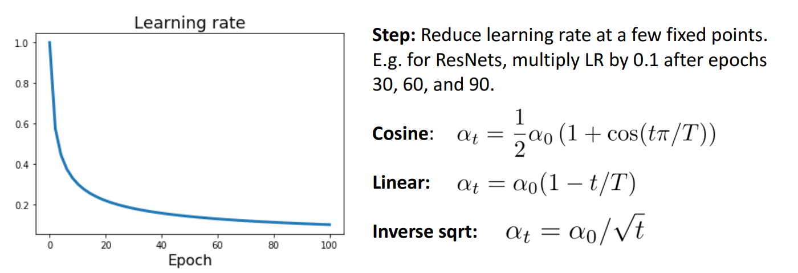
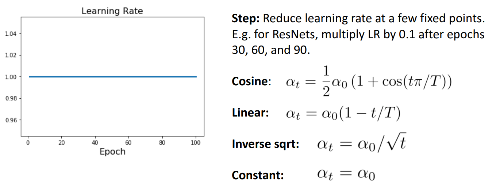
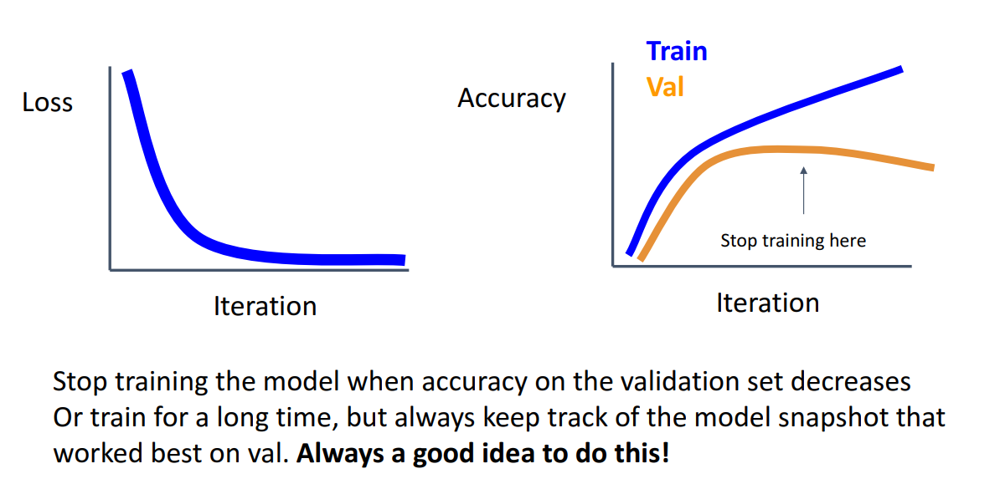

# 11. Training Neural Networks (Part 2)

**`강의 영상`**                      

https://www.youtube.com/watch?v=qcSEP17uKKY&list=PL5-TkQAfAZFbzxjBHtzdVCWE0Zbhomg7r&index=11

**`강의 자료`**

https://web.eecs.umich.edu/~justincj/slides/eecs498/498_FA2019_lecture11.pdf

___

# Learning Rate Scheduling

예전 강의에서 **SGD, SGD + Momentum, Adagrad, RMSProp, Adam** 등, **어떠한 `Optimizer`이던지 상관없이 모든 `Optimizer`는 `Learning rate`를 `Hyperparameter`로 갖는다.**

`Learning rate`는 Deep Learning model의 `Hyperparameter` 중 가장 중요한 `Hyperparameter` 중 하나이다.

- `Learning rate`가 너무 작은 경우, `Training`에 너무 **오랜 시간이 소요**된다.

- `Learning rate`가 너무 큰 경우, 최솟값을 지나칠 가능성이 있다.

따라서 가장 중요한 것은 **너무 크지도, 너무 작지도 않은 적당한 값의 `Learning rate`를 사용**하는 것이 중요하다. 

그럼 적당한 값의 `Learning rate`를 어떻게 찾을 수 있을까?

- 일반적으로 사용하는 방법은 **큰 `Learning rate`부터 시작해서 `Training`을 해보며 `Learning rate`를 조금씩 줄여나가는 것**이다.

- `Learning rate`를 바꾸어가며 **가장 좋은 성능을 내는 `Learning rate`를 선택**하기 때문에 `Learning rate scheduling`이라고 부른다.

### Learning Rate Decay: Step 

> **가장 많이 사용되는 Learning rate scheduling 방법 중 하나**

특정 `Epoch`마다 `Learning rate`를 **일정한 비율로 줄이거나 일정한 값만큼 감소**시키는 방법

`ResNet`에서 이 방법을 사용하였다.

- `RestNet`에서는 `Epoch`: 30, 60, 90마다 `Learning rate`를 10배씩 감소하는 방법을 이용하였다.

- 학습 초기에 `Learning rate`가 커서 **학습 초기에 빠르게 `Minimum`에 도달**할 수 있는 빠른 학습이 가능하다.

- 학습 후반에는 `Learning rate`가 작아서 **세밀하게 `Minimum`을 탐색**할 수 있다.

- 일반적으로도 **`Learning rate`를 학습 초기에 크게, 학습 후반에 작게 설정하는게 유리**하다.

하지만, 이 방법은 Model에 **너무 많은 `Hyperparameter`가 도입된다는 단점이 존재**한다.

- **어떤 `Epoch`마다 어떤 비율이나 크기만큼 `Learning rate`를 줄여야 할 지**에 대한 `Hyperparameter`가 요구된다.

- 모델에 `Hyperparameter`가 늘어날수록 **설계자가 투자해야하는 시간이 늘어나고**, **많은 `Trial and Error`를** 겪어야 한다.

### Learning Rate Decay: Cosine

전체 학습 `Epoch`에서의 `Learning rate`가 **Cosine 함수의 반주기**에 해당되도록 설정하는 방법

- $T$: Total Epoch, $\alpha_0$: Initial Learning rate, $t$: 현재 시점의 Epoch

이 방법을 사용하게 되면 **학습 초기에 `Initial learning rate`를 사용하고 전체 Epoch 후에는 `Learning rate`로 0을 갖도록 할 수 있다.**

이 방법을 `Learning rate`로 사용하게 되면, **추가적인 `Hyperparameter`가 필요없다**는 장점이 있다.

- **Cosine**을 사용했을 때, 요구되는 `Hyperparameter`는 **Total Epoch와 Initial Learning rate**인데, 이는 어느 `Learning rate`를 사용하던 Deep Learning Model을 설계할 때 항상 요구된다.

### Learning Rate Decay: Linear

**Cosine**처럼 **`Initial Learning rate`에서 시작하여 점점 감소하는 형태**를 갖는다.

**Cosine**과 **Linear**간의 성능은 거의 비슷하다.

- 대부분의 연구자들은 **각 분야의 선행 연구에서 어떤 방법을 사용했는지를 그대로 따른다.**

- 분야에 따라 각 방법이 뛰어난 경우가 있다.

### Learning Rate Decay: Inverse Sqrt

**Cosine, Linear**처럼 **`Initial Learning rate`에서 시작하여 점점 감소하는 형태**를 갖는다.

그러나 이 방법은 **Cosine, Linear**에 비해 **큰 `Learning rate`를 사용하는 구간이 비교적 짧은 것**을 확인할 수 있다.

### Learning Rate Decay: Constant

전체 `Epoch` 내내 동일한 `Learning rate`를 사용하는 방법이다.

Deep Learning Model을 구축하고 프로세스 초기에 사용하기 좋다.

- 다른 `Learning Rate Decay`를 이용하는 것은 **프로세스가 어느 정도 진행된 이후에 시도하는 편**이 낮다.

- **성능을 챙기는 것보다 빠르게 모델을 실행하고, 적용**해야할 때 유용하다.

### Addition

`Momentum + SGD`를 이용하는 경우에는 `Learning rate`가 감소하는 형태인 방법을 사용하는 것이 좋다.

하지만, `Adam`이나 `RMSProp`과 같이 복잡한 `Optimizer`를 사용하는 경우에는 `Constant`를 사용하는게 좋다.

### How long to train?

`Early Stopping`을 사용할 수 있다.

`Neural Network`를 `Training`할 때에는 **`Validation Accuracy`가 가장 높은 지점에서 꺾이기 시작할 때, `Training`** 을 중지시켜야 한다.

- 이를 위해, `Training` 과정에서 특정 `Epoch`마다 `Loss`와 `Accuracy`를 저장해 위 예시처럼 그래프로 시각화할 수 있어야 한다.