# 11. Training Neural Networks (Part 2)

**`강의 영상`**                      

https://www.youtube.com/watch?v=qcSEP17uKKY&list=PL5-TkQAfAZFbzxjBHtzdVCWE0Zbhomg7r&index=11

**`강의 자료`**

https://web.eecs.umich.edu/~justincj/slides/eecs498/498_FA2019_lecture11.pdf

___

# Training dynamics

아래에서 배울 내용들은 **Training 중에 시도할 수 있는 방법**들이다.

## Learning Rate Scheduling

예전 강의에서 **SGD, SGD + Momentum, Adagrad, RMSProp, Adam** 등, **어떠한 `Optimizer`이던지 상관없이 모든 `Optimizer`는 `Learning rate`를 `Hyperparameter`로 갖는다.**

`Learning rate`는 Deep Learning model의 `Hyperparameter` 중 가장 중요한 `Hyperparameter` 중 하나이다.

- `Learning rate`가 너무 작은 경우, `Training`에 너무 **오랜 시간이 소요**된다.

- `Learning rate`가 너무 큰 경우, 최솟값을 지나칠 가능성이 있다.

따라서 가장 중요한 것은 **너무 크지도, 너무 작지도 않은 적당한 값의 `Learning rate`를 사용**하는 것이 중요하다. 

그럼 적당한 값의 `Learning rate`를 어떻게 찾을 수 있을까?

- 일반적으로 사용하는 방법은 **큰 `Learning rate`부터 시작해서 `Training`을 해보며 `Learning rate`를 조금씩 줄여나가는 것**이다.

- `Learning rate`를 바꾸어가며 **가장 좋은 성능을 내는 `Learning rate`를 선택**하기 때문에 `Learning rate scheduling`이라고 부른다.

### Learning Rate Decay: Step 

> **가장 많이 사용되는 Learning rate scheduling 방법 중 하나**

특정 `Epoch`마다 `Learning rate`를 **일정한 비율로 줄이거나 일정한 값만큼 감소**시키는 방법

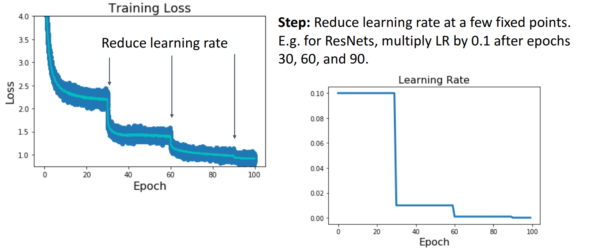

`ResNet`에서 이 방법을 사용하였다.

- `RestNet`에서는 `Epoch`: 30, 60, 90마다 `Learning rate`를 10배씩 감소하는 방법을 이용하였다.

- 학습 초기에 `Learning rate`가 커서 **학습 초기에 빠르게 `Minimum`에 도달**할 수 있는 빠른 학습이 가능하다.

- 학습 후반에는 `Learning rate`가 작아서 **세밀하게 `Minimum`을 탐색**할 수 있다.

- 일반적으로도 **`Learning rate`를 학습 초기에 크게, 학습 후반에 작게 설정하는게 유리**하다.

하지만, 이 방법은 Model에 **너무 많은 `Hyperparameter`가 도입된다는 단점이 존재**한다.

- **어떤 `Epoch`마다 어떤 비율이나 크기만큼 `Learning rate`를 줄여야 할 지**에 대한 `Hyperparameter`가 요구된다.

- 모델에 `Hyperparameter`가 늘어날수록 **설계자가 투자해야하는 시간이 늘어나고**, **많은 `Trial and Error`를** 겪어야 한다.

### Learning Rate Decay: Cosine

전체 학습 `Epoch`에서의 `Learning rate`가 **Cosine 함수의 반주기**에 해당되도록 설정하는 방법

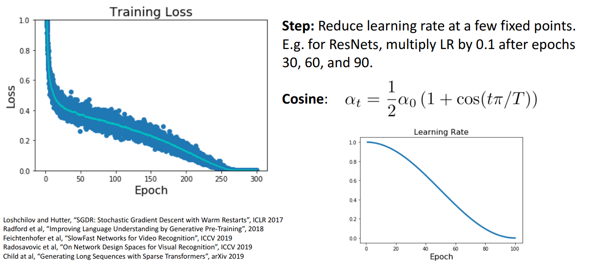
- $T$: Total Epoch, $\alpha_0$: Initial Learning rate, $t$: 현재 시점의 Epoch

이 방법을 사용하게 되면 **학습 초기에 `Initial learning rate`를 사용하고 전체 Epoch 후에는 `Learning rate`로 0을 갖도록 할 수 있다.**

이 방법을 `Learning rate`로 사용하게 되면, **추가적인 `Hyperparameter`가 필요없다**는 장점이 있다.

- **Cosine**을 사용했을 때, 요구되는 `Hyperparameter`는 **Total Epoch와 Initial Learning rate**인데, 이는 어느 `Learning rate`를 사용하던 Deep Learning Model을 설계할 때 항상 요구된다.

### Learning Rate Decay: Linear

**Cosine**처럼 **`Initial Learning rate`에서 시작하여 점점 감소하는 형태**를 갖는다.

**Cosine**과 **Linear**간의 성능은 거의 비슷하다.

- 대부분의 연구자들은 **각 분야의 선행 연구에서 어떤 방법을 사용했는지를 그대로 따른다.**

- 분야에 따라 각 방법이 뛰어난 경우가 있다.

### Learning Rate Decay: Inverse Sqrt

**Cosine, Linear**처럼 **`Initial Learning rate`에서 시작하여 점점 감소하는 형태**를 갖는다.

그러나 이 방법은 **Cosine, Linear**에 비해 **큰 `Learning rate`를 사용하는 구간이 비교적 짧은 것**을 확인할 수 있다.

### Learning Rate Decay: Constant

전체 `Epoch` 내내 동일한 `Learning rate`를 사용하는 방법이다.

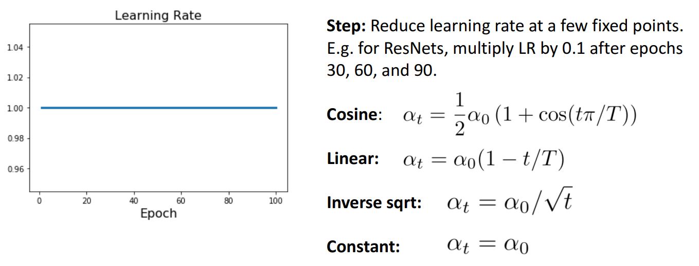

Deep Learning Model을 구축하고 프로세스 초기에 사용하기 좋다.

- 다른 `Learning Rate Decay`를 이용하는 것은 **프로세스가 어느 정도 진행된 이후에 시도하는 편**이 낮다.

- **성능을 챙기는 것보다 빠르게 모델을 실행하고, 적용**해야할 때 유용하다.

### Addition

`Momentum + SGD`를 이용하는 경우에는 `Learning rate`가 감소하는 형태인 방법을 사용하는 것이 좋다.

하지만, `Adam`이나 `RMSProp`과 같이 복잡한 `Optimizer`를 사용하는 경우에는 `Constant`를 사용하는게 좋다.

### How long to train?

`Early Stopping`을 사용할 수 있다.

`Neural Network`를 `Training`할 때에는 **`Validation Accuracy`가 가장 높은 지점에서 꺾이기 시작할 때, `Training`** 을 중지시켜야 한다.

- 이를 위해, `Training` 과정에서 특정 `Epoch`마다 `Loss`와 `Accuracy`를 저장해 위 예시처럼 그래프로 시각화할 수 있어야 한다.

## Choosing Hyperparameter

### 1. Grid Search

> **가장 흔하게 시도하는 방법**

`Hyperparameter`로 사용하고 하는 값을 **`Hyperparameter` 집합**으로 만들고, **그 값을 모두 이용하여 테스트해보고 가장 성능이 좋은 것을 선택하는 방법**

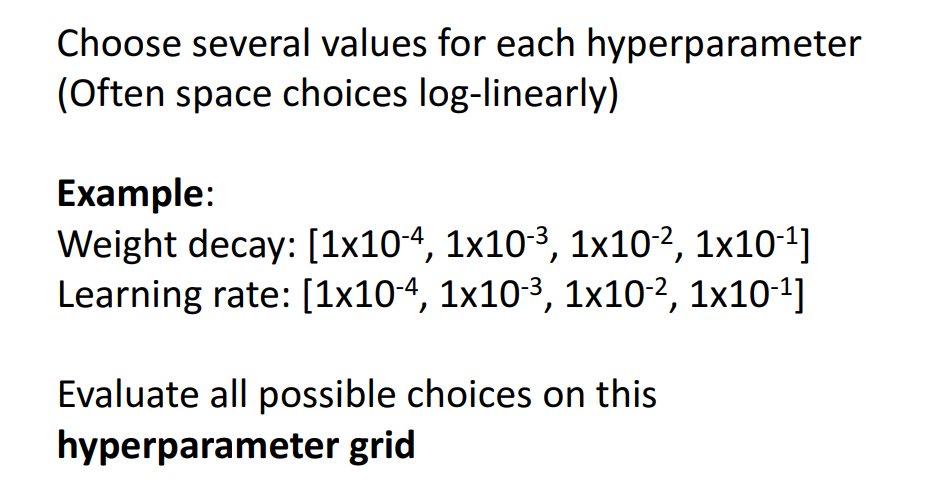

- 보통 한 집합 내에서 `Hyperparameter`값들은 `Log`를 취했을 때, `Linear`하도록 설정한다.

하지만, 모든 가능한 `Hyperparameter` 집합에 대해 전부 테스트 해야하기 때문에 **`GPU`가 충분한 경우에만 사용할 수 있는 방법**이다.

___
### 2. Random Search

> **Grid Search가 요구하는 GPU 성능이 부담되는 경우에 주로 사용하는 방법**

`Hyperparameter` 집합을 설정하는 것이 아니라, `Hyperparameter`의 **가능한 범위**만을 지정해주면 **`Training` 시마다 범위내에서 `Random`한 값을 사용하는 방법**이다.

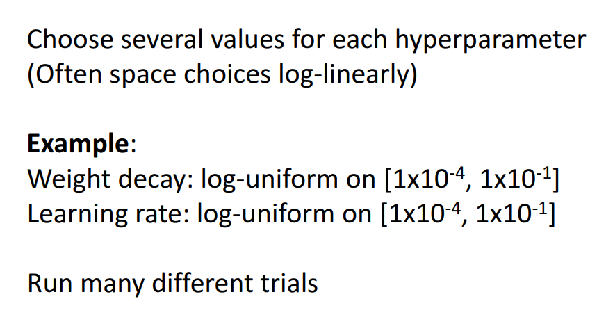

여전히 꽤 많은 `GPU`의 사용이 필요하지만, `Grid Search`에 비해 비교적 낫다.

### Example

보라색 부분이 성능이 좋은 부분이다.

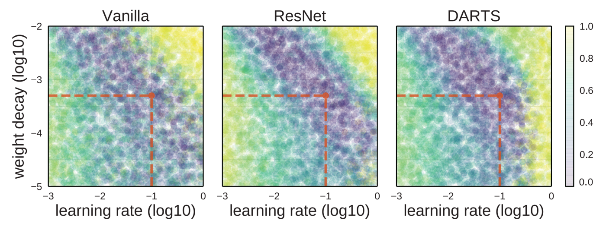

- 붉은색 선 부분은 **가장 성능이 좋은 `Hyperparameter`를 의미한다.**

___

### Grid vs Random

> **Random Search 방법이 Grid Search에 비해 더 적은 시도를 통해 더 좋은 성능을 내고, GPU도 비교적 적게 사용할 수 있는 이유를 알아보자.**

아래 예시는 두 `Hyperparameter`가 존재할 때, 한 `Hyperparameter`는 성능에 중요한 영향을 미치고, 다른 `Hyperparameter`는 큰 영향을 미치지 않는 경우이다.

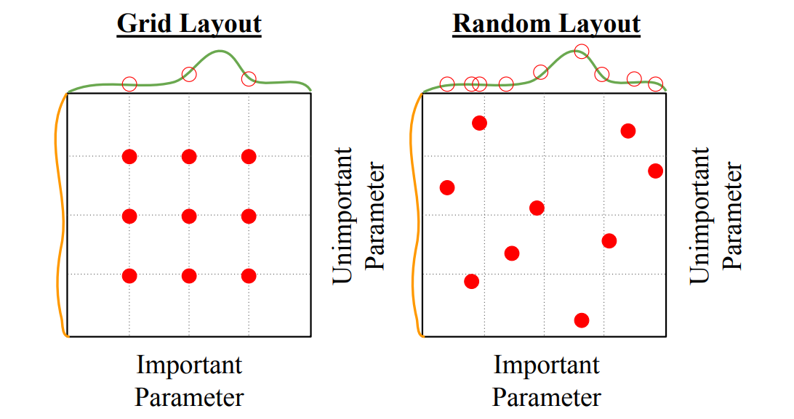

위 같은 경우에, `Grid Search`는 각 `Hyperparameter`에 대해 9번의 `Training`에도 불구하고, **3개의 Sample만**을 얻을 수 있게 된다.

- 이것은 여러번의 시도에도 불구하고, **특정 `Hyperparameter`의 성능 분포를 비교적 정확하게 알 수 없을 가능성이 크다**는 것을 의미한다.

- 중요하다고 생각되는 `Hyperparameter` 집합의 크기를 늘리면 해결되지만, **`Training` 전에 어떤 `Hyperparameter`가 중요할 지 알 수 없다는 것이 문제**가 된다.

반면, `Random Search`는 9번의 `Training`에 **특정 `Hyperparameter`의 성능 분포에 대해 9개의 Sample**을 얻을 수 있다.

- 이는 `Hyperparameter`의 성능 분포를 **비교적 정확**하게 알 수 있다는 것을 의미한다.

추가로, `Random Search`는 범위 내에서 특정 값을 갖도록 강제하는 것이 아니라 **랜덤하게 샘플링**하기 **정확히 최고의 성능**을 갖도록 하는 `Hyperparameter`를 정확하게 나타낼 수도 있다.

- 사전에 어떤 `Hyperparameter`가 중요한지 몰라도, 랜덤하게 찾기 때문에 **최고의 성능을 가지는 하이퍼파라미터 조합에 더 쉽게 도달**할 수 있다.

____

이 아래부터는 많은 양의 `GPU` 사용 없이, `Hyperparameter`를 선택하는 방법을 알아보자.

### 1. Initial Loss Check

우선 모델을 구현하고, 가장 먼저 해야하는 일은 `Initial Loss`를 확인하는 것이다.

- 이전에 `Hinge loss`와 `Cross Entropy Loss` 두 가지 `Loss function`을 배울 때, 배웠던 것처럼 **사용하는 `Loss function`의 종류에 따라, `Training`을 진행하지 않았을 때 근사치로 나와야하는 값이 존재한다.**

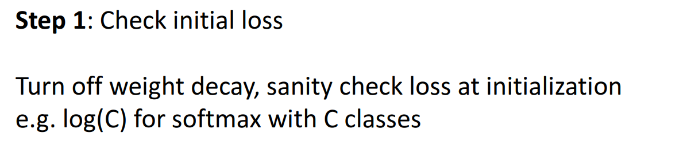

- `Weight Update`를 끄고, 한번 실행하여 `Loss` 값이 무엇인지 확인한다.

### 2. Overfit a small sample (5 ~ 10 Batch)

다음으로 할 작업은 **매우 작은 5 ~ 10개의 Sample로 이루어진 Batch**에 대해 **모델이 거의 100%의 정확도를 가질 수 있도록 `Overfit`하는 것**이다.

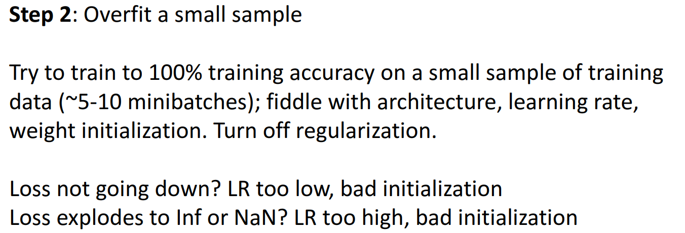
정하고 
- **Architecture의 Layer, size / Learning rate, Weight Initialize를 조절하여 100%에 가까운 정확도를 얻을 수 있어야 한다.**
  
- 이 단계에서 **낮은 정확도**를 얻는다면, 전체 Training Dataset에 대해 **높은 정확도를 얻을 가능성은 거의 없다.**

- 이 단계에서 **낮은 정확도를** 얻는다면, **최적화 과정에서의 버그** 등을 의심해보아야 한다. 

중요한 점은 Data에 대해 `Overfit` 시켜야하기 때문에, **`Regulraization` = `Weight Decay`를 꺼야한다는 점**이다.

### 3. Find Learning Rate that makes loss go down

이 단계부터 전체 `Training Dataset`을 사용한다.

두 번째 단계에서 **사용한 모델 전체**를 그대로 불러와서, 전체 `Training Dataset`에 대해 적용한다.

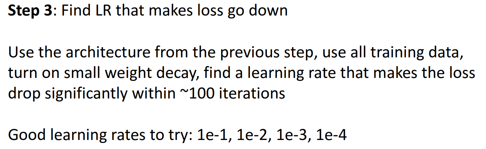

- 이 단계에서의 목표는 **`Learning rate`와 `Weight Decay`를 조정**하여, **처음 100번의 Iteration 내에 `Loss`를 크게 줄여 수렴**시키는 것이다.

- 처음 100번 내에 줄여야하는 이유는 경험적으로 **`Loss`가 초반 `Iteration`에 `Exponential` 하게 감소하는 경향**이 있기 때문이다.

### 4. Coarse grid, Train for ~1-5 epochs

세 번째 단계에서 얻은 모델이 **가장 좋은 성능을 보이는 `Learning rate`와 `Weight Decay` 근처에서 아주 작은 `Grid`를 사용**하여 **1 ~ 10회 사이의 적은 `Epoch`로 `Grid Search`를** 해본다.

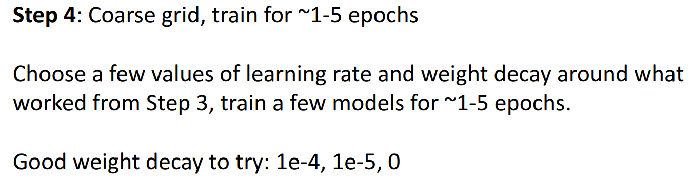

### 5. Refine grid, Train longer

네 번째 단계에서의 결과를 보고, **`Grid`를 세밀하게 조정**하여 **네 번째 단계보다 길게 학습**시킨다.

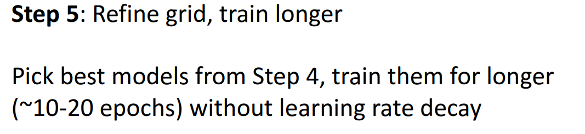

### 6. Look at Learning Curve

다섯 번째 단계의 결과를 이용하여 `Learning Curve`를 얻고, 분석하여 더 세밀하게 모델을 조정한다.

### 7. GOTO step 5

여섯 번째 단계의 결과를 분석하여, `Hyperparameter`를 조정하여 **다섯 번째 단계부터 다시 진행**한다.

____

`Learning Curve`에 대해 자세히 알아보자

일반적인 `Learning Curve`는 아래와 같이 이루어진다.

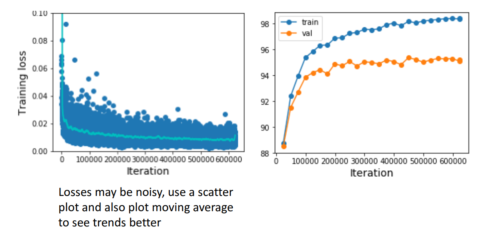

- `Loss`의 경우 `Nosiy`하기 때문에 평균선으로 나타내는 경우가 많다.

`Learning Curve`를 분석하는 방법을 살펴보자.

### 1. `Loss Curve`가 초반에 평평하다가 갑자기 급격히 감소지는 경우

**초반에 학습이 제대로 이루어지지 않은 것**을 의미하기에, **`Weight Initialize`가 잘못되었을 가능성이** 크다.

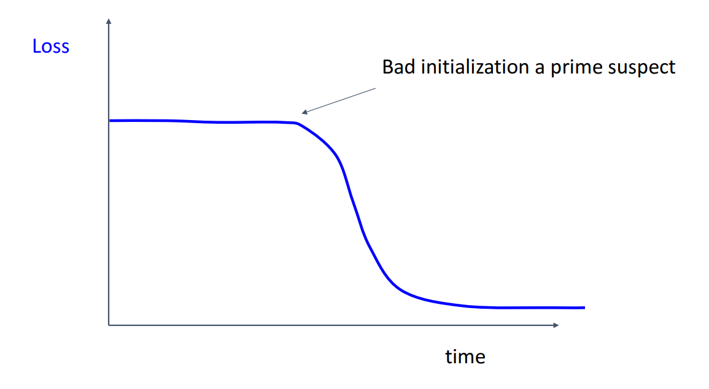

### 2. 초반에 `Loss`가 갑소하다가 점점 학습이 이루어지지 않는 경우

**`Learning rate`가 커서 중후반에 학습이 제대로 이루어지지 않았을 가능성이 크기 때문에 `Learning rate decay`를 시도해야 한다.**

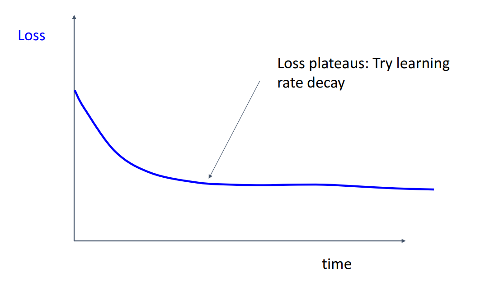

`Learning rate decay`를 너무 이른 시간에 시도하면 아래와 같이 학습이 중단될 수 있다.

- 그래프를 보면, 학습이 정체되기 직전에 **크게 감소하는 구간**이 보인다.

- **`Learning rate`를 그대로 놔뒀으면 학습이 제대로 이루어졌을텐데,** `Learning rate`가 감소되어 학습이 제대로 이루어지지 않은 것을 의미한다.

### 3. `Train Accuracy`와 `Validation Accuracy`가 계속 증가하는 경우

**`Accuracy`가 감소하지 않았다는 것**은 더 `Training`하면 Accuracy가 늘어날 수도 있기 때문에 **`Training`을 더 길게 진행**해야 한다.**

### 4. `Train Accuracy`와 `Validation Accuracy`간의 차이가 많이 나는 경우

`Train Accuaracy`가 `Validation Accuarcy`보다 큰 경우, `Overfitting`을 의미하기 때문에, **`Regularization`을 적용해야 한다.**

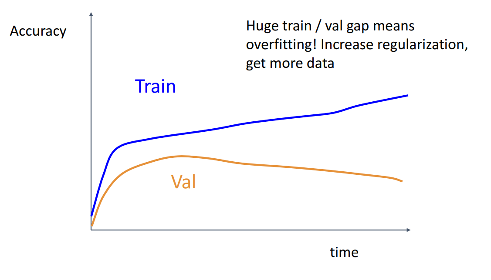

### 5. `Train Accuracy`와 `Validation Accuracy`간의 차이가 나지 않는 경우

`Train Accuaracy`와 `Validation Accuarcy` 차이가 나지 않는 경우, `Underfitting`을 의미하기 때문에, **모델의 크기를 늘리거나 `Regularization`을 줄여야 한다.**

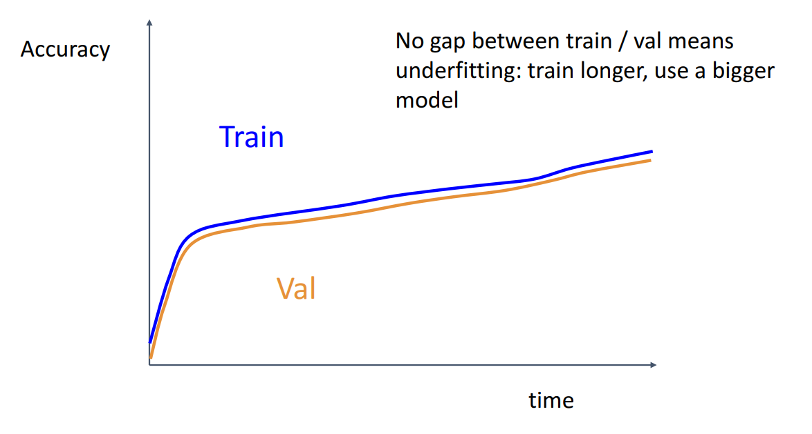

- 경험적으로, 이미 본 `Training Data`와 본 적이 없는 `Validation Data` 간에는 **어쩔 수 없는 차이가 존재**하기 때문이다.

## Addition

우리가 `Deep Learning Model`을 설계하면서 다룰 수 있는 `Hyperparameter`는 대표적으로 아래와 같다.

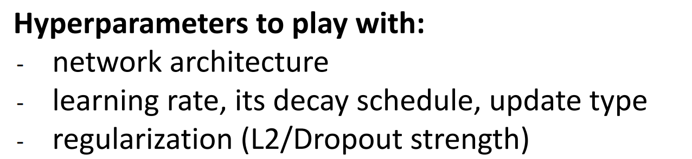

다른 효율적인 방법은 `Cross Validation`을 이용하는 방법도 있다.

`Hyperparameter`를 설정하고 `Training`할 때, 내가 **설정한 `Hyperparameter`가 잘못되었는 지 확인할 수 있는 방법**도 있다.

이 중 한가지는 `Ratio of Weight Update`와 `Weight Magnitude`를 살펴보는 것이다.

일반적으로 **`Weight`를 업데이트하기 전의 `Weight` 값 자체와 `Weight`가 업데이트되는 비율**간의 **비율**은 너무 크면 좋지 않다.

- `Update할 Weight 값` / `Update할 Weight의 비율`

- **0.001과 유사한 값을 갖는 것이 좋다**고 한다.

- 이를 디버깅 방법 중 하나로 사용할 수 있다.
  

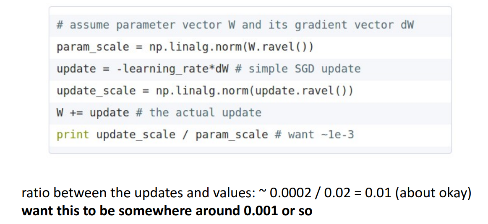

- 이를 통해, `Learning rate`, `Weight Initialize`가 적절한 지 확인할 수 있다.

# After Training

> **성공적으로 모델을 학습시킨 이후, 더 좋은 성능을 얻기 위해 할 수 있는 작업을 살펴보자.**

## Model Ensembles

> **더 좋은 성능을 얻기 위해, 서로 다른 N개의 모델을 각각 훈련시킨 이후 Test time에는 모든 모델을 이용하고 결과를 평균내는 방법**

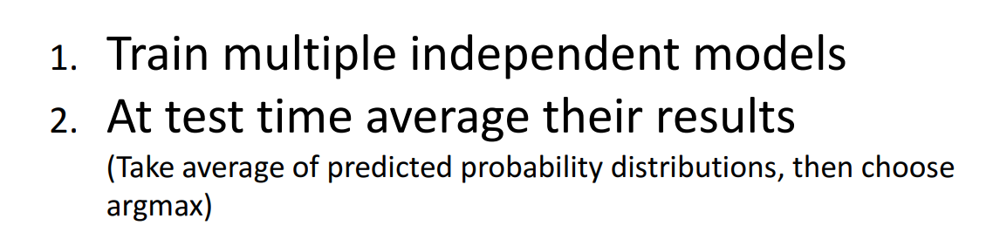

- 이 방법을 이용하면, 평균적으로 **1 ~ 2% 나은 결과**를 얻을 수 있다.

### Tricks for Modle Ensembles

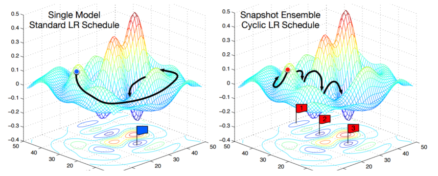

1. Training 중간에 **전체 Model에서의 결과를 평균**내어, Training 중 **Parameter update에 사용**할 수 있다.

2. `Cyclic Learning rate`가 `Model Ensemble`을 사용하는 경우에 도움이 될 때도 있다.

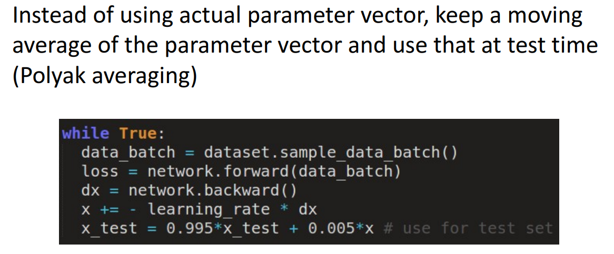

3. 실제 값의 `Parameter`를 사용하는 대신, **`Parameter`의 이동 평균**을 구하는 것이 도움이 되기도 한다.

## Transfer Learning

> **한 분야의 문제를 해결하기 위해서 얻은 지식과 정보를 다른 문제를 푸는데 사용하는 방법**

> **CNN Architecture를 완벽하게 학습시키기 위해선 매우 큰 크기의 Dataset이 필요하다는 문제를 해결하기 위해 사용하는 방법**

- 매우 **큰 Dataset으로 `Pre-training`한 모델**을 사용하면, **내가 사용하고자 하는 적은 Dataset을 이용해도 좋은 성능**을 얻을 수 있다.

`Image Classification`에서 사용했던 `CNN Model`을 더 좋은 성능을 위해 다르게 사용할 수 있다.

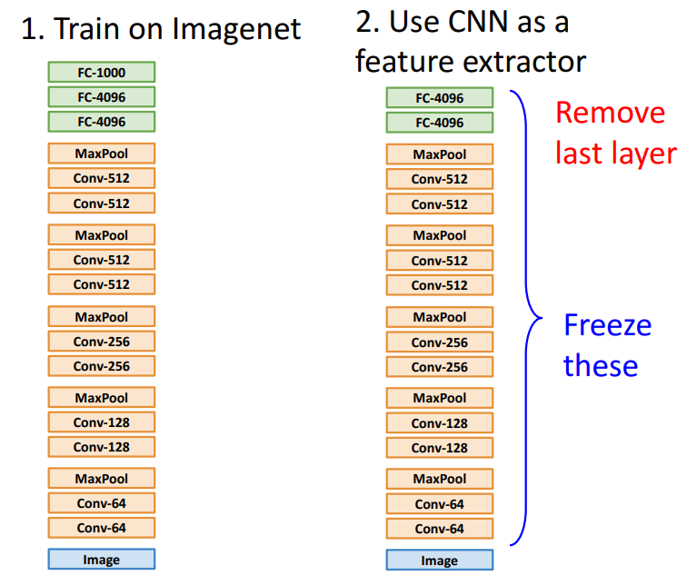

1. 먼저 큰 Dataset으로 학습을 시킨다.

2. 원래 `CNN Architecture`에서 마지막 `Layer`는 `Classification (Score)`를 위한 `Layer`이기 때문에 **단순 `Feature Extractor`로써의 역할만 하도록 마지막 `Layer`를 제거한다.**

   - (1)에서 얻은 모델을 그대로 가져와서 **마지막 `Layer`만 제거**하고 나머지 `Parameter`는 **Freeze한다.** 

    - 새롭게 분류하고자 하는 `Dataset`에 대해 **새롭게 만든 `Classifier`만 학습**한다.

`Transfer Learning`을 적용한 `Model`로 `ImageNet` Dataset이 아니라, **비교적 작은 크기**의 `Caltech-101` Dataset을 분류해보니, 아래와 같은 결과를 얻을 수 있었다.

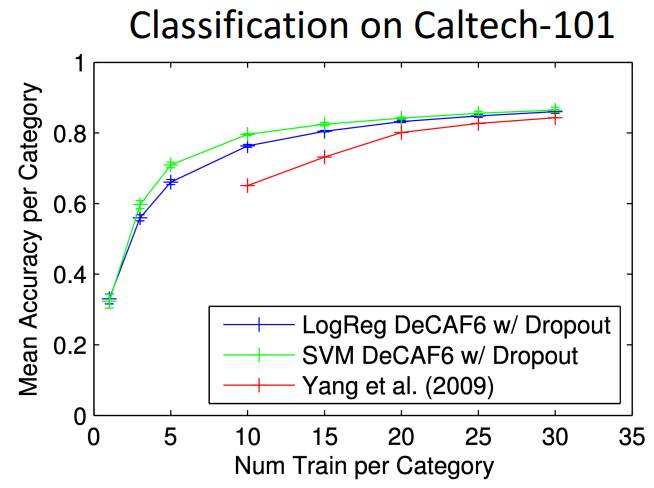

- 빨간색이 `Caltech-101`만을 이용하여 `Training`한 Model을 나타낸다.

- 나머지 두 곡선은 각각 다른 `Loss function`을 이용하여 `ImageNet`으로 `Training`한 Model을 이용한 Model이다.

- **`Pre-trained Model`을 사용하는 것이 더 효과적**임을 확인할 수 있다,

`Caltech-101` 뿐만 아니라, 다른 `Dataset`에서도 `Transfer Learning`을 이용한 Model이 **더 좋은 성능**을 내고 있다.

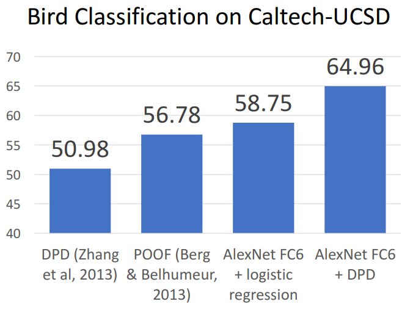

다양한 분야에서도 **`Tranfer Learning`을 이용한 Model의 성능이 뛰어남을 확인**할 수 있다.

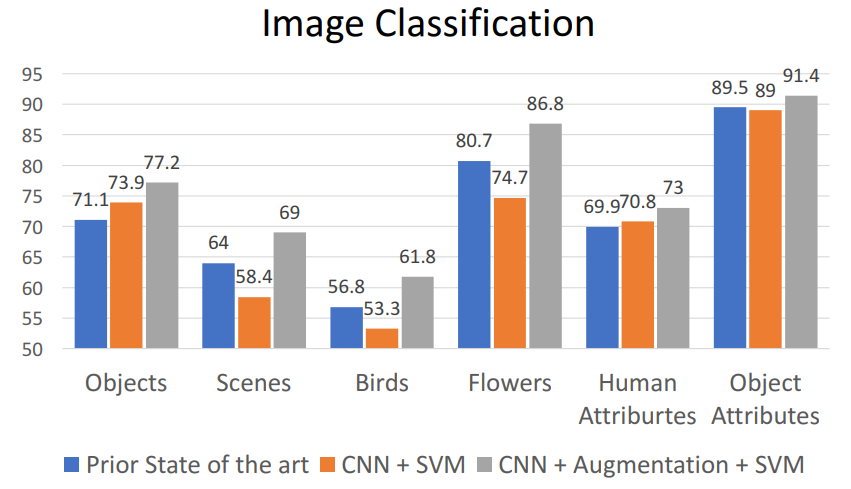

추가로, 기존 `CNN Architecture`를 이용하여 얻은 **`Feature Vector`에 `Nearest Neighbor` 방법을 적용하면 좋은 성능**을 얻을 수 있다.

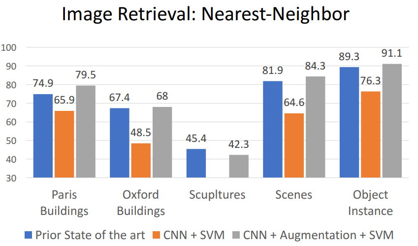

즉, 기존 `CNN Architecture`를 이용하여 **`Feature Vector`를 얻고 그 위에 새로운 알고리즘을 적용**하는 방법은 효과적이다.

- 가장 흔한 방법은 **내가 분류하고자 하는 `Class`에 맞는 새로운 `FC Layer`를 정의**하는 방법이다.

___ 

새롭게 분류하고자 하는 `Dataset`이 크지 않다면, 위 방법대로만 해도 **좋은 성능**을 얻을 수 있다.

그러나, `Dataset`이 큰 경우에는 **`Fine-Tuning`을 추가적으로 해주는 것이 더 좋은 성능**을 얻을 수 있게 해준다.

위에서 (2) 과정과 다르게, `Conv Layer`에 대한 `Parameter`를 **Freeze하는 것이 아니라, `Training`할 때 Update 한다.**

- 즉, `Pre-Trained Model`에서의 **`Parameter` 값을 초기값**으로 사용한 상태에서, **새로운 `Dataset`에 맞추어 `Fine-Tuning`한다.** 

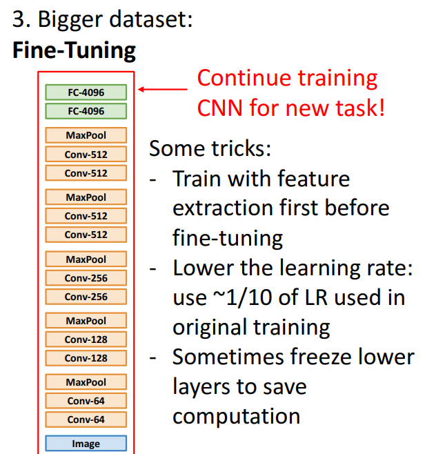

`Fine-Tuning` 시 몇 가지 팁이 있다.

1. Model 전체에 대해 `Fine-Tuning` 하기 전에, 새롭게 만든 `Classifier` 먼저 `Training`하고, 전체 모델을 `Training`하는 것이 낫다.

2. `Pre-Trained Model`에서의 `Parameter`를 크게 바꾸지 않도록 기존 `Learning rate`의 **1/10 수준의 작은 값의 `Learning rate`를 사용**한다.

3. `ConV Layer`의 **하위 (초반부) Layer**는 `Edge`, `Corner`, `Texture` 등의 **일반적인 성질**을 나타내는 경우가 많아서 **Freeze**하고, **중간 Layer부터 `Fine-Tuning`하는 것이 더 좋은 성능**을 낼 수도 있다. 

`Fine-Tuning`은 다양한 분야에서 더 좋은 성능을 낸다.

예시로는 `Object-Detecting`을 들 수 있다.

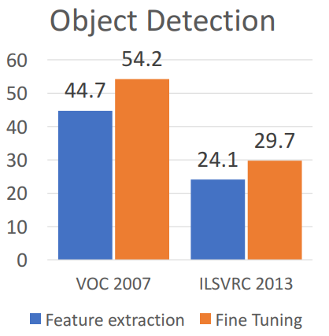

___

`Tranfer Learning`을 사용할 땐, **어떤 `Architecture`를 사용할 지**가 굉장히 중요해진다.

일반적으로, **`ImageNet Classification Challenge`의 우승 모델**들이 다른 `Computer Vision` 문제에서 더 잘 동작하는 경향이 있다.

즉, `Downstream Task` 작업에서 `ImageNet Classification`에 사용된 모델을 이용하는 것은 **굉장히 유용**하고, **좋은 성능**을 얻을 수 있다는 기대감을 준다.

- `Downstream Task`: **사전 학습(pre-training)된** 모델을 활용하여 수행하는 **목표 과제(task)**

`Object Detecting`에서 `ImageNet Classification` 모델을 사용한 예시를 확인할 수 있다.

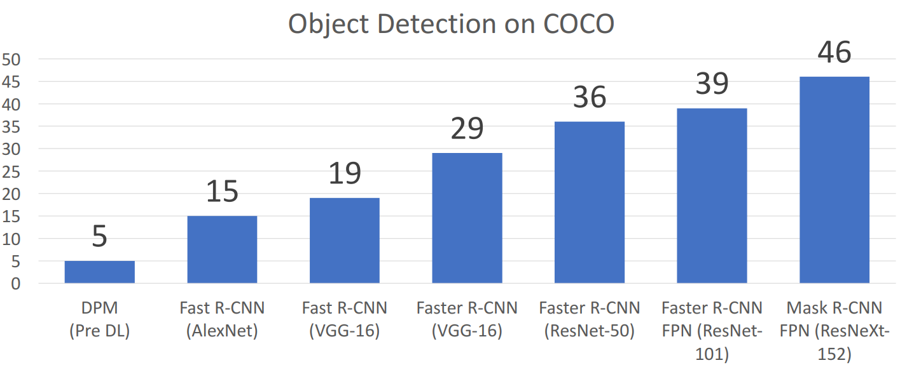

___

이러한 `Transfer Learning`을 이용할 땐, **Dataset의 크기나 종류**에 따라 **`pre-trained model`을 어떻게 수정할 지**가 달라진다. 

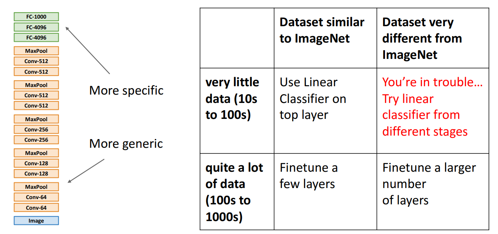

- `Dataset`의 크기가 작고, `ImageNet`과 유사할수록 적은 `Layer`를 `Training` 한다.

- `Dataset`의 크기가 크고, `ImageNet`과 유사하지 않을수록 많은 `Layer`를 `Training` 한다.

- 그러나, `Dataset`의 크기가 작은데 `ImageNet`과 유사하지 않은 경우에는 문제가 된다.

    - 이 경우, `Classifier`부터 시작해서 **여러 시도**를 해봐야한다.

`Object Detecting`, `Image Captioning` 등에서도 `Transfer learning`을 이용하고, `ImageNet`을 이용해 `Pre-trained`된 모델을 사용한다.

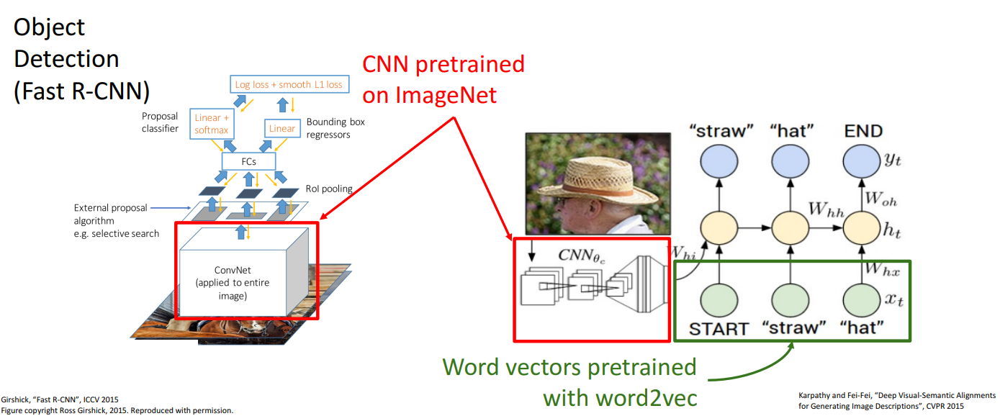

`Image Captioning`에서 사용한 `Transfer Learning`에 대해 자세히 살펴보자.

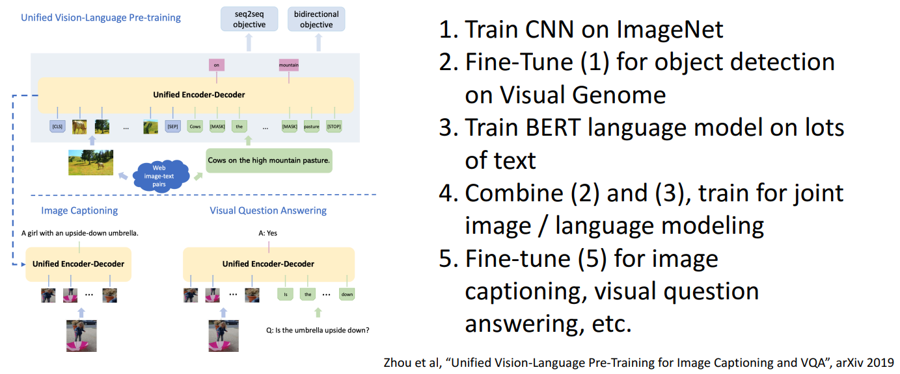

`Object Detecting`의 한 예시에서는 **Model을 처음부터 설계하는 방법도 `Pre-trianed Model`을 사용하는 만큼 좋은 성능을 낼 수 있지만 `Training time`에서 약 3배 더 오래 걸린다는 점을 보여준다.**

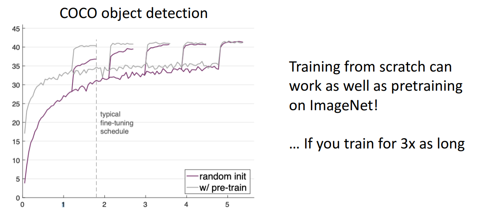

추가로, **`Training Dataset`이 굉장히 작은 경우**에는 **`Pre-training` + `Fine-Tuning`은 처음부터 모델을 설계하는 경우보다 좋은 성능**을 보인다.

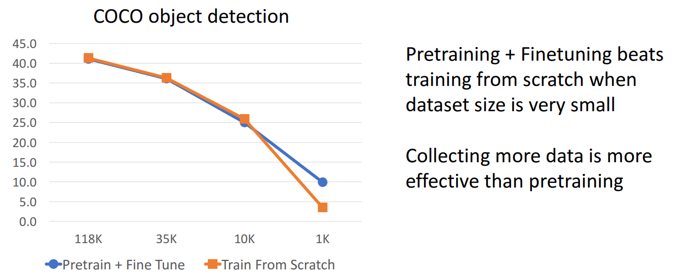

- 주의할 점은, `Training Dataset`이 매우 큰 경우에서도 **`Pre-trained Model`을 사용하는 것은 `Training Time` 관점에서 이점을 가져다준다는 점이다.**

## Distributed Learning

> **사용 가능한 `GPU`가 여러 개 있을 때, 이를 최대한 활용하여 모델의 `Training Time`을 줄일 수 있는 방법에 대해 알아보자.**

먼저 **모델 자체를 나누어 다른 GPU로 연산하는 방법**에 대해 알아보자.

### 1. Run different layers in different GPUs

모델의 `Layer`를 여러 부분으로 나누어 **다른 `GPU`에서 실행**할 수 있다.

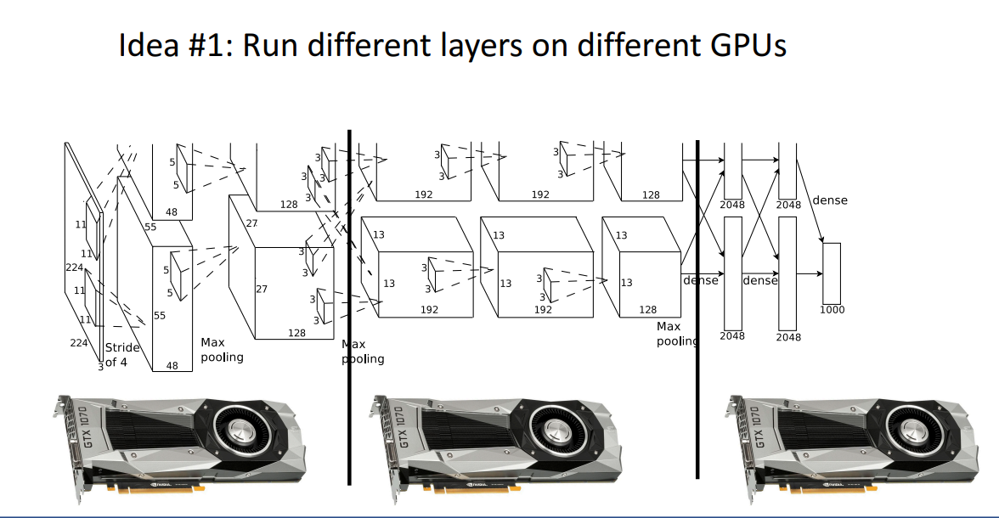

- 그러나 이 방법은 **`Layer`의 연산이 순서대로 이루어져야 하기 때문에, `GPU`가 놀게된다는 단점**이 있다.

### 2. Run parallel branches of model on different GPUs

모델 중 **병렬로 처리 가능한 부분은 나누어서 다른 GPU에서 실행**하는 방법

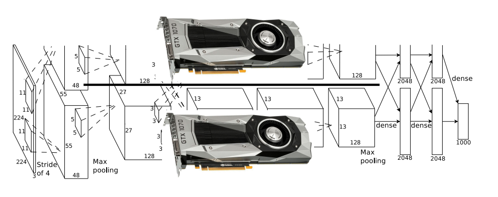

- `AlexNet`에서 사용한 방법으로, (1)번 방법에 비해 효율적이기 때문에 실현 가능성이 크다.

**`GPU`간의 `Synchronizing`이 굉장히 비싸다는 단점**이 있다.

- 특히, 서로 다른 `GPU`에서 돌아가는 부분에 대해 `Activations`과 `Gradient` 전달이 어렵다.

즉, **Model 자체를 나누는 방법은 실현하기 굉장히 어렵다.**

따라서 우리는 **각 GPU에 동일한 Model을 복사하고, Training Data를 GPU 개수만큼 나누어 각 GPU에서 Training하는 방법을 사용할 수 있다.**

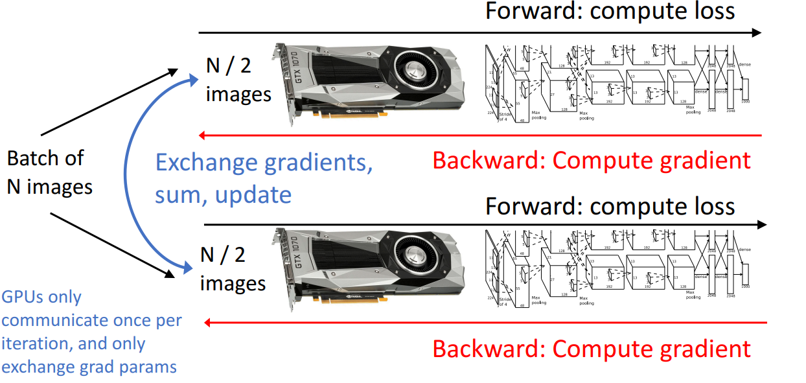

- **`Forward`와 `Backward`에서 `GPU`간의 `Communication`이 필요없다**는 장점이 있다.

- `Backward` 과정 이후, `GPU`간의 `Communication`을 통해 **각각 구한 `Gradient`를 모두 더하는 과정**이 필요하다.

- 실제로 **가장 많이 사용하는 방법이다.**

추가로, 이 방법은 **GPU 개수에 의해 성능이 제한받지 않는다.**

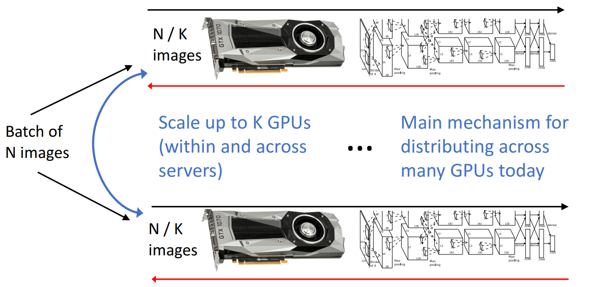

추가로 시도할 수 있는 방법은 **각 Server내에서 Model을 나누는 방법을 시도하고, 전체 Server를 추가로 병렬 처리하는 방법이다.**

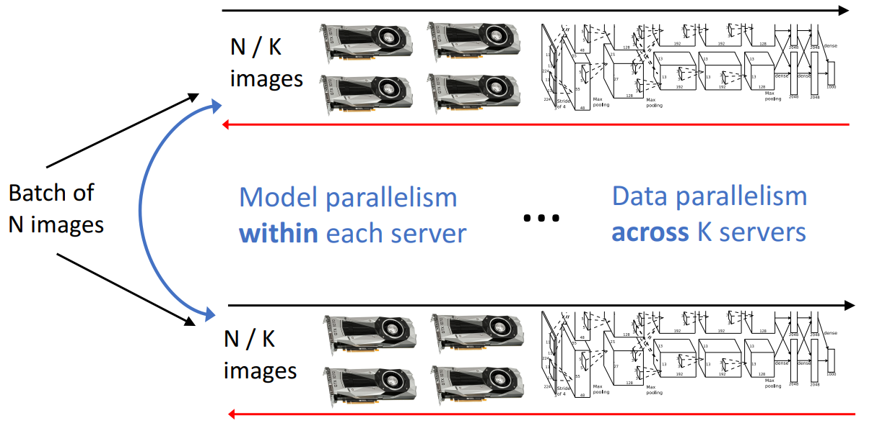

그러나 이 방법은 **필요한 `GPU`의 개수가 너무 많다는 단점**이 있다.

## Large-Batch Training

하나의 `GPU`에서 잘 동작하는 `Model`을 시간 절약을 위해 여러 개의 `GPU`에서 돌리고 싶은 상황을 가정해보자.

- 그렇다면, 각 `GPU`로 돌리는 `Batch size`는 **하나의 `GPU`를 사용할 때 썼던 `Batch`를 `GPU` 개수로 나눈 것**이다.

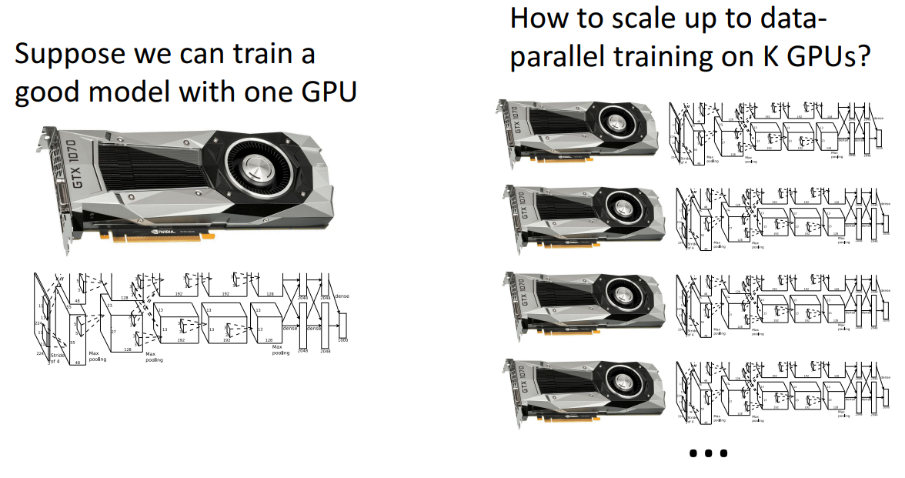

같은 수의 `Epoch`로 $K$개의 `GPU`를 이용하여 $K$배 빠르게 `Model`을 학습시키기 위해서는 **더 큰 minibatches가 필요**하다.

### Scale Learning Rate

일반적으로 하나의 `GPU`에서 `Learning rate`: $\alpha$, `Batch size`: $N$으로 잘 동작하던 모델을 $K$개의 `GPU`에서 잘 동작하도록 만드려면 **`Learning rate`: $K\alpha$, `Batch size`: $KN$을 사용하는 것이 좋다.**

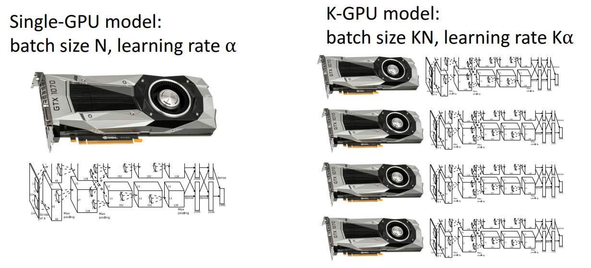

### Learning Rate Warmup 

`Scale Learning Rate`처럼 `Learning rate`를 바로 $K$배 해버리면, **학습 초반에 `Loss`가 Explode되는 경우가 많다.**

이를 방지하기 위해, **`Learning Rate를 0부터 시작하여 처음 5000번째 전 반복까지 Linearly Increasing하는 방법이 있다.**

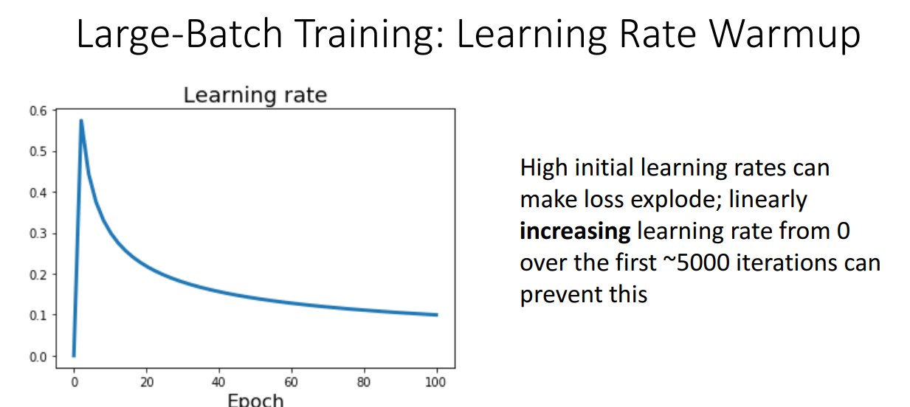

### Other Concerns

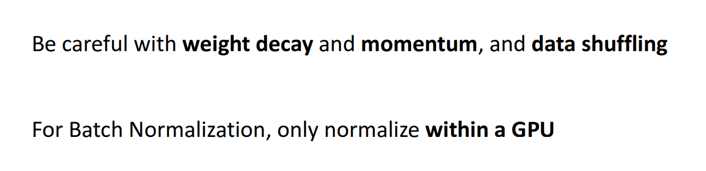

### Results

`ResNet`을 **큰 Batch size와 많은 수의 `GPU`를** 이용하여 **한 시간만에 학습**시킬 수 있었다는 것을 확인할 수 있다.

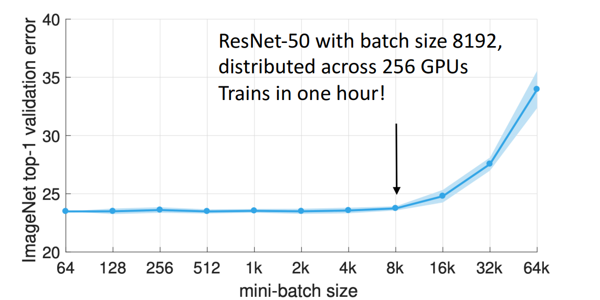