# 12. Recurrent Neural Networks 

**`강의 영상`**                      

https://www.youtube.com/watch?v=qcSEP17uKKY&list=PL5-TkQAfAZFbzxjBHtzdVCWE0Zbhomg7r&index=12

**`강의 자료`**

https://web.eecs.umich.edu/~justincj/slides/eecs498/498_FA2019_lecture12.pdf

___

11강까지 봤던 `Neural Network`는 모두 `Feedforward Neural Network`이다.

- 하나의 `Layer`가 **하나의 intput을 받고, 하나의 Output을 다음 하나의 Layer로 전달**하는 것을 의미한다.

- 하나의 `Input`이 하나의 `Output`을 만들어 낸다.

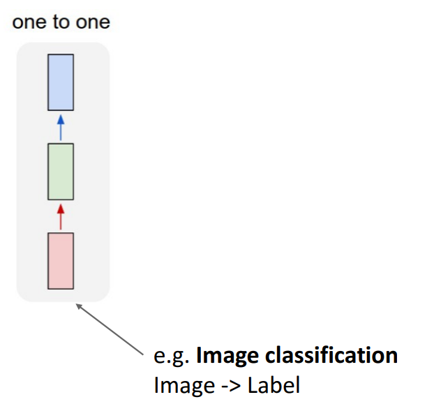

그러나, `Feedforward` 방식의 `Network`만 존재한다면, **다른 목적을 가진 작업에는 효과적이지 않**을 수 있다.

`Feadforward` 방식이 적합하지 않은 예시로는 여러 개가 있다.

먼저, `Image Captioning`의 경우에는 **하나의 입력을 받아 여러 Output(word)를 출력해야 한다.**

- `one to many` 방식이 요구된다.

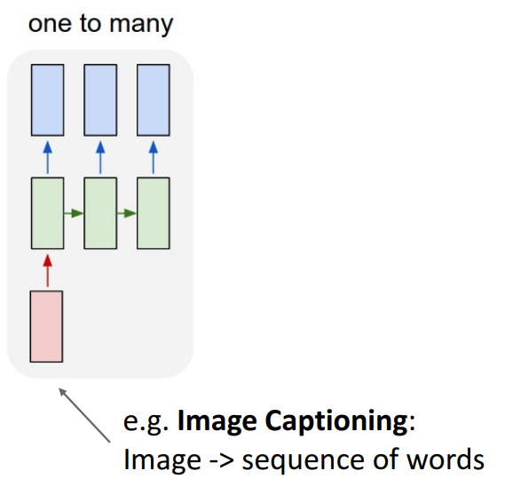

`Video Classification` 같은 경우, **`Video`가 여러 이미지 프레임의 연속**이기 때문에 **모델은 여러개의 입력**을 받을 수 있어야 한다.

- `many to one` 방식이 요구된다.

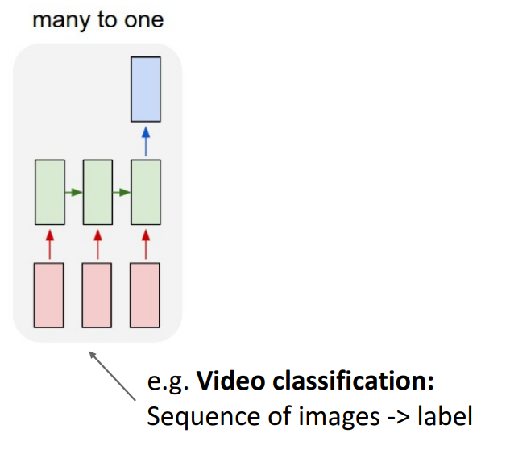

`Machine Translation`은 **번역해야 되는 언어를 입력받고 번역한 언어를 출력**해야 하기 때문에 **여러 개의 입력, 여러 개의 출력**이 필요하다.

`Per-frame video classification`의 경우에는 `Video Classification`과 동일하지만, **각 Frame 당 Classification을 수행**해야 하기 때문에 **여러 개의 입력, 여러 개의 출력**이 필요하다.

- `many to many` 방식이 요구된다.

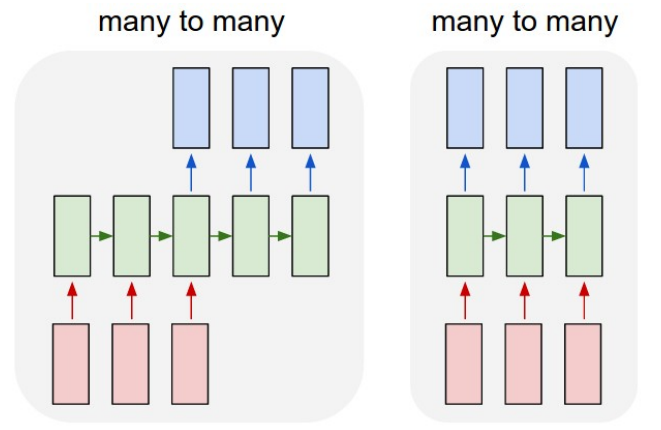

___

> **즉, Feadforward 방식만 사용하는 것이 아니라, 주어진 Task에 맞는 목적에 맞는 방식으로 네트워크를 구축해야 한다.** 

- 더 일반화된 기능을 수행할 수 있다.

`Feadforward` 방식을 제외한 다른 방법 모두 `Seqeunce`를 갖는다.

중요한 점은 **모든 Sequential model에서 Sequence의 길이를 미리 알 수 없다는 것이다.**

- **임의의 Sequence를 처리할 수 있는 일반화된 모델을 구축**해야 한다.

___

순서가 정해지지 않은 `Non-Sequential Data`가 `Input`이더라도 `Recurrent Neural Network`를 사용하는 것이 효율적일 수 있다.

예를 들면, 여러 `Image Patch`가 존재하고, 각 `Patch`에 그림을 그려야 하는 경우를 생각해볼 수 있다.

- `Feadforward` 방식을 사용하면, **`Image Patch` 개수만큼 모델을 돌려야 한다.**

- `Recurrent Neural Network`를 사용하면, **`Image Patch`의 개수만큼 `Sequence`을 갖도록 하여 모델을 한 번만 돌려도 되도록 한다.**

# Recurrent Neural Networks

`RNN`은 기본적으로 `Hidden Layer`에서 `Sequence`를 처리한다.

- 각 `Layer`는 `Time step`의 개수만큼의 `Hidden State`를 갖는다.

    - 실제 구현에서는 하나의 `Layer`의 하나의 `Hidden State 변수`가 `Time Step`마다 업데이트 된다.

    - `Initial Hidden State`를 제외한 개수이다.

- 결국 **`Time Step`마다 해당 `Time Step` 기준 이전 `Time Step`의 `State`와 현재 `Input`을 이용하여 `Update function`을 통해 `State`를 업데이트한다.**

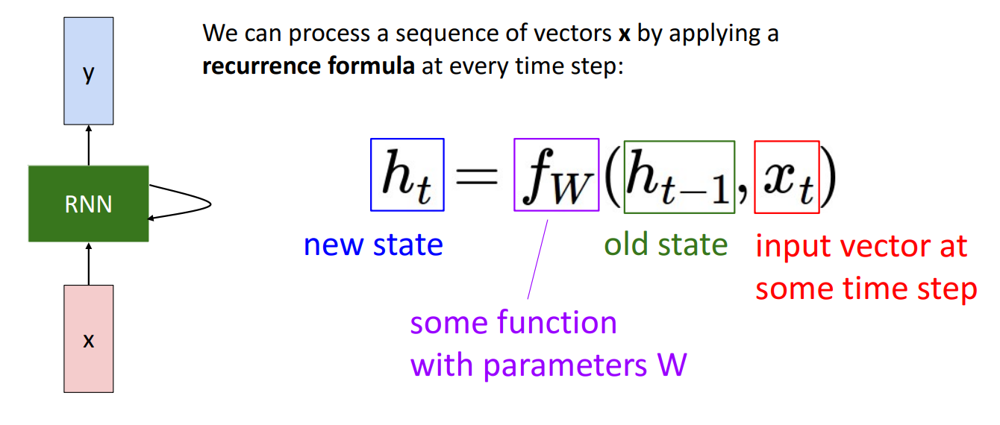 

- $W$: Learnable Weight

- **같은 `Layer`에서의 모든 `Function`과 `Weight`는 모든 `Time Step`에서 같은 것을 사용한다.**

- 한 `Layer`에서 **단일 `Function`과 `Weight`로 `Sequence`를 처리**할 수 있도록 해준다.

    - `Parameter`의 개수가 줄고, 하나의 `Layer`에서 같은 규칙을 적용할 수 있다.

## Vanilla Recurrent Neural Networks

> **가장 심플한 RNN**

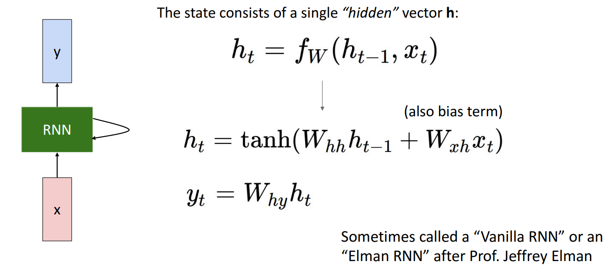

세 개의 `Weight Matrix`를 사용한다.

- $W_{hh}$: 이전 `Time Step`에서의 `Hidden State`에 사용
  
- $W_{xh}$: 현재 `Input`에 사용, `Bias`도 추가한다.

- $W_{hy}$: 현재 `Time Step`의 `Hidden State`에 `Linear Transform`을 위해 사용

`Non-linearilty`를 위한 `Activation Function`으로 **tanh**를 사용한다.

## RNN Computational Graph

`Output`을 고려하지 않고, 여러개의 `Input`을 받는 경우만 고려하면 아래와 같은 `Computational Graph`를 얻을 수 있다.

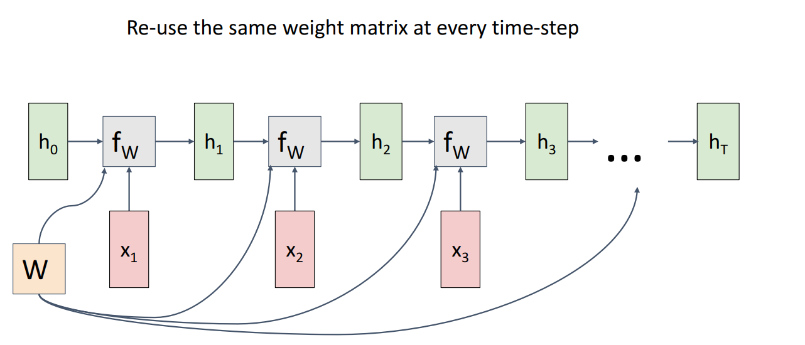

- $h_0$, `Initial Hidden State`는 모두 0으로 초기화할 수도 있고, Training한 결과를 사용할 수도 있다.

- 하나의 `Layer`에서는 같은 `Parameter`와 `Function`을 사용한다.

- `Comutational Graph`에서 하나의 $W$가 여러 `Hidden State`에 사용되기 때문에 `Backpropagation` 시에는 **$dW$를 계산하기 위해 모든 `Gradient` ($dh_i / W$)를 합산해야 한다.**

이제, `Many to Many` 상황임을 가정해서, `Output`까지 포함해보자.

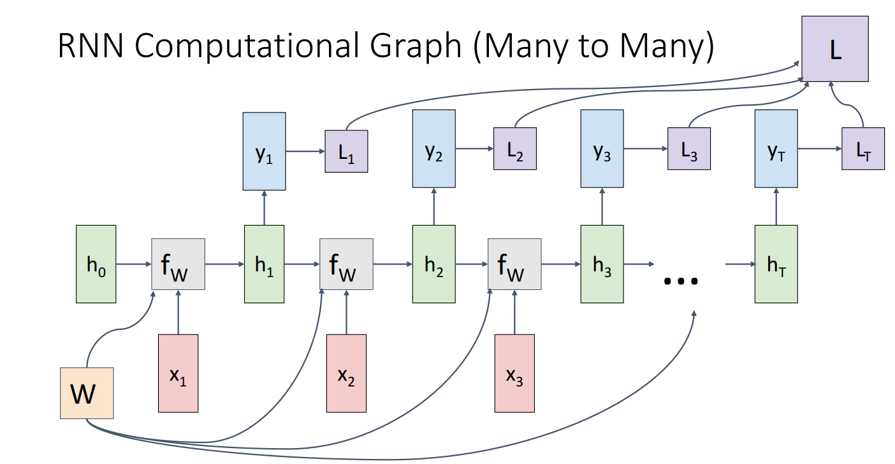

- 그림에는 표현되지 않았지만, $y_i$와 $h_i$ 사이에 $W_{hy}$가 존재한다.

- `Loss`는 **각 `Time Step`에서 `Feadforward`와 유사하게 `Loss`를 구하고, 전체 `Loss`는 각 `Loss`를 합하여 얻는다.**

`Many to One` 상황에 대한 `Computational Graph`도 확인해보자.

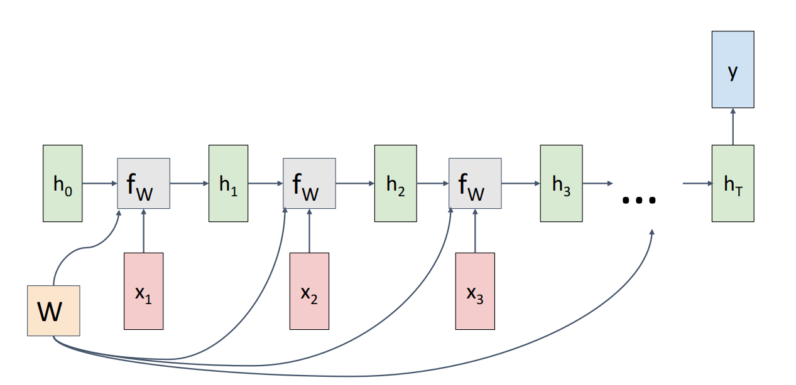

- `Final Hidden State`에 대해서만 예측을 진행한다.

마지막으로, `One to Many` 상황에 대한 `Computational Graph`도 확인해보자.

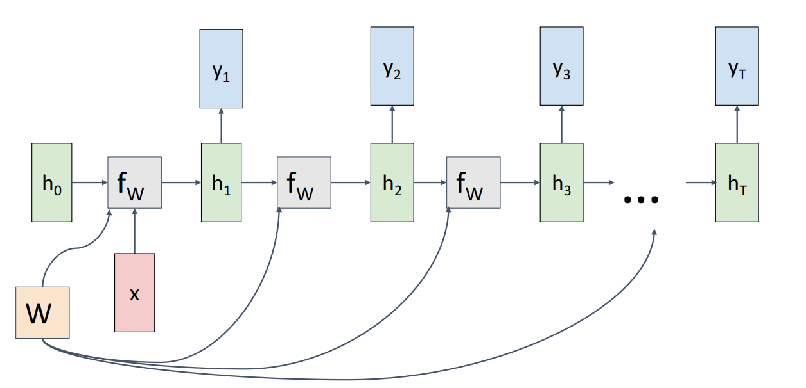

- 가장 처음의 `Hidden State`에서만 `Input`을 받는다.

## Squence to Sequence Recurrent Neural Network

> **Machine Translation 등에서 많이 사용하는 방법으로 Many to Many를 구현하기 위해 두 Sequence 모델을 연결하는 방법이다.**

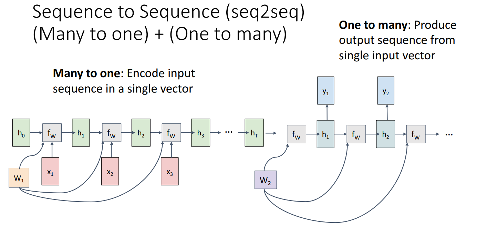

- `Many to One`은 `Encoder`, `Ont to Many`는 `Decoder`라고 부른다.

- `Encoder`: 번역할 언어를 처리하는 단계

- `Decoder`: 번역한 언어를 생성하는 단계

- `Encoder`와 `Decoder`에서 **다른 `Parameter`를 사용**한다.

- `Decoder`에서는 **`Encoder`의 마지막 `Hidden state`를 입력**으로 받는다.

`Many to Many`를 구현할 때, 두 `Sequence Model`을 연결하는 방법을 사용하기도 하는 이유

- **`Input Sequence`의 길이와 `Output Sequence`의 길이가 다를 수도 있기 때문이다.**

더 자세한 구현 방법을 영어를 스페인어로 변역하는 `Sequence to Sequence model`을 예시로 살펴보자.

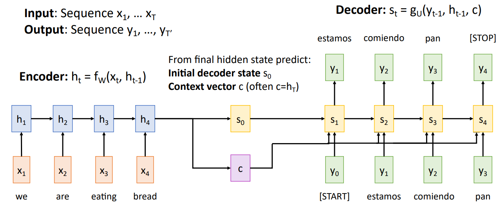

- `Encoder` 이후, `Encoder`에서의 동작을 요약하는 **두 개의 벡터가 필요**하다.

- 하나는 $s_0$로 `Decoder`의 `Initial hidden state`이고, 하나는 $c$로 `Encoder`에서의 전체 `Context`를 의미한다.

- 보통 `Context vector`는 `Encoder`의 마지막 `Hidden state`를 그대로 사용하고, `Initial hidden state`는 `Feedforward` 방식을 거친다.

- `Context vector`는 `Decoder`의 **모든 `Time step`에 입력으로 사용**된다.

### Example: Language Modeling

> **`Input` Sequence를 넣었을 때, 그 다음 글자를 예측하는 모델**

**"Hello"에서 "Hell"까지** 주어졌을 때, `Output`으로 **"o"가 나오도록 훈련**하는 과정을 살펴보자.

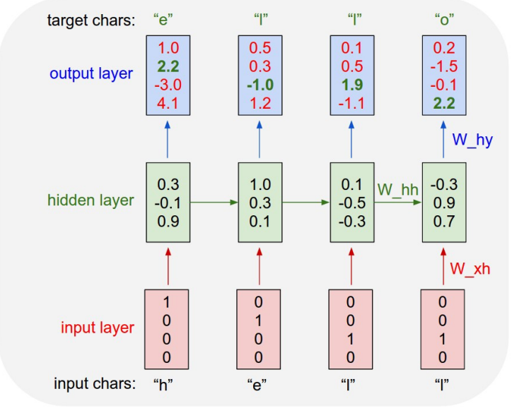

- 각 `Time Step`의 `Input`: h, e, l, l

    - `One-hot vector`를 사용한다.

- 각 `Time Step`의 `Output`: e, l, l, o가 되도록 Training

`Training`시, `Input`으로 `One-hot vector`를 사용한다는 점을 보면, **실제로 $x$와 $W_{xh}$와의 `Matrix Multiplication`이 필요하지 않다는 것을 확인할 수 있다.**

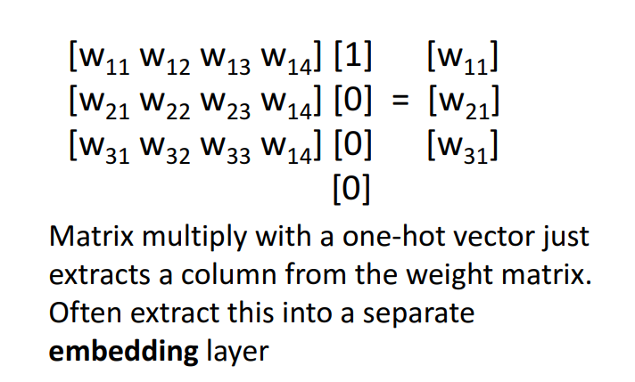

`One-hot Vector`의 특징 때문에, **$x$와 $W_{xh}$와의 `Matrix Multiplication`은 $W_{xh}$에서 특정 `Column`만**을 뽑아낸다.

따라서 직접 `Matrix Multiplication`을 수행하는 대신, 따로 `Embedding Layer`를 만들어서 **`Input`에 해당되는 `Weight`의 특정 `Column` 값을 저장해놓는 것**이 유리할 수 있다.

- `Output layer`에서는 `Output`으로 사용 가능한 글자 중, **가장 확률이 높은 것을 `Output`으로 내기 때문에, `Sampling`한다고도 표현**한다.

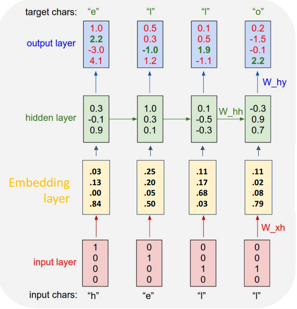

`Test Time`에는 `Training`과 다르게 동작한다.

- **초기 Token을 통해 새로운 텍스트를 생성**하도록 한다.

먼저, 아래와 같이 첫 글자만 `Input`으로 제동한다.

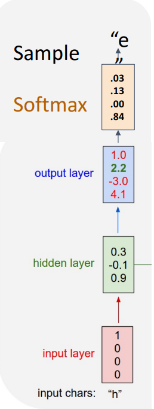

이후에는 이전 `Time Step`에서 결과로 나온 `Output`을 다음 `Time Step`의 `Input`으로 넣는다.

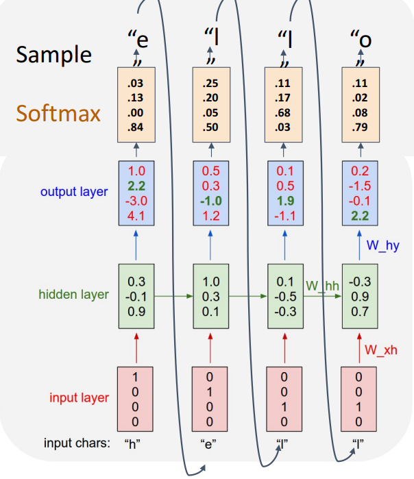

이 과정을 **목표 길이만큼 반복해서 나온 `Output`을 나열**하면 새롭게 텍스트가 생성된다.

## Backpropagation

> **Time Step을 따라 Forward 되고, Backward 되기 때문에 Backpropagation Through Time이라고도 한다.**

- 줄여서 `BPTT`라고 한다.

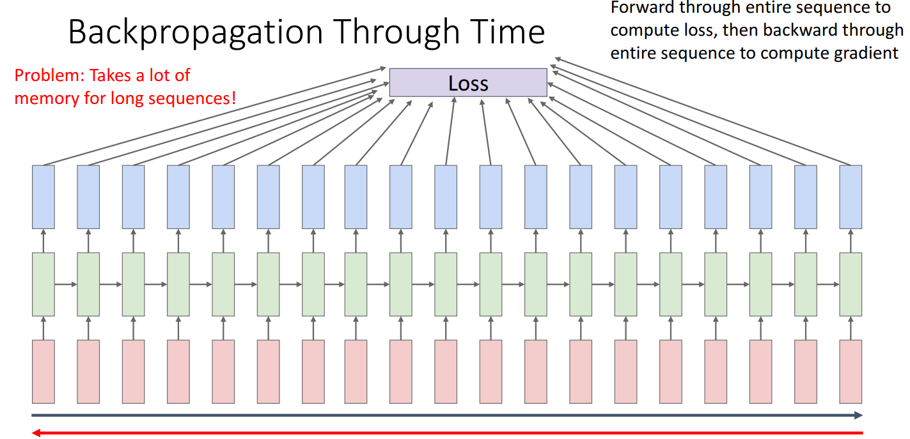

- `Loss`는 각 `Time Step`에서의 `Loss`를 더한 것이다.

- `Gradient`는 `Time Step`의 역순으로 `Backpropagation`한다.

하지만, 이 방법은 **Sequence가 매우 길다면, Memory 사용량이 너무 많아진다는 단점이 있다.**

이런 단점을 해결하기 위해, `Truncated Backpropagation Through Time`이라는 방법을 사용한다.

- 전체 `Sequence`에 대해 `Backpropagation`하는 대신, **하나의 `Sequence`를 여러개의 `Chunk`로 나눠서 `Chuck`마다 `Backpropagation`하는 방법**이다. 

과정은 아래와 같다.

1. 먼저 하나의 `Chunk` 내에서 Forward를 진행하고, `Chunk`의 `Loss`를 구한 후, `Backpropagation`을 진행한다.

    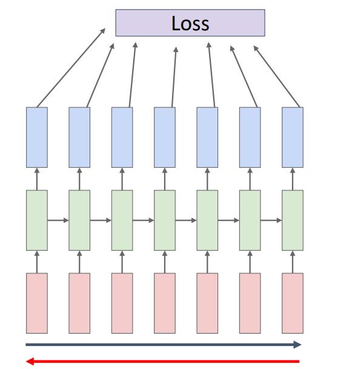

2. 이전 `Chunk`에서의 마지막 `Hidden State`만을 넘겨받고, **(1)의 과정을 반복**한다.

    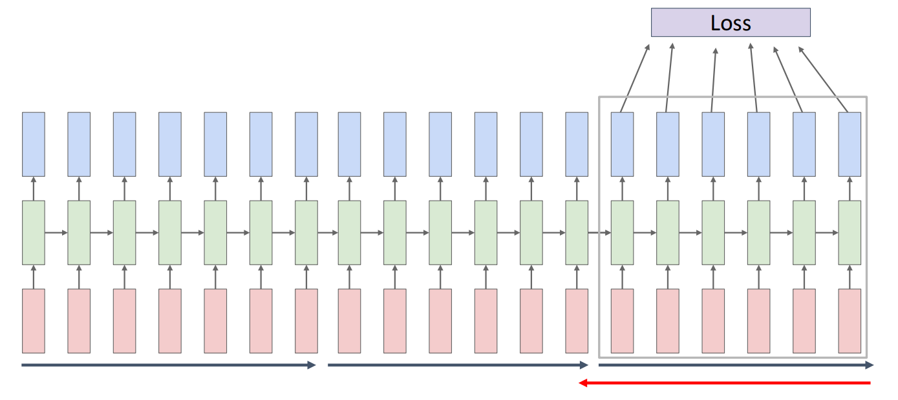

즉, **`Forward` 과정은 동일하지만, `Backpropagation`만 `Chunk` 별로 진행하여, `Memory`를 절약**할 수 있다.

## Training Example

셰익스피어의 소설을 이용하여, 비슷한 문장의 글을 생성해내는 모델을 `Training`한다고 생각해보자.

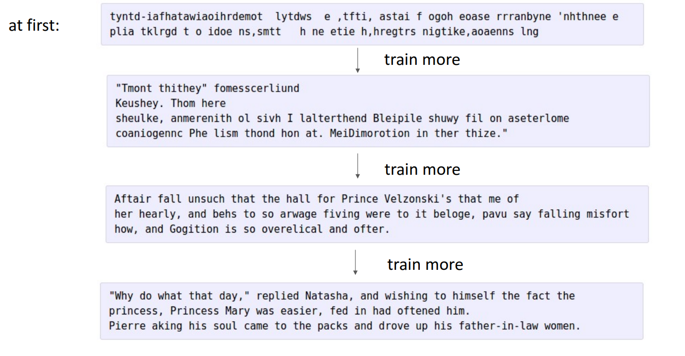

- 가장 처음에는 **모든 `Weight`가 Random**하기 때문에, 말도 안 되는 글이 생성된다.

- `Training`을 거듭할수록, 더 명확한 문장이 생성되는 것을 확인할 수 있다.

**Source Code도** 결국 텍스트이기 때문에, **Source Code도 생성**하도록 할 수 있다.

## Seaching for Interpretable Hidden Units

모든 `Hidden Unit`이 사람이 이해할만한 기능을 수행하는 것은 아니지만, **특정 `Hidden Unit`은 사람이 이해하기 쉬운 기능을 수행하기도 한다.**

- 이를 확인하기 위해, **특정 `Hidden unit`에서의 결과를 색으로 시각화**해볼 수 있다.

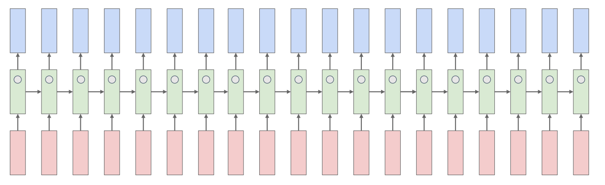

- 원으로 표시된 부분을 색으로 시각화한 것이다.

예를 들어, 활성화된 부분을 **활성화된 정도에 따라 빨간색과 파란색으로 나누어 표현**할 수 있다.

먼저, 결과가 아래와 같은 경우에는 `Hidden Unit`이 **사람이 해석하기 어려운 기능을 수행**하는 것이다.

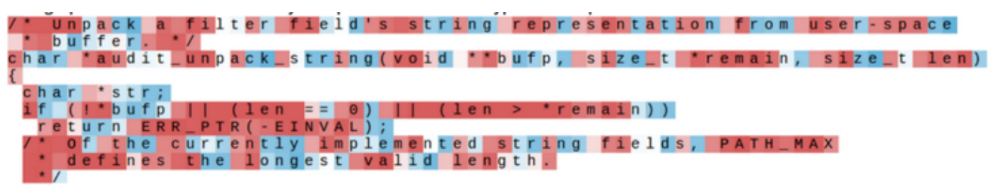

하지만, 아래 두 경우에는 `Hidden Unit`이 어떤 것을 학습하는지 **명확하게 해석**할 수 있다.

먼저, 이 경우에는 `Hidden Unit`이 **인용구를 찾는 기능**을 학습했음을 확인할 수 있다.

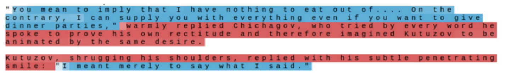

다음으로, 이 경우에는 `Hidden Unit`이 **if statement를 찾는 기능을** 학습했음을 확인할 수 있다.

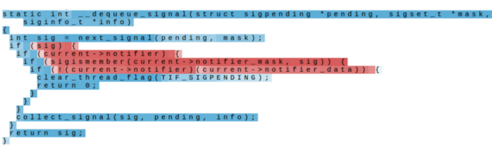

## Example: Image Captioning

> **Image를 입력으로 받아, CNN을 통해 Feature를 추출하고, RNN을 통해 해당 이미지를 설명하는 글을 출력하는 방법이다.**

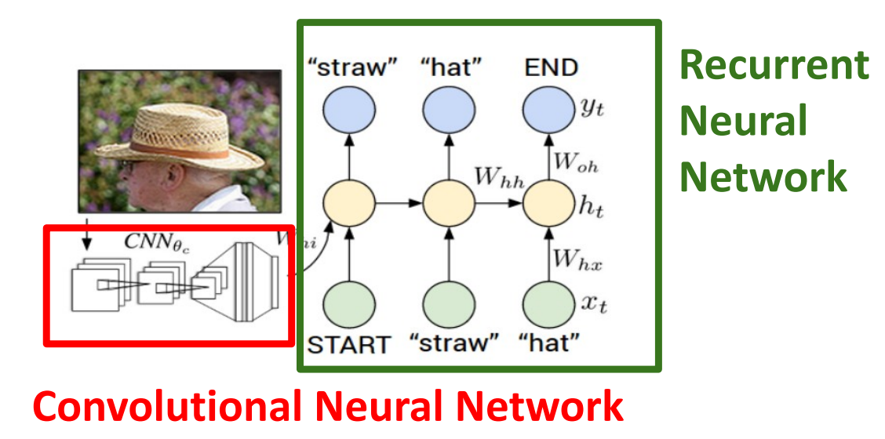

`Training`의 과정은 아래와 같다.

먼저 `Image Feature`를 얻기 위해, 기존 `CNN Architecture`를 `Transfer Learning` 해야 한다.

`Feature Vector`를 얻어야 하기 때문에, `Classification`을 위한 **마지막 두 개의 `FC Layer`는 제거**한다.

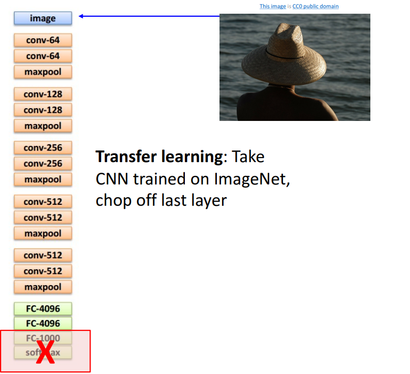

이후, `RNN Architecture`를 이용하여 `Text`를 생성하기 위해, 기존 `RNN`과 다른 방식을 사용해야 한다.

- 먼저, `Text` 생성을 시작하기 위해, **처음 `Input`에는 `<start>` Token을 사용**한다.

- 추가로, `Image Feature`을 사용하기 위해 각 `Time Step`에서 `Feature Vector`**를 추가로 입력받고, 이를 위해 $W_{ih}$라는 새로운 Parameter도 추가**한다.

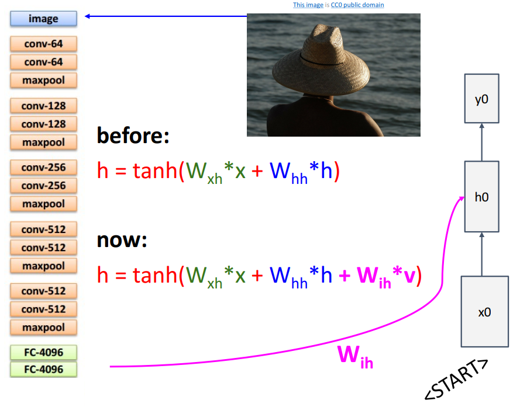

이후, 이전 `Time Step`의 `Output`을 다음 **`Time Step`의 `Input`으로 사용하고, `Output`으로 `<END>` Token이 나오면 종료**한다.

- `Output`으로 `<END>` Token이 나오면 종료하도록 하여, **모든 단계에서 Text가 끝났는지를 예측**하도록 한다.

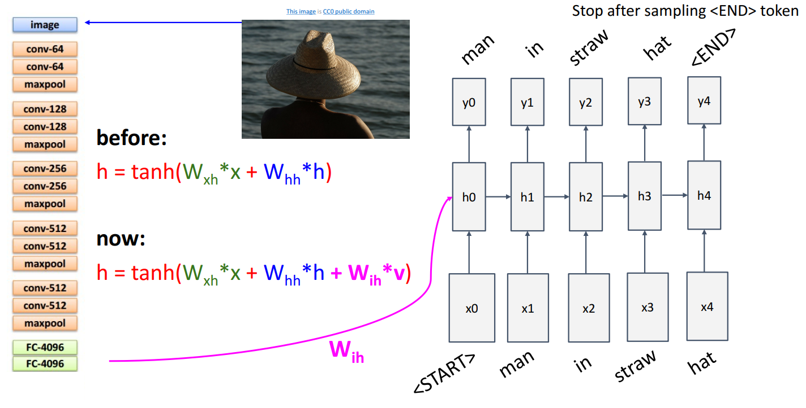

`Training` 시에는 일반 `RNN`과 마찬가지로 **정답 Token을 Input으로 사용한다.**

결과는 아래와 같다.

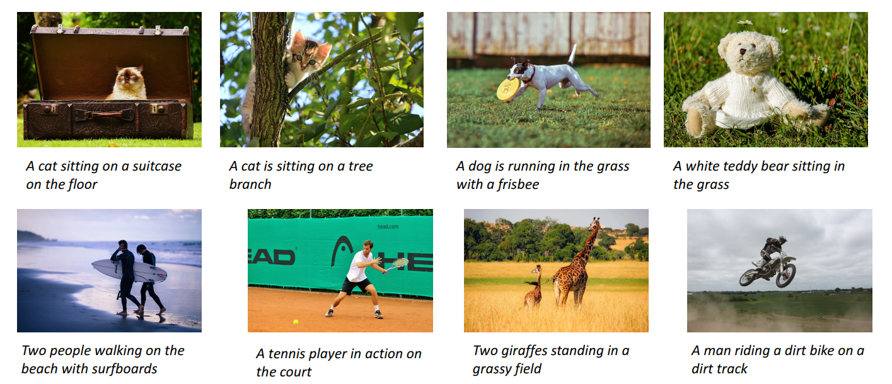

실패하는 경우도 많다.

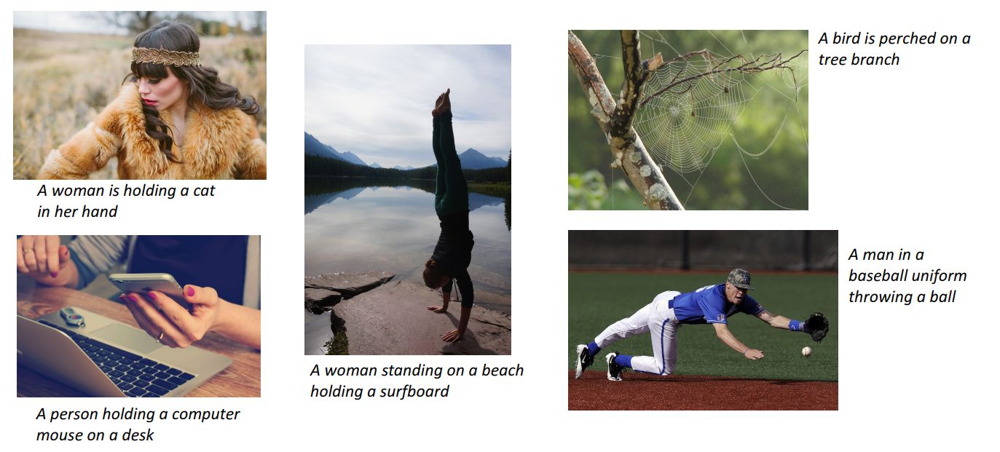

## Vanilla RNN Gradient Flow

하나의 `Time Step`을 살펴보면 아래와 같은 그림처럼 나타낼 수 있다.

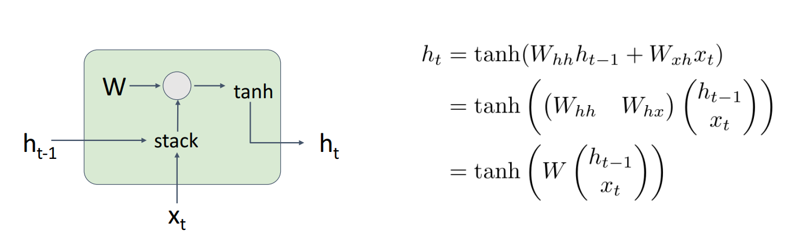

이 그림에 따라 `Hiddne State`에 대한 `Backpropataion`을 진행해보자.

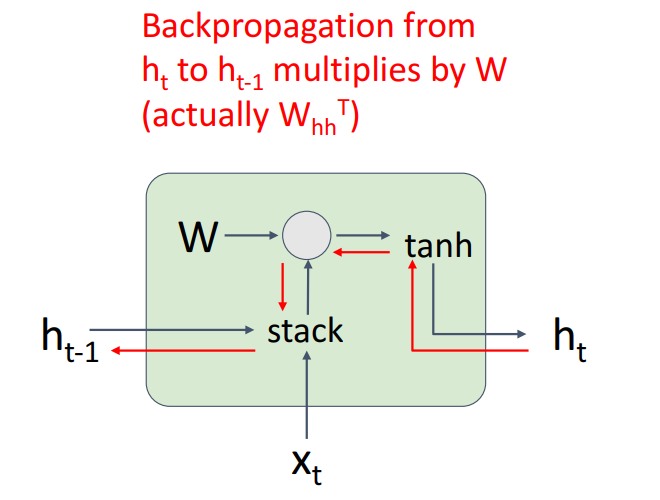

- 이 경우, 단순히 $dh_{t-1}$은 $dh_{t}$ * $W_{hh}.T$이 아니라 **Activation function**인 **`tanh`의 미분도 포함**한다.

- `tanh`의 미분은 **`input`이 너무 작거나 너무 크면 `Gradient`가 0에 가까워지기 때문에 위험하다.**

특히, 여러 개의 `Hidden State`가 있는 경우, **각 `Hidden State`에서 `Gradient`가 매우 작아질 수 있다는 것은 굉장히 위험**하다.

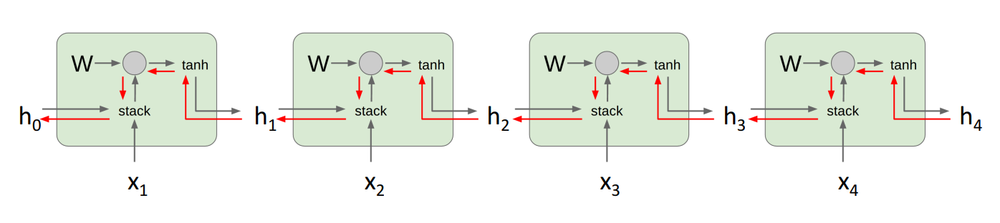

추가로, 여러 개의 `Cell`을 사용하는 경우에는 **같은 `Weight Matrix`를 여러번 곱하게 된다. 이 또한 굉장히 위험**하다.

왜냐하면, 이 경우 `Weight Matrix`의 `Singular Value`에 따라 `Gradient`가 `Explode` 또는 `Vanishing`될 수 있기 때문이다.

같은 행렬을 여러번 곱할 때, 각 행렬을 `Matrix Multiplication`할 때, **최대로 해당 방향의 벡터의 크기가 변할 수 있는 양을 `Largest Singular Value`**라고 한다.

따라서 `Largest Singular Value`가 정확히 1이 아니라면, **곱할 때마다 `Gradient`가 커지거나 작아지는 문제가 발생**할 수 있다.

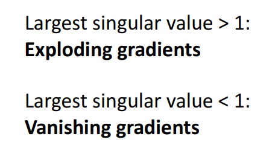

`Largest Singular Value`가 **1보다 큰지 작은지에 따라 다른 방법**으로 해결할 수 있다.

1. `Largest Singular Value`가 1보다 큰 경우
    
    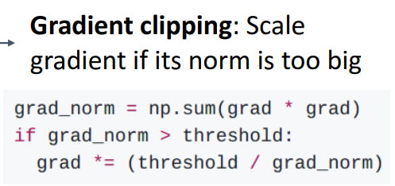

    - 각 단계에서 `Gradient Norm`이 기준보다 크면, `Gradient`를 작게 만든다.
  
2. `Largest Singular Value`가 1보다 작은 경우

    - 기존 `RNN Architecture`를 사용하지 않고, **`LSTM`을 사용**한다.

> **그러나, `Vanilla RNN`은 위 이유때문에 잘 동작하지 않는다.**

# Long Short Term Memory (LSTM)

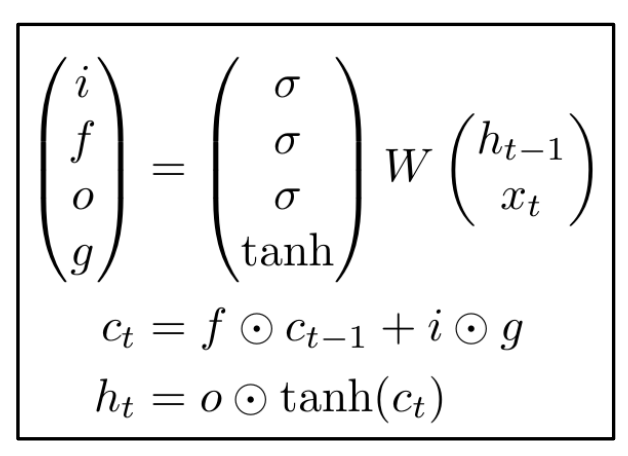

기존 `RNN`과 달리, 각 `Time Step`에 `Cell State`와 `Hidden State`라는 두 개의 벡터를 갖는다.

- `Cell`은 **기억 유지 + 다음 Unit에 영향**, `Hidden`은 **출력 관여 + 다음 Unit에 영향**

각 `Time Step`마다 **4개의 gate ($i, g, o, g$)를** 계산한다.

각 Gate의 의미는 아래와 같다.

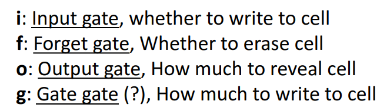

## Structure of LSTM

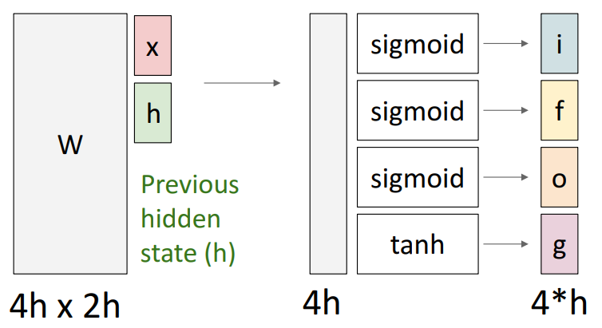

- $X, h, i, f, o, g$ = $h$ dim

- $X$는 다른 차원을 가질 수 있다.

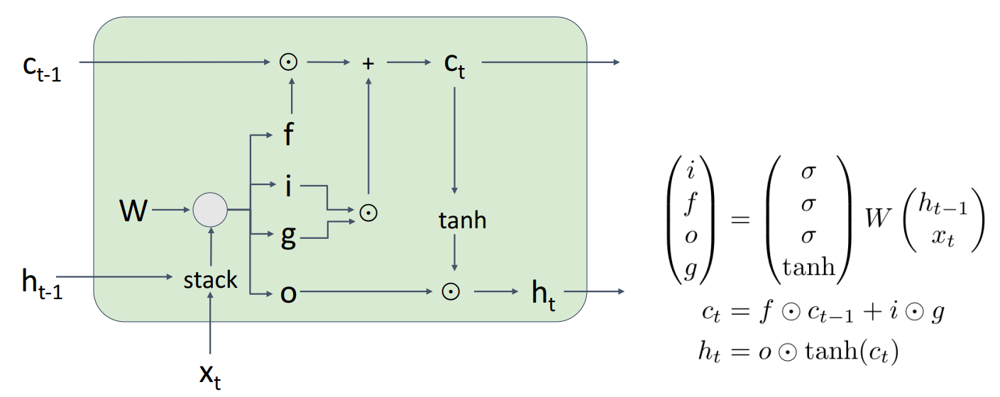

- 먼저 LSTM은 `Cell`, `Hidden State` 그리고 `Input`을 입력 받는다.

- 이후, $X$와 $h$를 `Weight`와 `Matrix Mutliplication`하고 **4개의 게이트에 전달한다.**

- 위에서의 `Matrix Multiplcation`의 결과에 **$i, g, o$는 `Sigmoid Function`을 적용하고, $g$는 `Tanh Function`을 적용**한다.

- `현재 Cell`은 `Previous Cell`을 잊을 정도($C_{t-1} \cdot f$)와 `Input` ($i \cdot g$)을 적을 정도의 합으로 나타낸다.

- `Next Hidden Unit`은 `현재 Cell`의 정보를 `Next Cell`이나 `Output`에 **얼마나 드러낼 것**인지($o \cdot tanh(C_t)$)로 나타낸다.

## Backpropagation

$C_{t-1}$에 대한 `Backpropagation`을 살펴보자.

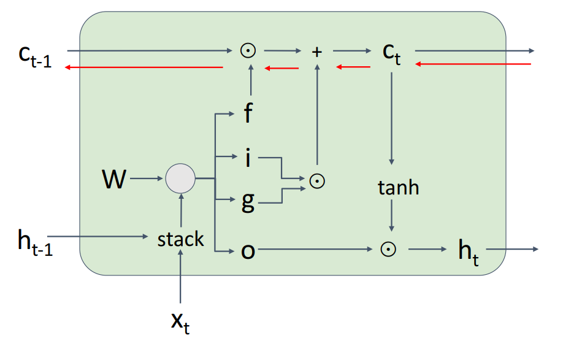

`RNN`과 다르게 `Matrix Multiplication`을 할 필요도 없고, `Activation function`에 대한 미분도 필요없다.

$f$는 `Sigmoid function`이 적용된 이후의 상수 벡터이므로 `Element-wise multiplication`에 대한 미분만 해주면 된다.

따라서 하나의 `Unit`만 봤을 때 전혀 문제가 없다.

여러 `Unit`을 봐도, 같은 `Weight`를 계속 곱하지 않기 때문에 문제가 없다.

-   그러나 이것은 **`Cell`에 대한 `Gradient`에 대해서만**이다.

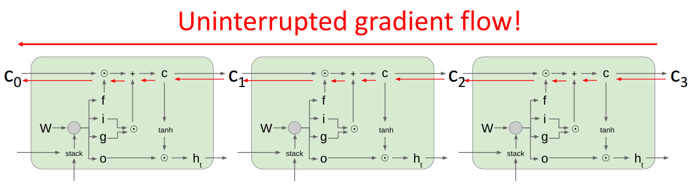

**문제점)**

`Weight`나 $H_t$쪽 `gradient`는 **여전히 activation 미분과 matrix multiplication을 반복**하므로 `RNN`과 비슷하게 **소실/폭발 가능성**이 있음.

**해결 방법)**

하지만, **`cell state` 쪽 `gradient`가 절대적으로 안정적으로 흐르기 때문에** **하나의 `unit`에서 해당 `gradient`를 가져와 $h_t$나 `weight gradient` 계산에 활용 가능**하다.

- 특히, `forget gate` **$f$를 1에 가깝게 유지**하면, **$C_{t-1}$과 $C_t$가 거의 유사하기 때문에 정보 손실도 거의 없다.**

즉, `RNN`보다 **훨씬 장기 의존성(Long-term dependency) 학습**에 유리하다.

- 위쪽에서 `Gradient`가 잘못되더라도, **`Cell`을 이용하여 중간부터 학습을 유도**할 수 있다.

이런 해결 과정은 `CNN`의 `ResNet`과 굉장히 비슷하다.

# Multi-Layer RNN

지금까지 12강에서 본 모든 `RNN`은 `Single-Layer RNN`이다.

**하나의 `Hidden State`에서의 `Output`을 다음 `Layer`의 `Input`으로 사용**하는 방식으로 `Multi-Layer RNN`을 구현할 수 있다.

- 각 `Layer`마다 다른 `Weight`를 사용하는 것이 일반적이다.

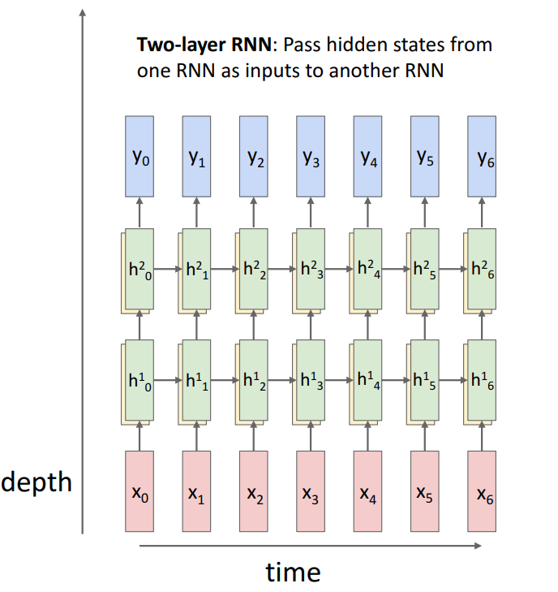

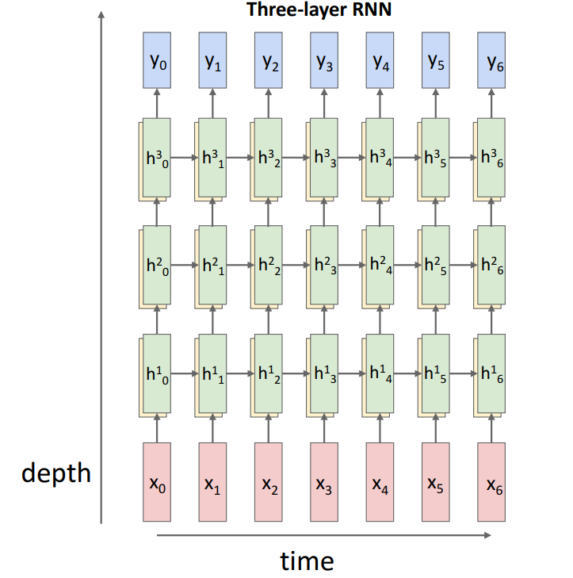

# Gated Recurrent Unit (GRU)

> **LSTM을 간소화한 버전으로, 두 개의 Gate만을 사용한다.**

**`Vanishing Gradient` 문제를 해결**할 수 있는 다른 방법이다.

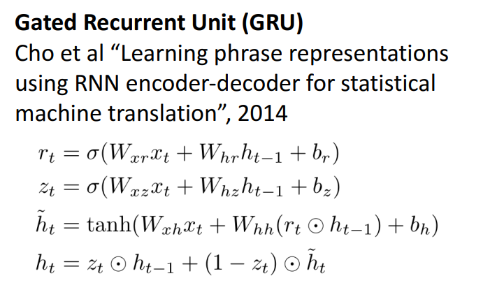