# 13. Attention

**`강의 영상`**                      

https://www.youtube.com/watch?v=qcSEP17uKKY&list=PL5-TkQAfAZFbzxjBHtzdVCWE0Zbhomg7r&index=13

**`강의 자료`**

https://web.eecs.umich.edu/~justincj/slides/eecs498/498_FA2019_lecture13.pdf

___

먼저 12강에서 배운 `Sequence to Sequence model`의 문제점에 대해 살펴보자.

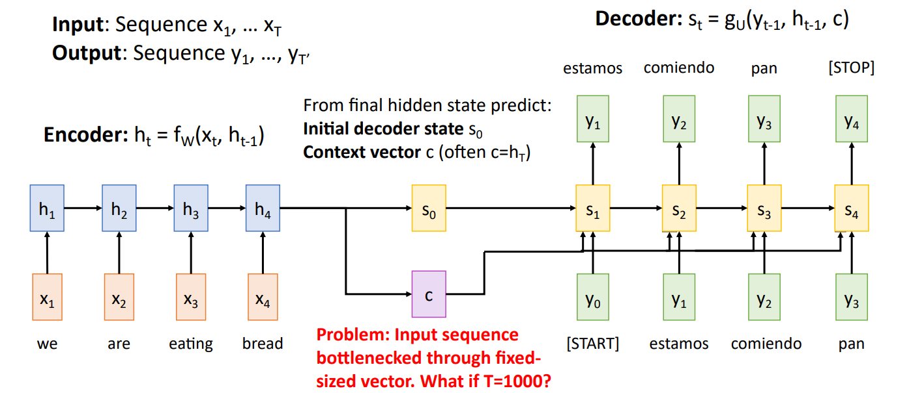

위 모델에서 `Context vector` $c$가 `Input Sequence`가 긴 상황에서는 `Bottleneck`이 될 수 있다.

- 긴 문장을 **하나의 벡터로 완벽하게 표현하는 것은 불가능**하기 때문이다.

- **`Input Sequence`의 길이와 상관없이 `Context vector`의 길이는 고정적이기 때문**이다.

> 이러한 문제를 해결하기 위해선 **`Encoder`의 모든 `Time step`에 대한 정보를 하나의 `Context vector`로 표현하는 대신, `Decoder`의 각 `Time step`별로 개별 `Context vector`를 생성하여 `Decoder`의 `Time step`마다 사용할 수 있도록 하면 된다.**

- 이런 방법을 `Attention`이고 한다.

# RNN + Attention

과정이 복잡하기 때문에, 하나씩 살펴보자.

먼저, `Encoder`는 기존 `RNN` 모델과 비슷하다.

- 단, `Context vector`는 `Encoder`에서 생성하지 않는다.

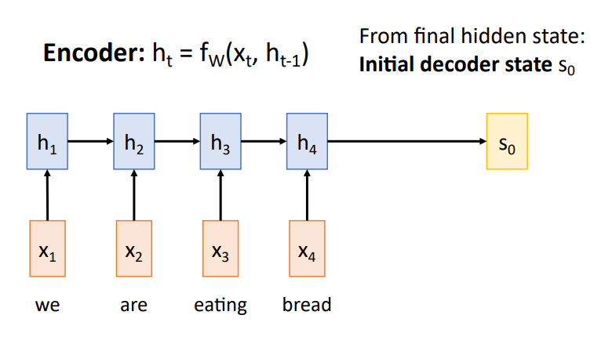

이후, `Encoder`의 각 `Time step`마다 $e_{t, i}$를 계산한다.

- 이는 `Alignment score`라고 부르며, 임의의 스칼라값이다.

- $f_{att}$는 보통 `MLP(FC) Layer`를 이용한다.

`Alignment score`는 `Decoder`의 이전 `Hidden state`와 `Encoder`의 `Hidden state`를 이용하여 구한다.

- $e_{t, i}$는 `Decoder`의 **$t$번째 `Hidden state`를 구할 때, `Encoder`의 $i$번째 `Input`이 얼마나 영향을 미치는 지를 나타낸다.**

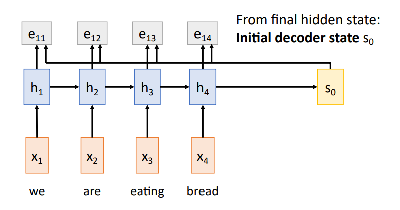
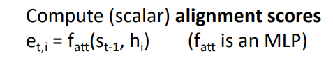

- $s_{t-1}$: `Decoder`의 이전 `Hidden state`
- $h_i$: `Encoder`의 `Hiddne state`

`Alignment score`는 단순히 스칼라 값이기 때문에, 아무 의미가 없다.

따라서 **확률적인 의미**를 부여하기 위해, **`Softmax`를 이용한다.**

- 기본적으로 `Decoder`의 **$t$번째 `Time step`에 해당하는 `Context vector`**를 구하는 것이기 때문에, **$i$에 대해 `Softmax`를** 구한다.

- 이를 `Attention weight`라고 부른다.

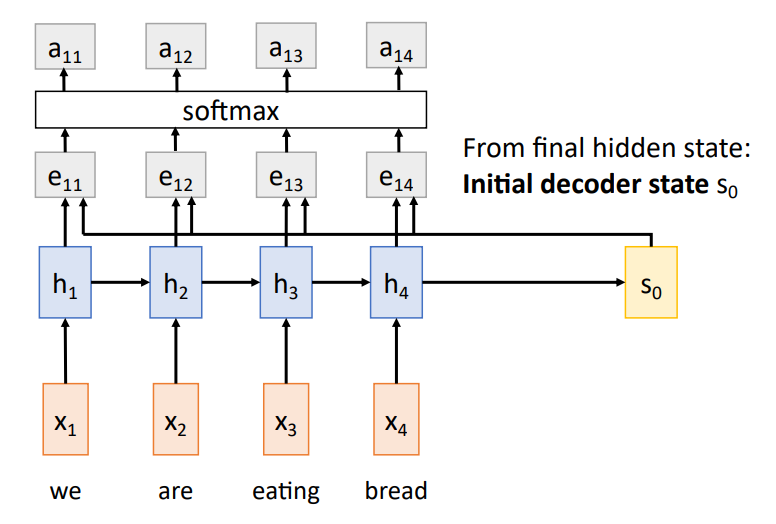
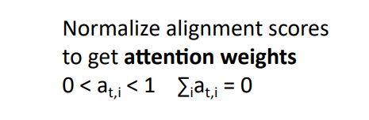
- 합이 0인 것은 오타로, 1이다.

이제 `Encoder`의 **각 `Hidden state`에 얼마나 집중해야 하는지에 대한 가중치(Attention weight)**가 있기 때문에, **`Encoder`의 각 `Hidden state`과 `Attention weight`를 곱하고, 이를 모두 더하여** $t$에 대한 `Context vector`를 얻을 수 있다.

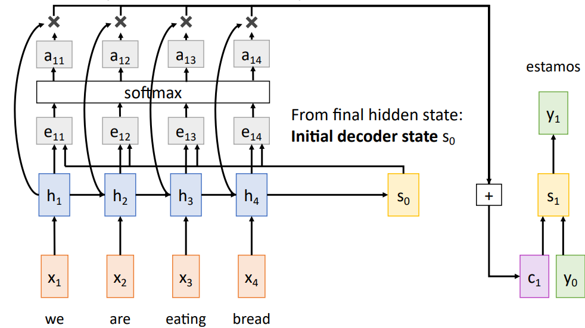
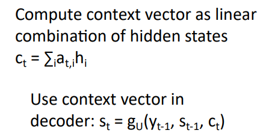

이후, `Decoder`에서 **`Input`, `Previous hidden state` 그리고 `Context vector`를** 이용하여 `Output`을 생성할 수 있다.

**이 과정은 전부 미분이 가능하다.**

- `Training`이 가능하다!

- 사람이 직접 `Weight`를 수정해서 어느 부분을 집중적으로 보라고 할 필요가 없다.

이 과정을 **직관적으로** 이해할 수도 있다.

> **`Decoder`에서 생성하는 `Output`은 적어도 하나 이상의 `Input` 단어와 관련이 있다.**

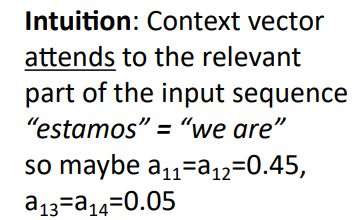

- 즉, `Decoder`가 **각 `Time step`마다 `Input`의 다른 부분에 집중**할 수 있다는 것을 의미한다. 

- **각 `Context vector`가 `Input Sequence`의 다른 부분에 집중**하고 있다.

`Decoder`의 각 `Time step`마다 위에서 본 과정을 반복하면 아래와 같은 결과를 얻을 수 있다.

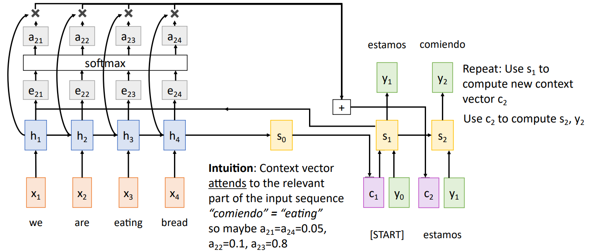

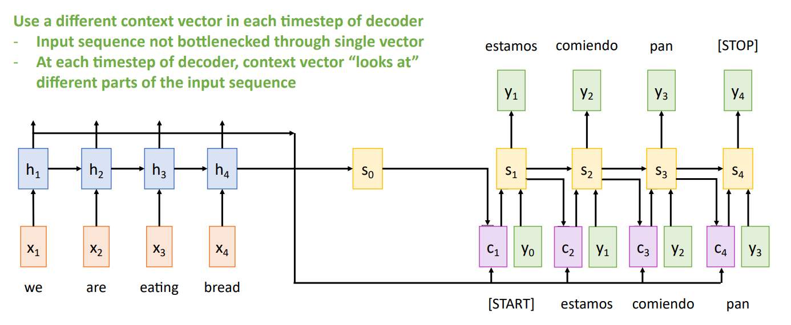

## Example

영어를 불어로 변역하는 예시에서, 각 **불어 단어(Output)**마다 다른 **영어 단어들(Input)에** 집중하고 있는 것을 확인할 수 있다.

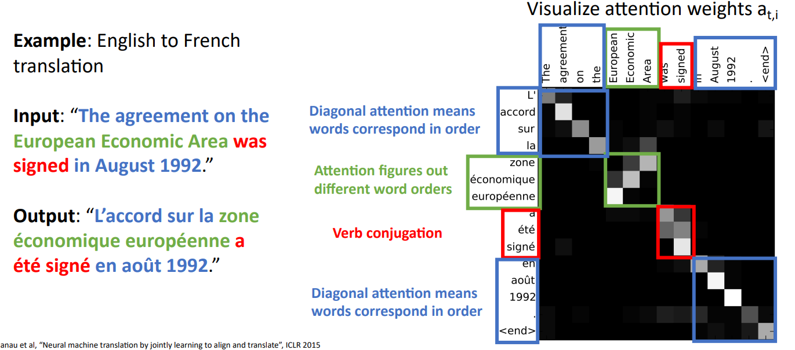

위 예시에서, Attention에 따라 다른 성질을 띈다.

파란색 부분은 `Diagonal Attention`으로, 이 경우에는 `Input`과 `Output`의 순서가 일치한다는 것이다.

반대로 초록색 부분은 **우상->좌하**로 **순서가 맞지 않음**을 확인할 수 있다.

**빨간색 부분**은 **동사의 시제, 형태 불일치**로 인해, **영어와 불어간의 단어 수가 정확히 맞지 않는** 경우를 의미한다.

> **중요한 점은 이런 Attention Mechanism은 Input vector가 Sequence라는 사실을 전혀 신경쓰지 않는다는 것이다. 따라서 우리는 Attention을 꼭 Input이 Sequence인 경우에만 사용하는 것이 아니라, 다른 유형의 문제에도 적용할 수 있다.**

## Example: Image Captioning

먼저, `CNN Architecture`를 이용하여, `2D grid Hidden state`를 얻을 수 있다.

이후에는, **위에서 봤던 `RNN + Attention`과 정확히 같은 동**작을 하여 `Decoder`에서 `Output`을 생성하도록 할 수 있다.

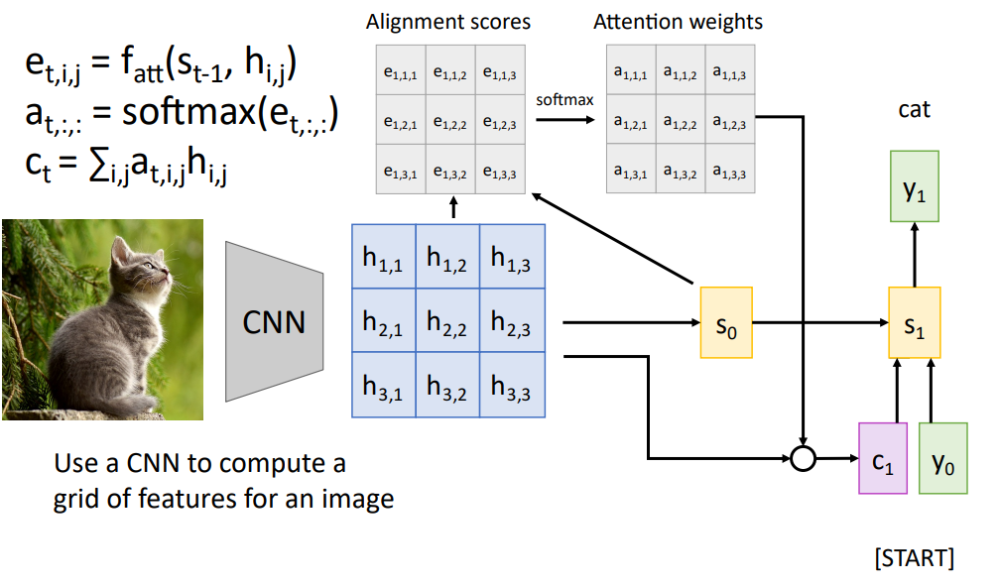

이 과정을 반복하면, `Image Caption`을 얻을 수 있다.

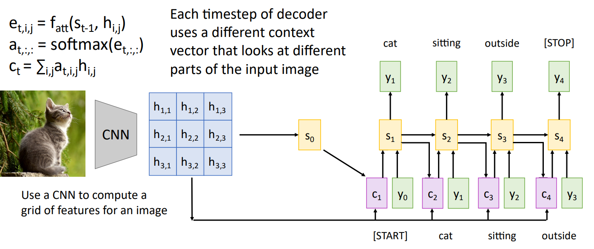

**`Input`이 `Sequence` 형태가 아니더라도 `RNN+Attention`을 적용**할 수 있는 것을 확인할 수 있다.

각 `Time Step`에서 `Context vector`가 이미지의 어느 부분에 집중했는지를 시각적으로 나타낼 수 있다.

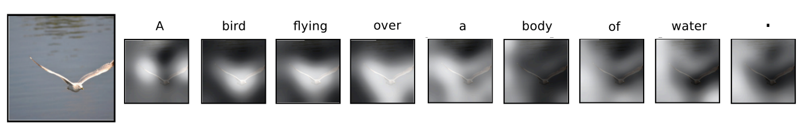

- 생성된 각 단어마다 이미지에서 **다른 부분에 집중**하고 있는 것을 확인할 수 있다.

`Image Captioning`에 `Attention`을 사용하면 좋은 이유를 **생물학적**으로도 설명할 수 있다.

우리 눈의 망막은 **우리가 보는 시점으로부터의 각도에 따라 다른 시력**을 갖는다.

오른쪽 그래프에서 y축은 시력, x축은 각도이다.

특히, `Fovea`라고 하는 **잘 보이는 구간이 존재한다.**

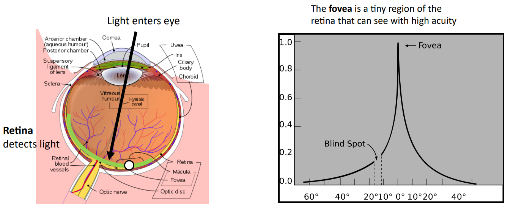

그리고 어떤 물체를 볼 때, **우리의 눈은 계속하여 움직인다**. 한 물체라도 한 부분만 보고있지 않고 **물체의 모든 부분을 눈을 움직여가며 본다.**

- 한 번의 움직임마다 **각기 다른 한 영역에만 집중**하고, 이를 **종합하여 물체를 인식하거나 설명**할 수 있는 것이다.

# Generalizing Attention (Cross-Attention)

`RNN+Attention`을 `Neural Network`에 삽입하거나 다양한 작업에 적용하기 위해 **일반화**해보자.

> 먼저, `RNN+Attention`에서의 **`Decoder`의 `Previous Hidden state`를 `Query`가 대체하고, `Encoder`의 `Input`을 $X$가 대체**한다.

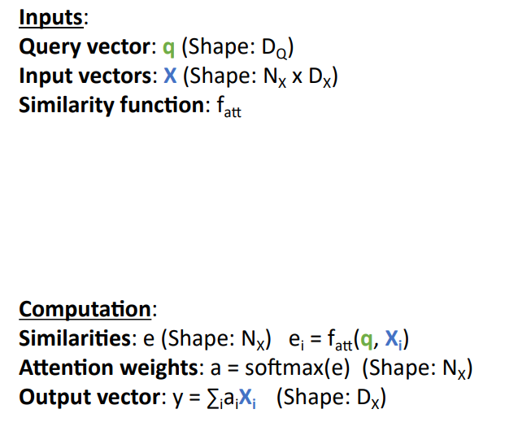

> $f_{att}$ 대신 `Dot Product`를 이용한다.

- 이때, **벡터의 차원이 너무 커서 Elignment값이 너무 커지거나, 특정 Element의 값만 너무 큰 경우 Softmax에서 Exp를 취할 때, 한 값만 1에 가까워지고 나머지 값들은 0에 가까워져 Vanishing Gradient 문제가 발생하기 때문에 `Scaled dot product`를 사용한다.**

- $D_Q$의 제곱근을 나눈다.

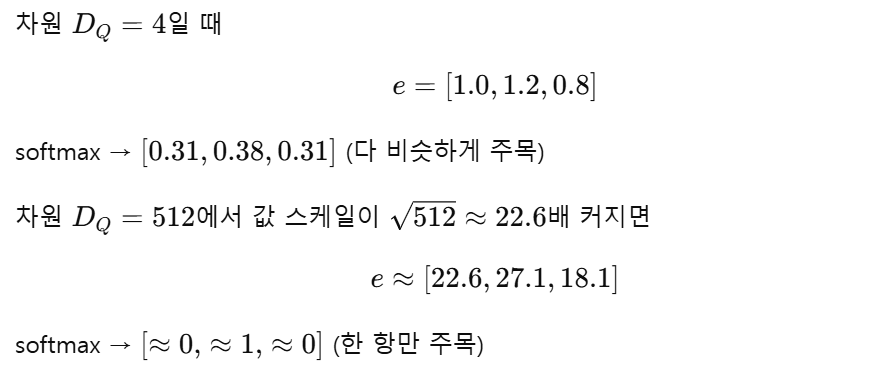

- 벡터의 차원이 커질수록 Element간의 값 차이가 벌어져 `Softmax score`가 편향될 수 있다.

- $e^{27}$과 $e^{22}$는 큰 차이가 난다.

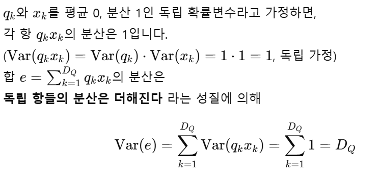

- 각 Element간의 곱을 합한 것이기 때문에, 분산이 커져 `Softmax Score`가 편향된다.
 

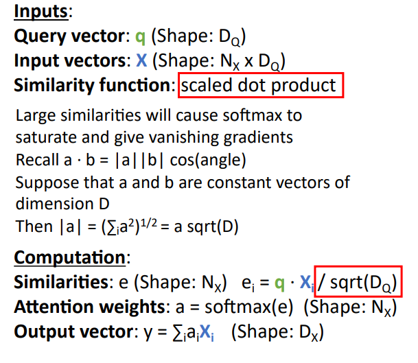

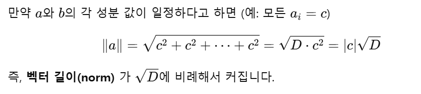

- `Dot Product`도 비례해서 커지게 된다.

> `Multiple Query`를 허용할 수도 있다.

`Matrix Multiplication`을 이용하여 단일 `Query vector`와 단일 `Input Vector`와의 **유사도를 구할 수 있다.**

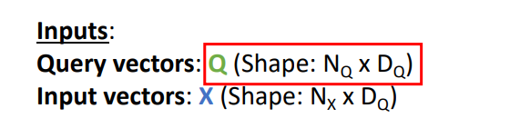
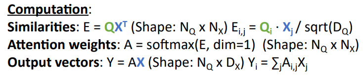

- `Softmax Score`는 `Input dim`에 대해 구해야 한다.

- 하나의 `Query vector`는 자신에 대해 예측한 하나의 `Output Vector`를 가지며, `Output`은 `matrix` 형태이다.

> `Input`을 `Key`와 `Value`로 분리할 수 있다.

- 이전까지는 하나의 `Input`을 **`Query`에 대한 유사도와 `Softmax Score`에 대한 결과값 출력**에 모두 사용했다.

**두 개의 `Weight`를 사용하여** `Input`을 `Key`와 `Value`로 분리할 수 있다.

- `Key`: `Query`와의 유사도를 계산하는데 사용
- `Value`: `Softmax`를 이용하여 `Output`을 계산하는데 사용

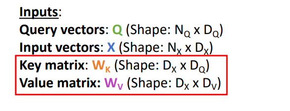
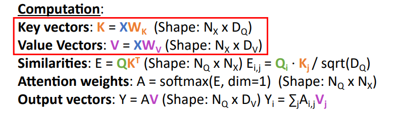

`Key`와 `Value`로 분리하는 방법은 모델이 **`Input data`를 더 유연하게 사용할 수 있도록 만든다.**

- `Query`는 모델이 난 이런 정보를 검색하고 싶다는 의미를 갖는다.

- `Query`에 목적에 맞으려면 `Query`에 대응되어 `Decoder`에 전달되어야 하는 정보는 `Decoder`가 아직 알지 못하는 정보여야 한다.

- 하지만 하나의 `Input`을 사용하게 되면 `Query`에 대응되는 정보와 `Decoder`에 전달되는 정보가 동일하기 때문에 유연성이 떨어진다.

- **따라서, 하나의 `Input`에 대해 `Key`는 선택 기준의 역할을 하고, `Value`는 실제 내용의 역할을 하도록 하면 모델이 더 유연해진다.**

- 예를 들어 `Key`는 **문서 제목(검색 조건)**, `Value`는 **문서 본문(전달할 실제 내용)처럼** 사용할 수 있다.

`Query`: “내가 어떤 정보를 찾아야 하는지”를 표현하는 질문 역할

`Key`: 각 입력 요소가 어떤 조건에서 선택될 수 있는지를 표현

`Value`: 선택된 후 실제로 디코더에 전달될 정보

____

결론적으로 `RNN + Attention`을 일반화하기 위해선 아래 **네가지 작업**을 한다.

1. `Query`와 `Input`의 사용

2. $f_{att}$ 대신 `Scaled Dot Product`의 사용

3. `Multiple Query`의 사용

4. `Input`을 `Key`와 `Value`로 분리

이 작업을 적용하여 그림으로 나타내면 아래와 같다.

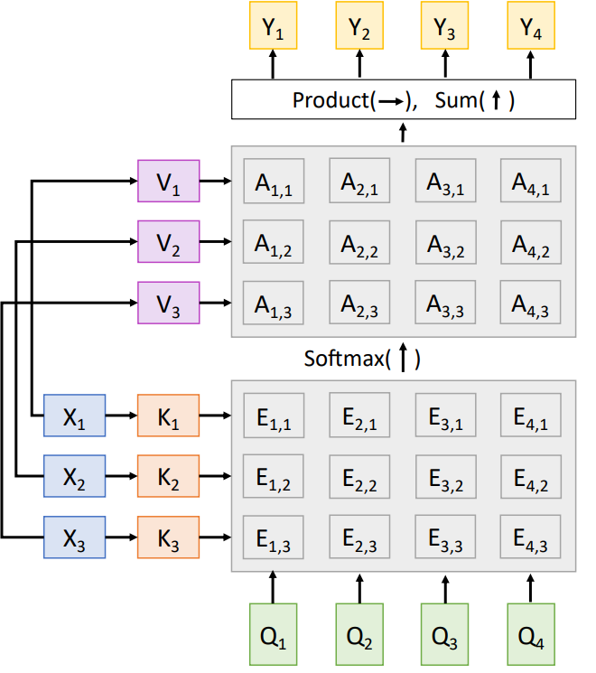

- $Q_i, X_i, K_i, V_i, Y_i$는 전부 `Vector`이다.

이 그림이 일반적으로 `Neural Network` 중간에 넣을 수 있는 **가장 일반적인 `Attention layer`이다.**

# Self-Attention Layer

> **`Input Vector`를 이용하여 `Query Vector`까지 생성하는 `Attention Layer`**

> **`Self-Attention`은 전통적인 `RNN+Attention` 구조와는 다소 다르다.** 왜냐하면, 디코더가 인코더로부터 **별도의 입력을 받는 것이 아니라, 자신과 동일한 입력 시퀀스**를 사용하기 때문이다. 즉, 입력 시퀀스를 받아 그 내부 토큰들 간의 관계를 학습하여 다음 출력을 생성한다.

기존 `Attention Layer`와 다른 점은 `Input`으로부터 `query`를 생성하기 위한 **`Weight Matrix`가 하나 더 추가**되고, **`Input Vector`의 개수와 `Query Vector`의 개수가 항상 동일**해야 한다는 점이다.

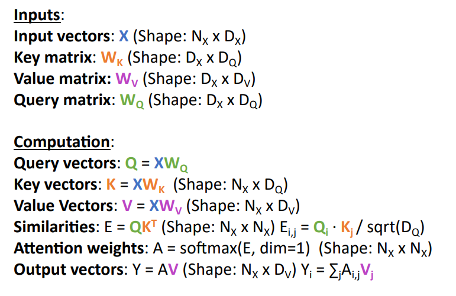

그림으로 나타내면 아래와 같다.

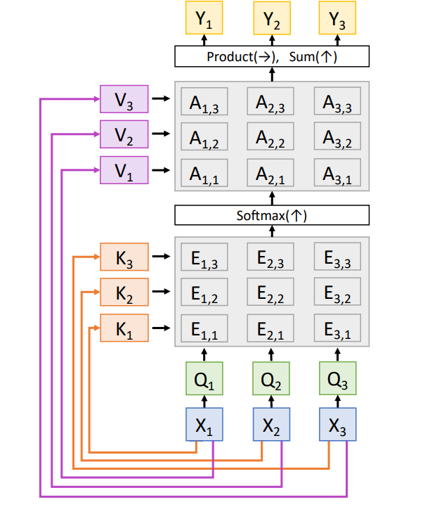

하지만, `Self Attention`의 특징이 있다.

`Input`으로부터 `Query`, `Key`, `Value`가 모두 만들어는데, 3개 `Input`과의 모두 `Matrix Multiplication`을 통해 만들어진다.

`Matrix Multiplication`에서 `Input`의 순서를 바꾸면 `Input` $X$의 **행의 순서만 바뀌게 되는데**, 이때 $XW$의 `Matrix Multiplication`은 **$X$의 행에 $W$의 열을 곱하고 더한 값**으로 계산된다.

따라서, $X$의 행의 순서를 변화시키는 것은 **$XW$의 결과의 행의 순서를 변화시키는 것과 동일하고 값은 변하지 않는다.**

때문에, `Input`의 순서를 바꾸면 `Query`, `Key`, `Value`의 행의 순서만 바뀌게 되고, 이후 계산에서도 `Output`까지 `Input`의 순서가 변한 것에 맞춰서 값의 변화없이 순서만 변하게 된다.

`Self Attention`의 이러한 특징을 `Permutation Equivariant`라고 한다.

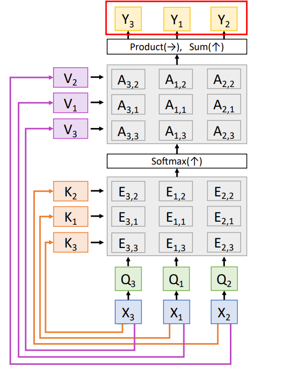

- `Input`의 순서 변경에 따라 `Output`의 순서도 바뀌었다.

> `Permutation Equivariant`는 곧, **Self Attention이 `Input`의 순서를 고려하지 않는다는 것을 의미한다.**

- **`Self Attention`은 `Input`의 순서가 중요한 작업에는 불리할 수 있다.**

일반적인 `Attention`의 경우에는 **`Query`가 `Input`의 영향을 받지 않기** 때문에, **`Key`와 `Query`를 곱하는 과정에서 값이 변해 일반적으로 `Permutation Equivariant`하지 않다.**

`Self Attention`이 `Permutation Equivariant`하다는 문제점을 해결하기 위해, `Position Encoding`을 추가할 수 있다.

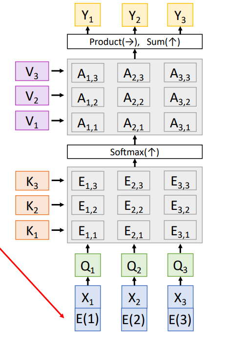

- $E$는 고정된 함수를 사용하거나, `Learnable`한 Lookup table을 만드는 등으로 구현할 수 있다.

## Masked Self-Attention Layer

> **특정 `Time step`의 `Query`를 처리할 때, 해당 `Time Step` 기준 과거 정보들만 사용할 수 있도록 하는 `Self Attention`**

$Q_i$에서 $i$가 `Time Step`이라고 생각할 때, $i$**=2일 경우에는 $K_3$까지의 정보를 확인하면 안 되는 경우**가 있을 수 있다. 이런 경우에 $E_{2, 3}$을 **-inf**로 두어 사용하지 못하도록 한다.

- 주로 `Language Model`에서 이 방법을 사용한다.

- **-inf**로 두는 이유는 `Exp`를 취했을 때 0이 되기 때문이다.

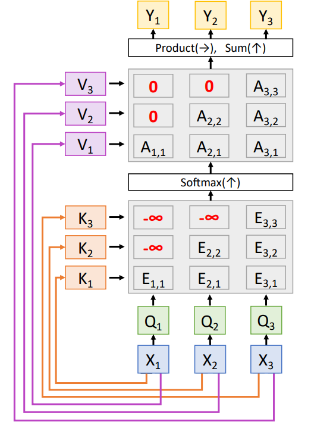

## Multihead Self-Attention Layer

> **같은 `Input`을 서로 독립적인 H개의 `Self Attention Model (Head)`로 병렬로 처리하는 방법**

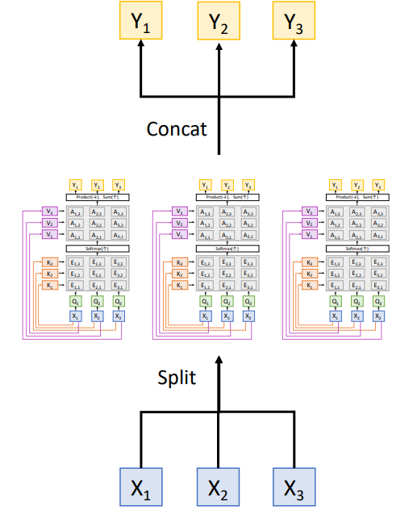

- 몇 개의 `Head`를 사용할 지를 나타내는 $H$라는 `Hyperparameter`가 추가로 요구된다.

- 각 `Head`는 각기 다른 `Weight Matrix`를 갖기 때문에, 각 `Head`가 각각 다른 부분에 집중할 수 있다.

`Output`은 각 `Head`에서의 `Output`을 `Concat`한다.

- 따라서 `Output`이 $N_x X D_v$처럼 나오기 위해선, **하나의 `Head`에서 `Value`의 차원을 $D_x X (D_v / H)$로 잡는 것**이 일반적이다. 

## Example: CNN with Self-Attention

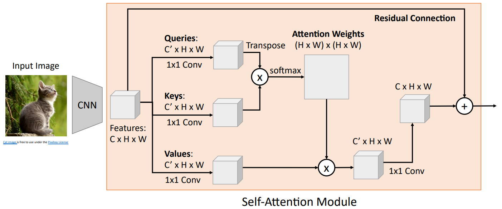

- 계산량을 줄이기 위해 `Channel` 차원을 줄이기 위하여 `1x1 Conv Layer`를 사용한다.

- `Gradient Flow`를 개선하고, 정보를 보존하기 위해 `Residual Connection`을 사용한다.

# Cross-Attention vs Self-Attention

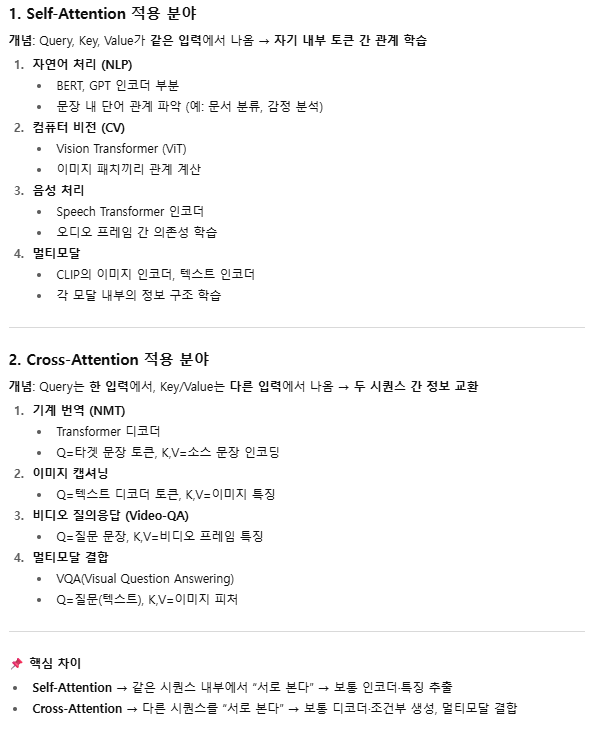

# Three Ways of Processing Sequences

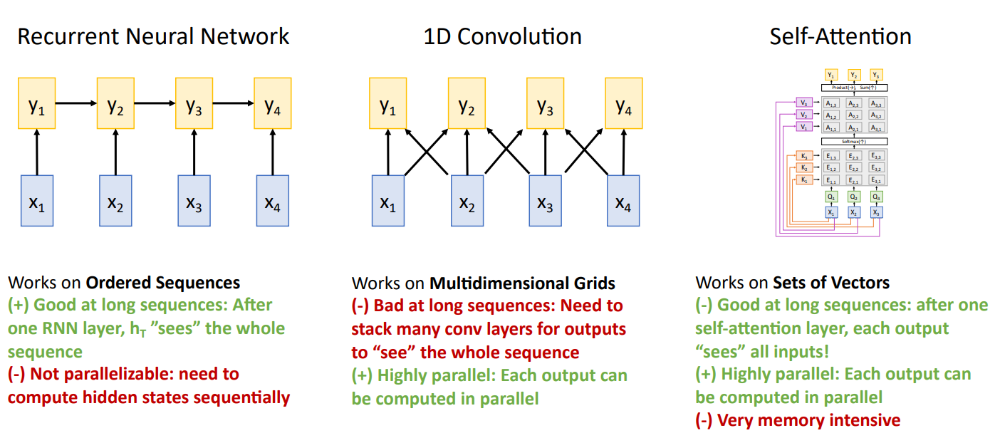

1. `RNN / LSTM`

   - **굉장히 긴 `Input Sequence`도 처리**할 수 있고, **하나의 벡터로 전체 `Input Sequence`의 내용을 압축**할 수 있다. 

    - 하지만 모든게 순서대로 계산되어야 하기 때문에 **병럴 처리가 어렵다**는 단점이 있다.

2. `1D Convolution`

    - **병렬 처리가 쉽다.**

    - 긴 `Input Sequence`를 처리하기 위해선 **굉장히 많은 `Convolution layer`를 쌓아야 한다.**

3. `Self-Attention`

    - **병렬 처리도 쉽고 긴 `Input Sequence` 처리가 쉽다.**

    - 유일한 단점은 **GPU Memory를 많이 차지한다는 것이다.**

___

> **Attention is all you need**

- **`Sequence`를 처리할 때에는 `RNN`과 `CNN`을 고려할 필요도 없이 `Attention`만 있으면 된다!!!**

- `Transformer`와 연결된다.

# Transformer

먼저, `Input Vector Sequence`를 이용하여 `Self Attention`을 진행한다.

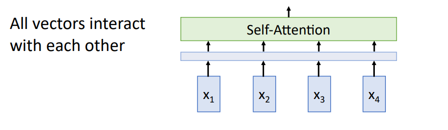

이후, `Residual connection`을 이용하여`Gradient Flow`를 개선하고, `Layer Normalization`을 통해 `Optimization`에 도움을 준다.

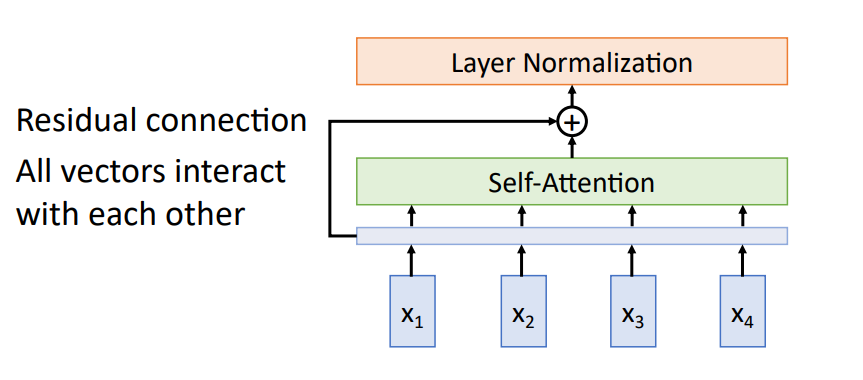

- `Residual connection`은 같은 위치의 벡터를 더한다. 

- `Layer Normalization`은 아래와 같이 동작하며, 특이한 점은 **`Self Attention`의 `Output Vector`들끼리의 상호 작용없이 각 `Output Vector`를 독립적으로 `Normalization` 한다.**

- 각 `Vector` 내에서 독립적으로 `Normalization`된다.

    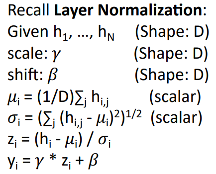

이후, 각 `Output Vector`에 `MLP`를 통과시키고 또 다른 `Residual Connection`과 `Layer Normalization`을 추가한다.

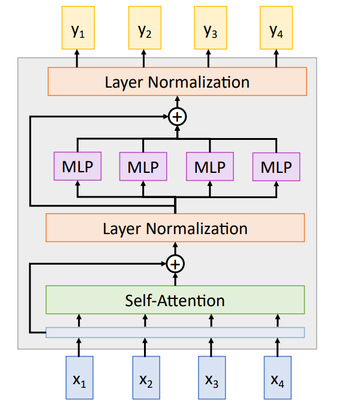

- `Input Vector`와 `Output vector`의 개수는 동일해야 하지만, 각 `Vector`의 차원은 다를 수 있다.

이때 `Self-Attention`부터 두 번째 `Layer Normalization`까지를 `Transformer Block`이라고 한다.

- `Neural Network`에 `Layer`의 일부분으로 사용할 수 있다. 

`Transformer`의 가장 큰 장점은 **각 `Input Vector`가 자기 자신내에서만 처리되기 때문에 GPU Hardware에 맞게 병렬화가 쉽고 확장하기 쉽다는 것이다.**

> **`Transformer`는 `Transformer Block`의 `Sequence`이다.**

- `Transformer`를 구현하기 위해서는 `Model`의 `Depth`, `Transformer block의 개수`, `Head의 개수`를 정하는 `Hyperparameter`가 요구된다.

**Attention is all you need** 논문에서는 아래와 같은 `Hyperparamemter`를 사용하였다.

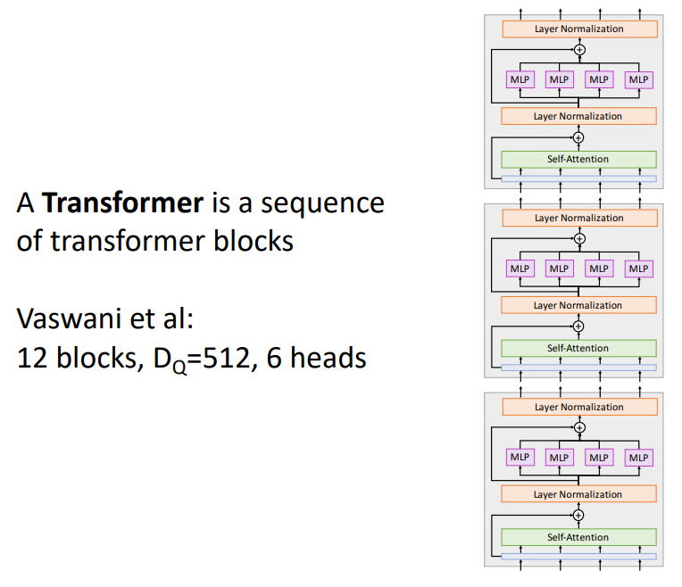

- $D$: Query dimension

- `Head`: Self Attention에서 사용하는 Head의 개수

## Transfer Learning

`Transformer`를 이용하여 `Natural Language Processing` 분야에서 `CNN`의 `ImageNet`과 같이 `Transfer Learning`으로 뛰어난 성능을 얻을 수 있다.

- 인터넷에서 얻은 대규모 `Text Dataset`으로 `Pretraining`을 하고, 하는 `Downstream task`에 맞는 Dataset을 이용하여 `Finetuning`하면 좋은 성능을 얻을 수 있다.

`ImageNet`과 비슷하게 더 좋은 성능을 보이는 `Transformer`를 얻고자 여러 시도가 있었다.

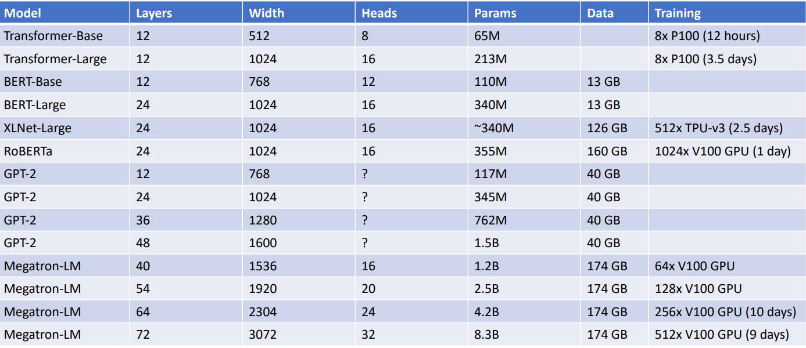