# 14. Visualizing and Understanding

**`강의 영상`**                      

https://www.youtube.com/watch?v=qcSEP17uKKY&list=PL5-TkQAfAZFbzxjBHtzdVCWE0Zbhomg7r&index=14

**`강의 자료`**

https://web.eecs.umich.edu/~justincj/slides/eecs498/498_FA2019_lecture14.pdf

___

# **Q) Neural Network의 각 Layer가 어떤 것을 학습하고 있는지 어떻게 알 수 있을까?**

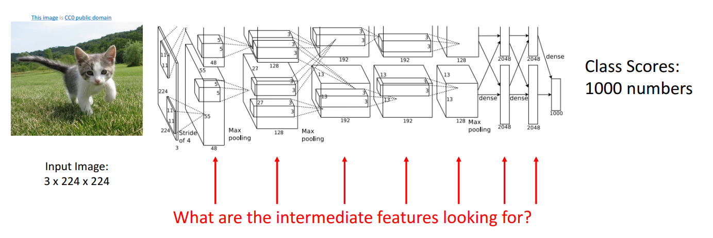

**A) 이를 확인할 수 있는 정확한 방법은 없지만, 경험적으로 알 수 있는 방법은 존재한다.**

- 사진에서 확인할 수 있는 `Convolution Layer`에서 각 `Layer`가 어떤 것을 학습하는지 경험적으로 확인할 수 있는 여러 방법들이 있다.

- 아래에서 이 방법들을 설명할 것이다.

## `Convolution Layer`의 **첫 번째 Layer가 학습하는 것을** 확인할 수 있는 방법은 **첫 번째 Layer의 Filter를 시각화하는 방법이다.**

- `Filter`가 찾고자 하는 특징과 일치하는 `Input image`에 **Filter와 Input의 내적이 크게 반응하는 특징을 이용한다.**

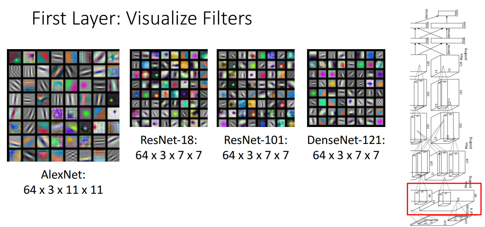

- 첫 번째 Layer에서는 보통, **각기 다른 방향의 방향성이 있는 엣지 (Oriented Edge) 또는 다른 유형의 색을** 찾는다.

첫 번째 Layer뿐만 아니라 **상위 Layer에서도 `Filter`를 시각화해서 어떤 것을 학습하는지** 확인할 수 있다.

- 그러나, 첫 번째 `Layer`만이 `Input`을 직접 확인하기 때문에, 첫 번째 `Layer`의 `Filter`만큼 유의미하지 않다.

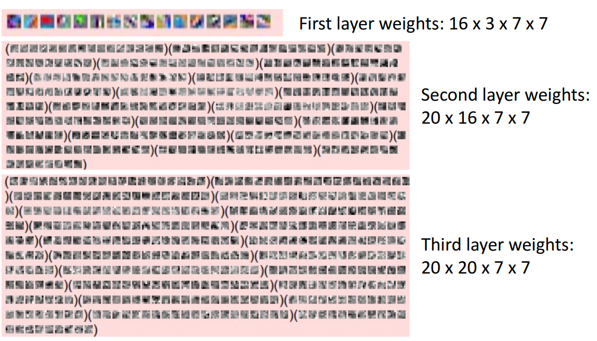

- `Higher Layer`로 갈수록 `Input`과는 멀어지고 여러 `Activation`이나 `Pooling`등을 거치기 때문에, **Filter를 시각화해도 그 결과를 우리가 직관적으로 이해하기 어렵다.**

## `Convolution Layer`의 **마지막 Layer가 학습하는 것을** 확인하기 위해 여러 방법을 사용할 수 있다.**

> **가장 먼저 사용할 수 있는 방법은 마지막 Layer에서의 Feature Vector에 대해 Nearest Neighbor를 적용하는 방법이다.**

우선, `Training Dataset`을 이용하여 모델을 학습시키고, `Test Dataset`을 모델에 입력하여 `Last Layer`에서 `Feature vector`를 얻는다.

이후, `Feature vector`에 대해 `Top-K Nearest Neighbor`을 적용해서 나온 여러 개의 이미지를 이용하여, **모델이 Feature space에서 유사한 객체들을 가까이 하는지를 확인할 수 있다.**

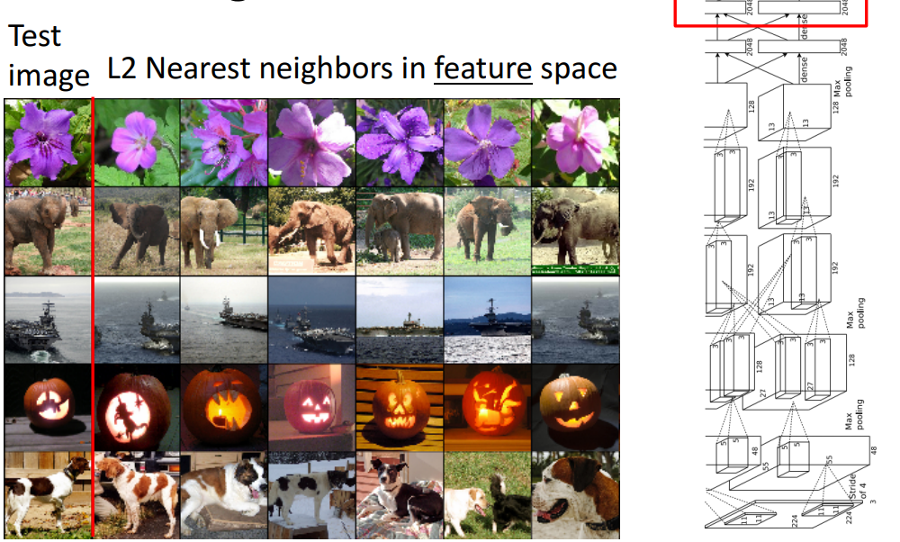

- Test image에 대해 `Top-K Nearest Neighbor`의 결과로 나온 6개의 이미지가 전부 유사하므로, **모델이 Feature space에서 유사한 객체들을 가까이 하는 것을 확인할 수 있다.**

- `Raw Image`에서 적용한 `Nearest Neighbor`와 다르게, **다른 특징을 가진 같은 종류의 물체도 정확하게 분류된다는 점이 중요하다.**

> **또 다른 방법으로 마지막 Layer에서 얻은 Feature vector을 `Dimensionality Reduction`하여 저차원에서 확인하는 방법이 있다.**

- `Feature Space`를 저차원으로 줄였을 때, **다르게 분류되어야 하는 객체끼리 분리되어 있어야 분류 성능이 좋은 모델을 얻은 것이다.**

- 직접 `Feature Space`의 분포를 **시각적으로 확인할 수 있다.**

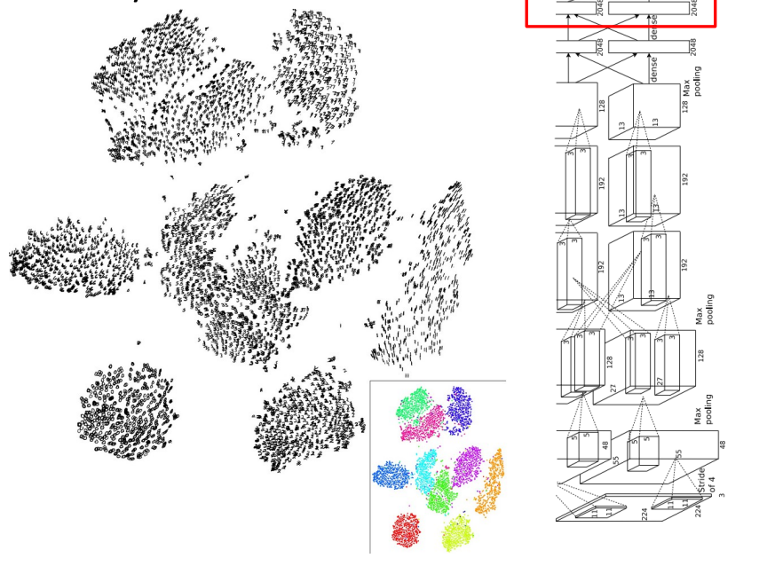

- 0 ~ 9까지의 MNIST Dataset에 대해 적용한 예시이다.

- `PCA`나 `t-SNE` Algorithm을 `Dimensionality Reduction`을 위해 사용할 수 있다.

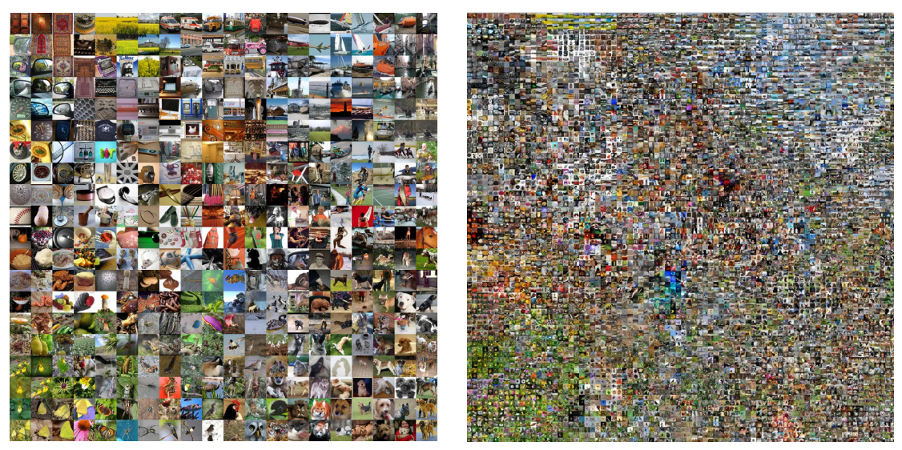

- 이미지에 대해 `Dimentionality Reduction`을 진행하고 시각화하면 이와 같은 결과를 얻을 수 있다.

- 오른쪽 그림에서 **비슷한 색, 특징**끼리 근처에 분포하는 것을 확인할 수 있다.

## 중간 `Layer`에서 `Convolution Layer`의 각 `Layer`가 무엇을 학습하는지 확인할 수 있는 방법도 있다.

> **먼저, 각 Layer에서 Activation function을 통과한 결과를 시각화 할 수 있다.**

- `Layer`에서 `Activation`된 결과를 확인하면 **각 Filter나 Layer가 어떤 것을 학습했는지에 대한 직관을 얻을 수 있다.**

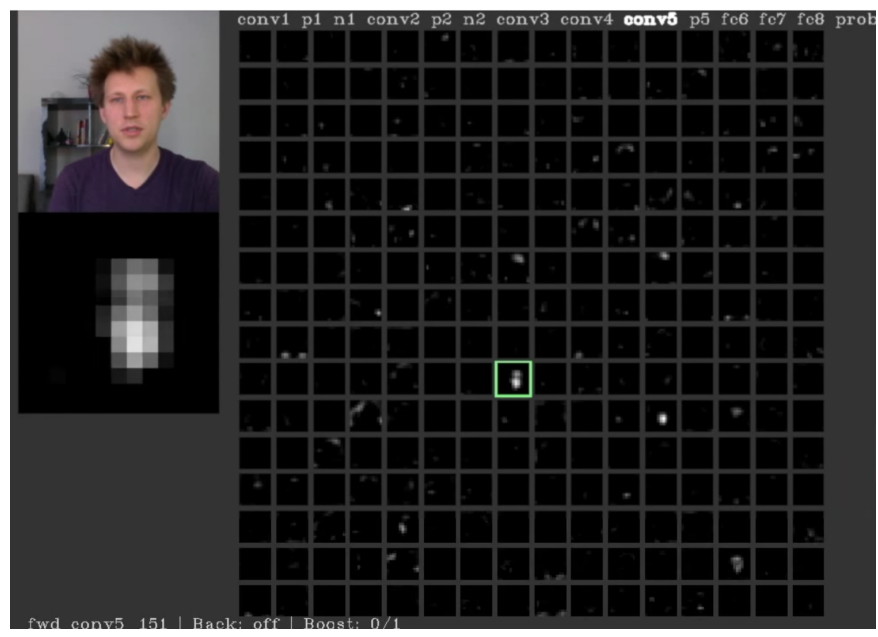

- 초록색 부분은 특정 Layer의 여러 `Filter`중 **한 `Filter`에서의 `Activation` 결과를 시각화한 결과**이다.

- **사람 얼굴 모양의 `Activation` 영역이 있는 것을 보아, 이 `Layer`의 `Filter`는 사람 얼굴 형태를 학습**하는 것을 확인할 수 있다.

> **또 다른 방법으로 가장 Activation 결과가 큰 Element에 대응되는 원본 이미지에서의 Patch를 찾아 시각화하여, 각 Filter가 어떤 것을 학습하는지 확인할 수 있다.**

- `Maximally Activating Patches`라고 부른다.

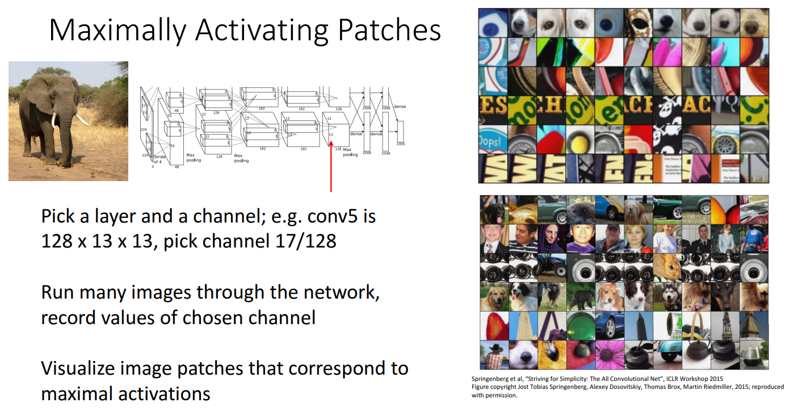

- 각 Layer의 특정 채널의 `Filter`를 정하고, **해당 `Filter`를 통과하고 `Activation function`을 적용한 결과에서 가장 큰 `Element`에 대응되는 원본 이미지의 `Patch`를 찾아서 시각화**할 수 있다.

- 오른쪽 예시에서 각 행이 같은 `Filter`에서 가장 `Activation` 결과가 큰 `Element`에 대응되는 각기 다른 원본 이미지의 `Patch`를 시각화한 것이다.

- `Maximally Activating Pixel`에 대응되는 `Receptive Field`를 찾는 방법이다.

___

> **또 다른 방법으로 원본 이미지에서 어떤 `Pixel`이나 부분이 모델 성능에 중요한 영향을 미치는지 확인할 수 있다.**

- 두 가지 방법이 존재한다.

먼저, **특정 이미지에 맞춰 모델이 정확히 분류할 수 있도록 Training 해놓고,** 원본 이미지에서 일부분을 가려가며 **모델이 일부분이 손상된 이미지에 대해 어떻게 반응**하는지를 확인한다.

- `Saliency via Occlusion`이라고 부른다.

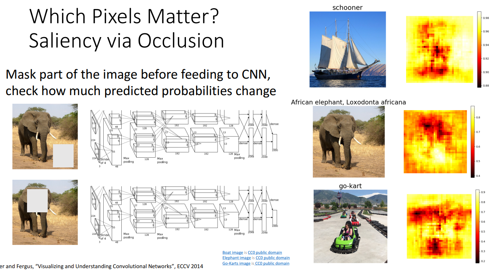

- 오른쪽에서 `Heatmap`에서 **빨간색으로 진하게 된 부분**이 **성능에 큰 영향**을 미치는 부분임을 확인할 수 있다.

- 이 방법을 통해, `Neural Network`가 **모델의 실제 특성에 기반하여 정확하게 분류**한 것인지 확인할 수 있다.

단, 이 방법은 **계산 비용이 크다**는 단점이 있다.

다른 방법은 `Backpropagation` 과정에서 **입력 이미지가 결과에 얼마나 영향을 미치는지 확인할 수 있도록 한다.**

- `Saliency via Backprop`이라고 한다.

- `Backpropagation` 과정에서 최종 `Score`에 대해 `Input pixel`의 `Gradient`를 계산한다. 

    - 이는 **최종 `Output`에 `Input Pixel`이 미치는 영향**을 의미한다.

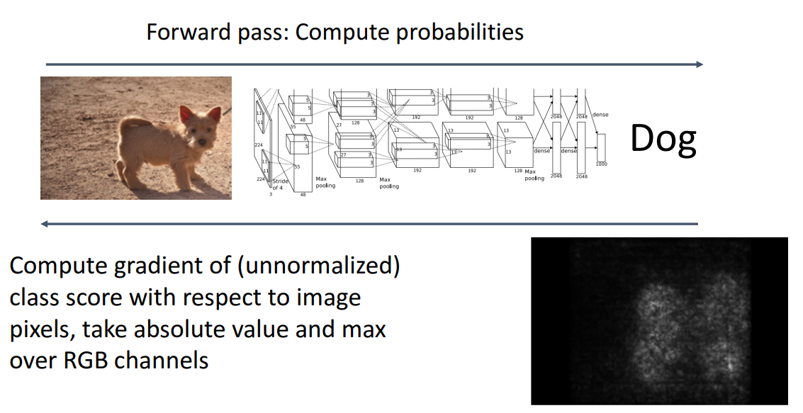

- 위의 `Gradient`를 시각화하면, `Gradient`의 **절댓값이 큰 부분은 밝은색**으로 나타나고, `Output`의 **변화에 큰 영향을 미치는 것**을 의미한다.

___

`Output`에 대해 `Saliency Map`을 계산하는 것뿐만 아니라, **중간 `Layer`에 대해 `Saliency via Backprop`를 통해** **중간 `Layer`도 어떤 것을 학습하는지 시각화할 수 있다.**

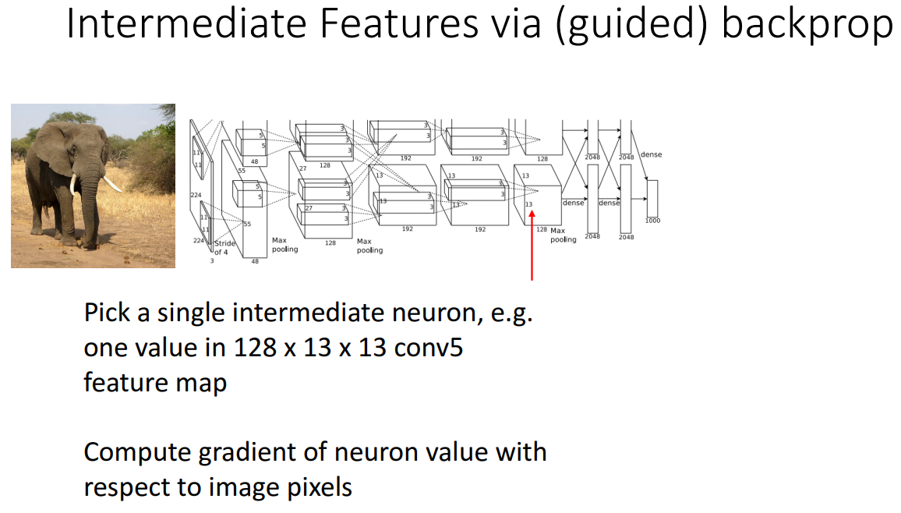

하지만, `Intermediate Layer`에 대해 위 방법을 적용할 때, **일반적인 `Backpropagation`을 사용하면 잘 동작하지 않는 경우**가 있다.

- 종종 시각화하기 어렵다고 한다.

따라서, `Guided backprop`이라는 다른 방법을 이용한다.

- 일반적인 `Backprop`과 다르게, `ReLU`를 `Backward`할 때, `Forward`때 사용했던 **`ReLU Mask`와 전혀 상관없이 `Upstream Gradient`가 음수이면 `Gradient`를 0**으로 전달한다.

- 일반적인 `Backward`와 다르지만, **`Saliency Map`을 시각화할 때 더 잘 동작**하는 경향이 있다고 한다.

결과는 아래와 같다.

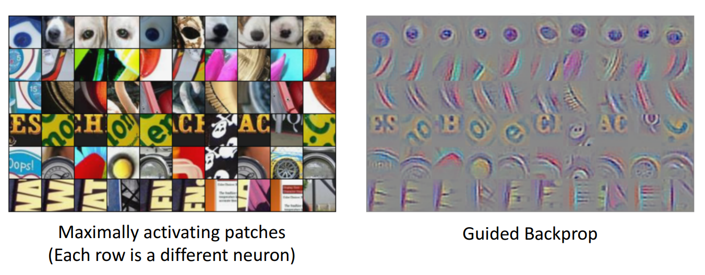

## Gradient Ascent

> 기존까지 `Layer`에서 어떤 것을 학습하는지 확인하는 방법들은 모두 기본적으로 **입력 이미지 속의 Patch나 Feature로만 나타낼 수 있었다.**

> 이를 극복하기 위해, 특정 `Neuron`이 크게 반응하는 `Input 영역`을 Return하는 것이 아니라, **특정 `Neuron`이 가장 크게 반응하는 새로운 이미지를 생성하는 방법**을 알아보자.

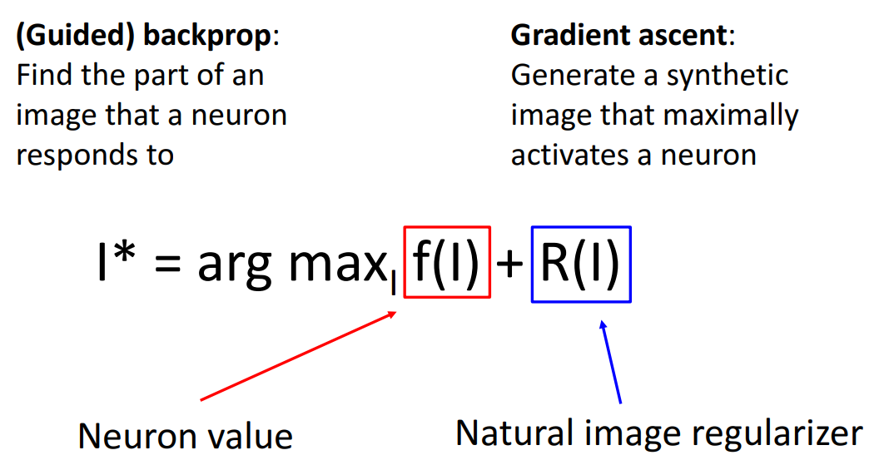

- $I^*$: `Neuron`이 크게 반응하는 새롭게 생성될 이미지

- $f(I)$: Neuron Value

- $R(I)$: 생성하는 이미지가 `Natural`해지도록 강제하는 Term 

`Gradient Ascent`의 과정을 알아보자.

1. 먼저, 가장 처음 `Input Image`를 0으로 초기화한다.

2. 기본적으로 모델을 `Training`하는 것과 똑같이 `Forward`시키고 `Backward`한다.

3. 이후, `Input Image` 자체를 `Update`한다.

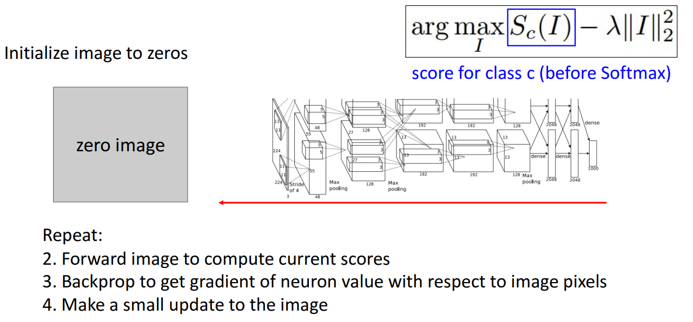

- $S_c$에 대해 위 식을 계산하면 특정 `Neuron` 또는 `Class` $c$에 대해 모델이 가장 잘 설명할 수 있는 이미지를 생성한다.

- 가장 간단한 `Regularizer`로는 `Generated Image`의 `L2 Norm`을 사용한다.

위 과정을 반복하다 보면, 결국 마지막 `Input Image`가 **해당 `Neuron` / `Class`에 대해 모델이 가장 잘 설명하는 이미지**가 된다.

`Regulizer`로 `L2 Norm`을 사용한 예시 결과는 아래와 같다.

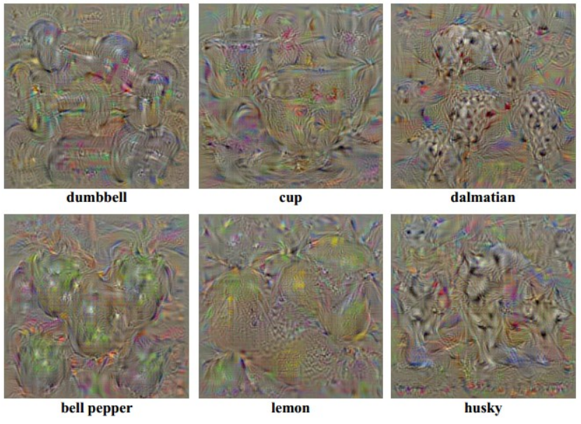

위 결과는 약간 `Noisy`해 보인다. 
이를 보완하기 위해, 더 좋은 `Regulizer`를 사용할 필요가 있다.

성능 개선을 위해 사용할 수 있는 `Regulizer`로는 대표적으로 아래 세 가지가 있다.

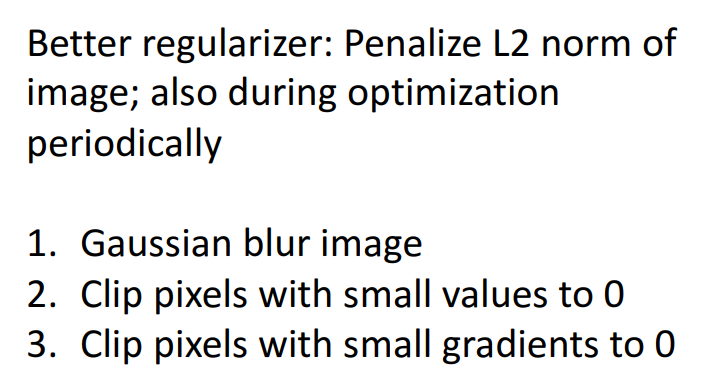

- 기본적으로는 `L2 Norm`에 위 세 가지 중 하나를 추가로 사용한다.

이 `Regulizer`를 이용한 예시 결과는 아래와 같다.

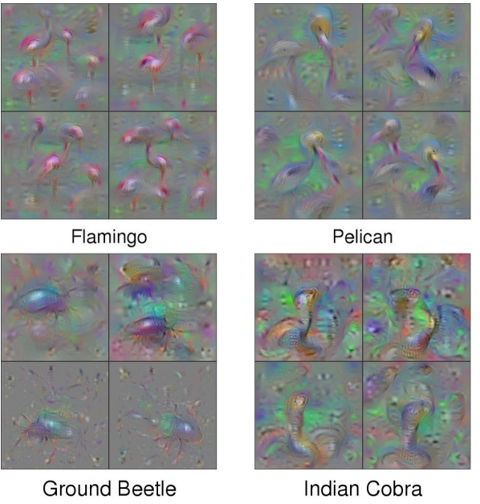

결국, 각 `Layer`의 **`Neuron`에 대해 가장 크게 반응할 수 있는 이미지**를 얻을 수 있다.

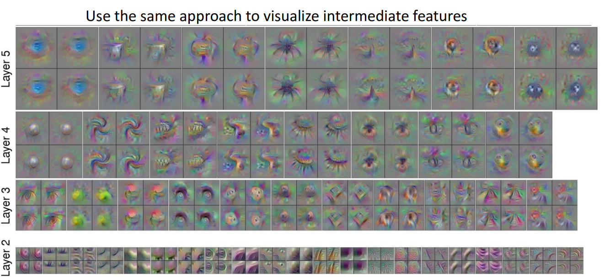

> 그러나, 강한 `Regulizer`를 사용하게 되면, **생성된 이미지가 `Regulizer`에 의해 자연스럽게 생성되도록 유도된 것인지, 실제로 모델이 그 이미지 자체를 학습하고 있는 것인지 제대로 확인하기 어렵다.**

- 이 강의의 교수님은 `Simple Regulizer`를 선호하신다고 한다.

## Feature Inversion

> **미리 구해놓은 `Feature Vector`와 유사한 `Feature vector`를 얻을 수 있도록 하는 `Input`을 생성하도록 하는 방법이다.**

`Feature Inversion`의 과정을 살펴보자.

1. 특정 이미지로 특정 `Layer`에서의 `Feature Vector`를 저장해놓는다.

2. 완전히 새로운 이미지(처음에 전부 0)으로 모델을 통과시켜 (1)의 `Layer`에서 (1)의 `Feature vector`와 유사한 `Feature vector`를 얻도록 한다.

3. (2) 과정을 반복한다.

(2) 과정에서 사용하는 `Loss`와 `Regulizer`는 아래와 같다.

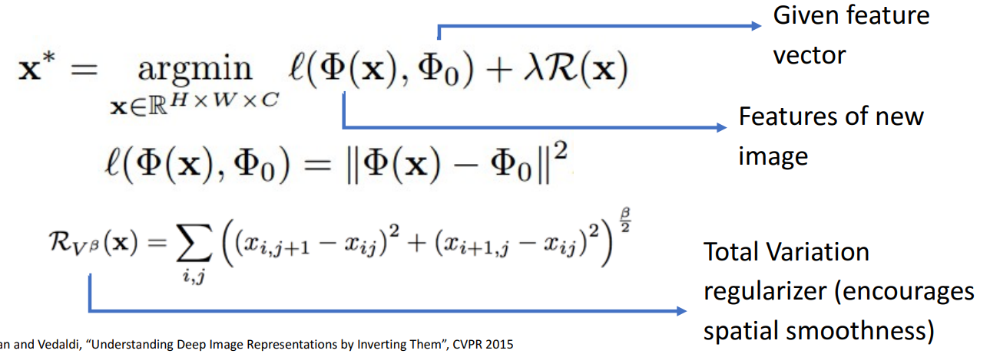

- `Loss`를 최소화하는 `Input` $x$를 찾는 것이 목표이다.

예시로 생기는 결과는 아래와 같다. $y$를 제외한 각 이미지는 각 `Layer`의 `Feature vector`를 기준으로 생성된 이미지이다.

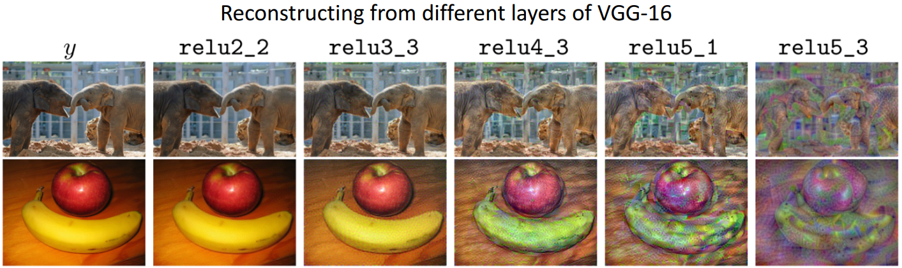

- `Layer`가 깊게 들어갈수록 어느정도 정보 손실이 있는 것을 확인할 수 있다.

___

# Neural Network의 각 `Layer`가 어떤 것을 학습하고자 하는지 알 때, 이를 이용하여 완전히 새로운 이미지를 생성해낼 수 있다.

- `Gradient Ascent`와 `Feature Inversion`의 아이디어와 비슷하다.

## DeepDream

> **각 `Layer`가 어떤 `Feature`를 다루는지 알고있다면 그것을 이용하여 특정 `Feature`를 `Amplify`시켜 새로운 이미지를 생성할 수 있다.**

과정은 아래와 같다.

1. 특정 이미지를 `Forward`하고 특정 `Layer`에서의 `Activation` 값을 저장한다.

2. (1)에서 정한 `Layer`의 `gradient`를 (1)에서 저장한 `Activation` 값으로 설정한다.
   
   - 이때, 특정 `Layer`에서 학습하고 있는 특징을 부각한 이미지를 생성할 수 있다.

3. `Backward` 과정을 진행하고, `Input`을 업데이트 한다.

    - `Update` 과정에서 $I = I + lr*f(I)$가 되므로, 해당 `Layer`의 특징이 더 부각된다.

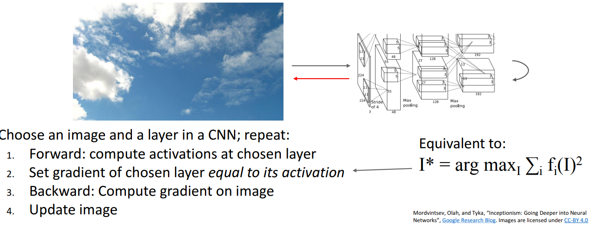

코드로 구현하면 아래와 같다.

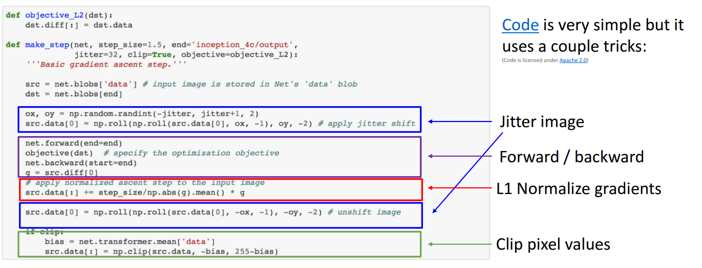

아무 것도 없는 하늘을 `Input`으로 사용한 예시는 아래와 같다.

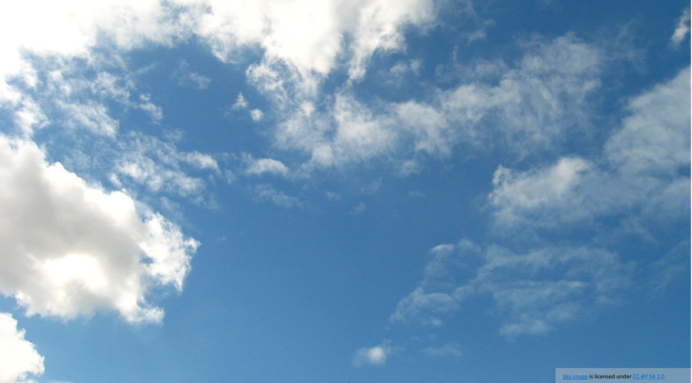

초반 `Layer`는 `Edge` 등을 탐색한다는 것을 기억하면, **초반 `Layer`를 `Amplify`한 결과는 구름의 `Edge`를 더 부각**시킬 수 있다는 것을 알 수 있다.

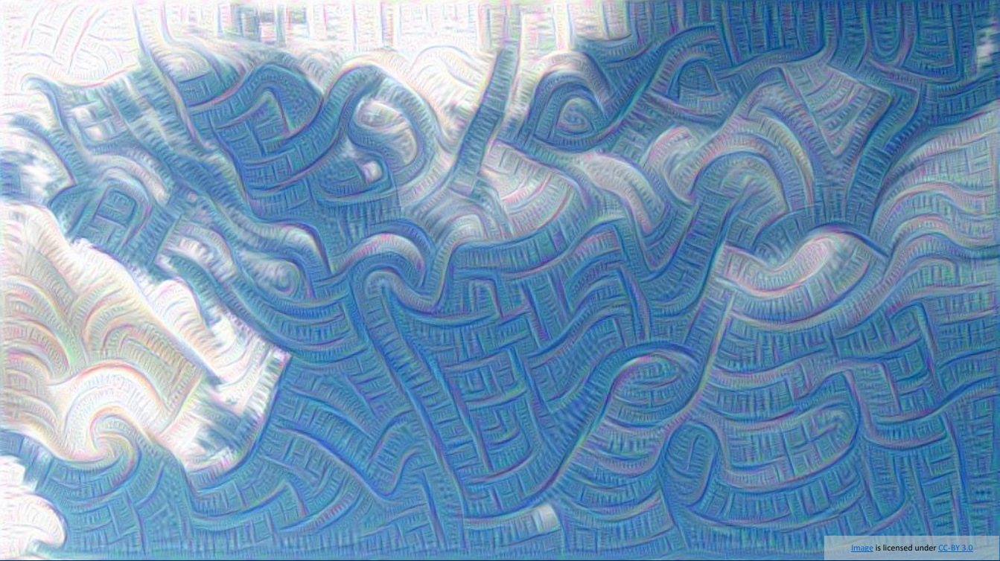

`Higher Layer`로 갈수록 **더 복잡하고, 기존에 없던 패턴**이 생기기 시작한다.

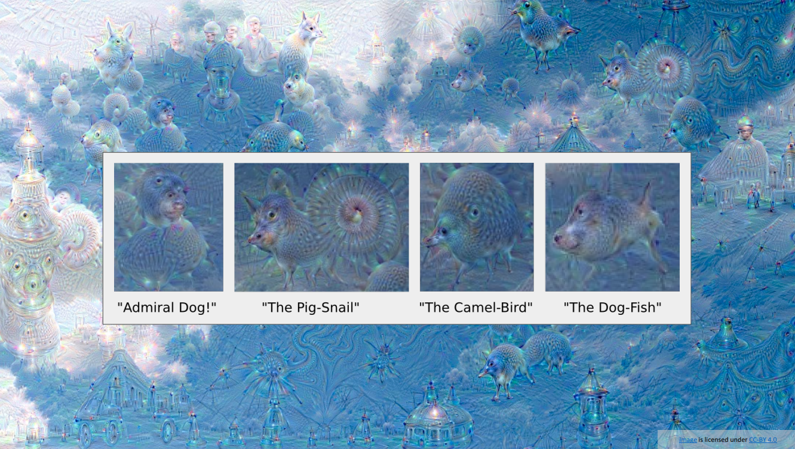

- 이런 결과가 나온 이유는 아마, `Training`에서 하늘과 개, 새, 물고기 등이 같이 제시된 이미지가 존재했기 때문으로 추정된다.

`DeepDream Algorithm`을 반복할 수록 말도 안 되는 이미지가 생성된다.

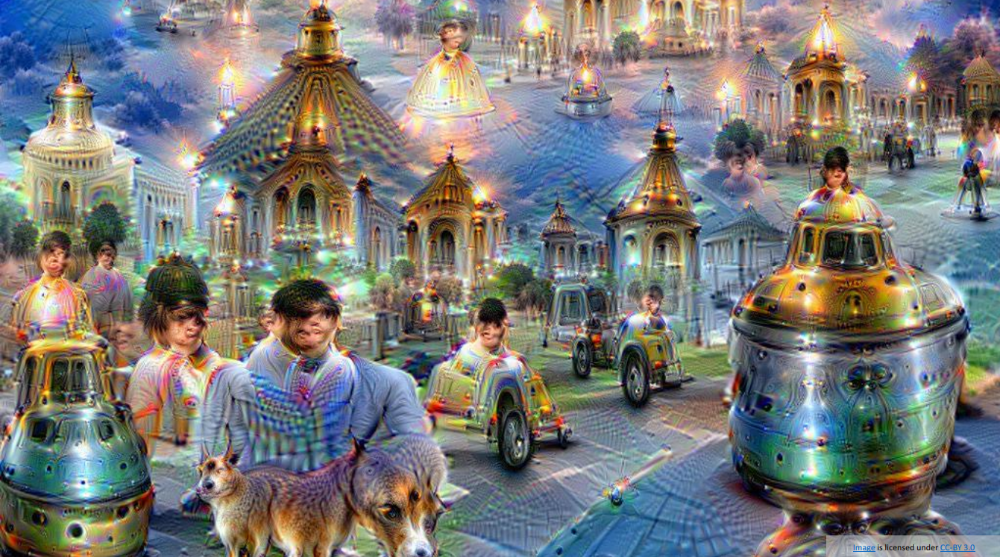

## Texture Synthesis

> `Neural Network`에서 살짝 벗어나서, 컴퓨터 그래픽 분야에서 주로 사용된 방법이다.

**작은 `Input texture`를 무늬를 그래도 유지하며 큰 `Output Texture`를 만드는 방법이다.**

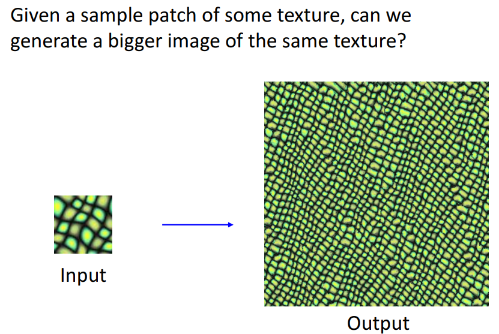

- `Nearest Neighbor`를 사용하기도 한다.

`Neural Network`를 이용하여 `Texture Synthesis`를 해결하는 방법에 대해 알아보자.

- `Gradient Ascent`와 비슷한 아이디어를 이용한다.

이때, 중요한 점은 **`Texture Synthesis`에서 `Spatial information`은 중요하지 않고, `Texture`자체만 중요하기 때문에, Spatial information은 고려하지 않은 `Gram Matrix`를 사용한다.**

`Gram Matrix`를 구하는 방법에 대해 먼저 알아보자.

먼저, 각 `Layer`에서 **C*H*W의 Feature matrix를 얻는다.**

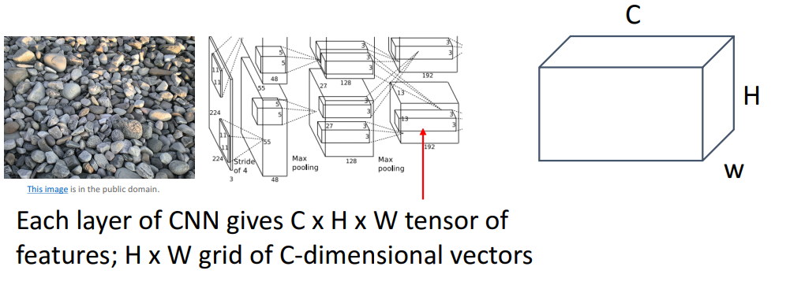

이후, 각 `Feature Matrix`의 **HW Space**에서 임의로 **두 개의 $C$-d vector를 외적하여 (C,C) Matrix를 얻는다.**

- 이때, (C, C) Matrix의 ($i$, $j$) Element는 **채널 $i$와 채널 $j$의 상관 관계**가 된다.

- 각 `Channel`은 **각기 다른 특징을 학습하는데,** 서로 다른 두 특징이 **동시에 같은 `Layer`에서 등장했다는 것이 `Texture`를 학습**하는데 큰 도움이 된다.

- 마지막에 **HW Space**에 대해 평균까지 내기 때문이다.
  
  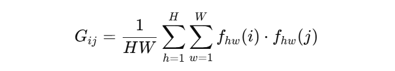

  - 공분산 식과 동일하다.

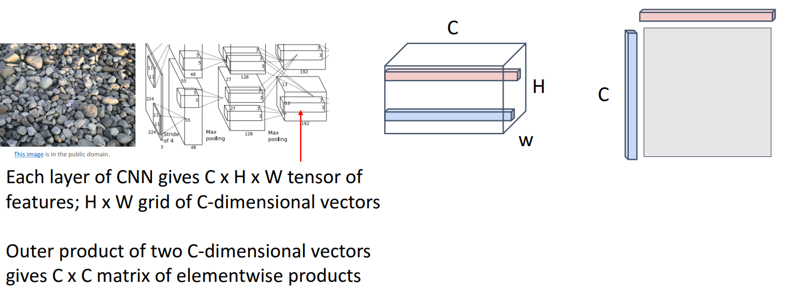

마지막으로, 가능한 모든 조합에 대해 (C,C) Matrix를 얻고, 평균을 낸다.

- 평균을 낼 때, **Spatial information이 없어진다.**

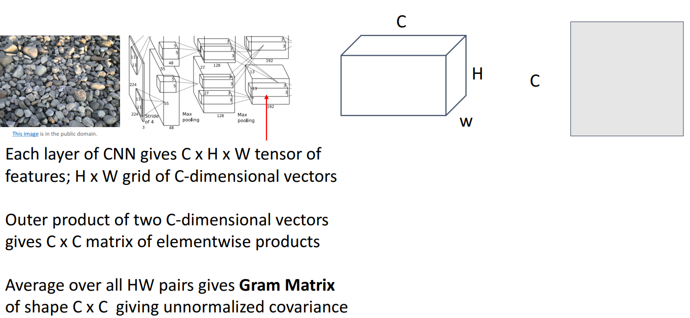

`Feature map`을 **C * (HW)**로 미리 Reshape 해놓으면 더 빠르게 구할 수 있다.

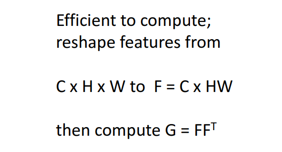

`Gram Matrix`을 이용하여 `Texture`를 학습하는 과정은 다음과 같다.

1. 먼저, `Pretrained model`에 `Texture input`을 넣어 `Gram Matrix`을 얻는다.

2. 이후, `Noisy input`으로 `Pretrained model`을 이용하여 `Gram Matrix`를 얻고, (1)에서의 `Gram Matrix`와의 차이를 이용하여 `Loss`를 계산한다.

3. `Loss`를 이용하여 `Backpropagation`한다.

결과는 아래와 같다.

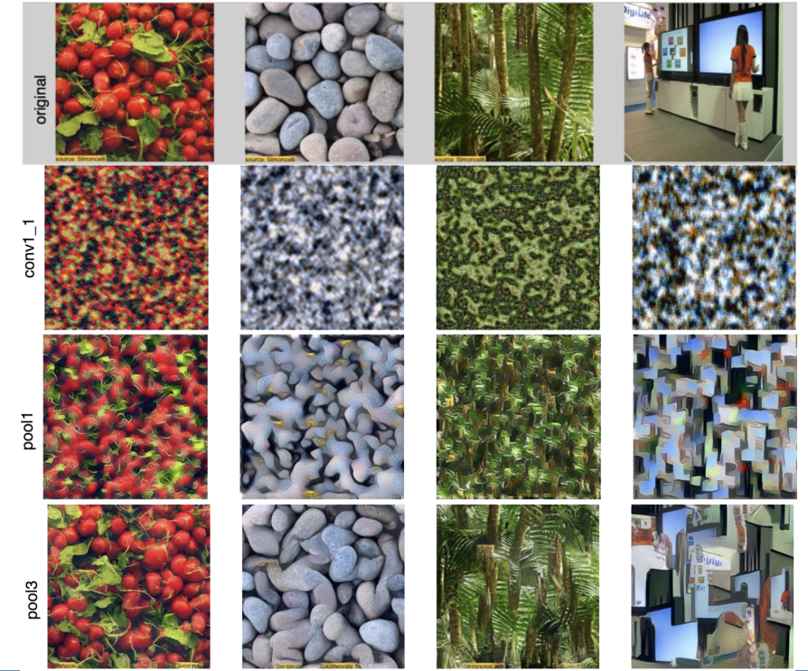

- **`High Layer`에서의 `Gram Matrux`를 이용**해야 더 좋은 `Texture`를 얻는 것을 확인할 수 있다.

이를 응용하면 공간 구조는 유지되지 않지만 **색상이나 Texture 정보는 유지된 새로운 이미지**를 생성할 수도 있다.

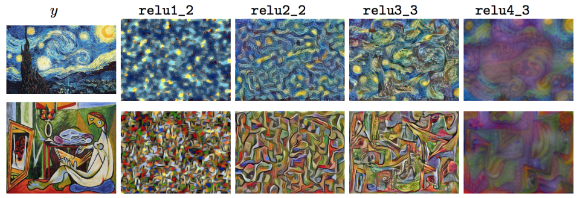

___

`Gram Matrix`를 이용하면, **Spatial information은 사라지지만 색상과 Texture 정보가 남고,** `Feature reconstruction`을 이용하면 **`Higher layer`로 갈수록 색상과 Texture의 구체적인 정보는 사라지지만 Spatial information은 남는다.**

따라서, **`Gram Matrix`와 `Feature reconstruction`을 동시에 사용**하면 굉장히 퀄리티 높은 새로운 이미지를 얻을 수 있다.

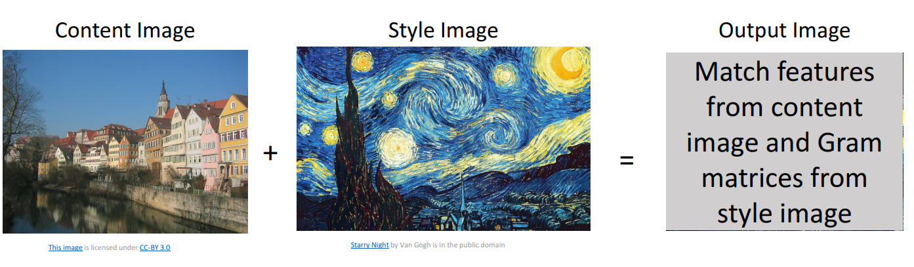

- `Style`은 `Gram Matrix`를 이용하여 얻고, `Feature`는 `Feature reconstruction`을 이용하여 얻어서 합치면 아래와 같은 결과를 얻는다.

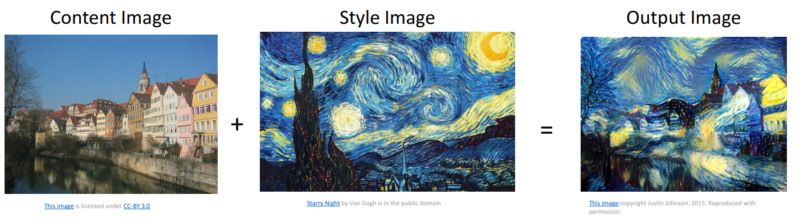

구체적인 동작 방식은 아래와 같다.

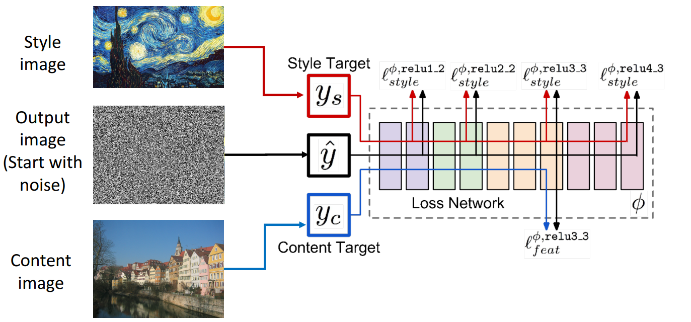

`Noisy Input`부터 시작하여 변화는 과정은 일종의 `Gradient Ascent`와 비슷하다.

## Neural Style Transfer

위와 비슷한 방법을 이용한 **특정 이미지에 특정 스타일을 적용할 수 있는 모델**이다.

`Style`에 집중할 지, `Feature`에 집중할 지에 따라 다른 이미지가 생성된다.

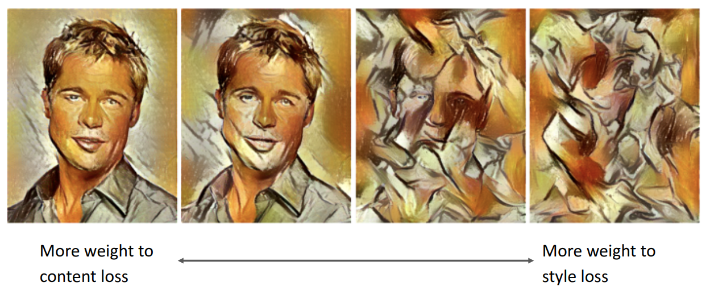

또 다르게, `Input`의 Size를 조정하게 되면, `Gram Matrix` 값이 바뀌게 된다.

- 이 때문에, `Input` Size를 작게할수록, 더 세심한 `Style`이 적용된다.

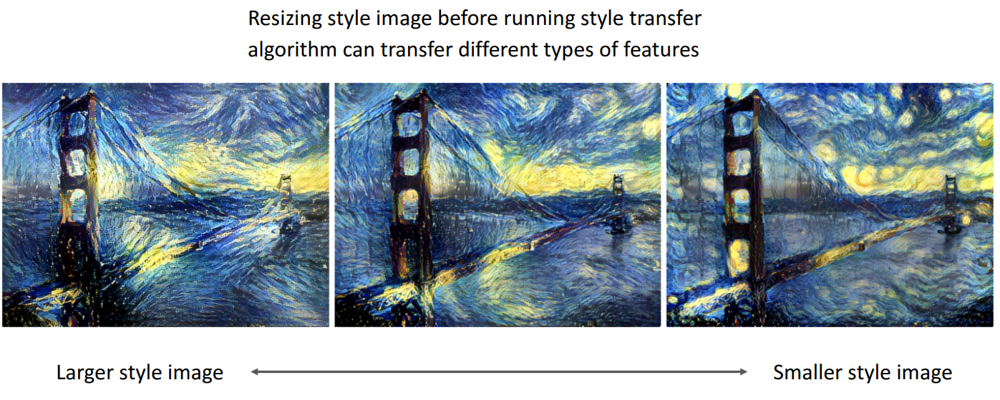

여러 `Style`을 섞는 것도 가능하다.

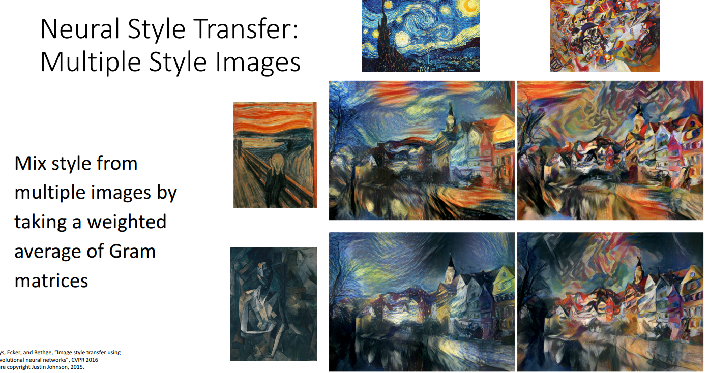

- 서로 다른 `Style`의 `Gram Matrix`에 다른 가중치를 주는 방법으로 구현할 수 있다.

또는 `Neural Style Transfer`에 `DeepDream`을 추가할 수 있다.

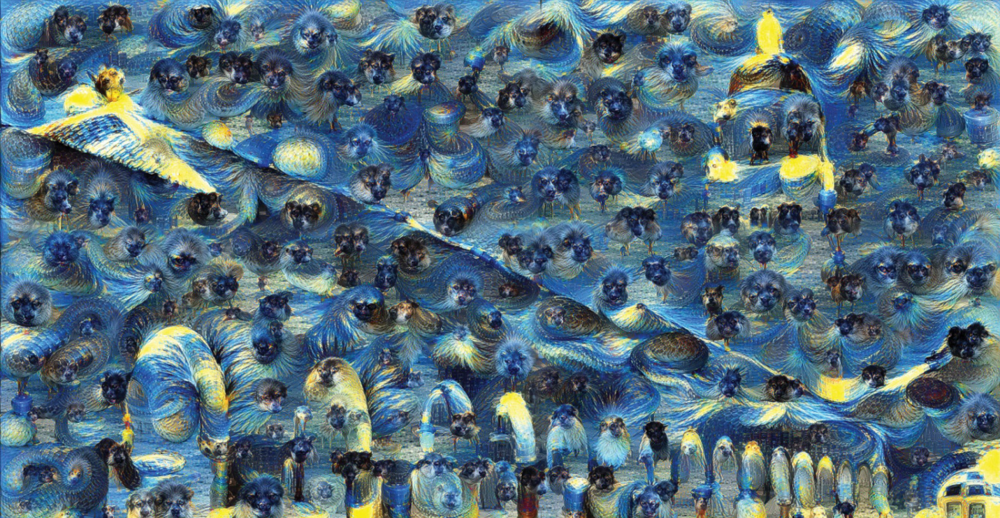

유일한 단점은 `Style transformer`는 `Forward / Backward`가 굉장히 많기 떄문에 **매우 느리다.**

- `Gradient Ascent`를 반복적으로 적용하기 때문이다.

이를 해결하는 방법은 **또 다른 `Neural Network`를 사용하는 것이다!**

## Fast Neural Style Transfer

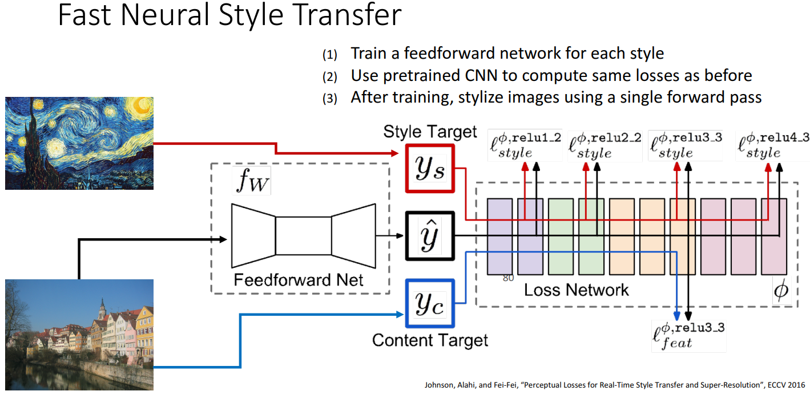

- `Training`에는 오랜 시간이 걸리지만, **그 이후에는 `Feadforward Net`만 분리하여, 하나의 `Forward`로 새로운 이미지를 생성할 수 있다.**

`Real-Time`에 실제로 적용할 수 있을만큼 빨라졌고, 예시는 아래와 같다.

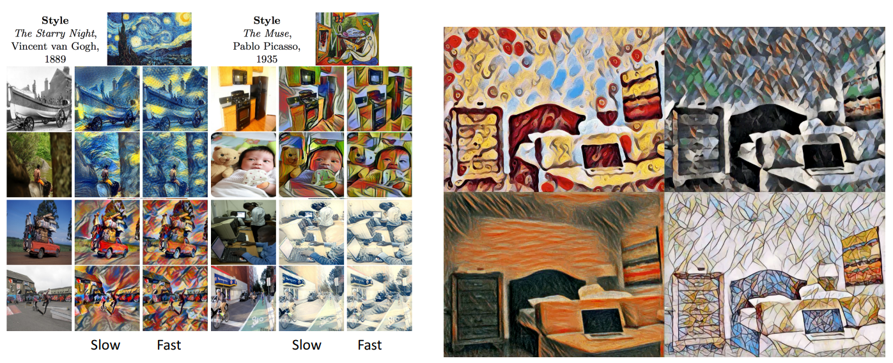

추가로, `Real-time` 적용을 위해, `Instance Normalization`을 사용한다.

- `Instance Normalization`이 `Real-Time` 적용에 좋다.
