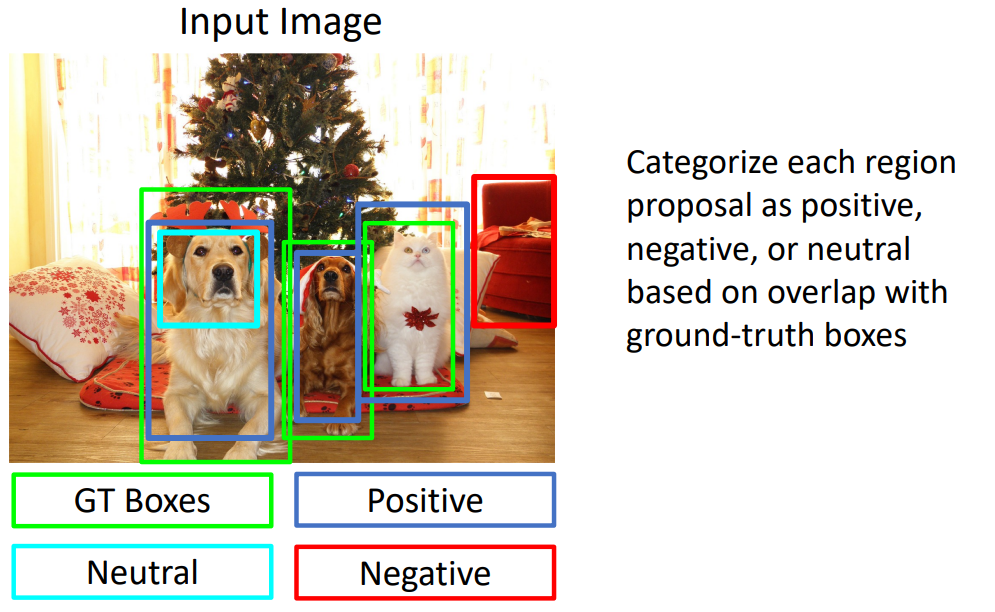
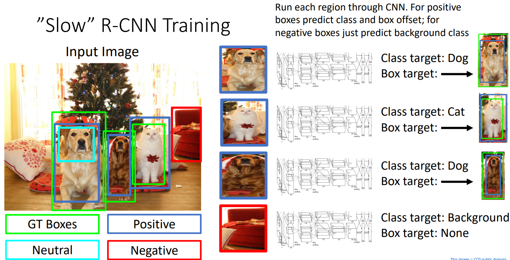
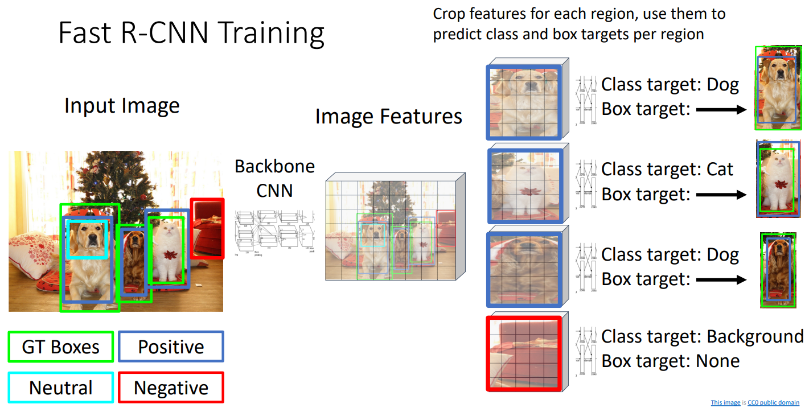
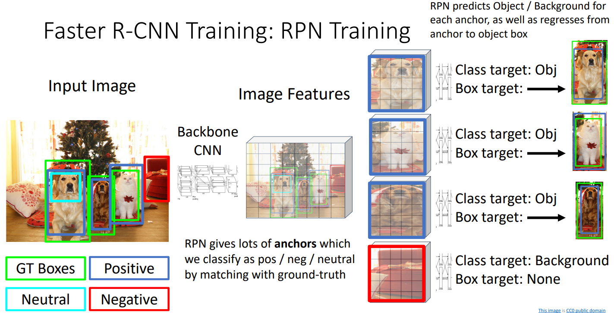
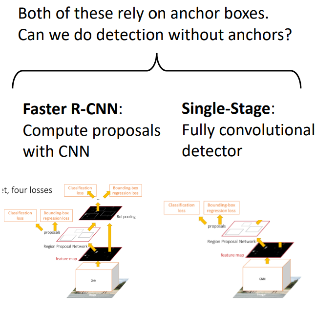
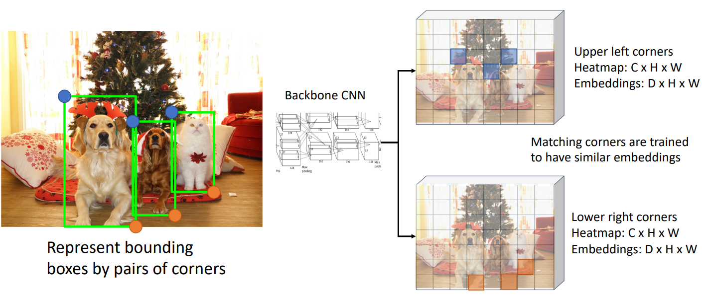

# 16. Detection and Segmentation

**`강의 영상`**                      

https://www.youtube.com/watch?v=qcSEP17uKKY&list=PL5-TkQAfAZFbzxjBHtzdVCWE0Zbhomg7r&index=16

**`강의 자료`**

https://web.eecs.umich.edu/~justincj/slides/eecs498/498_FA2019_lecture16.pdf

___

15강에서 `Slow R-CNN`에 대한 설명이 부족했다고 판단되어, `Slow R-CNN`의 동작에 대해 자세히 살펴보도록 할 것이다.

`Slow R-CNN`의 `Training` 과정에 대해 알아보자.

`Input Image`의 `Ground Truth Box`와 겹치는 `Box` 중, **Negative, Neutral, Positive로 분류한다.**

- `IoU`를 사용한다.

- `Neutral`은 `Ground Truth`와 일부분 일치하지만, 애매한 경우에 지정된다.

- `Ground Truth Box`와 `Label`이 쌍으로 제공되어, `CNN`은 각 `RoI`와 가장 유사한 `Ground Truth Box`의 `Label`을 기준으로 예측하고자 한다.

이후, **`Neutral`을 제외한 모든 `Box`를 **원하는 Size로 `Crop`하고**, `CNN Architerture`에** 넣는다.

- `Neutral`을 제외하는 이유는 `CNN Model`이 `Positive`와 `Negative`로 분류할 수 있도록 하기 위함이다.

- 각 `RoI`에 적용되는 모든 `CNN`의 `Weight`는 동일하다.

- `Negative Box`는 `Background`로 분류되어야 한다.

- `Positive Box`는 `Class`와 `Box offset`을 모두 예측하게 하고, `Negative box`는 `Class`를 `Background`로만 예측하도록 한다.

  - `Negative box`는 일치하는 `Ground Truth Box`가 없기 때문에, `Regression loss`를 사용할 필요도 없고 사용할 수도 없다.

  - 즉, `Regression loss`는 `Positive box`에 대해서만 구한다.

**`Test Time`에서도 `Slow R-CNN`은 같은 `Region Proposal` 방법을 사용하기 때문에, `Training`때와 `Test` 때 입력받은 `Image`의 유형이 많이 다르면 `Test`가 실패할 수 있다.**

____

`Fast R-CNN`의 `Training` 과정에 대해서도 간단하게 살펴보자.

`Slow R-CNN`과 `Crop`과 `ConvNet`의 적용 순서만 다르고 대부분 동일하다.

___

`Faster R-CNN`의 `Training` 과정은 아래와 같다.

먼저 `RPN`을 `Training` 한다.

`Two Stage` 방식에서는 `RPN`을 통해 각 `Anchor Box`가 `Object`인지 여부를 **Positive, Neutral, Negative**로 나타내고 각 `Anchor Box`의 `Transform`을 반환한다.

- 따라서 `Slow R-CNN`이나 `Fast R-CNN`와 다르게, `Categoty`대신 `Object`인지 아닌지의 여부만 제공하면 `Slow R-CNN`이나 `Fast R-CNN`의 `Training` 과정과 동일하게 `RPN`을 `Training`할 수 있다.

`RPN`에서 제공된 `Anchor Box`와 `Stage 2`의 `Network`를 거쳐 `Class`와 `Box`를 예측하기 때문에, `RPN`에서 제공된 `Anchor Box`와 `Stage 2`의 `Output`을 페어링만 하면,  `Slow R-CNN`이나 `Fast R-CNN`과 동일하게 `Training`할 수 있다.

___

`Faster R-CNN`과 `Single Stage Detector`이 압도적으로 빠르고 성능도 좋지만, **여전히 `Anchor Box`의 개념에 의존하게 된다.**

- 매우 많은 `Anchor box`를 사용하는데, 이 중에 불필요한 것이 있을 수 있고 여러 개의 `Anchor box`를 사용하더라도 적합한 `Anchor box`가 없을 수도 있다.

`Anchor Box`에 의존하지 않고 `Neural Network`를 이용하여 `Object Detetion` 하는 방법으로 `CornetNet`을 제시할 수 있다.

`Box`를 **좌상단과 우하단 두 개**로 나타내고, `Ground Truth Box`에서 **좌상단 모서리에 특정 객체가 위치할 확률과 우하단 모서리에 특정 객체가 위치할 확률은 동일**하다.

그리고 `Image`의 각 `Pixel`이 **특정 객체의 좌상단이 될 확률을 포함한 `Heatmap`**과 **특정 객체의 우하단이 될 확률을 포함한 `Heatmap`**를 출력하게 한다.

- 이미지의 각 `Pixel`을 `Cross Entropy Loss`로 `Training`할 수 있다.

좌상단을 표현하는 `Heatmap`과 우하단을 표현하는 `Heatmap`에서 **같은 객체를 가리키는 `좌상단 Pixel`과 `우하단 Pixel`을 연결**하기 위해, **쌍을 이루는 Pixel은 같은 `Embedding Vector`를 갖도록 학습**힌다.

위 방법을 이용하여, `Anchor box`에 의존하지 않고, **Image의 각 Pixel별로 예측**을 할 수 있다.