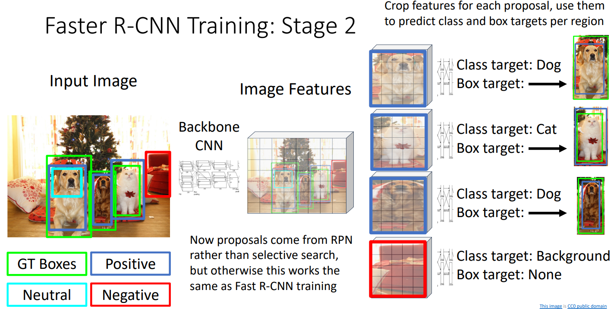

# 16. Detection and Segmentation

**`강의 영상`**                      

https://www.youtube.com/watch?v=qcSEP17uKKY&list=PL5-TkQAfAZFbzxjBHtzdVCWE0Zbhomg7r&index=16

**`강의 자료`**

https://web.eecs.umich.edu/~justincj/slides/eecs498/498_FA2019_lecture16.pdf

___

15강에서 `Slow R-CNN`에 대한 설명이 부족했다고 판단되어, `Slow R-CNN`의 동작에 대해 자세히 살펴보도록 할 것이다.

`Slow R-CNN`의 `Training` 과정에 대해 알아보자.

`Input Image`의 `Ground Truth Box`와 겹치는 `Box` 중, **Negative, Neutral, Positive로 분류한다.**

- `IoU`를 사용한다.

- `Neutral`은 `Ground Truth`와 일부분 일치하지만, 애매한 경우에 지정된다.

- `Ground Truth Box`와 `Label`이 쌍으로 제공되어, `CNN`은 각 `RoI`와 가장 유사한 `Ground Truth Box`의 `Label`을 기준으로 예측하고자 한다.

이후, **`Neutral`을 제외한 모든 `Box`를 **원하는 Size로 `Crop`하고**, `CNN Architerture`에** 넣는다.

- `Neutral`을 제외하는 이유는 `CNN Model`이 `Positive`와 `Negative`로 분류할 수 있도록 하기 위함이다.

- 각 `RoI`에 적용되는 모든 `CNN`의 `Weight`는 동일하다.

- `Negative Box`는 `Background`로 분류되어야 한다.

- `Positive Box`는 `Class`와 `Box offset`을 모두 예측하게 하고, `Negative box`는 `Class`를 `Background`로만 예측하도록 한다.

  - `Negative box`는 일치하는 `Ground Truth Box`가 없기 때문에, `Regression loss`를 사용할 필요도 없고 사용할 수도 없다.

  - 즉, `Regression loss`는 `Positive box`에 대해서만 구한다.

**`Test Time`에서도 `Slow R-CNN`은 같은 `Region Proposal` 방법을 사용하기 때문에, `Training`때와 `Test` 때 입력받은 `Image`의 유형이 많이 다르면 `Test`가 실패할 수 있다.**

____

`Fast R-CNN`의 `Training` 과정에 대해서도 간단하게 살펴보자.

`Slow R-CNN`과 `Crop`과 `ConvNet`의 적용 순서만 다르고 대부분 동일하다.

___

`Faster R-CNN`의 `Training` 과정은 아래와 같다.

먼저 `RPN`을 `Training` 한다.

`Two Stage` 방식에서는 `RPN`을 통해 각 `Anchor Box`가 `Object`인지 여부를 **Positive, Neutral, Negative**로 나타내고 각 `Anchor Box`의 `Transform`을 반환한다.

- 따라서 `Slow R-CNN`이나 `Fast R-CNN`와 다르게, `Categoty`대신 `Object`인지 아닌지의 여부만 제공하면 `Slow R-CNN`이나 `Fast R-CNN`의 `Training` 과정과 동일하게 `RPN`을 `Training`할 수 있다.

`RPN`에서 제공된 `Anchor Box`와 `Stage 2`의 `Network`를 거쳐 `Class`와 `Box`를 예측하기 때문에, `RPN`에서 제공된 `Anchor Box`와 `Stage 2`의 `Output`을 페어링만 하면,  `Slow R-CNN`이나 `Fast R-CNN`과 동일하게 `Training`할 수 있다.

___

`Faster R-CNN`과 `Single Stage Detector`이 압도적으로 빠르고 성능도 좋지만, **여전히 `Anchor Box`의 개념에 의존하게 된다.**

- 매우 많은 `Anchor box`를 사용하는데, 이 중에 불필요한 것이 있을 수 있고 여러 개의 `Anchor box`를 사용하더라도 적합한 `Anchor box`가 없을 수도 있다.

`Anchor Box`에 의존하지 않고 `Neural Network`를 이용하여 `Object Detetion` 하는 방법으로 `CornetNet`을 제시할 수 있다.

`Box`를 **좌상단과 우하단 두 개**로 나타내고, `Ground Truth Box`에서 **좌상단 모서리에 특정 객체가 위치할 확률과 우하단 모서리에 특정 객체가 위치할 확률은 동일**하다.

그리고 `Image`의 각 `Pixel`이 **특정 객체의 좌상단이 될 확률을 포함한 `Heatmap`**과 **특정 객체의 우하단이 될 확률을 포함한 `Heatmap`**를 출력하게 한다.

- 이미지의 각 `Pixel`을 `Cross Entropy Loss`로 `Training`할 수 있다.

좌상단을 표현하는 `Heatmap`과 우하단을 표현하는 `Heatmap`에서 **같은 객체를 가리키는 `좌상단 Pixel`과 `우하단 Pixel`을 연결**하기 위해, **쌍을 이루는 Pixel은 같은 `Embedding Vector`를 갖도록 학습**힌다.

위 방법을 이용하여, `Anchor box`에 의존하지 않고, **Image의 각 Pixel별로 예측**을 할 수 있다.

# Semantic Segmentation

> **Image의 전체 픽셀에 대해 Label을 부여하도록 하는 방법**

- `Semantic Segmentation Mask`: `Pixel`별로 `Class Score`가 구해진 Map

- 그러나, **이 방법은 같은 종류의 객체가 붙어있을 때, 구별해서 구분하지 못 한다.**

## 구현 방법 1: Sliding Window

`Image Patch`를 `Image` 위에서 `Sliding`하고, 해당 `Image Patch`의 중간 `Pixel`에 대한 예측을 `CNN`을 통해서 하는 방법이다.

그러나, 이 방법은 **겹치는 영역이 있더라도 따로 처리**해야 하기 때문에, **굉장히 느리고 비효율적**이다.

- 때문에, 최근엔 사용하지 않는 방법이다.

## 구현 방법 2: Fully Convolutional Netwrok

`Spatial size`를 유지하도록 `Fully Convolutional Network`를 이용하고, 분류하고자 하는 `Class`만큼의 `Feature Map`을 갖도록 하고 전체 `Channel`에 대해 평균내면, `Prediction`이 나온다.

- `Fully Convolutional Network`를 통과한 각 `Feature map`은 `Input image`에서의 각 `Pixel`이 해당 `Class`에 속할 확률을 값으로 갖는다.

- 각 `Pixel`에 대해 `Cross Entropy Loss`를 이용하여 `Training`할 수 있다.

그러나 이 모델에서 두 가지 문제점이 있다.

1. 3*3 Filter with 1 padding and 1 stride `Conv Layer`를 겹겹이 쌓을 때, $L$번째 `Layer`에서는 $2L + 1$의 `Receptive field`를 가질 수 있는데, **전체 `Image`를 커버하기 위해선 꽤 많은 `Conv Layer`가 필요할 수 있다.**
   
   - 한 `Pixel`에 대해 예측을 할 때에도, 주변 정보를 알고 예측하는 것이 좋기 때문에, 큰 `Receptive field`를 갖는 것은 좋다. 

2. `Image`에서의 분할은 보통 `High resolution image`에서 이루어지며, **`Convolution`을 `High resolution image`에서 수행하는 것은 계산 비용이 크다.**

**연산량이 많다는 문제** 때문에, 이 방법도 사용하지 않는다.

연산량이 많다는 문제를 해결하기 위해, **`High Resolution Image`를 빠르게 `Down Sampling`하여 연산량을 줄이고 나중에 `Upsampling`하는 방식**을 주로 사용한다.

`Down-sampling`은 `Convoltion Network` 안에서는 주로 `Stride`를 이용하거나 `Pooling`을 이용한다.

그럼 `Network` 내에서 `Upsampling`하는 방법엔 뭐가 있을까?

## In-Network Upsampling: Unpooling (Non-Learnable)

> **학습이 가능하지 않은 Upsampling 방식으로 여러 방법이 있다.**

### Bed of Nails / Nearest Neighbor

기본적으로 아래 두 가지 방식이 있다.

- `Bed of Nails`는 `Aliasing` 문제 때문에 주로 사용하지 않고, `Nearest Neighbor` 방법을 주로 사용한다.

### Bilinear Interpolation

`Bilinear Interpolation`을 사용할 수도 있다.

- 원래의 값을 가장 자리에 놓고, 그 사이에 `Bilinear Interpolation`에 따라 `Upsampling`할 개수만큼 `Sampling`한다.

- `Nearest Neighbor`에 비해 **부드러운 `Unsampling`이 가능하다.**

### Bicubic Interpolation

3차 근사치를 이용한다.

### Max Unpooling

`Downsampling`에 사용한 `Max-pooling`에 맞춰 사용할 수 있다.

**`Max pooling`에서 최댓값의 위치를 기억하고, `Max Unpooling`에서 그 위치에 값을 전달하고 나머지는 0으로 채운다.**

반드시, **`Max pooling`을 사용한 `Downsampling layer`와 쌍을 이루어서 사용**되어야 하기 때문에, `Downsampling` 방법으로 `Max pooling`을 사용한 경우에만 고려할 수 있다.

## Leanable Upsampling

> **Neural Network를 통해 학습이 가능한 Upsampling 방식이다.**

- `Upsampling` 할 때의 값을 `Filter`를 통해서 학습할 수 있도록 한다.

### Transposed Convolution

기본적인 아이디어는 다음과 같다. 

- `Convolution layer`에서 `stride`가 1보다 크다면, `Downsampling`된다.

- 그렇다면, **`Stride`가 1보다 작다면 `Upsampling`되지 않을까?라는** 아이디어에서 시작한다.

- `Stride`를 실제로 1보다 작게 만들 수는 없고, 흉내내는 방법이다.

과정은 아래와 같다.

`Input`과 `Filter`의 값을 곱하고, **`Output`에서 대응되는 위치에 해당 값을 복사**한다.

만약 `Output`에 대응되는 영역이 기존 값과 겹치면 기존 값에 더한다.

위 예시에서는 `Output`의 크기로 **5x5**가 나오지만, **4x4**를 원하기 때문에 **가장 위와 왼쪽 픽셀들을 잘라냈다.**

 

`Input`이 1-dimension인 예시를 확인해보자.

**`Convolution`은 `Matrix Multiplication` 형태**로 나타낼 수 있다.

- `Convolution`의 `Filter`을 펼쳐서 `Digonal matrix` $X$ 형태로 나타내고 `input`은 $a$로 표현하여 `Matrix Multiplication`하면 된다.

이를 이해하기 위해 같은 `Filter`를 사용하여 `Downsampling`하고 `Downsampling`하기 전 크기로 `Upsampling`하는 예시를 살펴보자.

- 왼쪽을 `Downsampling`, 오른쪽을 `Upsampling` 과정으로 볼 수 있다.

- `Transposed Convolution`은 `Downsampling` 과정에서 사용한 행렬 $X$를 `Transpose`한 후의 `Matrix multiplication` 형태로 나타낼 수 있다.

- 오른쪽 예시에서는 `Input` 4개가 `Output` 6개로 `Upsampling`된 것을 확인할 수 있다.

- `Transposed convolution`에서 `Stride`가 1보다 크면 일반적인 `Conv`로 표현되지 않는다.

    - `Rank`가 맞지 않기 때문이다.

    - `Stride`가 1보다 크면, **`Downsampling` 과정에서 정보가 손실되어 `Rank`가 맞지 않게 된다.**

위 예시를 통해, 일반적으로 `Upsampling`의 과정은 `Convolution 연산을 정의한 행렬`에 `Transpose`를 한 후에 `Input`과 `Matrix multiplication`해서 나타낼 수 있음을 확인할 수 있다. 

___

`Semantic Segmentation`은 `Pixel`당 `Label`을 부여해주지만, **여러 객체를 분리하지 못 한다는 단점**이 있다.

# Things and Stuff

`Computer Vision Tesks`에서 더 높은 정확도를 위해 `Object`를 두 종류로 나눈다.

- `Things`: 개별 객체로 나눌 수 있는 Categoty

- `Stuff`: 개별 객체로 나눌 수 없는 Categoty

**`Object detection`은 `Things`만 구분하고, `Semantic Segmentation`은 `Things`와 `Stuff` 모두 구별할 수 있다는 차이점이 있다.**

# Instance Segmentation

> **하나의 Category에 대한 객체를 발견하고 각 개별 객체로 나누는 방법**

- **`Image`에서 모든 `Object`를 감지하고, 각 `Object`를 개별 객체로 구분**한다.

- 개별 객체로 구분해야 하기 때문에, **`Things`에 대해서만 적용이 가능**하다.

- `Stuff`는 구별하지 않는다.

## Mask R-CNN

`Instance Segmentation`의 접근 방식은 간단하다.

- 먼저, `Object Detection`을 이용해 객체를 찾고, 개별 객체에 대해 `Segmentation mask`를 예측한다.

`Object Detection`의 `Faster R-CNN`을 이용한다.

`Faster R-CNN`에서 `Segmentation mask`를 예측하는 `Output`을 추가한 것을 `Mask R-CNN`이라고 한다.

`Segmentation mask`를 예측하는 과정은 아래와 같다.

먼저, `CNN`과 `RPN`을 이용하여 `Feature space`를 얻는다.

이후, 각 `RoI`마다 `Class` 개수만큼의 각 `Class`일 확률 (`Score`), 각 `Class`일 때의 `Box transfrom` 그리고 `Segmentation mask`를 출력한다.

- $C$개의 `Score`와 $4C$개의 `Box transform`이 출력된다.

- `RoI`를 여러 `Conv` 거친 후, `Score head`, `box head`, `mask head`에 전달한다.

`Training` 예시는 아래와 같다.

감지하고자하는 물체의 종류에 따라 다른 `Segmentation mask`를 얻을 수 있다.

# Panoptic Segmentation

> **`Instance Segmentation`과 `Semantic Segmentation`을 합친 방법**

- `Things`에 대해선 개별 `Instance` 감지까지 수행한다.
- `Stuff`는 `Class` 구별까지만 한다.

# Human Keypoints

> **사람의 포즈를 나타내기 위해, 신체 주요 지점에 `Keypoint`를 두는 것**

- 사람 개개인, 즉 `Instance` 별로 estimate하기 때문에 `Instance Segmentation` 기법을 기반으로 구현한다.

모델 구조는 아래와 같다.

`Mask R-CNN`에 각 `Instance`의 **$K$개의 `Keypoint`의 위치를 예측하기 위한 `Head`를 하나 추가**한다.

$K$개의 `Keypoint`에 대해 예측한다.

`Human Keypoint`를 이용하여 `Joing Instance Segmentation`과 `Pose Estimation`을 수행할 수 있다.

____

> 일반적으로 `Mask R-CNN`이나 `Faster R-CNN`에 **특정 목적을 위한 `Head`를 추가하면 `Object Detection`을 위한 특정 작업을 수행할 수 있다.**

응용 예시로 `Faster R-CNN`에 `Image Captioning prediction head`를 추가한 `Dense captioning`이 있다.

`Triangle`을 예측하는 `Head`를 추가해 볼 수도 있다.

